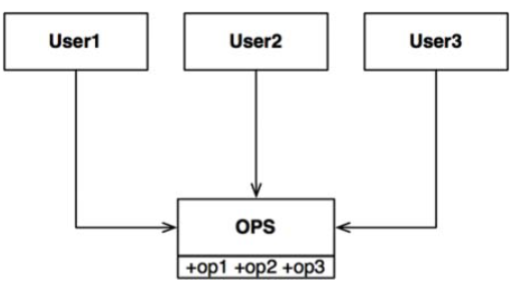
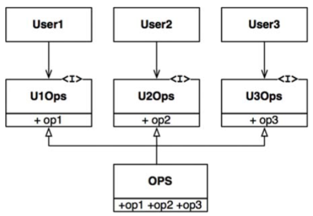
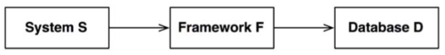

# Chapter 10: The interface segregation principle
--------------

Nguyên Lý Tách Biệt Interface (Interface Segregation Principle – ISP) có cái tên được lấy từ biểu đồ như thấy ở hình dưới đây:

Trong tình huống được minh họa trong hình trên, một số người dùng sử dụng các xử lý của lớp OPS. Chúng ta giả sử rằng `User1` chỉ dùng `op1`, `User2` chỉ dùng `op2`, và `User3` chỉ dùng `op3`.

Bây giờ hãy tưởng tượng OPS là một lớp được viết bằng một ngôn ngữ như Java. Rõ ràng, trong trường hợp đó, mã nguồn của `User1` dù muốn hay không cũng phụ thuộc vào `op2` và op3, cho dù nó không hề gọi tới chúng. Sự phụ thuộc này có nghĩa là một thay đổi tới mã nguồn của `op2` trong lớp OPS sẽ buộc `User1` phải biên dịch và triển khai lại, mặc dù nó không liên quan gì tới thứ thực sự thay đổi.

Vấn đề này có thể được giải quyết bằng cách tách biệt các hoạt động đó thành nhiều interface như thấy ở hình dưới đây.

Một lần nữa, nếu chúng ta tưởng tượng rằng cái này được triển khai bằng một ngôn ngữ kiểu tĩnh (statically typed language) như Java, thì mã nguồn của `User1` sẽ phụ thuộc vào `U1Ops`, và `op1`, nhưng sẽ không phụ thuộc vào `OPS`. Nhờ đó một thay đổi của `OPS` mà `User1` không liên quan thì sẽ không khiến cho `User1` phải biên dịch và triển khai lại.

## ISP and language

Rõ ràng, mô tả được đưa ra phụ thuộc rất nhiều vào loại ngôn ngữ. Các ngôn ngữ kiểu tĩnh như Java buộc các lập trình viên phải tạo các khai báo để người dùng phải `import`, hoặc `use`, hoặc `include`. Các khai báo `included` này trong mã nguồn đã tạo ra sự phụ thuộc mã nguồn và bắt buộc chương trình phải biên dịch và triển khai lại.

Trong các ngôn ngữ kiểu động (dynamically typed language) như Ruby và Python, các khai báo như vậy không tồn tại trong mã nguồn. Thay vào đó, chúng được suy ra lúc chương trình đang chạy (runtime). Do vậy chúng không có các phụ thuộc mã nguồn để buộc phải biên dịch và triển khai lại. Đây là nguyên nhân chính mà các ngôn ngữ kiểu động tạo ra các hệ thống có tính linh hoạt hơn và ít bị gắn kết chặt chẽ hơn là các ngôn ngữ kiểu tĩnh.

Điều này có thể đưa bạn tới kết luận là ISP là một vấn đề của ngôn ngữ hơn là một vấn đề về kiến trúc phấn mềm.

## ISP and Architecture
Nếu bạn quay lại và nhìn vào gốc rễ động cơ của ISP, bạn sẽ có thể nhìn thấy một mối quan tâm sâu xa hơn ẩn giấu trong đó. Xét tổng quát thì việc phụ thuộc vào các module mà bao gồm nhiều thứ hơn bạn thực sự cần sẽ gây ra tác hại xấu. Điều này hiển nhiên là đúng đối với các phụ thuộc mã nguồn mà nó có thể khiến bạn phải biên dịch và triển khai lại một cách không cần thiết – nhưng điều này cũng đúng ở cấp cao hơn nhiều – cấp độ kiến trúc.

Hãy lấy một ví dụ, một kiến trúc sư làm việc trong một hệ thống S. Anh ta muốn thêm một framework F vào trong hệ thống đó. Bây giờ giả sử rằng các tác giả của F gắn nó với một cơ sở dữ liệu D. Vì vậy S phụ thuộc vào F, và F phụ thuộc vào D

Bây giờ giả sử rằng D bao gồm một chức năng mà F không dùng và do đó S không quan tâm tới nó. Những thay đổi tới các chức năng này bên trong D có thể dẫn tới buộc phải triển khai lại F, do đó mà phải triển khai lại cả S. Tệ hơn nữa là nếu một lỗi nào đó của một trong những chức năng trong D có thể dẫn tới các lỗi trong cả F và S.

## Conclusion 
Bài học ở đây là nếu phụ thuộc vào thứ mà trong đó có nhiều thứ hơn bạn cần thì có thể sẽ khiến bạn gặp rắc rối mà bạn không ngờ tới.

Chúng ta sẽ khám phá ý tưởng này chi tiết hơn khi chúng ta thảo luận về nguyên lý tái sử dụng chung (Common Reuse Principle) trong Chương 13, “Sự gắn kết các component”.