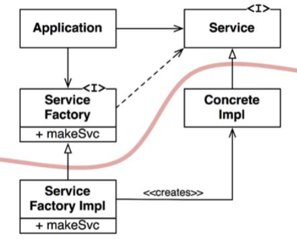

# Chapter 11: DIP - The Dependency Inversion Principle
-------------

Nguyên Lý Đảo Ngược Phụ Thuộc (Dependency Inversion Principle – DIP) cho chúng ta biết rằng những hệ thống linh hoạt nhất là những hệ thống mà những phụ thuộc mã nguồn chỉ gắn với các lớp trừu tượng (abstraction) mà không phải là các đối tượng cụ thể (concretion).

Trong một ngôn ngữ kiểu tĩnh như Java thì điều này có nghĩa là các câu lệnh `use`, `import`, và `include` chỉ được trỏ tới các module nguồn bao gồm các `interface`, các lớp trừu tượng (`abstract class`), hoặc một dạng khai báo trừu tượng nào đó. Nó không nên phụ thuộc vào bất cứ đối tượng cụ thể nào.

Nguyên tắc tương tự cũng áp dụng cho các ngôn ngữ kiểu động, như Ruby và Python. Các phụ thuộc mã nguồn không được quy với bất cứ module cụ thể nào. Tuy nhiên, trong những ngôn ngữ này sẽ khó hơn một chút để định nghĩa cái gì là một module cụ thể. Nhìn chung, đó là bất cứ module nào có triển khai các hàm được gọi tới.

Rõ ràng, việc thực hiện ý tưởng này như một nguyên tắc là điều không thực tế, bởi vì các hệ thống phần mềm bắt buộc phải phụ thuộc vào nhiều module cụ thể. Lấy ví dụ, lớp `String` trong Java là một lớp cụ thể, và thật không thực tế nếu cố gắng buộc nó trở thành trừu tượng. Phụ thuộc mã nguồn vào lớp cụ thể `java.lang.string` là điều không thể tránh được và cũng không nên tránh.

Để so sánh, lớp `String` này rất ổn định. Những thay đổi tới lớp này là rất hiếm và được kiểm soát chặt chẽ. Các lập trình viên và các kiến trúc sư không cần phải lo lắng tới việc thay đổi thường xuyên và thất thường của lớp `String`.

Vì những nguyên nhân này, chúng ta có khuynh hướng bỏ qua nền tảng ổn định của hệ điều hành và các module hệ thống khi nói tới DIP. Chúng ta cho phép những phụ thuộc cụ thể này bởi vì chúng ta có thể tin tưởng rằng chúng sẽ không bị thay đổi.

Điều chúng ta muốn ở đây là tránh phụ thuộc vào những thành phần cụ thể dễ thay đổi (volatile concrete element) của hệ thống của chúng ta. Đây là những module mà chúng ta đang tích cực phát triển, và có khả năng sẽ thay đổi thường xuyên.

## Stable abstractions

Mọi thay đổi tới một interface trừu tượng tương ứng với một thay đổi tới những triển khai cụ thể của nó. Ngược lại, những thay đổi tới những triển khai cụ thể thì không phải luôn luôn hoặc thường xuyên đòi hỏi phải thay đổi tới các interface mà chúng triển khai. Do đó các interface ít bị thay đổi hơn so với các triển khai.

Quả thực, các kiến trúc sư và thiết kế phần mềm giỏi luôn làm việc chăm chỉ để hạn chế sự thay đổi của các interface. Họ cố gắng tìm ra các cách để thêm chức năng vào các triển khai mà không phải thay đổi tới các interface. Đây là Thiết Kế Phần Mềm 101.

Ý của nó là những kiến trúc phần mềm ổn định là những kiến trúc mà tránh phụ thuộc vào các đối tượng cụ thể dễ thay đổi, và thay vào đó là sử dụng các interface trừu tượng ổn định. Hàm ý này có thể tóm tắt thành một bộ các kinh nghiệm coding rất cụ thể:

- **Không nên sử dụng các lớp cụ thể dễ thay đổi** : Thay vào đó sử dụng các interface trừu tượng. Nguyên tắc này áp dụng cho tất cả các ngôn ngữ, dù là ngôn ngữ kiểu tĩnh hay kiểu động. Nó cũng áp đặt những ràng buộc nghiêm ngặt tới việc tạo ra các đối tượng và thông thường buộc phải sử dụng Abstract Factories.
- **Không nên kế thừa các lớp cụ thể dễ thay đổi**: Đây là kết quả tất yếu của nguyên tắc trước, nhưng nó có một ý nghĩa đặc biệt. Trong các ngôn ngữ kiểu tĩnh, việc kế thừa là chắc nhất, và cứng nhắc nhất, trong tất cả các mối liên hệ của mã nguồn; hệ quả là nó cần phải được sử dụng một cách thận trọng. Trong các ngôn ngữ kiểu động, việc kế thừa là một vấn đề nhẹ hơn, nhưng nó vẫn là một sự phụ thuộc – và việc cẩn trọng luôn luôn là một sự lựa chọn sáng suốt.
- **Không nên ghi đè (override) các hàm cụ thể** : Các hàm cụ thể thường đòi hỏi các phụ thuộc mã nguồn. Khi bạn ghi đè những hàm này, thì bạn không hề loại bỏ những phụ thuộc mà thay vào đó bạn đang kế thừa chúng. Để quản lý những phụ thuộc này thì bạn nên tạo các hàm trừu tượng và tạo ra nhiều triển khai.
- **Không bao giờ được gọi tới tên của bất cứ thứ gì cụ thể và dễ thay đổi**: Đây thực sự chỉ là một sự phát biểu lại của bản thân nguyên lý này.

## Factories
Để tuân thủ những nguyên tắc này, việc tạo ra các đối tượng cụ thể dễ thay đổi sẽ đòi hỏi việc xử lý đặc biệt. Sự thận trọng này đã được đảm bảo bởi vì trong hầu như tất cả các ngôn ngữ, việc tạo ra một đối tượng sẽ đòi hỏi một phụ thuộc mã nguồn vào định nghĩa cụ thể của đối tượng đó.

Trong phần lớn các ngôn ngữ hướng đối tượng, như Java, chúng ta thường dùng một *Abstract Factory* để quản lý những phụ thuộc không mong muốn này.

Biểu đồ trong hình dưới đây chỉ ra cấu trúc này. Lớp `Application` sử dụng lớp `ConcreteImpl` thông qua interface `Service`. Tuy nhiên, `Application` buộc phải tạo ra các thực thể của `ConcreteImpl` bằng cách nào đó. Để đạt được điều này mà không phải tạo ra phụ thuộc mã nguồn vào `ConcreteImpl`, thì `Application` gọi method makeSvc của interface `ServiceFactory`. Method này được triển khai bởi lớp `ServiceFactoryImpl`, dẫn xuất từ `ServiceFactory`. Lớp này khởi tạo ra `ConcreteImpl` và trả nó về như là một `Service`.

Đường cong trong hình trên là đường ranh giới kiến trúc. Nó tách biệt giữa phần trừu tượng và phần cụ thể. Tất cả các phụ thuộc mã nguồn vượt qua đường cong đó đều trỏ theo cùng một hướng, hướng về phía trừu tượng.

Đường cong này chia hệ thống thành hai component: một là trừu tượng và cái còn lại là cụ thể. Component trừu tượng bao gồm tất cả các logic nghiệp vụ của ứng dụng. Component cụ thể thì bao gồm tất cả các chi tiết triển khai của những logic nghiệp vụ đó.

Lưu ý rằng luồng điều khiển vượt qua đường cong đó theo hướng ngược lại với các phụ thuộc mã nguồn. Các phụ thuộc mã nguồn bị đảo ngược lại so với luồng điều khiển – điều này lý giải tại sao chúng ta lại gọi nguyên lý này là Đảo Ngược Phụ Thuộc (Dependency Inversion).

## Concrete components
Component cụ thể trong hình trên bao gồm một phụ thuộc đơn, vì vậy nó đã vi phạm nguyên lý DIP. Điều này là điều bình thường. Việc vi phạm DIP không thể loại bỏ hoàn toàn được, nhưng chúng có thể được tập hợp lại thành một số nhỏ các component cụ thể và được giữ tách biệt khỏi phần còn lại của hệ thống.

Phần lớn các hệ thống sẽ bao gồm ít nhất một component cụ thể như vậy – thường được gọi là main bởi vì nó bao gồm hàm main. Trong trường hợp mô tả như trong Hình 11.1, hàm main sẽ khởi tạo `ServiceFactoryImpl` và đặt thực thể đó trong một biến global có kiểu `ServiceFactory`. `Application` sau đó sẽ truy cập tới factory thông qua biến global đó.

## Conclusion
Khi chúng ta tiếp tục cuốn sách này và đề cập tới các nguyên lý kiến trúc ở cấp cao hơn, thì nguyên lý DIP vẫn sẽ được nhắc tới lặp đi lặp lại. Nó sẽ là nguyên lý tổ chức rõ ràng nhất trong các biểu đồ kiến trúc của chúng ta. Đường cong trong hình vẽ mục trước sẽ trở thành đường ranh giới kiến trúc trong các chương sau. Cái cách mà các phụ thuộc vượt qua đường ranh giới đó theo một hướng, và hướng về các đối tượng có mức trừu tượng cao hơn, sẽ trở thành một nguyên tắc mới mà chúng ta sẽ gọi là Nguyên Tắc Phụ Thuộc (Dependency Rule).