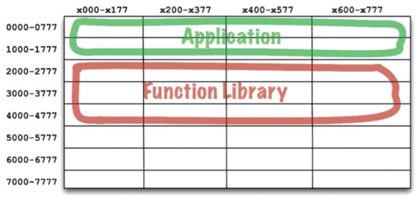
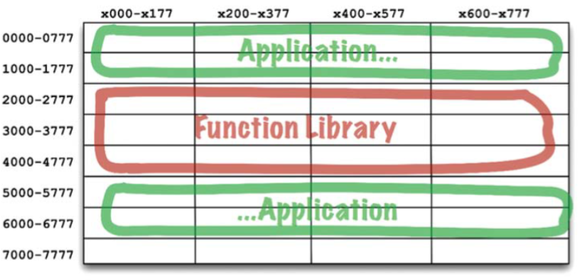

# Chapter 12 : Components
-------------


Nếu các nguyên lý SOLID cho chúng ta biết cách để sắp xếp các viên gạch để xây tường và phòng, thì các nguyên lý component sẽ cho chúng ta biết cách sắp xếp các phòng thành các tòa nhà. Những hệ thống phần mềm lớn, cũng giống như những tòa nhà lớn, đều được xây nên bởi những component nhỏ hơn. Trong Phần IV, chúng ta sẽ thảo luận các component phần mềm là cái gì, những yếu tố nào cấu thành nên chúng và chúng cần phải được kết hợp với nhau như thế nào trong một hệ thống.

# Chapter 12: Components
-------------

Các component là các đơn vị triển khai code. Chúng là những thực thể nhỏ nhất có thể được triển khai như là một phần của hệ thống. Trong Java, chúng là những file `jar`. Trong Ruby, chúng là những file `gem`. Trong .Net, chúng là các `DLL`. Trong các ngôn ngữ biên dịch, chúng là tập hợp của các file nhị phân. Trong các ngôn ngữ thông dịch, chúng là tập hợp của các file nguồn. Trong tất cả các ngôn ngữ, chúng là một phần của việc triển khai code.

Các component có thể được liên kết với nhau thành một file thực thi duy nhất. Hoặc chúng có thể tập hợp với nhau thành một file chứa, ví dụ như file `.war`. Hoặc chúng có thể được triển khai độc lập thành những plugin có thể nạp động riêng rẽ, ví dụ như `.jar` hoặc `.dll` hoặc file `.exe`. Cho dù cuối cùng chúng được triển khai như thế nào đi nữa thì các component được thiết kế tốt sẽ luôn duy trì được khả năng có thể triển khai độc lập và do đó chúng sẽ có thể phát triển một cách độc lập.


## A brief history of components
Vào những năm đầu của ngành phát triển phần mềm, các lập trình viên điều khiển vị trí bộ nhớ và bố cục của các chương trình của họ. Một trong những dòng đầu tiên của code chương trình sẽ là câu lệnh origin (gốc), nó khai báo địa chỉ mà chương trình sẽ được nạp.

Hãy xem chương trình PDP-8 đơn giản sau. Nó bao gồm một thủ tục con tên là `GETSTR` được dùng để nhận chuỗi ký tự từ bàn phím và lưu nó vào trong một bộ nhớ đệm. Nó cũng có một chương trình kiểm tra nhỏ để kiểm tra `GETSTR`.

```
        *200
        TLS
START,	CLA
        TAD BUFR
        JMS GETSTR
        CLA
        TAD BUFR
        JMS PUTSTR
        JMP START
BUFR,	3000
 	 
GETSTR,	0
 	    DCA PTR
NXTCH,	KSF
        JMP -1
        KRB
        DCA I PTR
        TAD I PTR
        AND K177
        ISZ PTR
        TAD MCR
        SZA
        JMP NXTCH
 	 
K177,	177
MCR,	-15
```

ưu ý  lệnh *200 ở đầu chương trình này. Nó nói cho trình biên dịch là nó sẽ được nạp ở địa chỉ 200_8.

Kiểu lập trình này là một khái niệm xa lạ với phần lớn lập trình viên ngày nay. Họ hiếm khi phải nghĩ về nơi mà một chương trình sẽ được nạp vào bộ nhớ của máy tính. Nhưng trong những ngày đầu đó, điều này là một trong những quyết định đầu tiên của một lập trình viên cần phải thực hiện. Vào thời điểm đó, các chương trình không có khả năng tái định vị trong bộ nhớ.

Vậy bạn truy cập một hàm trong thư viện vào những ngày đó như thế nào? Đoạn code phía trên đã mô tả phương pháp được sử dụng. Các lập trình viên thêm mã nguồn của các hàm thư viện vào trong code ứng dụng của họ, và biên dịch tất cả thành một chương trình[1] duy nhất. Các thư viện được lưu dưới dạng mã nguồn, chứ không phải dạng nhị phân.

Vấn đề với phương pháp này đó là trong thời kỳ đó, các thiết bị đều xử lý rất chậm và bộ nhớ thì rất đắt đỏ và do đó bị hạn chế. Các trình biên dịch cần thực hiện một số lần chuyển mã nguồn, nhưng bộ nhớ quá hạn chế để lưu giữ  được tất cả mã nguồn. Do đó, trình biên dịch đã phải đọc mã nguồn nhiều lần bằng các thiết bị chậm chạp.

Điều này mất rất nhiều thời gian – và thư viện hàm của bạn càng lớn thì trình biên dịch càng lâu. Việc biên dịch một chương trình lớn có thể mất hàng tiếng đồng hồ.

Để rút ngắn thời gian biên dịch, các lập trình viên đã tách biệt mã nguồn của thư viện hàm khỏi ứng dụng. Họ biên dịch thư viện hàm riêng và nạp thư viện ở dạng nhị phân vào một địa chỉ đã biết – ví dự như 2000_8. Họ đã tạo ra một bảng ký hiệu cho thư viện hàm và biên dịch thứ đó với code ứng dụng của họ. Khi họ muốn chạy một ứng dụng, họ sẽ nạp thư viện hàm ở dạng nhị phân, và sau đó nạp ứng dụng. Bộ nhớ được bố trí giống như trong hình dưới đây:



Cách này hoạt động tốt với điều kiện ứng dụng nằm vừa trong khoảng giữa địa chỉ 0000_8 và 1777_8. Nhưng các ứng dụng đã sớm phát triển ngày càng lớn hơn so với không gian nhớ được cấp phát cho chúng. Lúc đó, các lập trình viên phải chia ứng dụng của họ thành hai vùng địa chỉ, nhảy qua vùng địa chỉ thư viện hàm.



Hiển nhiên đây không phải là một phương pháp bền vững. Khi các lập trình viên thêm nhiều hơn các hàm vào thư viện hàm, nó sẽ vượt qua giới hạn này và họ sẽ phải cấp phát thêm không gian nhớ cho nó (trong ví dụ này là gần 7000_8). Sự phân mảnh này của các chương trình và thư viện là điều cần thiết khi bộ nhớ máy tính lớn lên.

Rõ ràng, chúng ta phải làm cái gì đó.

## Relocatability

Giải pháp đó là các file nhị phân có thể tái định vị được. Ý tưởng này rất đơn giản. Trình biên dịch được thay đổi để xuất ra mã nhị phân mà có thể tái định vị được trong bộ nhớ bởi một bộ nạp (loader) thông minh. Bộ nạp này sẽ được cung cấp nơi nào để nạp mã có thể tái định vị đó. Mã này được gắn bằng nhiều cờ để nói với bộ nạp về những phần của dữ liệu nạp nào phải được thay thế để có thể nạp được tại địa chỉ lựa chọn. Thường thì điều này nghĩa là chỉ cần thêm địa chỉ đầu tiên vào bất cứ địa chỉ tham chiếu bộ nhớ nào trong file nhị phân.

Bây giờ lập trình viên có thể nói với bộ nạp này nơi nào để nạp thư viện hàm, và nơi nào để nạp ứng dụng. Trong thực tế, các bộ nạp sẽ chấp nhận vài file nhị phân đầu vào và đơn giản là nạp chúng trong bộ nhớ cái này cạnh cái kia, tái định vị chúng theo như cách nó nạp chúng. Điều này cho phép các lập trình viên chỉ phải nạp những hàm mà họ cần.

Trình biên dịch cũng được thay đổi để cung cấp tên hàm như là một metadata (siêu dữ liệu) trong file nhị phân có thể tái định vị được đó. Nếu một chương trình gọi một hàm thư viện, thì trình biên dịch sẽ cung cấp tên hàm như là một ngoại tham chiếu (external reference). Nếu một chương trình định nghĩa một hàm thư viện, trình biên dịch sẽ cung cấp tên hàm như một ngoại định nghĩa (external definition). Sau đó bộ nạp có thể liên kết ngoại tham chiếu đó với ngoại định nghĩa khi mà nó đã xác định được nơi nào nó có thể nạp được những định nghĩa này.

Và như vậy bộ nạp liên kết được ra đời.

## Linkers

Bộ nạp liên kết đó cho phép các lập trình viên chia chương trình của họ thành những phần có thể biên dịch được và có thể nạp tách biệt nhau. Phương pháp này hoạt động tốt khi mà các chương trình tương đối nhỏ được liên kết với những thư viện cũng tương đối nhỏ. Tuy nhiên, trong cuối những năm 1960 và đầu những năm 1970, các lập trình viên có nhiều tham vọng hơn, và các chương trình của họ ngày càng lớn hơn.

Cuối cùng, các bộ nạp liên kết này trở nên quá chậm chạp để có thể chịu đựng được. Các thư viện hàm được lưu trữ trên các thiết bị chậm như băng từ. Thậm chí cả đĩa cứng vào thời đó cũng khá chậm chạp. Trong khi sử dụng những thiết bị tương đối chậm này, các bộ nạp liên kiết lại phải đọc hàng tá, nếu không muốn nói là hàng trăm các thư viện nhị phân để phân giải những ngoại tham chiếu này. Khi các chương trình ngày một lớn hơn, và các hàm thư viện được tích lũy trong thư viện ngày một nhiều hơn, bộ nạp liên kết sẽ phải mất hàng giờ chỉ để nạp được chương trình đó.

Cuối cùng, việc nạp và việc liên kết đã được tách ra thành hai giai đoạn. Các lập trình viên đã lấy phần chậm – phần thực hiện việc liên kết – và đặt nó vào trong một ứng dụng riêng được gọi là bộ liên kết (linker). Đầu ra của bộ liên kết này là một file đã được liên kết mà một bộ nạp tái định vị có thể nạp rất nhanh. Điều này cho phép các lập trình viên chuẩn bị một file thực thi bằng cách sử dụng bộ liên kết chậm chạp đó, nhưng sau đó thì chúng lại có thể được nạp rất nhanh, vào bất cứ lúc nào.

Sau đó tới những năm 1980. Các lập trình viên lúc này làm việc với ngôn ngữ C hoặc một ngôn ngữ nào đó ở cấp cao hơn. Các chương trình của họ cũng lớn hơn cùng với tham vọng của họ. Các chương trình có hàng trăm nghìn dòng code lúc này không phải là điều gì bất thường cả.

Các module nguồn được biên dịch từ các file .c thành các file .o, và sau đó chuyển cho các bộ liên kết để tạo ra các file thực thi có thể được nạp nhanh chóng. Việc biên dịch mỗi một module này khá nhanh, nhưng việc biên dịch tất cả các module thì mất nhiều thời gian hơn một chút. Bộ liên kết thì thậm chí còn mất nhiều thời gian hơn nữa. Trong nhiều trường hợp, mỗi chu kỳ biên dịch – liên kết có thể mất tới một hoặc nhiều giờ.

Có vẻ như các lập trình viên đã phải chịu đựng việc mất nhiều thời gian biên dịch một cách không có hồi kết. Trải qua những năm 1960, 1970, và 1980, tất cả những thay đổi được thực hiện để tăng tốc độ công việc đều bị cản lại bởi tham vọng của các lập trình viên, và kích thước các chương trình mà họ viết. Họ có vẻ như không thể thoát được chu kỳ làm việc phải kéo dài hàng giờ. Thời gian nạp vẫn duy trì nhanh chóng, nhưng thời gian biên dịch – liên kết lại bị tắc nghẽn.

Dĩ nhiên chúng ta cũng gặp phải định luật Murphy về kích thước chương trình:

Các chương trình sẽ phát triển tới mức choán đầy tất cả thời gian biên dịch và liên kết khả dụng.

Nhưng Murphy không phải là đối thủ duy nhất trong vùng. Cùng với đó là Moore[3], và vào những năm cuối 1980, cả hai đã có một cuộc chiến. Moore đã chiến thắng cuộc chiến đó. Đĩa cứng đã bắt đầu co nhỏ lại và nhanh hơn đáng kể. Bộ nhớ máy tính đã bắt đầu rẻ đến mức mà nhiều dữ liệu trên đĩa cứng đã có thể lưu đệm trong RAM. Tốc độ máy tính cũng tăng từ 1 MHz lên 100 MHz.

Vào giữa những năm 1990, thời gian dùng để liên kết đã bắt đầu giảm nhanh hơn so với tham vọng tạo ra các chương trình ngày càng lớn của chúng ta. Trong nhiều trường hợp, thời gian liên kết đã giảm chỉ còn vài giây. Đối với những công việc nhỏ, ý tưởng về một bộ nạp liên kết lại trở nên khả thi.

Đây là kỷ nguyên của Active-X, các thư viện chia sẻ, và là sự khởi đầu của các file .jar. Máy tính và các thiết bị trở nên nhanh đến nỗi chúng ta có thể, lại một lần nữa, thực hiện việc liên kết cùng lúc vào thời điểm nạp. Chúng ta có thể liên kết vài file .jar, hoặc vài thư viện chia sẻ chỉ trong vài giây, và thực thi chương trình. Và vì vậy kiến trúc component plugin đã được ra đời.

Ngày nay chúng ta thường dùng các file .jar hoặc DLL hoặc các thư viện chia sẻ như là các plugin cho các ứng dụng đang có. Lấy ví dụ, nếu bạn muốn tạo ra một bản chỉnh sửa (mod) cho trò Mincecraft thì bạn chỉ cần đơn giản là đặt các file .jar sửa đổi của bạn vào một thư mục cụ thể nào đó. Nếu bạn muốn sử dụng Resharper trong Visual Studio, thì bạn chỉ cần đơn giản thêm vào các file DLL thích hợp.

## Conclusion

Các file liên kết động, có thể được gắn vào nhau lúc chạy chương trình, là các component phần mềm trong các kiến trúc của chúng ta. Phải mất tới 50 năm, thì chúng ta mới tới được cái nơi mà kiến trúc component plugin đã trở thành mặc định thông thường, đối nghịch với những nỗ lực không biết mệt mỏi trước đây đã từng có.