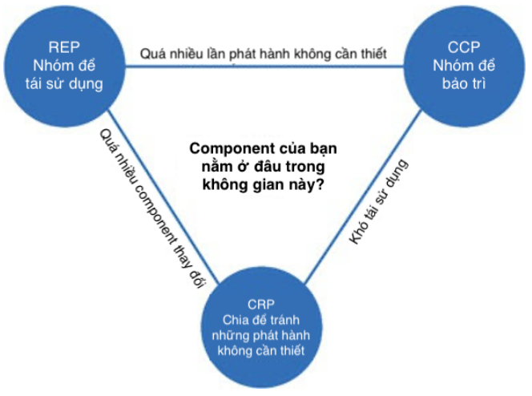

Lớp nào sẽ thuộc về component nào? Đây là một quyết định quan trọng, và đòi hỏi sự hướng dẫn từ những nguyên lý kỹ thuật phần mềm tốt. Không may thay, trải qua nhiều năm, quyết định này đều được đưa ra một cách tùy ý dựa gần như hoàn toàn vào bối cảnh.

Trong chương này chúng ta sẽ thảo luận ba nguyên lý của sự gắn kết component:

- **REP**: Nguyên Lý Tái Sử Dụng/Phát Hành Tương Đương (Reuse/Release Equivalence Principle)
- **CCP**: Nguyên Lý Khép Kín Chung (Common Closure Principle)
- **CRP**: Nguyên Lý Tái Sử Dụng Chung (Common Reuse Principle)

## The Reuse/Release Equivalence Principle

*The granule of reuse is the granule of release*

Thập niên gần đây đã chứng kiến sự gia tăng của một loạt các công cụ quản lý module, ví dụ như Maven, Leiningen, và RVM. Những công cụ này đã đóng một vai trò quan trọng bởi vì trong suốt thời kỳ đó, một số lượng khổng lồ các component có thể tái sử dụng và các thư viện component đã được tạo ra. Chúng ta hiện nay đang sống trong kỷ nguyên của phần mềm tái sử dụng – hoàn thành một trong những lời hứa xưa nhất của mô hình hướng đối tượng.

Nguyên lý Tái Sử Dụng/Phát Hành Tương Đương (REP) là một nguyên lý có vẻ hiển nhiên, ít nhất là trong nhận thức muộn màng. Những người muốn tái sử dụng các component phần mềm sẽ không thể, và không nên tái sử dụng trừ khi những component này được kiểm soát theo một quy trình phát hành và được cung cấp số phiên bản phát hành.

Điều này không đơn giản bởi vì nếu không có các số phiên bản phát hành thì sẽ không có cách nào để đảm bảo tất cả các component được tái sử dụng sẽ tương thích với những cái khác. Hơn nữa nó cũng phản ánh thực tế là những lập trình viên phần mềm cần biết khi nào phiên bản mới được phát hành, và những thay đổi nào mà phiên bản mới đó sẽ mang lại.

Không có gì lạ khi các lập trình viên được thông báo về một bản phát hành mới và quyết định xem có tiếp tục sử dụng phiên bản cũ hay không, dựa trên những thay đổi trong bản phát hành đó. Bởi vậy quy trình phát hành buộc phải tạo ra những thông báo thích hợp và tài liệu cho mỗi lần phát hành để người dùng có thể đưa ra được những quyết định về việc khi nào và có nên tích hợp phiên bản mới vào hay không.

Từ quan điểm kiến trúc và thiết kế phần mềm, nguyên lý này có nghĩa là các lớp và module hình thành nên một component buộc phải thuộc vào một nhóm gắn kết chặt chẽ với nhau. Component không thể chỉ đơn giản bao gồm một mớ lộn xộn ngẫu nhiên các lớp và các module; thay vào đó, nó buộc phải có một chủ đề bao quát hoặc mục đích nào đó mà tất cả những module cùng chia sẻ với nhau.

Dĩ nhiên, đây là điều hiển nhiên. Tuy nhiên, có một cách khác để nhìn vào vấn đề này mà có lẽ nó không được hiển nhiên như vậy. Các lớp và các module được nhóm lại thành một component cần phải có khả năng phát hành cùng lúc với nhau. Thực tế là chúng chia sẻ cùng số hiệu phiên bản và cùng theo dõi phát hành, và được bao gồm trong cùng một tài liệu phát hành, nên chúng cần phải có nghĩa đối với cả tác giả lẫn người dùng.

Đây là một lời khuyên không rõ ràng lắm: Nói cái gì đó cần phải “có nghĩa” cũng chỉ giống như cái cách vẫy tay trong không khí và cố gắng tỏ ra vẻ có quyền hành. Lời khuyên này không rõ ràng bởi vì nó khó để giải thích chính xác mối gắn kết giữa các lớp và module lại với nhau thành một component. Mặc dù lời khuyên này không rõ ràng, nhưng bản thân nguyên lý này lại rất quan trọng, bởi vì các vi phạm rất dễ dàng để phát hiện – chúng không “có ý nghĩa” gì cả. Nếu bạn vi phạm nguyên lý REP, người dùng của bạn sẽ biết, và họ sẽ không ấn tượng với kỹ năng thiết kế kiến trúc của bạn.

Điểm yếu của nguyên lý này đã được bù đắp nhiều hơn bởi điểm mạnh của hai nguyên lý tiếp theo. Thực vậy, các nguyên lý CCP và CRP xác định rõ nguyên tắc này nhưng theo nghĩa tiêu cực.

## The Common Closure Principle

*Gather into components those classes that change for the same reasons and at the same times. Separate into different componnets those classes that change at different times and for different reasons*

*Tập hợp thành component những lớp mà sẽ được thay đổi vì cùng nguyên nhân và vào cùng một thời điểm. Việc phân tách thành những component khác khi mà những lớp thay đổi vào những lúc khác nhau và vì những nguyên nhân khác nhau.*

Đây là Nguyên Lý Đơn Nhiệm SRP được phát biểu lại đối với các component. Cũng như nguyên lý SRP nói rằng một lớp không nên có nhiều lý do để thay đổi, thì Nguyên Lý Khép Kín Chung (CCP) cũng nói rằng một component cũng không nên có nhiều lý do để thay đổi.

Đối với phần lớn các ứng dụng, khả năng bảo trì được sẽ quan trọng hơn là khả năng dùng được. Nếu code trong một ứng dụng buộc phải thay đổi, thì tốt hơn hết là tất cả những thay đổi đó nên xảy ra trong một component, hơn là bị phân tán qua nhiều component. Nếu những thay đổi chỉ hạn chế trong một component, thì chúng ta sẽ chỉ cần triển khai lại một component bị thay đổi đó thôi. Các component khác không phụ thuộc vào component bị thay đổi sẽ không cần phải được kiểm tra hoặc triển khai lại.

Nguyên lý CCP nhắc chúng ta tập hợp cùng nhau vào một nơi tất cả các lớp có khả năng sẽ thay đổi vì cùng một nguyên nhân. Nếu hai lớp gắn kết với nhau quá chặt đến nỗi chúng luôn thay đổi cùng nhau thì khi đó chúng sẽ thuộc về cùng một component. Điều này cũng tối thiểu hóa các công việc liên quan tới việc phát hành, kiểm tra và triển khai lại phần mềm.

Nguyên lý này gắn kết chặt chẽ với Nguyên Lý Mở-Đóng (OCP). Thực vậy, nó được “khép kín” theo nghĩa của nguyên lý OCP với từ mà nguyên lý CCP đề cập. Nguyên lý OCP nói rằng các lớp nên đóng không cho sửa đổi nhưng lại mở ra cho phép mở rộng. Do việc khép kín 100% là điều không thể đạt được, nên việc khép kín ở đây phải hiểu là chiến lược. Chúng ta thiết kế các lớp sao cho chúng đóng đối với những dạng thay đổi thông thường nhất mà chúng ta có thể dự đoán được hoặc đã từng có kinh nghiệm.

Nguyên lý CCP nhấn mạnh bài học phải tập hợp vào cùng một component những lớp khép kín với những thay đổi cùng loại. Do đó, khi một thay đổi theo yêu cầu cần thực hiện thì thay đổi đó có khả năng cao là sẽ chỉ giới hạn thay đổi trong một số tối thiểu các component.

### Similarity with SRP
Như đã phát biểu trước đó, nguyên lý CCP là dạng component của nguyên lý SRP. SRP nói với chúng ta rằng nên tách các method vào các lớp khác nhau nếu chúng thay đổi vì những lý do khác nhau. CCP thì nói với chúng ta rằng việc phân tách lớp thành những component khác nhau nếu chúng thay đổi vì những lý do khác nhau. Cả hai nguyên lý có thể được tổng kết như sau:

Tập hợp cùng nhau những thứ thay đổi vào cùng một thời điểm và vì cùng một lý do. Phân tách những thứ thay đổi ở những thời điểm khác nhau hoặc vì những lý do khác nhau.

## The Common Reuse Principle
*Don't force users of a component to depend on things they don't need*

*Đừng ép người dùng một component phải phụ thuộc vào thứ mà chúng không cần.*

Nguyên Lý Tái Sử Dụng Chung (CRP) là một nguyên lý khác giúp chúng ta quyết định xem lớp nào và module nào nên được đặt vào trong một component. Nó nói rằng các lớp và các module có thể tái sử dụng cùng nhau sẽ thuộc về cùng một component.

Các lớp hiếm khi được tái sử dụng trong điều kiện cách ly. Thông thường, các lớp có thể tái sử dụng kết hợp với các lớp khác là một phần của một bộ trừu tượng tái sử dụng được. CRP nói rằng những lớp này cùng thuộc một component. Trong một component như vậy chúng ta sẽ thấy các lớp của nó sẽ có rất nhiều phụ thuộc lẫn nhau.

Một ví dụ đơn giản có thể là một lớp chứa (container class) và các lặp lại gắn với nó. Những lớp này được tái sử dụng cùng nhau bởi vì chúng được gắn kết chặt chẽ với nhau. Do đó chúng phải ở trong cùng một component.

Nhưng nguyên lý CRP nói cho chúng ta không chỉ về việc các lớp đặt cùng nhau trong một component: Nó còn nói với chúng ta về những lớp không được giữ cùng nhau trong một component. Khi một component dùng một component khác thì một phụ thuộc đã được tạo ra giữa các component. Có lẽ việc component sử dụng chỉ dùng duy nhất một lớp nằm trong component được sử dụng – cũng không hề làm yếu đi sự phụ thuộc. Khi đó component sử dụng vẫn phụ thuộc vào component được sử dụng.

Bởi vì sự phụ thuộc đó, mỗi khi component được sử dụng thay đổi thìcomponent sử dụng cũng sẽ cần những thay đổi tương ứng. Ngay cả khi những thay đổi đều không cần thiết cho component sử dụng, thì nó vẫn cần phải được biên dịch lại, kiểm tra lại, và triển khai lại. Đây là sự thật ngay cả khi component sử dụng không quan tâm gì tới thay đổi có trong component được sử dụng.

Do đó khi chúng ta phụ thuộc vào một component, thì chúng ta muốn đảm bảo rằng chúng ta phụ thuộc vào mọi lớp có trong component đó. Nói cách khác, chúng ta muốn đảm bảo rằng những lớp mà chúng ta đặt chúng vào trong một component là không thể tách rời khỏi nhau – nghĩa là không thể chỉ phụ thuộc vào một vài lớp mà không phụ thuộc vào các còn lại. Nếu không, chúng ta sẽ phải triển khai lại các component nhiều hơn cần thiết và lãng phí đáng kể công sức.

Do đó nguyên lý CRP nói cho chúng ta nhiều hơn về cách mà các lớp không nên có cùng nhau hơn là cách mà các lớp nên có cùng nhau trong cùng một component. CRP nói rằng các lớp không gắn kết chặt chẽ với nhau thì không nên ở trong cùng một component.

### Relation to ISP
Nguyên lý CRP là phiên bản khái quát của nguyên lý ISP. ISP khuyên chúng ta không phụ thuộc vào các lớp mà có các method chúng ta không sử dụng. CRP khuyên chúng ta không phụ thuộc vào component mà có các lớp mà chúng ta không sử dụng.

Tất cả những lời khuyên này có thể tổng kết thành một câu duy nhất:

*Don't depend on things you don't need*

## The Tension Diagram For Component Cohesion
Bạn có thể đã nhận ra rằng ba nguyên lý gắn kết này có khuynh hướng là đối đầu lần nhau. Nguyên lý REP và CCP là các nguyên lý bao gồm (inclusive principle): Cả hai đều có khuynh hướng làm cho các component lớn hơn. Nguyên lý CRP lại là một nguyên lý loại trừ (exclusive principle), nó hướng các component nhỏ đi. Đó là sự giằng co giữa các nguyên lý mà một kiến trúc sư giỏi cần phải tìm cách giải quyết.

Biểu đồ đưới đây là một biểu đồ sức căng chỉ ra cách mà ba nguyên lý gắn kết này tương tác với nhau. Các cạnh của biểu đồ mô tả chi phí của việc từ bỏ nguyên tắc của đỉnh đối diện.

Một kiến trúc sư chỉ tập trung vào nguyên lý REP và CRP sẽ thấy quá nhiều component bị ảnh hưởng khi chỉ cần thực hiện những thay đổi đơn giản. Ngược lại, một kiến trúc sư tập trung quá nhiều vào CCP và REP sẽ gây ra việc tạo ra nhiều lần phát hành không cần thiết.

Một kiến trúc sư giỏi sẽ tìm ra được một điểm mà ở đó tam giác sức căng thỏa mãn được những lo ngại hiện giờ của đội phát triển, nhưng cũng cân nhắc tới việc những lo ngại này sẽ có thể thay đổi. Lấy ví dụ, trong giai đoạn đầu phát triển một dự án, nguyên lý CCP sẽ quan trọng hơn nguyên lý REP, bởi vì khả năng phát triển quan trọng hơn việc tái sử dụng.

Nói chung, các dự án thường có khuynh hướng bắt đầu từ phía tay phải của hình tam giác trên, nơi mà chỉ phải hy sinh khả năng tái sử dụng. Một khi dự án đã trưởng thành, và các dự án khác bắt đầu sử dụng nó, thì mức độ ưu tiên các nguyên lý sẽ trượt về phía trái. Điều này có nghĩa là cấu trúc component của một dự án có thể thay đổi theo thời gian và tùy mức độ trưởng thành của dự án. Nó liên quan nhiều hơn đến cách dự án đó được phát triển và sử dụng, hơn là những gì dự án đó thực sự làm.

## Conclusion

Trong quá khứ, quan điểm của chúng tôi về sự gắn kết thì đơn giản hơn nhiều những gì nguyên lý REP, CCP, và CRP đã nói tới. Chúng tôi đã từng nghĩ rằng sự gắn kết chỉ đơn giản là một thuộc tính mà trong đó một module sẽ thực hiện một và chỉ một chức năng. Tuy nhiên, ba nguyên lý của sự gắn kết component đã mô tả sự thay đổi tính chất gắn kết phức tạp hơn nhiều. Để chọn các lớp để nhóm chúng lại thành các component thì chúng ta buộc phải cân nhắc đến phản lực liên quan tới khả năng tái sử dụng và khả năng phát triển. Việc cân bằng các lực này tùy theo mức độ đòi hỏi của ứng dụng là vấn đề không hề đơn giản. Hơn nữa, sự cân bằng thì hầu như luôn luôn có tính động. Ngày hôm nay việc phân chia như vậy là thích hợp có thể sẽ không còn thích hợp vào năm tới. Kết quả là thành phần của các component sẽ bị xáo trộn và tiến hóa theo thời gian khi mà trọng tâm của dự án thay đổi từ khả năng phát triển được sang khả năng tái sử dụng được.

