# Chapter 14 : Component Coupling
------------------

Ba nguyên lý tiếp theo sẽ giải quyết mối quan hệ giữa các component. Ở đây lại một lần nữa chúng ta sẽ gặp mối quan hệ giằng co giữa khả năng phát triển và thiết kế logic. Các lực tác động đến kiến trúc của một cấu trúc component bao gồm kỹ thuật, chính trị, và biến động (technical , political, volatile).

## The Acyclic Dependencies Principle (ADP)

*Allow no cycles in the component dependency graph*

*Cấm vòng lặp trong biểu đồ các phụ thuộc component*

Bạn đã từng làm việc cả ngày, làm cho thứ gì đó hoạt động, và sau đó đi về nhà, chỉ khi đến sáng hôm sau mới thấy rằng chương trình của bạn không còn hoạt động nữa? Tại sao nó lại không chạy được nữa vậy? Bởi vì ai đó ở lại muộn hơn và đã thay đổi thứ gì đó mà bạn phụ thuộc vào nó! Tôi gọi điều này là “hội chứng sau buổi sáng”.

“Hội chứng sau buổi sáng” này xảy ra trong môi trường phát triển phần mềm nơi mà nhiều lập trình viên đang sửa đổi các file mã nguồn cùng nhau. Ở những dự án tương đối nhỏ với chỉ một vài lập trình viên thì điều này không phải là một vấn đề quá lớn. Nhưng một khi kích thước của dự án và đội ngũ phát triển tăng lên, thì những buổi sáng có thể sớm biến thành những cơn ác mộng. Không có gì lạ khi nhiều tuần trôi qua mà đội phát triển không thể xây dựng được một phiên bản ổn định của dự án. Thay vào đó, mọi người tiếp tục thay đổi và thay đổi code của họ, cố gắng để làm cho nó hoạt động được với những thay đổi mà ai đó đã làm trước đó.

Trải qua vài thập kỷ gần đây, hai giải pháp cho vấn đề này đã được phát triển, cả hai đều xuất phát từ ngành công nghiệp viễn thông. Đầu tiên là “build hàng tuần”, và thứ hai là Nguyên Tắc Phụ Thuộc Không Vòng Lặp (ADP).

### The Weekly Build

Việc build hàng tuần thường phổ biến trong các dự án cỡ trung bình. Nó sẽ hoạt động như thế này: Tất cả các lập trình viên sẽ phớt lờ những người khác trong bốn ngày đầu của tuần. Tất cả họ sẽ làm việc trên bản copy của mã nguồn trên máy cá nhân, và không phải lo ngại gì tới việc tích hợp công việc của họ trên mã nguồn tổng. Sau đó, vào ngày Thứ Sáu, họ sẽ tích hợp tất cả những thay đổi của họ và build hệ thống đó.

Cách tiếp cận này có ưu điểm tuyệt vời là cho phép các lập trình viên sống trong một thế giới biệt lập vào bốn trên năm ngày trong tuần. Dĩ nhiên nhược điểm của nó là một lượng lớn lỗi tích hợp sẽ xảy ra vào Thứ Sáu.

Không may thay, khi dự án lớn dần, thì nó càng trở nên ít khả năng để có thể hoàn thành tích hợp dự án vào Thứ Sáu. Gánh nặng tích hợp lớn dần cho đến khi nó bắt đầu ngốn cả vào ngày Thứ Bảy. Chỉ một vài ngày Thứ Bảy như vậy là đủ để thuyết phục các lập trình viên là việc tích hợp hệ thống nên được bắt đầu vào Thứ Năm – và vì vậy việc bắt đầu tích hợp đã chậm rãi tiến vào giữa tuần.

Khi mà tỷ lệ thời gian chu kỳ phát triển với thời gian tích hợp hệ thống giảm, thì hiệu suất công việc của đội phát triển cũng giảm theo. Cuối cùng tình trạng này trở nên khó chịu đến mức mà các lập trình viên, hoặc các quản lý dự án tuyên bố rằng lịch tích hợp hệ thống sẽ thay đổi sang build hai tuần một lần. Việc này đủ để giải quyết vấn đề lần này, nhưng thời gian tích hợp vẫn tiếp tục tăng dần theo kích thước của dự án.

Cuối cùng, kịch bản này sẽ dẫn tới một cuộc khủng hoảng. Để duy trì hiệu quả, lịch build hệ thống phải tiếp tục được kéo dài – nhưng việc kéo dài chu kỳ build sẽ dẫn tới những rủi ro dự án. Việc tích hợp và kiểm thử trở nên càng khó khăn hơn để thực hiện, và đội phát triển mất đi ích lợi từ việc nhận được những phản hồi nhanh chóng.

### Eliminating Dependecy Cycles
Giải pháp cho vấn đề này là phân chia môi trường phát triển ra thành những component có thể phát hành độc lập được. Các component này trở thành một đơn vị công việc mà đó có thể là trách nhiệm của một lập trình viên hoặc một nhóm các lập trình viên. Khi các lập trình viên hoàn thành một component, họ sẽ phát hành nó để các lập trình viên khác có thể sử dụng. Họ sẽ cho nó một số hiệu phiên bản và chuyển nó vào trong một thư mục để các đội khác có thể sử dụng. Sau đó họ tiếp tục chỉnh sửa component của họ trong phạm vi riêng của mình. Còn những người khác thì dùng phiên bản đã phát hành.

Khi một phiên bản mới của một component xuất hiện, các đội phát triển khác có thể quyết định xem họ có áp dụng ngay lập tức phiên bản mới hay không. Nếu họ quyết định là không thì họ chỉ việc đơn giản là tiếp tục dùng bản cũ. Một khi họ quyết định là họ đã sẵn sàng thì họ sẽ bắt đầu dùng phiên bản mới.

Do đó không một đội nào bị ảnh hưởng bởi đội khác. Việc thay đổi đối với một component sẽ không có ảnh hưởng ngay lập tức đối với các đội khác. Mỗi đội có thể tự quyết định xem khi nào họ sẽ điều chỉnh component của họ sang sử dụng phiên bản mới của các component của đội khác. Hơn nữa, việc tích hợp sẽ được tiến hành thành từng bước nhỏ. Không cần có lúc nào mà các lập trình viên buộc phải ngồi lại với nhau và tích hợp mọi thứ mà họ đang làm.

Đây là một quy trình rất đơn giản và hợp lý, và nó đang được sử dụng rộng rãi. Tuy nhiên, để cho nó vận hành được thành công thì bạn buộc phải quản lý cấu trúc phụ thuộc của các component. Không được có vòng lặp phụ thuộc lẫn nhau. Nếu có xuất hiện vòng lặp trong cấu trúc phụ thuộc thì “hội chứng sau buổi sáng” vẫn không thể tránh được.

Hãy xem biểu đồ component ở hình dưới đây. Nó chỉ ra một cấu trúc phổ biến của các component được hợp thành trong một ứng dụng. Chức năng của ứng dụng này không phải là vấn đề quan trong đối với mục đích của ví dụ này. Điều quan trọng là cấu trúc phụ thuộc của các component. Lưu ý rằng cấu trúc này là một đồ thị có hướng (directed graph). Các component là các node, và mối liên hệ phụ thuộc là các cạnh có hướng (directed edge).

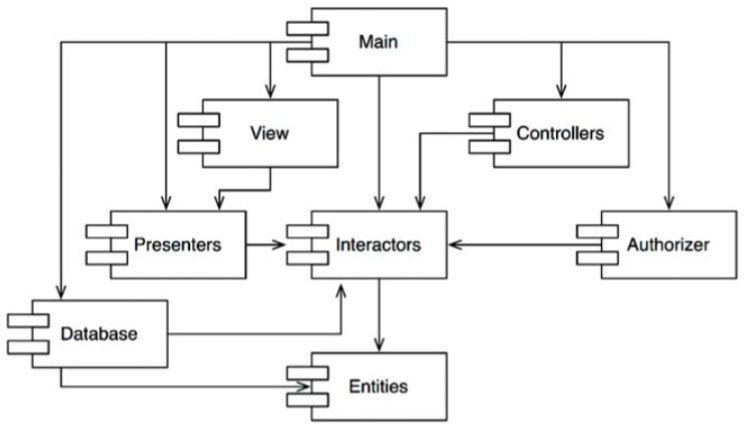

Bạn cần lưu ý một điều nữa: Dù cho bạn bắt đầu từ component nào thì cũng không thể theo các mối quan hệ phụ thuộc và lại quay trở lại chính component đó. Cấu trúc này không có vòng lặp. Đây được gọi là đồ thị không vòng lặp hữu hướng (directed acyclic graph – DAG).

Bây giờ hãy xem điều gì sẽ xảy ra khi nhóm phát triển chịu trách nhiệm đối với component `Presenters` tạo ra một phiên bản mới cho component của họ. Thật dễ dàng để tìm ra ai là người sẽ bị ảnh hưởng bởi đợt phát hành này; bạn chỉ cần lần theo ngược lại các mũi tên phụ thuộc. Như vậy cả `View` và `Main` đều sẽ bị ảnh hưởng. Hiện tại các lập trình viên đang làm việc với các component này sẽ phải quyết định là khi nào thì họ sẽ cần tích hợp công việc của họ với phiên bản mới của `Presenters`.

Cũng cần lưu ý rằng khi `Main` được phát hành, nó sẽ hoàn toàn không gây ảnh hưởng gì đối với bất cứ một component nào khác trong hệ thống. Chúng không biết gì về `Main`, và chúng cũng không quan tâm tới khi nào nó thay đổi. Điều này thật tuyệt. Nó có nghĩa là sự ảnh hưởng của việc phát hành `Main` sẽ tương đối nhỏ.

Khi các lập trình viên đang làm việc với component `Presenters` cũng sẽ giống như việc chạy một bài kiểm tra đối với component đó, họ chỉ cần build phiên bản `Presenters` của họ với phiên bản của component `Interactors` và `Entities` mà họ hiện đang dùng. Không một component nào khác trong hệ thống sẽ cần phải dính líu tới. Điều này thật tuyệt. Nó có nghĩa là các lập trình viên đang làm việc với component `Presenters` sẽ có tương đối ít công việc cần làm để thiết lập một bài kiểm tra, và họ sẽ có tương đối ít biến số cần phải cân nhắc tới.

Khi đến thời điểm phát hành toàn bộ hệ thống, thì quy trình này sẽ xử lý từ dưới lên. Đầu tiên component `Entities` được biên dịch, được kiểm tra, và được phát hành. Sau đó điều tương tự cũng được thực hiện với component `Database` và `Interactors`. Những component `Presenters`, `View`, `Controllers` thực hiện tiếp theo và sau cùng là component `Authorizer.Main`. Quy trình này rất rõ ràng và dễ dàng xử lý. Chúng ta biết cách để build hệ thống này bởi vì chúng ta hiểu về mối quan hệ phụ thuộc giữa các phần của nó.

### The Effect Of A Cycle In The Cycle Component Dependency Graph

Giả sử rằng một yêu cầu mới buộc chúng ta phải thay đổi một trong những lớp trong component `Entities` ví dụ như nó phải sử dụng một lớp trong `Authorizer`. Lấy ví dụ, chúng ta hãy cho rằng lớp User trong `Entities` dùng lớp `Permissions` trong `Authorizer`. Điều này sẽ tạo ra một vòng lặp phụ thuộc, như thấy ở hình dưới.

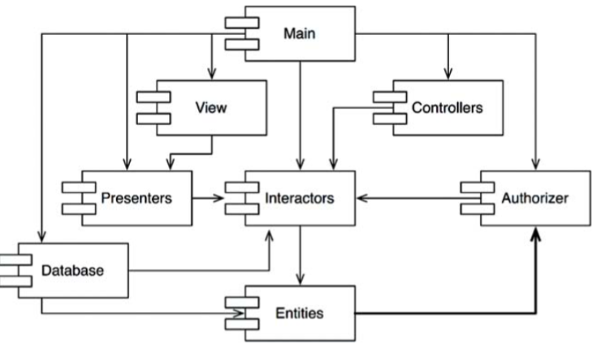

Vòng lặp này tạo ra ngay lập tức một số vấn đề. Lấy ví dụ, các lập trình viên đang làm việc với component `Database` biết rằng để phát hành nó, thì component này buộc phải tương thích với `Entities`. Tuy nhiên, với việc vòng lặp xuất hiện, thì component `Database` bây giờ cũng sẽ phải tương thích với `Authorizer`. Nhưng `Authorizer` lại phụ thuộc vào `Interactors`. Điều này làm cho việc phát hành `Database` trở nên khó khăn hơn rất nhiều. Theo hiệu ứng thì `Entities`, `Authorizer`, và `Interactors` sẽ trở thành một component lớn – điều này có nghĩa là tất cả các lập trình viên đang làm việc với bất cứ component nào trong số này sẽ lại trải nghiệm “hội chứng sau buổi sáng” kinh khiếp. Chúng sẽ lại bị dẫm lên nhau bởi vì tất cả buộc phải dùng chính xác cùng một bản phát hành của component khác.

Nhưng đây chỉ là một phần của vấn đề nảy sinh. Hãy xem điều gì sẽ xảy ra khi chúng ta muốn kiểm tra component `Entities`. Thật thất vọng khi chúng ta sẽ thấy rằng chúng ta buộc phải build và tích hợp với cả `Authorizer` và `Interactors`. Mức độ gắn kết (coupling) giữa các component này là một vấn đề, nếu không muốn nói là không thể chấp nhận được.

Bạn có thể băn khoăn tại sao bạn phải kèm quá nhiều thư viện khác, và quá nhiều thứ code bởi những người khác, chỉ để chạy một bài unit test đơn giản của một trong những lớp của bạn. Nếu bạn điều tra vấn đề một chút, bạn có lẽ sẽ khám phá ra rằng đó là do những vòng lặp trong biểu đồ phụ thuộc. Những vòng lặp như vậy làm cho chúng ta rất khó để tách biệt được các component. Việc unit test và phát hành trở nên rất khó khăn và dễ mắc lỗi. Thêm vào đó, các vấn đề trong khi build sẽ phát sinh tỷ lệ thuận với số lượng các module.

Hơn nữa, khi có các vòng lặp trong biểu đồ phụ thuộc, sẽ rất khó để xác định được thứ tự mà bạn sẽ phải build các component. Quả thực là có lẽ sẽ không có thứ tự chính xác. Điều này có thể dẫn tới một số vấn đề rất khó chịu trong nhiều ngôn ngữ như Java khi mà nó phải đọc các khai báo của chúng từ các file nhị phân đã biên dịch.

### Breaking The Cycle
Chúng ta luôn có thể phá vỡ một vòng lặp của các component và phục hồi lại biểu đồ phụ thuộc không vòng lặp hữu hướng DAG. Có hai cơ chế chính để làm như vậy:

1. Áp dụng Nguyên Lý Đảo Ngược Phụ Thuộc (DIP). Trong trường hợp như hình dưới đây, chúng ta có thể tạo ra một interface mà có các method lớp `User` cần. Sau đó chúng ta có thể đặt interface đó vào `Entities` và kế thừa nó trong component `Authorizer`. Điều này giúp đảo ngược sự phụ thuộc giữa `Entities` và `Authorizer`, nhờ đó mà phá vỡ vòng lặp.

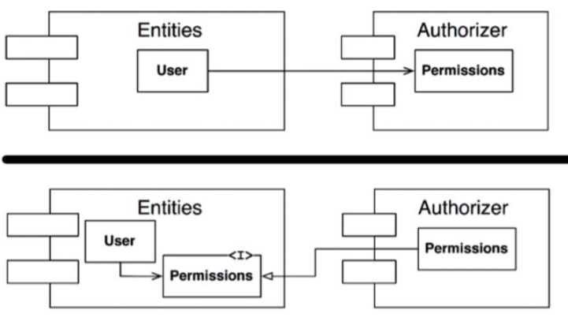

2. Tạo ra một component mới mà cả `Entities` và `Authorizer` đều phụ thuộc vào nó. Di chuyển những lớp mà cả hai đều phụ thuộc vào trong component mới:

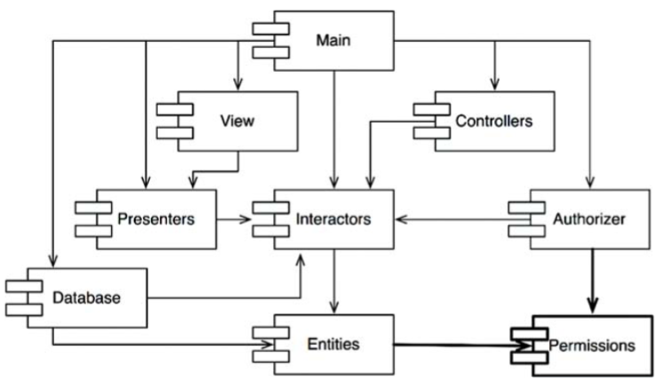

### The "Jitters"

Giải pháp thứ hai cho thấy cấu trúc component không phải là cố định khi xuất hiện sự thay đổi của các yêu cầu. Quả thực là khi ứng dụng lớn dần, thì cấu trúc phụ thuộc component cũng thay đổi và lớn dần theo. Do đó chúng ta phải luôn theo dõi sự xuất hiện của các vòng lặp trong biểu đồ cấu trúc phụ thuộc. Khi vòng lặp xảy ra, chúng buộc phải được phá vỡ bằng cách nào đó. Đôi khi điều này có nghĩa là tạo ra các component mới, điều này làm cho cấu trúc phụ thuộc lớn dần lên.

## Top-Down Design

Các vấn đề mà chúng ta vừa thảo luận dẫn tới một kết luận không phải bàn cãi: Cấu trúc component không thể được thiết kế từ trên xuống. Nó không phải là một trong những thứ đầu tiên về hệ thống cần được thiết kế, mà đúng hơn là nó sẽ phát triển dần khi hệ thống lớn lên và thay đổi.

Một vài độc giả có thể thấy điều này không được trực quan. Chúng ta đều mong muốn rằng việc phân tách các component cũng sẽ giống như việc phân tách chức năng ở cấp cao.

Khi chúng ta thấy một nhóm lớn như một cấu trúc phụ thuộc component, chúng ta tin rằng các component có thể thể hiện các chức năng của hệ thống theo cách nào đó. Điều này có vẻ không phải là một thuộc tính của biểu đồ phụ thuộc component.

Thực tế, các biểu đồ phụ thuộc component rất ít khi dùng để mô tả chức năng của ứng dụng. Thay vào đó, chúng là một sơ đồ cho khả năng build (buildability) và khả năng bảo trì (maintainability) của ứng dụng. Đây là lý do tại sao chúng không được thiết kế vào lúc bắt đầu của dự án. Lúc đó chưa có phần mềm nào để build hoặc bảo trì, nên không cần sơ đồ build và bảo trì làm gì cả. Nhưng khi mà có ngày càng nhiều các module ở giai đoạn đầu của việc triển khai và thiết kế, thì sự cần thiết của việc quản lý các phụ thuộc cũng tăng dần để cho dự án có thể được phát triển mà không gặp phải “hội chứng sau buổi sáng”. Hơn nữa, chúng ta muốn các thay đổi được cục bộ hóa nhất có thể, vì vậy chúng ta bắt đầu lưu ý tới SRP và CCP và sắp xếp các lớp có nhiều khả năng thay đổi vào cùng với nhau.

Một trong những lo ngại quan trọng hơn với cấu trúc phụ thuộc này là sự tách biệt của khả năng thay đổi. Chúng ta không muốn các component bị thay đổi thường xuyên và vì các nguyên nhân thất thường gây ảnh hưởng đến các component mà lẽ ra có thể đã ổn định. Lấy ví dụ, chúng ta không muốn những thay đổi về mặt thẩm mỹ của giao diện người dùng GUI sẽ gây ảnh hưởng tới các logic nghiệp vụ của chúng ta. Chúng ta không muốn việc thêm hoặc sửa đổi các báo cáo sẽ có ảnh hưởng tới các logic nghiệp vụ ở cấp cao nhất của chúng ta. Hệ quả là biểu đồ phụ thuộc component được tạo ra và đúc kết bởi các kiến trúc sư để bảo vệ tính ổn định của các component có giá trị cao khỏi những component dễ thay đổi.

Khi ứng dụng tiếp tục lớn lên, chúng ta bắt đầu trở nên lo ngại với việc tạo ra các thành phần có khả năng tái sử dụng. Lúc này, nguyên tắc CRP bắt đầu gây ảnh hưởng tới cấu thành của các component. Cuối cùng, khi các vòng lặp xuất hiện, nguyên tắc ADP được áp dụng và biểu đồ phụ thuộc component sẽ thay đổi và lớn dần.

Nếu chúng ta cố gắng thiết kế cấu trúc phụ thuộc component trước khi chúng ta thiết kế bất cứ lớp nào, chúng ta nhiều khả năng sẽ thất bại nặng nề. Chúng ta không biết nhiều về sự khép kín chung, chúng ta không biết gì về bất cứ thành phần tái sử dụng nào, và chúng ta hầu như chắc chắn sẽ tạo ra các component mà có vòng lặp phụ thuộc. Do đó cấu trúc phụ thuộc component sẽ tăng trưởng dần với thiết kế logic của hệ thống.

## The Stable Dependencies Principle
*Depend in the direction of stability*

Thiết kế không thể hoàn toàn cố định. Một vài thay đổi là cần thiết nếu thiết kế là để được bảo trì. Bằng cách tuân thủ Nguyên Tắc Khép Kín Chung (CCP), chúng ta tạo ra các component nhạy cảm với một số loại thay đổi nhưng miễn nhiễm với các cái khác. Một số các component này được thiết kế để thay đổi. Chúng ta dự tính chúng sẽ thay đổi.

Bất cứ component nào mà chúng ta dự tính sẽ bị thay đổi thì không được phụ thuộc vào một component khó thay đổi. Nếu không component có tính thay đổi cũng sẽ khó mà thay đổi được.

Sự éo le của phần mềm đó là một module mà bạn thiết kế để dễ dàng thay đổi lại có thể gây cho người khác khó có thể thay đổi do họ đơn giản là bị phụ thuộc vào nó. Dù không một dòng code nào trong module của bạn cần thay đổi, thì module của bạn cũng đột nhiên trở thành một thử thách lớn hơn để có thể thay đổi. Bằng cách tuân thủ Nguyên Tắc Phụ Thuộc Ổn Định (SDP), chúng ta sẽ đảm bảo rằng các module có khuynh hướng dễ thay đổi thì không bị phụ thuộc vào các module khó thay đổi hơn.

### Stability

“Tính ổn định” có nghĩa là gì? Dựng một đồng xu bằng cạnh của nó. Liệu nó có phải ở trạng thái ổn định không? Bạn chắc hẳn sẽ nói là “không”. Tuy nhiên, trừ khi bị tác động, thì nó vẫn sẽ giữ nguyên ở vị trí đó trong một khoảng thời gian rất dài. Do vậy tính ổn định không phải liên quan trực tiếp tới tần suất thay đổi. Đồng xu không thay đổi, nhưng khó có thể nghĩ rằng là nó ổn định.

Từ điển Webster đã định nghĩa một thứ gì đó ổn định khi nó “không dễ di chuyển.” Tính ổn định liên quan tới lượng công cần thiết để tạo ra một thay đổi. Một mặt, đồng xu đang dựng không ổn định bởi vì nó cần rất ít công để có thể bị đổ. Mặt khác, một cái bàn rất ổn định bởi vì nó cần một nỗ lực đáng kể để có thể xoay được nó.

Điều này có liên quan tới phần mềm như thế nào? Nhiều yếu tố có thể khiến cho một component phần mềm khó có thể thay đổi được – lấy ví dụ, kích thước, độ phức tạp, và rõ ràng trong những đặc tính khác của nó. Chúng ta sẽ bỏ qua tất cả các yếu tố này và tập trung vào những thứ khác ở đây. Một cách chắc chắn để làm cho một component phần mềm khó có thể thay đổi đó là làm cho rất nhiều những component phần mềm khác phụ thuộc vào nó. Một component có rất nhiều phụ thuộc tới nó sẽ phải rất ổn định bởi vì nó đòi hỏi một lượng lớn công sức để có thể dung hòa bất cứ thay đổi nào với tất cả các component bị phụ thuộc vào nó.

Biểu đồ trong hình dưới cho thấy X là một component ổn định. Ba component phụ thuộc vào X, vì vậy nó có ba nguyên nhân để không phải thay đổi. Chúng ta nói rằng X chịu trách nhiệm cho ba component đó. Ngược lại, x không phụ thuộc gì cả, vì vậy nó không bị ảnh hưởng nào bên ngoài khiến nó thay đổi. Chúng ta nói rằng nó độc lập.

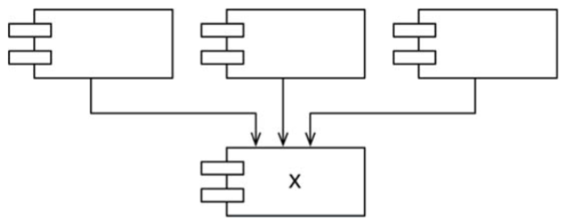

Trong hình dưới lại cho thấy Y là một component rất không ổn định. Không có component nào phụ thuộc vào Y, vì vậy chúng ta nói rằng nó không chịu trách nhiệm. Y cũng phụ thuộc vào ba component, vì vậy những thay đổi có thể tới từ ba nguồn bên ngoài. Chúng ta nói rằng Y bị phụ thuộc.

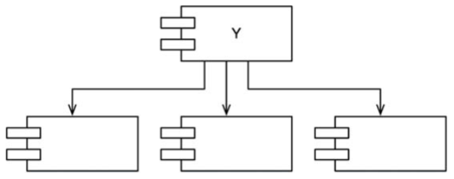

### Stability Metrics

Chúng ta có thể đo lường tính ổn định của một component như thế nào? Có một cách là đếm số lượng phụ thuộc vào và ra của component đó. Số này sẽ cho phép chúng ta tính toán tính ổn định vị trí (positional stability) của component đó.

- *Fan-in*: các phụ thuộc vào. Hệ số đo lường này xác định số lượng các lớp bên ngoài component này mà chịu phụ thuộc vào các lớp nằm trong component này.
- *Fan-out*: các phụ thuộc ra. Hệ số đo lường này xác định số lượng các lớp bên trong component này mà chịu phụ thuộc vào các lớp bên ngoài component này.
- *I*: Tính không ổn định: *I* = *Fan-out* / (*Fan-in* + *Fan-out*). Hệ số đo lường này có khoảng từ 0 đến 1. *I* = 0 thể hiện một component có tính ổn định tối đa. *I* = 1 thể hiện một component có tính không ổn định tối đa.

Hệ số đo lường *Fan-in* và *Fan-out* được tính toán bằng cách đếm số lượng các lớp bên ngoài component đó mà có mối quan hệ phụ thuộc với các lớp bên trong component. Hãy xem ví dụ trong hình dưới đây:

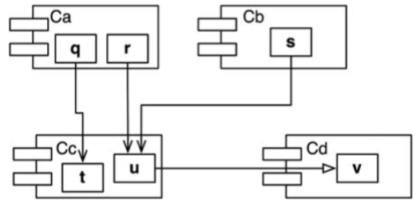

Cho là chúng ta muốn tính toán tính ổn định của component `Cc`. Chúng ta thấy rằng có ba lớp bên ngoài `Cc` phụ thuộc vào các lớp trong `Cc`. Do vậy, *Fan-in* = 3. Ngoài ra, có một lớp bên ngoài `Cc` mà các lớp trong `Cc` bị phụ thuộc vào. Do vậy, *Fan-out* = 1 và `I` = ¼.

Trong ngôn ngữ C++, sự phụ thuộc này thường được biểu hiện bởi các lệnh `#include`. Thực vậy, hệ số I là cách dễ nhất để tính toán khi bạn sắp xếp mã nguồn sao cho chỉ có một lớp trong một file mã nguồn. Trong Java, hệ số I có thể được tính toán bằng cách đếm lệnh `import` và các tên gọi đủ điều kiện.

Khi hệ số I bằng 1, nó có nghĩa là không có một component nào khác phụ thuộc vào component này (*Fan-in* = 0), và component này phụ thuộc vào các component khác (*Fan-out* > 0). Tình huống này thể hiện component đang không ổn định tối đa; nó không chịu trách nhiệm và bị phụ thuộc. Việc không có gì phụ thuộc vào nó khiến cho component đó không có lý do gì để mà không thay đổi, và component mà nó phụ thuộc vào có thể cho phép nó có nhiều lý do để thay đổi.

Ngược lại, khi hệ số I = 0, nó có nghĩa là component đó được các component khác phụ thuộc vào (*Fan-in* > 0), nhưng bản thân nó không phụ thuộc vào bất cứ component nào khác (*Fan-out* = 0). Một component như vậy được gọi là có trách nhiệm và độc lập. Nó ở trạng thái ổn định nhất có thể. Những component phụ thuộc vào nó khiến nó khó bị thay đổi, và nó không bị phụ thuộc nào mà có thể ép nó phải thay đổi.

Nguyên tắc SDP nói rằng hệ số I của một component nên lớn hơn hệ số I của các component mà nó phụ thuộc vào đó. Điều này nghĩa là hệ số I nên giảm dần theo hướng của phụ thuộc.

### Not All Components Should Be Stable

Nếu tất cả các component trong một hệ thống ở trạng thái ổn định tối đa thì nghĩa là hệ thống sẽ không thể thay đổi được. Đó không phải là một tình huống đáng mong đợi. Quả thực là chúng ta muốn thiết kế cấu trúc component của chúng ta sao cho một số component là không ổn định còn một số là ổn định. Biểu đồ trong Hình 14.8 cho thấy một cách cấu hình lý tưởng đối với ba component.

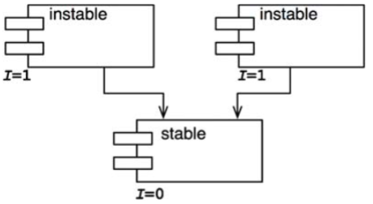

Các component không thể thay đổi được ở trên đỉnh và phụ thuộc vào các component ổn định ở bên dưới. Đặt các component không ổn định ở trên đầu của biểu đồ là một quy ước hữu ích bởi vì bất cứ mũi tên nào trỏ hướng lên sẽ vi phạm nguyên tắc SDP (và như chúng ta sẽ thấy sau này, đó là ADP).

Biều đồ dưới đây chỉ ra trường hợp nguyên lý SDP có thể bị vi phạm.

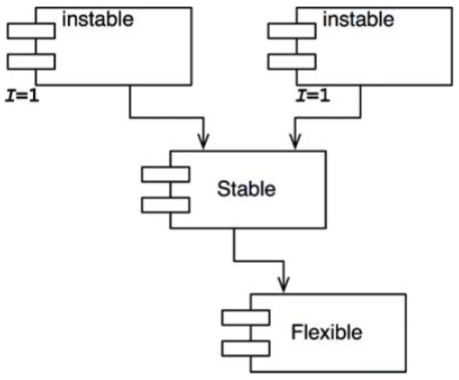

`Flexible` là một component mà chúng ta thiết kế để dễ thay đổi. Chúng ta muốn `Flexible` không ổn định. Tuy nhiên, một vài lập trình viên đang làm việc trong component `Stable` lại bị phụ thuộc vào `Flexible`. Điều này vi phạm nguyên tắc SDP bởi hệ số I của `Stable` nhỏ hơn nhiều so với hệ số I của `Flexible`. Kết quả là `Flexible` sẽ không còn dễ dàng để thay đổi. Một thay đổi đối với `Flexible` sẽ buộc chúng ta phải xử lý cả `Stable` và tất cả những phụ thuộc vào nó.

Để khắc phục vấn đề này, chúng ta bằng cách nào đó phải phá vỡ sự phụ thuộc của `Stable` vào `Flexible`. Tại sao sự phụ thuộc này lại tồn tại? Chúng ta hãy coi như có một lớp `C` trong `Flexible` mà lớp `U` trong `Stable` cần dùng tới như hình dưới:

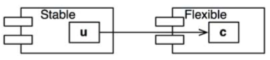

Chúng ta có thể sửa lỗi này bằng cách sử dụng nguyên lý DIP. Chúng ta tạo ra một interface được gọi là `US` và đặt nó vào một component tên là `UServer`. Chúng ta đảm bảo rằng interface này khai báo tất cả các method mà U cần phải dùng. Sau đó chúng ta cho C triển khai theo interface này như thấy ở Hình 14.11. Điều này sẽ phá vỡ sự phụ thuộc của `Stable` vào `Flexible`, và buộc cả hai component này phụ thuộc vào `UServer`. `UServer` rất ổn định (I = 0), và `Flexible` vẫn giữ được sự không ổn định cần thiết của nó (I = 1). Tất cả các phụ thuộc bây giờ chảy theo hướng giảm dần I.

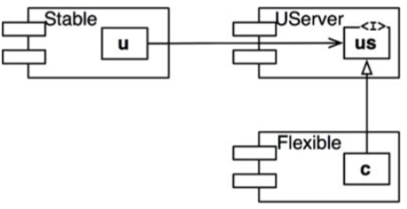

### Abstract Components

Bạn có thể thấy lạ khi chúng ta tạo ra một component – trong ví dụ này, `UService` – không có gì cả mà chỉ có một interface. Component như vậy không có code thực thi được! Tuy nhiên, hóa ra đây lại là chiến thuật được sử dụng rất phổ biến và cần thiết khi dùng các ngôn ngữ kiểu tĩnh như Java và C#. Các component trừu tượng này rất ổn định và do đó là mục tiêu lý tưởng để các component ít ổn định phụ thuộc vào nó.

Khi dùng các ngôn ngữ kiểu động như Ruby và Python, các component trừu tượng này hoàn toàn không tồn tại, cũng như không tồn tại các phụ thuộc vào chúng. Cấu trúc phụ thuộc trong những ngôn ngữ như thế này đơn giản hơn nhiều bởi vì việc đảo ngược phụ thuộc không yêu cầu phải khai báo hoặc kế thừa các interface.

## The Stable Abstractions Principle

*A component should be as abstract as it is stable*

*Một component cần ổn định như trừu tượng*

### Where do we put the high-level policy ?

Một vài phần trong hệ thống không nên thay đổi thường xuyên. Những phần này thể hiện cấu trúc và các quyết định logic nghiệp vụ ở cấp cao. Chúng ta không muốn những quyết định có tính kiến trúc và nghiệp vụ này dễ bị thay đổi. Do đó phần đóng gói các logic nghiệp vụ ở cấp cao của hệ thống cần được đặt trong các component ổn định (I = 0). Các component không ổn định (I = 1) chỉ nên bao gồm những phần dễ thay đổi mà chúng ta muốn chúng có thể nhanh chóng và dễ dàng thay đổi.

Tuy nhiên, nếu các logic nghiệp vụ ở cấp cao được đặt trong các component ổn định thì mã nguồn thể hiện những logic nghiệp vụ này sẽ khó có thể thay đổi được. Điều này có thể khiến cho kiến trúc tổng thể của hệ thống không được linh động. Làm cách nào mà một component ở trạng thái ổn định tối đa (I = 0)lại có đủ sự linh động để chống chịu với những thay đổi? Câu trả lời được tìm thấy trong nguyên lý OCP. Nguyên lý này nói cho chúng ta rằng có thể và kỳ vọng tạo ra các lớp có đủ sự linh động để mở rộng mà không cần phải sửa đổi. Loại lớp nào thỏa mãn được nguyên lý này? Các lớp trừu tượng.

### Introducing the stable abstractions principle
Nguyên lý trừu tượng ổn định (SAP) thiết lập một mối liên hệ giữa tính ổn định và sự trừu tượng. Một mặt, nó nói rằng một component ổn định cũng nên là trừu tượng để tính ổn định của nó không cản trở nó khỏi việc được mở rộng. Một mặt, nó nói rằng một component không ổn định nên là một thực thể do tính không ổn định của nó cho phép các code thực thể trong nó dễ dàng được thay đổi.

Do vậy, nếu là một component ổn định, nó cần phải bao gồm các interface và các lớp trừu tượng để nó có thể được mở rộng. Các component ổn định có thể mở rộng và có tính linh động và không bị ràng buộc quá vào kiến trúc.

Các nguyên lý SAP và SDP kết hợp thành nguyên lý DIP đối với các component. Điều này là thực tế bởi vì SDP nói rằng các phụ thuộc nên chạy theo hướng của sự ổn định, và nguyên lý SAP nói rằng tính ổn định thể hiện sự trừu tượng. Do vậy các phụ thuộc sẽ chạy theo hướng của sự trừu tượng.

Tuy nhiên nguyên lý DIP là một nguyên lý liên quan tới các lớp – và với các lớp thì không có sắc thái xám. Dù một lớp có trừu tượng hay không. Sự kết hợp của nguyên lý SDP và SAP liên quan tới các component, và cho phép một component có thể trừu tượng một phần và ổn định một phần.

### Measuring Abstraction

Hệ số A được dùng để đo lường mức độ trừu tượng của một component. Giá trị của nó đơn giản là tỷ lệ của số lượng interface và các lớp trừu tượng trong một component so với tổng số lớp có trong component đó.

- Nc: Số lớp có trong component.
- Na: Số lớp trừu tượng và interface trong component.
- A: Mức độ trừu tượng. A = Na / Nc.

Hệ số A nằm trong khoảng từ 0 tới 1. A có giá trị = 0 thể hiện rằng component không có lớp trừu tượng nào cả. A có giá trị = 1 thể hiện rằng component chỉ gồm các lớp trừu tượng.

### The Main Sequence
Bây giờ chúng ta xác định mối liên hệ giữa tính ổn định (I) và sự trừu tượng (A). Để làm được điều này, chúng ta tạo ra một biểu đồ với A nằm ở trục dọc và I nằm trên trục ngang (trong đồ thị dưới đây). Nếu chúng ta vẽ hai kiểu “đẹp” của các component trên biểu đồ này, chúng ta sẽ thấy rằng component có độ ổn định và trừu tượng tối đa nằm ở phía trên bên trái ở (0, 1). Component không ổn định và cụ thể tối đa nằm ở phía dưới bên phải ở (1, 0).

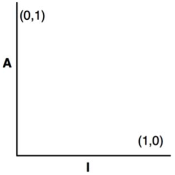

Không phải tất cả các component đều rơi vào một trong hai vị trí này, bởi vì các component thường có một mức độ trừu tượng và ổn định nhất định. Lấy ví dụ, chúng ta rất thường thấy một lớp trừu tượng kế thừa từ một lớp trừu tượng khác. Sự kế thừa này là một trừu tượng có một phụ thuộc. Do vậy, mặc dù nó có tối đa mức độ trừu tượng nhưng nó lại không có được tối đa sự ổn định. Sự phụ thuộc của nó sẽ làm giảm đi tính ổn định của nó.

Do chúng ta không thể ép buộc một quy định là tất cả các component hoặc là ở (0, 1) hoặc là ở (1, 0), chúng ta buộc phải xem như có quỹ tích các điểm trên biểu đồ A/I xác định được vị trí hợp lý cho các component. Chúng ta có thể suy ra quỹ tích đó là gì bằng cách tìm các vùng không nên có các component — nói cách khác, bằng cách xác định các vùng loại trừ.

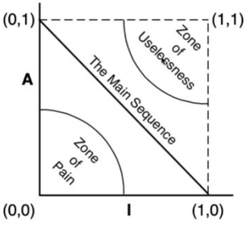

### The Zone of Pain

Hãy xem một component trong khu vực (0, 0). Đây là một component ổn định và có tính cụ thể cao. Một component như vậy không phải là điều chúng ta mong muốn bởi vì nó rất cứng nhắc. Nó không thể được mở rộng bởi vì nó không phải trừu tượng, và nó rất khó có thể thay đổi bởi vì tính ổn định của nó. Do vậy chúng ta bình thường không mong muốn nhìn thấy các component được thiết kế tốt nằm ở gần (0, 0). Khu vực quanh (0, 0) là một khu vực bị loại trừ và được gọi là Vùng Vất Vả (Zone of Pain).

Trong thực tế, một vài thành phần của phần mềm sẽ rơi vào trong Vùng Vất Vả. Một ví dụ đó là sơ đồ cơ sở dữ liệu (database schema). Sơ đồ cơ sở dữ liệu nổi tiếng dễ thay đổi, có tính cụ thể cực kỳ, và bị phụ thuộc cực cao. Đây là một nguyên nhân tại sao interface giữa các ứng dụng OO và cơ sở dữ liệu lại rất khó để quản lý, và tại sao việc cập nhật sơ đồ dữ liệu thường rất vất vả.

Một ví dụ khác của phần mềm nằm gần khu vực (0, 0) đó là các thư viện tiện ích cụ thể. Mặc dù một thư viện như vậy có hệ số I bằng 1, nhưng nó thực tế có thể không dễ thay đổi. Hãy xem component String làm ví dụ. Mặc dù tất cả các lớp trong nó đều cụ thể nhưng nó được dùng phổ biến đến mức việc thay đổi nó sẽ tạo ra một sự hỗn loạn ngay lập tức. Bởi vậy String có tính không thay đổi.

Các component không thay đổi vô hại trong vùng (0, 0) do chúng sẽ không bị thay đổi. Vì lý do đó, chỉ có những component phần mềm dễ thay đổi là sẽ gây ra vấn đề ở Vùng Vất Vả. Một component càng dễ thay đổi nằm trong Vùng Vất Vả thì nó lại càng “vất vả”. Quả là chúng ta có thể xem tính dễ thay đổi như là một trục thứ ba của biểu đồ. Với việc hiểu như vậy, Hình 14.3 chỉ ra mặt phẳng vất vả nhất, nơi mà có tính dễ thay đổi = 1.

### The Zone of Uselessness
Hãy xem một component gần (1, 1). Vị trí này không phải là điều mong muốn bởi vì nó có mức trừu tượng tối đa, cũng như không có gì phụ thuộc vào nó. Những component như vậy là vô dụng. Do vậy vùng này được gọi là Vùng Vô Dụng.

Các thành phần phần mềm nằm trong vùng này thường là bị bỏ quên. Chúng là các lớp trừu tượng sót lại khi không lớp nào triển khai nó. Đôi khi, chúng ta thấy chúng trong các hệ thống, nằm trong bộ mã nguồn mà không được sử dụng.

Một component có một vị trí sâu trong Vùng Vô Dụng thì buộc phải gồm một lượng đáng kể các thành phần như vậy. Rõ ràng, sự hiện diện của những thành phần vô dụng là điều không ai mong muốn và cần phải được dọn dẹp.

### Avoiding the zones of exclusion

Có vẻ rõ ràng là những component dễ thay đổi nhất nên được giữ càng xa cả hai vùng loại trừ này càng tốt. Quỹ tích của các điểm có khoảng cách xa nhất so với mỗi vùng này là một đường thẳng kết nối (1, 0) và (0, 1). Tôi gọi đường này là Chuỗi Chính (Main Sequence).

Một component nằm trên Chuỗi Chính không “quá trừu tượng” đối với tính ổn định của nó, mà cũng không “quá không ổn định” đối với độ trừu tượng của nó. Nó không vô dụng mà cũng không quá gây vất vả. Nó được phụ thuộc tới độ nó là trừu tượng, và nó phụ thuộc vào những thứ khác tới độ nó là cụ thể.

Vị trí mong muốn nhất đối với một component là ở một trong hai điểm cuối của Chuỗi Chính. Các kiến trúc sư giỏi sẽ cố gắng đạt tới vị trí mà phần lớn các component của họ sẽ nằm ở hai đầu này. Tuy nhiên, theo kinh nghiệm của tôi, chỉ có một tỷ lệ nhỏ các componet trong một hệ thống lớn không hoàn toàn trừu tượng cũng không hoàn toàn ổn định. Những component này có những đặc tính tốt nhất nếu chúng nằm trên, hoặc gần với Chuỗi Chính.

### Distance from the main sequence
Điều này dẫn chúng ta tới hệ số đo lường cuối cùng. Nếu chúng ta mong muốn các component nằm trên hoặc sát với Chuỗi Chính, thì chúng ta có thể tạo ra một hệ số đo lường để đo xem một component còn cách mục tiêu lý tưởng này là bao xa.

- D: Khoảng cách. D = |A+I-1|. Hệ số này nằm trong khoảng [0, 1]. Giá trị của nó = 0 nghĩa là component này nằm trực tiếp trên Chuỗi Chính. Giá trị của nó = 1 nghĩa là component này cách xa nhất khỏi Chuỗi Chính.

Đưa ra hệ số này, một thiết kế có thể được phân tích để xem sự tương quan tổng thể của nó so với Chuỗi Chính. Hệ số D đối với mỗi component có thể được tính toán. Bất cứ component nào mà có giá trị D không gần với 0 thì có thể được xem xét và cấu trúc lại.

Việc phân tích thống kê của một thiết kế cũng khả thi. Chúng ta có thể tính toán giá trị trung bình và phương sai của tất cả các hệ số D đối với các component nằm trong một thiết kế. Chúng ta mong muốn một thiết kế thích hợp sẽ có giá trị trung bình và phương sai gần bằng 0. Phương sai có thể được dùng để thiết lập “các giới hạn điều khiển” để xác định xem component có phải “ngoại lệ” khi so với các component khác hay không.

Trong biểu đồ scatter dưới đây, chúng ta thấy một lượng lớn các component nằm dọc theo Chuỗi Chính, nhưng có một số lớn hơn độ lệch chuẩn (Z = 1) khỏi đường trung bình. Những component khác thường này đáng để được xem xét kỹ lại. Vì một vài lý do, chúng có thể rất trừu tượng mà rất ít bị phụ thuộc hoặc là rất cụ thể mà có nhiều phụ thuộc vào.

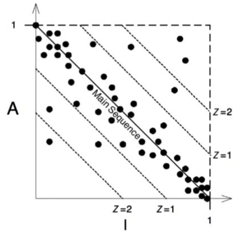

Một cách khác để dùng hệ số này vẽ biểu đồ hệ số D của mỗi component theo thời gian. Biểu đồ trong hình dưới đây là một ví dụ cho kiểu biểu đồ như vậy. Bạn có thể thấy rằng một số phụ thuộc kỳ lạ đã len lỏi vào component Payroll trong những đợt phát hành gần đây. Biểu đồ chỉ ra giới hạn điều khiển tại D = 0.1. Điểm R2.1 đã vượt quá giới hạn này, vì vậy chúng ta sẽ cần tìm hiểu tại sao component này lại cách quá xa so với Chuỗi Chính.

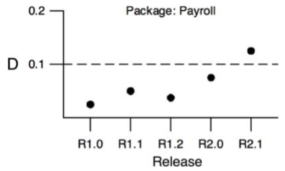

## Conclusion
Các hệ số quản lý phụ thuộc được mô tả trong chương này dùng để đo lường mức độ phù hợp của một thiết kế đối với mẫu thiết kế về mức độ phụ thuộc và mức độ trừu tượng, mà tôi nghĩ đó là một mẫu thiết kế “tốt”. Kinh nghiệm đã chỉ ra rằng một số phụ thuộc nhất định thì tốt còn một số thì tệ. Mẫu thiết kế này phản ánh được kinh nghiệm đó. Tuy nhiên, một hệ số đo không phải là thần thánh gì; nó chỉ đơn thuần là một sự đo lường so với một tiêu chuẩn không được quy định rõ ràng. Những hệ số này không phải là hoàn hảo, nhưng tôi hy vọng bạn vẫn sẽ thấy chúng hữu ích.