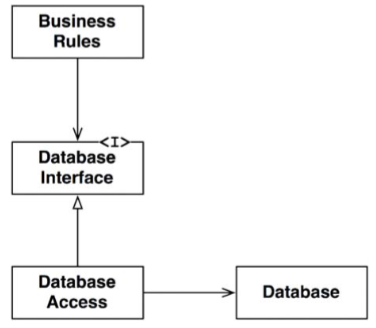
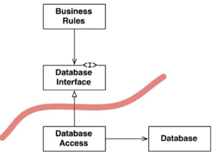
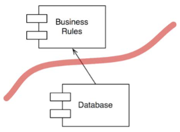
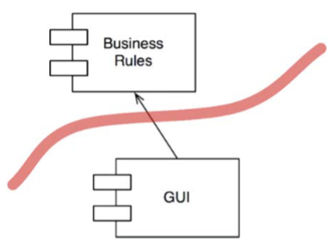
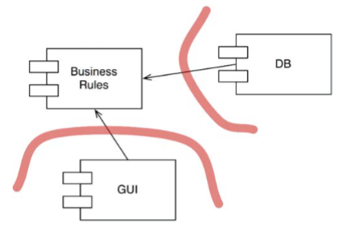
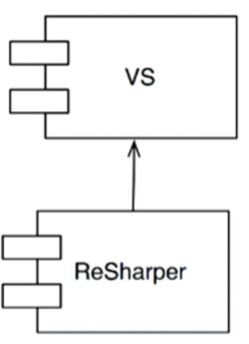

# Chapter 17 : Boundaries Drawing Lines
----------------

Kiến trúc phần mềm là nghệ thuật vẽ các đường mà tôi gọi là các ranh giới. Những ranh giới này tách biệt các component phần mềm khỏi những cái khác, và hạn chế những thứ ở bên này biết về những thứ khác ở bên kia. Một số đường như vậy được vẽ ra từ rất sớm khi bắt đầu dự án – thậm chí trước cả khi viết bất cứ dòng code nào. Một số đường khác lại được vẽ muộn hơn nhiều. Những đường được vẽ sớm nhằm mục đích trì hoãn các quyết định càng lâu càng tốt, và giữ cho những quyết định này khỏi bị lẫn với các quy tắc nghiệp vụ cốt lõi.

Bạn hãy nhớ lại rằng mục tiêu của một kiến trúc sư là để tối thiểu hóa nguồn tài nguyên con người cần để build và bảo trì hệ thống được yêu cầu. Vậy thì điều gì đã làm năng lực của con người bị giảm đi? Sự gắn kết (coupling) – và đặc biệt là sự gắn kết với các quyết định chưa chín muồi.

Những loại quyết định nào là chưa chín muồi? Các quyết định mà không liên quan tới các yêu cầu về nghiệp vụ – các use case (tình huống sử dụng) – của một hệ thống. Những quyết định này bao gồm về framework, cơ sở dữ liệu, máy chủ web, các thư viện tiện tích, việc chèn phụ thuộc (dependency injection), và những thứ tương tự. Một kiến trúc hệ thống tốt là một kiến trúc mà những quyết định như vậy có tính thứ cấp và có thể trì hoãn được. Một kiến trúc tốt không phụ thuộc vào những quyết định này. Một kiến trúc tốt cho phép những quyết định này có thể được đưa ra muộn nhất có thể, mà không gây ảnh hưởng nhiều

## A couple of sad stories
Đây là một câu chuyện buồn của công ty P, nó đưa ra một lời cảnh báo về việc đưa ra những quyết định chưa chín muồi. Vào những năm 1980, những người sáng lập của P đã viết một ứng dụng máy tính để bàn nguyên khối đơn giản. Họ vui mừng vì đó là một thành công lớn và đã tiếp tục phát triển sản phẩm đó sang những năm 1990 thành một ứng dụng GUI thành công và được sử dụng phổ biến.

Nhưng sau đó, cuối những năm 1990, công nghệ web bắt đầu nổi lên. Đột nhiên mọi người đều phải có một giải pháp web, và P không phải là ngoại lệ. Các khách hàng của P đòi một phiên bản của phần mềm đó chạy trên web. Để đáp ứng yêu cầu này, công ty đã thuê một nhóm các lập trình viên Java và tạo ra một dự án để web hóa sản phẩm của họ.

Các tay lập trình Java này có những giấc mơ về các khu trung tâm máy chủ nhảy múa trong đầu họ, vì vậy họ đã áp dụng một “kiến trúc”[1] ba tầng đắt giá để họ có thể phân tán được qua những khu máy chủ như vậy. Hệ thống đó có các máy chủ dành cho GUI, các máy chủ dành cho phần trung gian middleware, và các máy chủ dành cho cơ sở dữ liệu. Dĩ nhiên.

Ngay từ đầu, các lập trình viên đã quyết định rằng tất cả các đối tượng thuộc nghiệp vụ sẽ có ba thực thể: một nằm ở tầng GUI, một nằm ở tầng middleware, và một nằm ở tầng database. Do những thực thể này nằm ở các máy chủ khác nhau, nên một hệ thống giao tiếp liên-vi xử lý (inter-processor) và liên-tầng (inter-tier) đã được thiết lập. Các lệnh gọi hàm giữa các tầng được chuyển hóa thành các đối tượng, được serialize (nối tiếp hóa), và được sắp đặt thông qua dây dẫn.

Bây giờ bạn hãy tưởng tượng nó sẽ cần gì để triển khai một chức năng đơn giản như thêm một trường mới vào một dữ liệu đang có. Trường đó phải được thêm vào các lớp trong cả ba tầng, và vào vài gói tin liên-tầng. Do dữ liệu di chuyển theo cả hai hướng, nên bốn giao thức gói tin sẽ cần được thiết kế. Mỗi giao thức có một phía gửi và một phía nhận, vì vậy đòi hỏi phải có tám hàm xử lý giao thức. Ba file thực thi phải được build, mỗi cái có ba đối tượng nghiệp vụ được cập nhật, bốn gói tin mới, và tám hàm xử lý mới.

Và bạn hãy nghĩ xem các file thực thi đó phải làm cái gì để triển khai chức năng đơn giản nhất như vậy. Tất cả việc khởi tạo các đối tượng, tất cả việc serialize, tất cả việc sắp đặt lại các trường của đối tượng, tất cả việc xây dựng và phân tích các gói tin, tất cả các giao tiếp socket, các bộ quản lý timeout, các tình huống thử lại (retry), và tất cả những thứ thêm khác là những việc bạn phải làm chỉ để hoàn thành được một thứ đơn giản.

Dĩ nhiên, trong suốt quá trình phát triển, những lập trình viên đó không có được một khu trung tâm máy chủ thực sự. Quả thực là họ đơn giản chạy tất cả ba file thực thi ở ba process khác nhau trên một chiếc máy tính. Họ đã phát triển theo cách này tới vài năm. Nhưng họ đã được thuyết phục rằng kiến trúc của họ là đúng đắn. Và vì vậy, mặc dù họ thực thi tất cả trong một chiếc máy tính, họ vẫn tiếp tục tất cả việc khởi tạo đối tượng, tất cả việc serialize, tất cả việc sắp đặt lại các trường của đối tượng, tất cả việc xây dựng và phân tích các gói tin, tất cả các giao tiếp socket, và tất cả các thứ thêm khác trên một chiếc máy đơn duy nhất.

Mỉa mai là công ty P không bao giờ bán một hệ thống đòi hỏi một khu trung tâm máy chủ. Mọi hệ thống mà họ đã từng triển khai đều chỉ là một máy chủ đơn. Và trong máy chủ đơn đó, tất cả ba file thực thi tiếp tục tất cả công việc khởi tạo đối tượng, tất cả việc serialize, tất cả việc sắp đặt lại các trường của đối tượng, tất cả việc xây dựng và phân tích các gói tin, tất cả các giao tiếp socket, và tất cả các thứ thêm khác, chỉ vì họ đã dự đoán về một khu trung tâm máy chủ không bao giờ tồn tại, và sẽ không bao giờ có.

Bi kịch ở đây là các kiến trúc sư bằng việc tạo ra một quyết định chưa chín muồi, đã nhân lên công sức cần để phát triển lên gấp bội lần.

Câu chuyện của công ty P không phải là cá biệt. Tôi đã từng nhìn thấy nó nhiều lần và ở nhiều nơi. Nhưng quả thực P là một sự xếp chồng của tất cả những nơi đó cộng lại.

Nhưng còn có một số phận còn tệ hơn P.

Hãy xem công ty W, một doanh nghiệp địa phương quản lý các đội ô tô công ty. Họ gần đây đã thuê một “Kiến trúc sư” để giúp cho nỗ lực triển khai phần mềm rag-tag của họ được đặt trong vòng kiểm soát. Và hãy để tôi nói với bạn, control (điều khiển) là tên đệm của anh chàng này. Anh ta nhanh chóng nhận ra rằng điều mà hoạt động nhỏ này cần là một “Kiến Trúc” hướng dịch vụ, quy mô enterprise và toàn diện. Anh ta đã tạo ra một số lượng các model chuyên ngành khổng lồ của tất cả các “đối tượng” khác trong ngành, thiết kế một bộ các dịch vụ để quản lý các đối tượng ngành này, và đặt tất cả các lập trình viên trong dự án này trên con đường xuống Địa ngục. Lấy một ví dụ đơn giản, cho là bạn muốn thêm tên, địa chỉ, và số điện thoại của một người liên hệ vào một dữ liệu bán hàng. Bạn sẽ phải vào ServiceRegistry và hỏi xem service ID của ContactService. Sau đó bạn phải gửi một gói tin CreateContact cho ContactService. Dĩ nhiên, gói tin này có hàng tá các trường mà tất cả đều phải có dữ liệu hợp lệ trong đó – dữ liệu mà lập trình viên không có quyền truy cập, do tất cả những gì lập trình viên có là tên, địa chỉ, và số điện thoại. Sau khi làm giả dữ liệu đó, lập trình viên phải nhét ID của liên hệ vừa tạo vào trong dữ liệu bán hàng và gửi gói tin UpdateContact cho dịch vụ SaleRecordService.

Dĩ nhiên, để kiểm tra bất cứ thứ gì bạn sẽ phải khởi động tất cả các dịch vụ cần thiết, từng cái một, và khởi động đường truyền gói tin, và máy chủ Bpel, và… Và sau đó, hệ thống bắt đầu xuất hiện sự chậm trễ lan truyền khi các thông báo này được gửi từ dịch vụ này sang dịch vụ khác và chờ đợi hết hàng này đến hàng khác.

Và sau đó nếu bạn muốn thêm một chức năng mới – đúng, bạn có thể tượng tượng sự gắn kết giữa tất cả những dịch vụ này, và khối lượng của WSDL[2] cần thay đổi, và tất cả những việc triển khai lại được đòi hỏi…

So với địa ngục thì dường như địa ngục là nơi còn tốt hơn.

Về bản chất, không có gì sai với một hệ thống phần mềm được cấu trúc xung quanh các dịch vụ. Lỗi gặp phải ở W là việc chấp nhận và thực thi quá sớm một bộ công cụ hứa hẹn SoA – đó là việc áp dụng quá sớm một bộ các dịch vụ đối tượng ngành khổng lồ. Cái giá phải trả của sai lầm đó là số giờ làm việc – số người phải đổ vào SoA.

Tôi vẫn có thể tiếp tục nói hết về kiến trúc thất bại này đến kiến trúc thất bại khác. Nhưng thay vào đó chúng ta hãy nói về một kiến trúc thành công.

## Fitnesse
Con trai của tôi, Micah, và tôi đã bắt đầu dự án FitNesse vào năm 2001. Ý tưởng là tạo ra một trang wiki đơn giản để gói lại các công cụ FIT của Ward Cunningham nhằm mục đích viết các acceptance test.

Đó là thời điểm trước khi Maven “giải quyết” vấn đề về jar file. Tôi đã kiên quyết là bất cứ thứ gì mà chúng tôi tạo ra sẽ không đòi hỏi người dùng phải download nhiều hơn một file jar. Tôi đã gọi nguyên tắc này là “Download và Đi”. Nguyên tắc này đã dẫn hướng cho nhiều quyết định của chúng tôi.

Một trong những quyết định đầu tiên là viết máy chủ web của riêng chúng tôi, dành riêng cho nhu cầu của FitNesse. Điều này nghe có vẻ kỳ quặc. Ngay cả vào năm 2001 cũng đã có khá nhiều các máy chủ web mã nguồn mở mà chúng tôi có thể sử dụng. Tuy nhiên việc viết riêng đã chứng tỏ đó thực sự là một quyết định tốt bởi vì một máy chủ web cơ bản thì rất dễ để viết và nó cho phép chúng tôi trì hoãn lại những quyết định về web framework cho đến mãi về sau[3].

Một quyết định sớm khác là để tránh phải suy nghĩ về cơ sở dữ liệu. Chúng tôi đã nghĩ về MySQL trong đầu, nhưng chúng tôi đã làm trễ có mục đích quyết định đó bằng cách sử dụng một thiết kế không cần quan tâm tới quyết định đó. Thiết kế đó chỉ đơn giản đặt một interface giữa tất cả các dữ liệu truy cập và bản thân kho lưu dữ liệu.

Chúng tôi đã đặt các method truy xuất dữ liệu vào một interface tên là WikiPage. Những method này cung cấp tất các chức năng chúng tôi cần để tìm kiếm, lấy và lưu các trang. Dĩ nhiên, chúng tôi đã không triển khai những method này đầu tiên; chúng tôi chỉ đơn giản làm giả chúng trong khi chúng tôi làm việc với các chức năng mà không liên quan gì đến việc lấy và lưu dữ liệu.

Quả thực trong ba tháng chúng tôi chỉ đơn giản làm việc với việc chuyển đổi văn bản wiki thành dạng HTML. Điều này không đòi hỏi bất cứ loại lưu trữ dữ liệu nào, vì vậy chúng tôi đã tạo ra một lớp được đặt tên là MockWikiPage dùng để các method được làm giả truy cập dữ liệu.

Cuối cùng, những stub này trở nên không đủ cho các chức năng chúng tôi muốn viết. Chúng tôi cần truy cập dữ liệu thực sự, không phải các stub. Vì vậy chúng tôi đã tạo ra một kế thừa mới của WikiPage tên là InMemoryPage. Kế thừa này triển khai method truy cập dữ liệu để quản lý một bảng hash của các trang wiki, được lưu giữ trong RAM.

Điều này cho phép chúng tôi viết hết chức năng này tới chức năng khác trong tròn một năm. Thực tế là chúng tôi đã có toàn bộ phiên bản đầu tiên của chương trình FitNesse hoạt động theo cách này. Chúng tôi có thể tạo ra các trang, đường link tới các trang khác, làm tất cả việc định dạng trang wiki, và thậm chí chạy các bài test bằng FIT. Điều chúng tôi đã chưa thể làm đó là lưu lại công việc của chúng tôi.

Khi đã đến lúc để triển khai việc lưu trữ dài hạn, chúng tôi đã nghĩ một lần nữa về MySQL, nhưng chúng tôi đã quyết định điều đó chưa cần thiết trong ngắn hạn, bởi vì việc ghi các bảng hash vào các file thực sự là điều dễ dàng. Vì vậy chúng tôi đã triển khai FileSystemWikiPage, dùng để chuyển chức năng đó sang các file, và sau đó chúng tôi tiếp tục phát triển nhiều chức năng hơn.

Ba tháng sau, chúng tôi đã đi tới kết luận rằng phương án sử dụng file để lưu trữ đủ tốt; vì vậy chúng tôi đã quyết định từ bỏ ý tưởng dùng MySQL. Chúng tôi đã trì hoãn quyết định đó trở thành không tồn tại và không bao giờ quay lại với ý định đó nữa.

Điều đó có thể là kết thúc của câu chuyện này nếu không phải một trong những khách hàng của chúng tôi đã quyết định là ông ấy cần đặt wiki vào MySQL vì mục đích nào đó của bản thân ông ấy. Chúng tôi đã chỉ cho ông ấy kiến trúc của WikiPages đã cho phép chúng tôi trì hoãn lại quyết định đó như thế nào. Ông ấy đã quay trở lại vào ngày hôm sau với toàn bộ hệ thống được làm việc trong MySQL. Ông ấy chỉ đơn giản viết một kế thừa MySqlWikiPage và làm cho nó hoạt động.

Chúng tôi thường đóng gói lựa chọn đó cùng với FitNesse, nhưng không ai khác sử dụng nó, vì vậy cuối cùng chúng tôi đã loại bỏ nó. Ngay cả ông khách hàng, người viết kế thừa đó cuối cùng cũng đã loại bỏ nó.

Lúc mới phát triển FitNesse, chúng tôi đã vẽ một đường ranh giới giữa các quy tắc nghiệp vụ và cơ sở dữ liệu. Đường đó đã ngăn các quy tắc nghiệp vụ biết bất cứ thứ gì về cơ sở dữ liệu, ngoài các method truy xuất dữ liệu đơn giản. Quyết định đó cho phép chúng tôi trì hoãn lựa chọn và triển khai cơ sở dữ liệu sau hơn một năm. Nó cho phép chúng tôi thử nghiệm lựa chọn sử dụng file hệ thống, và nó đã cho phép chúng tôi thay đổi phương hướng khi chúng tôi thấy một giải pháp tốt hơn. Ngoài ra nó cũng không ngăn cản, hoặc gây trở ngại việc thực hiện theo định hướng ban đầu (MySQL) khi ai đó muốn.

Thực tế là chúng tôi không có một cơ sở dữ liệu nào để chạy trong 18 tháng phát triển, điều đó có nghĩa là trong 18 tháng, chúng tôi không có các vấn đề về schema (sơ đồ dữ liệu), các vấn đề về truy xuất, các vấn đề về máy chủ cơ sở dữ liệu, các vấn đề về mật khẩu, các vấn đề về thời gian kết nối, và tất cả các vấn đề khó chịu khác nảy sinh khi bạn khởi động một cơ sở dữ liệu. Nó cũng có nghĩa là tất cả các bài test của chúng tôi đều chạy nhanh, do không có cơ sở dữ liệu nào làm chậm chúng lại.

Nói ngắn gọn thì việc vẽ các đường ranh giới giúp chúng tôi làm chậm lại và trì hoãn các quyết định, và cuối cùng nó đã giúp chúng tôi tiết kiệm được lượng thời gian và công sức khổng lồ. Và điều đó là cái mà một kiến trúc tốt cần phải làm.

## Which lines do you draw, and when do you draw them ?
Bạn vẽ các đường ranh giới giữa những thứ quan trọng và những thứ không. Phần GUI không quan trọng đối với các quy tắc nghiệp vụ, vì vậy nên có một đường ranh giới giữa chúng. Cơ sở dữ liệu không quan trọng đối với GUI, vì vậy nên có một đường ranh giới giữa chúng. Cơ sở dữ liệu không quan trọng với các quy tắc nghiệp vụ, vì vậy nên có một đường ranh giới giữa chúng.

Một vài bạn có thể không đồng tình với một vài phát biểu này, đặc biệt là phần về các quy tắc nghiệp vụ không quan tâm gì tới cơ sở dữ liệu. Nhiều người trong chúng ta đã được dạy để tin rằng cơ sở dữ liệu gắn bó chặt chẽ với các quy tắc nghiệp vụ. Một vài người đã từng bị thuyết phục rằng cơ sở dữ liệu là biểu hiện của các quy tắc nghiệp vụ.

Nhưng như chúng ta sẽ thấy ở chương khác, ý tưởng này là một suy nghĩ sai lầm. Cơ sở dữ liệu là một công cụ mà các quy tắc nghiệp vụ có thể sử dụng gián tiếp. Các quy tắc nghiệp vụ không cần biết gì về schema, hoặc ngôn ngữ truy xuất dữ liệu, hoặc bất cứ những chi tiết nào khác về cơ sở dữ liệu. Tất cả thứ mà các quy tắc nghiệp vụ cần biết là có một bộ các hàm có thể được dùng để lấy hoặc lưu dữ liệu. Điều này cho phép chúng ta đặt cơ sở dữ liệu đằng sau một interface.

Bạn có thể nhìn thấy điều này rõ ràng ở hình dưới. Lớp BusinessRules dùng `DatabaseInterface` để nạp và lưu dữ liệu. Lớp `DatabaseAccess` triển khai interface đó và điều khiển sự vận hành của `Database` thực tế.

Các lớp và các interface trong biểu đồ này chỉ mang tính biểu tượng. Trong một ứng dụng thực tế sẽ có nhiều lớp quy tắc nghiệp vụ, nhiều lớp interface cơ sở dữ liệu, và nhiều lớp triển khai việc truy cập cơ sở dữ liệu. Mặc dù, tất cả chúng sẽ thực hiện cùng một mẫu triển khai.

Như vậy đường ranh giới nằm ở đâu? Đường ranh giới được vẽ qua mối quan hệ kế thừa, ngay phía dưới của `DatabaseInterface` như hình dưới:

Lưu ý hai mũi tên rời khỏi lớp `DatabaseAccess`. Hai mũi tên này trỏ hướng ra ngoài lớp `DatabaseAccess`. Điều đó có nghĩa là không một lớp nào biết về sự tồn tại của lớp `DatabaseAccess`.

Bây giờ chúng ta hãy trở lại một chút. Chúng ta sẽ nhìn vào component gồm nhiều các quy tắc nghiệp vụ và tất cả các lớp sử dụng nó:

Lưu ý về hướng của mũi tên. Component `Database` biết về `BusinessRules`. Còn `BusinessRules` không biết về `Database`. Điều này thể hiện là các lớp `DatabaseInterface` tồn tại trong component `BusinessRules`, trong khi đó các lớp `DatabaseAccess` tồn tại trong component `Database`.

Hướng của mũi tên này rất quan trọng. Nó chỉ ra là `Database` không quan trọng đối với `BusinessRules`, nhưng `Database` thì không thể tồn tại mà không có `BusinessRules`.

Nếu điều đó có vẻ lạ lẫm đối với bạn, thì bạn chỉ cần nhớ điểm này: Component `Database` bao gồm code để chuyển lời gọi hàm từ `BusinessRules` thành ngôn ngữ query của cơ sở dữ liệu. Nó là phần code chuyển đổi biết về `BusinessRules`.

Có được đường ranh giới này giữa hai component, và có các mũi tên hướng vào `BusinessRules`, bây giờ chúng ta có thể thấy rằng `BusinessRules` có thể dùng bất cứ loại cơ sở dữ liệu nào. Component `Database` có thể được thay thế bằng nhiều cách triển khai khác nhau – `BusinessRules` không cần quan tâm.

Cơ sở dữ liệu có thể được triển khai bằng Oracle, hoặc MySQL, hoặc Couch, hoặc Datomic, hoặc thậm chí là các file bình thường. Các quy tắc nghiệp vụ không cần quan tâm chút nào về điều đó. Và nó có nghĩa là quyết định dùng cơ sở dữ liệu nào có thể được trì hoãn và bạn có thể tập trung vào viết các quy tắc nghiệp vụ và kiểm tra chúng trước khi bạn phải đưa ra quyết định về cơ sở dữ liệu.

## What about input and output ?
Các lập trình viên và các khách hàng thường bị bối rối về việc hệ thống của họ là gì. Họ thấy được GUI (Graphical User Interface – giao diện đồ họa người dùng), và nghĩ rằng GUI chính là hệ thống. Họ định nghĩa một hệ thống trong các thuật ngữ của GUI, vì vậy họ tin rằng họ nên thấy GUI bắt đầu hoạt động ngay lập tức. Họ không nhận ra một nguyên lý cực kỳ quan trọng: Đầu vào và đầu ra IO thì không liên quan.

Điều này ban đầu có thể khó hiểu. Chúng ta thường nghĩ về hành vi của hệ thống theo khái niệm về hành vi của IO. Lấy ví dụ một trò chơi điện tử. Trải nghiệm của bạn bị choáng ngợp bởi phần giao diện: màn hình, con chuột, các nút, và âm thanh. Bạn quên mất rằng đằng sau giao diện đó là một model – một bộ cực kỳ phức tạp các cấu trúc dữ liệu và các hàm – đang điều khiển nó. Quan trọng hơn, model đó không cần giao diện. Nó sẽ vui vẻ thực thi nhiệm vụ của nó, tạo ra tất cả các sự kiện trong trò chơi, mà thậm chí không cần trò chơi phải được hiển thị trên màn hình. Giao diện không quan trọng đối với model – các quy tắc nghiệp vụ.

Và vì vậy, lại một lần nữa, chúng ta thấy các component GUI và `BusinessRules` được tách biệt bởi một đường ranh giới (Hình 17.4). Lại một lần nữa, chúng ta thấy component ít liên quan hơn phụ thuộc vào component có liên quan hơn. Các mũi tên chỉ ra component nào biết về component nào và do đó, component nào cần quan tâm về những component khác. Trong trường hợp này, GUI quan tâm về `BusinessRules`.

## Plugin architecture
Kết hợp lại với nhau, hai quyết định về cơ sở dữ liệu và GUI này tạo ra một loại mẫu kiến trúc để có thể thêm được các component khác. Mẫu kiến trúc đó cũng giống như mẫu được dùng bởi các hệ thống phần mềm cho phép sử dụng các plugin của các hãng thứ ba.

Quả thực, lịch sử của công nghệ phát triển phần mềm là câu chuyện về cách tạo ra các plugin một cách thuận tiện để thiết lập nên một kiến trúc hệ thống có khả năng bảo trì và mở rộng được. Các quy tắc nghiệp vụ cốt lõi được giữ tách riêng, và độc lập với các component hoặc là tùy chọn hoặc là có thể triển khai theo nhiều kiểu khác nhau đó:

Bởi vì giao diện người dùng trong thiết kế này có thể xem là một plugin, chúng ta đã làm cho nó có thể “cắm vào” (plug in) bất cứ loại giao diện người dùng nào khác. Chúng có thể là trên nền web, trên nền client/server, trên nền SOA, trên nền Console, hoặc trên nền bất cứ loại công nghệ giao diện người dùng nào.

Tương tự cũng đúng với cơ sở dữ liệu. Do chúng ta đã chọn coi nó như là một plugin, nên chúng ta có thể thay thế nó bằng bất cứ loại cơ sở dữ liệu SQL nào, hoặc một cơ sở dữ liệu NOSQL, hoặc một cơ sở dữ liệu dựa trên hệ thống file, hoặc bất cứ một công nghệ cơ sở dữ liệu nào khác mà chúng ta có thể nghĩ rằng cần thiết trong tương lai.

Sự thay thế này có thể không phải là vấn đề đơn giản. Nếu việc triển khai ban đầu của hệ thống của chúng ta là dựa trên nền web, thì việc viết plugin cho giao diện client-server có thể sẽ là một thử thách. Nó giống như việc sẽ phải làm lại các mối giao tiếp giữa các quy tắc nghiệp vụ và giao diện mới. Ngay cả như vậy, bằng cách bắt đầu với việc sử dụng kiến trúc plugin, thì ít nhất chúng ta cũng làm cho việc thay đổi như vậy trở nên khả thi.

## The Plugin Argument
Hãy xem mối liên hệ giữa ReSharper và Visual Studio. Những component này được tạo ra bởi những đội phát triển phần mềm hoàn toàn khác nhau trong những công ty hoàn toàn khác nhau. Thực vậy, JetBrains, công ty tạo ra ReSharper, đặt ở Nga. Còn dĩ nhiên, Microsoft nằm ở Redmond, Washington. Khó có thể tưởng tượng được sẽ có thể có hai đội phát triển tách biệt hơn nữa.

Đội phát triển nào có thể gây tổn hại cho đội khác? Đội nào sẽ không bị ảnh hưởng bởi đội khác? Cấu trúc phụ thuộc sau sẽ cho chúng ta biết câu trả lời (Hình 17.6). Mã nguồn của ReSharper phụ thuộc vào mã nguồn của Visual Studio. Do vậy đội ReSharper không thể làm thế nào để có thể ảnh hưởng tới đội Visual Studio. Nhưng đội Visual Studio thì có thể vô hiệu hóa hoàn toàn đội ReSharper nếu họ muốn làm vậy.

Đó là một mối quan hệ không đối xứng sâu sắc, và đó là thứ mà chúng ta mong muốn có trong hệ thống của chính chúng ta. Chúng ta muốn một số module nào đó không bị ảnh hưởng bởi những cái khác. Lấy ví dụ, chúng ta không muốn các quy tắc nghiệp vụ bị lỗi khi ai đó thay đổi định dạng của một trang web, hoặc thay đổi schema của cơ sở dữ liệu. Chúng ta không muốn những thay đổi trong một phần của hệ thống sẽ khiến cho những phần khác không liên quan của hệ thống bị lỗi. Chúng ta không muốn hệ thống của chúng ta mỏng manh, dễ vỡ như vậy.

Việc sắp xếp hệ thống của chúng ta thành một kiến trúc plugin tạo ra các bức tường lửa chắn ngang khiến cho các thay đổi không thể lan truyền đi được. Nếu GUI được “cắm vào” các quy tắc nghiệp vụ thì những thay đổi của GUI sẽ không thể ảnh hưởng đến các quy tắc nghiệp vụ.

Các đường ranh giới được vẽ tại những nơi có một trục thay đổi. Các component ở một phía của ranh giới thay đổi với một tốc độ khác, và vì những lý do khác so với các component ở phía bên kia của ranh giới này.

GUI thay đổi ở những thời điểm khác nhau và với tốc độ khác nhau so với các quy tắc nghiệp vụ, vì vậy cũng cần phải có một đường ranh giới giữa chúng. Các quy tắc nghiệp vụ cũng thay đổi ở những thời điểm khác nhau và vì những lý do khác nhau so với các framework chèn phụ thuộc (dependency injection), vì vậy cũng cần phải có một ranh giới giữa chúng.

Đây đơn giản lại là Nguyên Lý Đơn Nhiệm SRP. Nguyên lý này cho chúng ta biết vị trí nào cần phải vẽ đường ranh giới.

## Conclusion
Để vẽ đường ranh giới trong kiến trúc phần mềm, đầu tiên bạn phân chia hệ thống thành các component. Một vài component sẽ là những quy tắc nghiệp vụ cốt lõi; một số khác là các plugin bao gồm những hàm cần thiết để không liên quan trực tiếp tới phần nghiệp vụ cốt lõi. Sau đó bạn sắp xếp code trong những component này sao cho các mũi tên giữa chúng đều hướng về một hướng – về phía phần nghiệp vụ cốt lõi.

Bạn sẽ nhận ra đây là một ứng dụng của Nguyên Lý Đảo Ngược Phụ Thuộc và Nguyên Lý Trừu Tượng Ổn Định. Các mũi tên phụ thuộc được sắp xếp để trỏ từ phần chi tiết cấp thấp tới phần trừu tượng cấp cao hơn.

