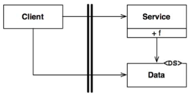
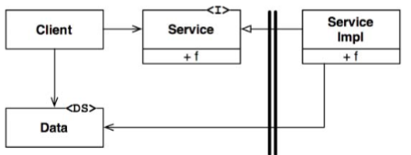

# Chapter 18 Boundary anatomy
Kiến trúc của một hệ thống được định nghĩa bởi một bộ các component phần mềm và các ranh giới tách biệt chúng. Những ranh giới này có nhiều dạng khác nhau. Trong chương này, chúng ta sẽ thấy một vài loại phổ biến nhất.

## Boundary Crossing
Lúc chạy chương trình runtime, ranh giới cắt ngang (boundary crossing) không gì khác là một hàm ở một phía ranh giới gọi một hàm ở phía khác và truyền theo đó một vài dữ liệu. Mẹo để tạo ra một ranh giới cắt ngang phù hợp là để quản lý các phụ thuộc mã nguồn.

Tại sao lại là mã nguồn? Bởi vì khi một module mã nguồn thay đổi, thì module mã nguồn khác cũng có thể phải thay đổi hoặc biên dịch lại, và sau đó được triển khai lại. Ranh giới chính là tất cả việc quản lý và tạo ra các bức tường lửa để chống lại sự thay đổi này.

## The Dreaded Monolith
Các ranh giới kiến trúc phổ biến nhất và đơn giản nhất không có biểu diễn ở dạng vật lý chặt chẽ. Nó chỉ đơn giản là việc phân chia có kỷ luật các hàm và dữ liệu trong một bộ vi xử lý và một không gian địa chỉ bộ nhớ. Trong chương trước, tôi đã gọi cái này là chế độ tách rời mức độ mã nguồn (source-level decoupling mode).

Từ quan điểm triển khai, nó chính là một file thực thi – vì vậy nó được gọi là nguyên khối. File này có thể là một dữ án C hoặc C++ được liên kết tĩnh, một tập các file lớp Java gắn với nhau trong một file jar thực thi được, một bộ các nhị phân .NET gắn trong một file .EXE đơn, .v.v.

Thực tế, các ranh giới này không thấy được trong quá trình phát triển theo mô hình nguyên khối không có nghĩa là chúng không tồn tại và không có ý nghĩa. Thậm chí khi được liên kết tĩnh vào trong một file thực thi đơn, thì khả năng phát triển độc lập và bố trí các component khác để ráp lại với nhau cũng là điều hết sức có giá trị.

Các kiến trúc như vậy hầu như luôn phụ thuộc và một kiểu đa hình động[1] nào đó để quản lý những phụ thuộc nội tại của chúng. Đây là một trong những nguyên nhân mà phát triển phần mềm hướng đối tượng lại trở thành một mẫu hình quan trọng trong vài thập kỷ gần đây. Nếu không có OO, hoặc một dạng nào đó tương đương của đa hình, thì các kiến trúc sư buộc phải trở lại sử dụng một cách mạo hiểm các con trỏ trỏ tới các hàm để đạt được mức độ tách rời phù hợp. Phần lớn các kiến trúc sư đều thấy việc sử dụng con trỏ trỏ tới các hàm là điều quá mạo hiểm, vì vậy họ buộc phải từ bỏ bất cứ dạng nào của việc phân chia component.

Ranh giới cắt ngang đơn giản nhất là một hàm gọi từ một client cấp thấp tới một dịch vụ ở cấp cao hơn. Cả phụ thuộc lúc runtime và phụ thuộc lúc biên dịch đều trỏ về cùng một hướng, hướng về component ở cấp cao hơn.

Trong Hình 18.1, luồng điều khiển vượt qua ranh giới này từ trái sang phải. Client gọi hàm `f()` của Service. Nó truyền theo đó một thực thể Data. Dấu <DS> đơn giản thể hiện đó là một cấu trúc dữ liệu (Data Structure). Data có thể truyền theo tham số hàm hoặc bởi một vài phương tiện phức tạp nào khác. Lưu ý rằng định nghĩa của Data nằm ở phía được gọi của ranh giới.

Khi một client cấp cao cần gọi một dịch vụ ở cấp thấp hơn, thì tính đa hình động được sử dụng để đảo ngược phụ thuộc ngược lại luồng điều khiển. Phụ thuộc lúc runtime ngược lại với phụ thuộc lúc biên dịch.

Trong hình dưới đây, luồng điều khiển vượt qua ranh giới từ trái sang phải như trước. Client cấp cao gọi hàm `f()` của `ServiceImpl` cấp thấp hơn thông qua interface Service. Tuy nhiên, lưu ý là tất cả các phụ thuộc vượt qua ranh giới này từ phải sang trái hướng về component cấp cao hơn. Cũng lưu ý rằng định nghĩa của cấu trúc dữ liệu nằm ở phía gọi của ranh giới đó.

Ngay cả trong một hệ thống nguyên khối, file thực thi được liên kết tĩnh, kiểu phân chia theo kỷ luật này cũng có thể hỗ trợ rất lớn cho công việc phát triển, kiểm tra, và triển khai dự án. Các đội phát triển có thể làm việc độc lập với nhau trên component của họ mà không dẫm vào chân của đội khác. Các component cấp cao vẫn giữ được tính độc lập so với các chi tiết cấp thấp.

Sự liên lạc giữa các component trong kiểu nguyên khối rất nhanh và không hề đắt đỏ. Chúng chỉ đơn thuần là các lệnh gọi hàm. Kết quả là việc liên lạc giữa các ranh giới tách rời ở cấp độ mã nguồn có thể có rất nhiều.

Do việc phát triển theo kiểu nguyên khối thường đòi hỏi phải biên dịch và liên kết tĩnh nên các component trong những hệ thống này thường được phát hành dưới dạng mã nguồn.

## Deployment components
Dạng vật lý đơn giản nhất của một ranh giới kiến trúc là một thư viện liên kết động như file DLL của .Net, file jar của Java, một Ruby Gem, hoặc một thư viện chia sẻ UNIX. Việc triển khai không cần phải biên dịch. Thay vào đó các component được phát hành dưới dạng nhị phân, hoặc một dạng triển khai được tương đương. Đây là chế độ tách rời cấp triển khai. Hàng động triển khai chỉ đơn giản là tập hợp những đơn vị triển khai được này vào cùng một dạng thuận tiện nào đó, ví dụ như một file WAR, hoặc thậm chí chỉ là một thư mục.

Ngoài ngoại lệ đó thì các component mức triển khai cũng giống như kiểu nguyên khối. Tất cả các hàm thông thường tồn tại trong cùng một bộ vi xử lý và không gian nhớ. Chiến thuật để tách biệt các component và quản lý những phụ thuộc của chúng cũng đều giống nhau.

Cũng giống như kiểu nguyên khối, việc liên lạc qua các ranh giới component triển khai cũng chỉ là các lời gọi hàm và do đó cũng không đắt đỏ. Có thể sẽ cần phải truy cập một lần đối với liên kết động hoặc nạp trong lúc runtime, nhưng việc liên lạc qua những ranh giới này có thể vẫn rất nhiều.

## Threads 
Cả hai component nguyên khối và triển khai đều có thể dùng các luồng (thread). Các luồng không phải là ranh giới kiến trúc hay là các đơn vị triển khai, mà đó là một cách để tổ chức lịch và thứ tự thực thi. Chúng có thể nằm hoàn toàn trong một component, hoặc mở rộng qua nhiều component.

## Local processes
Một ranh giới kiến trúc vật lý vững chắc hơn nhiều là tiến trình cục bộ (local process). Một tiến trình cục bộ thường được tạo ra từ dòng lệnh hoặc một lời gọi hệ thống tương đương. Các tiến trình cục bộ chạy trên cùng một vi xử lý, hoặc trong cùng một bộ các vi xử lý trên một vi xử lý đa nhân, nhưng chạy trong các không gian địa chỉ riêng biệt. Việc bảo vệ bộ nhớ thường ngăn những tiến trình như vậy chia sẻ bộ nhớ, mặc dù các phân vùng bộ nhớ được chia sẻ thường được sử dụng.

Thông thường nhất thì các tiến trình cục bộ liên lạc với những tiến trình khác thông qua socket, hoặc một vài phương tiện liên lạc của hệ điều hành như mailbox (hòm thư) hoặc message queue (hàng đợi tin).

Mỗi tiến trình cục bộ có thể là một nguyên khối liên kết tĩnh, hoặc nó có thể được hợp thành bởi những component triển khai liên kết động. Trong trường hợp đầu, vài tiến trình nguyên khối có thể có cùng các component giống nhau được biên dịch và liên kết trong đó. Trong trường hợp sau, chúng có thể chia sẻ cùng component triển khai liên kết động.

Hãy nghĩ về một tiến trình cục bộ như là một dạng của component người dùng (uber-component): tiến trình này bao gồm các component cấp thấp hơn mà quản lý các phụ thuộc của chúng thông qua tính đa hình động.

Chiến thuật tách biệt giữa các tiến trình cục bộ cũng giống như đối với các component nguyên khối và nhị phân. Các phụ thuộc mã nguồn trỏ theo cùng hướng qua ranh giới, và luôn hướng về component cấp cao hơn.

Đối với các tiến trình cục bộ, điều này có nghĩa là mã nguồn của tiến trình cấp cao hơn không được bao gồm tên, hoặc địa chỉ vật lý, hoặc sổ tìm kiếm key (registry lookup key) của các tiến trình cấp thấp hơn. Hãy nhớ rằng mục tiêu của kiến trúc là các tiến trình cấp thấp sẽ là plugin của tiến trình cấp cao.

Việc liên lạc qua các ranh giới tiến trình cục bộ liên quan tới các lệnh gọi hệ điều hành, sắp xếp và giải mã dữ liệu, và chuyển đổi ngữ cảnh liên tiến trình (interprocess), điều này phải trả giá ở mức độ vừa phải. Do đó, việc giao tiếp nên được giới hạn một cách cẩn thận.

## Services
Ranh giới vững chắc nhất là dịch vụ. Dịch vụ là một tiến trình, thường được bắt đầu từ dòng lệnh hoặc qua một lời gọi hệ thống tương đương. Các dịch vụ không phụ thuộc vào vị trí vật lý của nó. Hai dịch vụ liên lạc với nhau có thể hoặc có thể không, vận hành trên cùng một vi xử lý hoặc đa nhân vật lý. Các dịch vụ coi như tất cả các liên lạc được thực hiện trên mạng máy tính.

Việc liên lạc qua các ranh giới dịch vụ rất chậm so với lời gọi hàm. Thời gian xoay vòng có thể trong khoảng từ vài chục mili-giây cho tới vài giây. Chúng ta phải cẩn thận, tránh trao đổi gói tin càng nhiều càng tốt. Việc liên lạc ở mức độ này buộc phải xử lý cả vấn đề độ trễ ở mức cao.

Ngược lại, các quy tắc áp dụng cho các dịch vụ cũng tương tự như áp dụng cho các tiến trình cục bộ. Các dịch vụ cấp thấp hơn cần “cắm vào” các dịch vụ ở cấp cao hơn. Mã nguồn của các dịch vụ cấp cao hơn không được bao gồm bất cứ thông tin vật lý cụ thể nào (ví dụ như địa chỉ URI) của bất cứ dịch vụ cấp thấp hơn nào.

## Conclusion
Đa phần các hệ thống, ngoài kiểu nguyên khối, đều sử dụng nhiều chiến thuật ranh giới khác nhau. Một hệ thống sử dụng ranh giới kiểu dịch vụ cũng có thể có ranh giới kiểu tiến trình cục bộ. Quả thực, một dịch vụ thường chỉ là một facade (bề ngoài) của một bộ các tiến trình cục bộ tương tác qua lại. Một dịch vụ, hoặc một tiến trình cục bộ, sẽ hầu như chắc chắn hoặc là một nguyên khối cấu thành từ các component mã nguồn hoặc từ một bộ các component triển khai liên kết động.

Điều này có nghĩa là các ranh giới trong một hệ thống sẽ thường pha trộn giữa các ranh giới trao đổi cục bộ và các ranh giới mà phải quan tâm hơn tới vấn đề về độ trễ dữ liệu.

