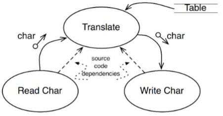
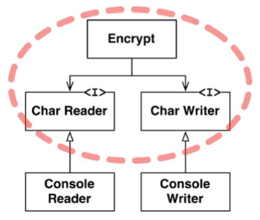
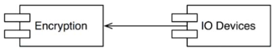

# Chapter 19 : Policy and Level
----------------

Các hệ thống phần mềm là sự trình bày của các chính sách. Quả thực, trong cốt lõi của nó, đó là tất cả những gì một chương trình máy tính thực tế làm. Một chương trình máy tính là một mô tả chi tiết của các chính sách này bằng cách xử lý đầu vào này sẽ chuyển hóa thành đầu ra như thế nào.

Trong hầu hết các hệ thống không đơn giản, chính sách đó có thể chia nhỏ thành nhiều chính sách khác nhỏ hơn. Một số sẽ mô tả các quy tắc nghiệp vụ cụ thể sẽ được tính toán như thế nào. Một số khác sẽ mô tả một báo cáo cụ thể sẽ được định dạng như thế nào. Một số khác sẽ mô tả dữ liệu đầu vào sẽ được kiểm tra xác thực như thế nào.

Một phần của nghệ thuật phát triển kiến trúc phần mềm là việc tách biệt cẩn thận những chính sách này khỏi những thứ khác, và nhóm chúng lại dựa trên cách mà chúng có thể thay đổi. Các chính sách thay đổi vì cùng lý do, và vào cùng thời điểm, ở cùng cấp độ thì sẽ cùng thuộc về một component giống nhau. Các chính sách thay đổi vì các lý do khác nhau, hoặc ở những thời điểm khác nhau, tại những cấp độ khác nhau thì nên được tách biệt thành những component khác nhau.

Nghệ thuật kiến trúc thường liên quan tới việc hình thành các component được nhóm lại thành một biểu đồ không vòng lặp hữu hướng. Các node của biểu đồ là các component bao gồm các chính sách ở cùng cấp độ. Các cạnh hữu hướng là các phụ thuộc giữa những component đó. Chúng kết nối các component ở các cấp khác nhau.

Những phụ thuộc đó là mã nguồn, những phụ thuộc lúc biên dịch. Trong Java, chúng là các câu lệnh `import`. Trong C#, chúng là các câu lệnh `using`. Trong Ruby, chúng là các câu lệnh `require`. Chúng là các phụ thuộc cần có để trình biên dịch hoạt động được.

Trong một kiến trúc tốt, hướng của những phụ thuộc này dựa trên cấp độ của các component mà chúng kết nối. Trong mọi trường hợp, các component cấp thấp được thiết kế để chúng phụ thuộc vào các component ở cấp cao.

## Level

Một định nghĩa chặt chẽ của “cấp độ” đó là “khoảng cách so với các đầu vào và các đầu ra”. Một chính sách càng xa so với cả đầu vào và đầu ra của hệ thống thì cấp độ của nó càng cao. Các chính sách quản lý đầu vào và đầu ra là các chính sách cấp thấp nhất trong hệ thống.

Biểu đồ luồng dữ liệu trong Hình 19.1 mô tả một chương trình mã hóa đơn giản đọc các ký tự từ một thiết bị đầu vào, dịch các ký tự này bằng một bảng, và sau đó ghi các ký tự đã được dịch vào một thiết bị đầu ra. Các luồng dữ liệu được biểu diễn bằng các mũi tên cong liền. Các phụ thuộc mã nguồn thiết kế đúng đắn được biểu diễn bằng các đường thẳng đứt đoạn.



Component `Translate` là component cấp cao nhất trong hệ thống này bởi vì nó là component xa nhất so với đầu vào và đầu ra[1].

Lưu ý rằng các luồng dữ liệu và các phụ thuộc mã nguồn không phải luôn trỏ về cùng một hướng. Đây lại một lần nữa là một phần của nghệ thuật kiến trúc phần mềm. Chúng ta muốn các phụ thuộc mã nguồn được tách rời khỏi luồng dữ liệu và gắn chặt với cấp độ.

Thật dễ dàng để tạo ra một kiến trúc không đúng bằng việc viết chương trình mã hóa như sau:

```js
function encrypt() {
    while (true) 
        writeChar(translate(readChar()));
}
```
Đây là một kiến trúc không đúng bởi vì hàm encrypt cấp cao phụ thuộc vào các hàm `readChar` và `writeChar` ở cấp thấp hơn.

Một kiến trúc tốt hơn cho hệ thống này được thấy ở biểu đồ lớp (class diagram) trong Hình 19.2. Lưu ý đường ranh giới đứt đoạn bao quanh lớp `Encrypt`, và các interface `CharWriter` và `CharReader`. Tất cả các phụ thuộc qua ranh giới đó hướng vào trong. Lớp này là thành phần cấp cao nhất trong hệ thống:



`ConsoleReader` và `ConsoleWriter` thấy ở đây là các lớp. Chúng ở cấp thấp bởi vì chúng gần với đầu vào và đầu ra.

Lưu ý về cách mà cấu trúc này tách rời chính sách mã hóa cấp cao khỏi các chính sách đầu vào/đầu ra cấp thấp. Điều này làm cho chính sách mã hóa có thể dùng được trong nhiều ngữ cảnh khác nữa. Khi những chính sách đầu vào và đầu ra thay đổi, thì chúng sẽ không gây ảnh hưởng gì tới chính sách mã hóa.

Hãy nhớ lại rằng các chính sách được nhóm thành các component dựa trên cách mà chúng thay đổi. Các chính sách thay đổi vì cùng lý do và tại cùng thời điểm được nhóm cùng nhau theo nguyên lý SRP và CCP. Các chính sách cấp cao hơn – những chính sách cách đầu vào và đầu ra xa nhất – thì có khuynh hướng ít thay đổi hơn, và vì nhiều nguyên nhân quan trọng hơn là đối với chính sách cấp thấp hơn. Các chính sách cấp thấp hơn – những cái gần nhất với đầu vào và đầu ra – có khuynh hướng thay đổi thường xuyên, và gấp rút hơn, nhưng lại vì những nguyên nhân ít quan trọng hơn.

Lấy ví dụ, đơn giản ngay trong chương trình mã hóa trên, việc thay đổi các thiết bị IO nhiều khả năng sẽ xảy ra hơn là đối với thuật toán mã hóa. Nếu thuật toán mã hóa thay đổi, thì nó sẽ vì những nguyên nhân quan trọng hơn là một thay đổi đối với thiết bị IO.

Việc giữ cho các chính sách này tách biệt, với tất cả các phụ thuộc mã nguồn trỏ theo hướng của các chính sách cấp cao thì sẽ làm giảm ảnh hưởng của những thay đổi. Những thay đổi đơn giản nhưng gấp rút ở cấp độ thấp nhất của hệ thống sẽ có ít hoặc không ảnh hưởng tới các cấp độ cao hơn, quan trọng hơn.

Một cách khác để nhìn vào vấn đề này là lưu ý các component cấp thấp hơn phải là các plugin cho các component ở cấp cao hơn. Biểu đồ component trong Hình 19.3 chỉ ra cách sắp xếp này. Component `Encryption` không biết gì về component `IODevices`; còn component `IODevices` lại phụ thuộc vào component `Encryption`.



## Conclusion
Tới đây, cuộc thảo luận về các chính sách đã liên quan tới nhiều nguyên lý: Nguyên Lý Đơn Nhiệm (Single Resonsibility Principle), Nguyên Lý Mở-Đóng (Open-Closed Principle), Nguyên Lý Khép Kín Chung (Common Closure Principle), Nguyên Lý Đảo Ngược Phụ Thuộc (Dependency Inversion Principle), Nguyên Lý Phụ Thuộc Ổn Định (Stable Dependencies Principle), và Nguyên Lý Trừu Tượng Ổn Định (Stable Abstractions Principle). Hãy quay trở lại và xem bạn có thể xác định được mỗi nguyên lý đã được dùng ở đâu, và tại sao không.
