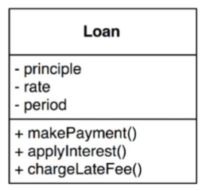

# Business Rules
--------------------

Nếu chúng ta phân chia chương trình của chúng ta thành các quy tắc nghiệp vụ và các plugin, thì chúng ta sẽ hiểu được rõ hơn các quy tắc nghiệp vụ thực sự là cái gì. Hóa ra nó có nhiều loại khác nhau.

Nói một cách chính xác, các quy tắc nghiệp vụ là các quy tắc hoặc các quy trình dùng để tạo ra hoặc tiết kiệm được tiền cho doanh nghiệp. Nói một cách rất chính xác, những nguyên tắc này sẽ tạo ra hoặc tiết kiệm tiền cho doanh nghiệp, bất kể chúng có được thực hiện trên máy tính hay không. Chúng sẽ tạo ra hoặc tiết kiệm tiền ngay cả khi chúng được thực hiện một cách thủ công.

Thực tế, một ngân hàng tính phí N% tiền lãi cho một khoản vay là một quy tắc nghiệp vụ giúp ngân hàng kiếm được tiền. Không quan trọng đó là một chương trình máy tính tính toán số tiền lãi đó hay là một nhân viên sử dụng bảng tính để tính toán số tiền lãi đó.

Chúng ta gọi những quy tắc này là Những quy tắc nghiệp vụ quan trọng, bởi vì chúng quan trọng đối với bản thân doanh nghiệp, và vẫn sẽ tồn tại ngay cả khi không có hệ thống nào thực hiện tự động hóa chúng.

Các quy tắc nghiệp vụ quan trọng thường đòi hỏi phải làm việc với một vài dữ liệu nào đó. Lấy ví dụ, khoản cho vay của chúng ta đòi hỏi phải có số dư khoản vay, lãi suất, và lịch thanh toán.

Chúng ta sẽ gọi dữ liệu này là Dữ liệu nghiệp vụ quan trọng. Đây là dữ liệu vẫn sẽ tồn tại ngay cả khi hệ thống không được tự động hóa.

Các quy tắc và dữ liệu quan trọng này gắn bó chặt chẽ với nhau, vì vậy chúng là một ứng viên tốt cho một đối tượng. Chúng ta gọi loại đối tượng này là một Entity (thực thể).

## Entities
Một entity là một đối tượng nằm trong hệ thống máy tính của chúng ta và biểu hiện một tập nhỏ các quy tắc nghiệp vụ quan trọng được vận hành trên Dữ liệu nghiệp vụ quan trọng. Đối tượng Entity hoặc là bao gồm cả Dữ liệu nghiệp vụ quan trọng hoặc là rất dễ truy xuất tới dữ liệu đó. Interface của Entity bao gồm các hàm triển khai các Quy tắc nghiệp vụ quan trọng mà có sử dụng các dữ liệu đó.

Lấy ví dụ, hình dưới đây cho thấy entity Loan của chúng ta trông như một lớp trong UML. Nó có ba trường Dữ liệu nghiệp vụ quan trọng, và biểu diễn ba Quy tắc nghiệp vụ quan trọng trong interface của nó.

Khi chúng ta tạo ra kiểu lớp này, chúng ta đang tập hợp cùng nhau trong phần mềm triển khai một khái niệm quan trọng đối với doanh nghiệp, và tách biệt nó khỏi những vấn đề quan tâm khác trong hệ thống tự động hóa mà chúng ta đang xây dựng. Lớp này đứng một mình như một biểu hiện của doanh nghiệp. Nó không phải quan tâm gì tới cơ sở dữ liệu, giao diện người dùng, hoặc các framework của hãng thứ ba. Nó có thể thực hiện chức năng của doanh nghiệp trong bất cứ hệ thống nào, không quan tâm tới việc hệ thống đó được biểu diễn thế nào, hoặc dữ liệu được lưu trữ thế nào, hoặc các máy tính trong hệ thống đó được sắp xếp thế nào. Entity là thứ thuần nghiệp vụ và không gồm bất cứ gì khác.

Một số bạn có thể lo ngại về việc tôi đã gọi nó là một lớp. Không phải. Bạn không cần phải dùng một ngôn ngữ hướng đối tượng để tạo ra một Entity. Tất cả điều cần làm là bạn gán các Dữ liệu nghiệp vụ quan trọng và các Quy tắc nghiệp vụ quan trọng cùng với nhau vào trong một module phần mềm tách biệt.

## Use Cases
Không phải tất cả các quy tắc nghiệp vụ đều thuần nghiệp vụ như Entity. Một số quy tắc nghiệp vụ tạo ra hoặc tiết kiệm tiền cho doanh nghiệp bằng cách định nghĩa và ràng buộc cách mà một hệ thống tự động hóa vận hành. Những quy tắc này sẽ không được sử dụng trong môi trường thủ công, bởi vì chúng chỉ có nghĩa khi nằm trong một hệ thống tự động hóa.

Lấy ví dụ, hãy tưởng tượng một ứng dụng được dùng bởi các nhân viên ngân hàng để tạo một khoản cho vay mới. Ngân hàng có thể quyết định rằng họ không muốn nhân viên cho vay cung cấp ước tính thanh toán khoản vay cho đến khi họ thu thập, xác thực được thông tin liên hệ và đảm bảo rằng điểm tín dụng của ứng viên là 500 hoặc cao hơn. Vì lý do này, ngân hàng có thể chỉ định rằng hệ thống sẽ không chuyển đến màn hình ước tính thanh toán cho đến khi màn hình thông tin liên hệ đã được điền và xác minh, và điểm tín dụng đã được xác nhận là lớn hơn ngưỡng giới hạn.

Đó là một use case (tình huống sử dụng). Use case là một mô tả cách mà một hệ thống tự động hóa được sử dụng. Nó chỉ rõ đầu vào được cung cấp bởi người dùng, đầu ra được trả về cho người dùng, và các bước xử lý liên quan trong quá trình tạo ra đầu ra. Một use case mô tả các quy tắc nghiệp vụ cho ứng dụng cụ thể, ngược với các Quy tắc nghiệp vụ quan trọng nằm trong Entity.

Hình dưới chỉ ra một ví dụ về use case. Lưu ý rằng dòng cuối cùng nó đề cập tới Customer (khách hàng). Đây là một tham chiếu tới entity Customer, bao gồm các Quy tắc nghiệp vụ quan trọng điều hành mối liên hệ giữa ngân hàng và các khách hàng của nó.

Các use case bao gồm các quy tắc chỉ rõ bằng cách nào và khi nào thì các Quy tắc nghiệp vụ quan trọng nằm trong Entity được gọi tới. Use case điều khiển hoạt động của Entity.

Cũng lưu ý rằng use case không mô tả giao diện người dùng nào ngoài xác định cụ thể dữ liệu nào được nhập vào giao diện đó, và dữ liệu nào đi ra khỏi giao diện đó. Từ use case, chúng ta không thể biết được ứng dụng được phát triển trên web, hay trên một console, hay đó chỉ là một dịch vụ đơn thuần.

Đây là điều rất quan trọng. Các use case không mô tả cách hệ thống xuất hiện thế nào trước người dùng. Thay vào đó, chúng mô tả các quy tắc của ứng dụng cụ thể để quản lý tương tác giữa người dùng và các Entity. Cách để dữ liệu vào và ra trong hệ thống không liên quan tới các use case.

Use case là một đối tượng. Nó có một hoặc nhiều hàm triển khai các quy tắc nghiệp vụ của ứng dụng cụ thể. Nó cũng có các thành phần dữ liệu bao gồm dữ liệu đầu vào, dữ liệu đầu ra, và các tham chiếu tới Entity thích hợp mà nó sẽ tương tác.

Entity không biết gì về các use case điều khiển chúng. Đây là ví dụ khác về hướng của các phụ thuộc bám theo Nguyên lý đảo ngược phụ thuộc. Các khái niệm cấp cao, như Entity, không biết chút gì về các khái niệm cấp thấp hơn, ví dụ như các use case. Thay vào đó, các use case ở cấp thấp hơn thì lại biết về các Entity ở cấp cao hơn.

Tại sao Entity ở cấp cao còn use case lại ở cấp thấp hơn? Đó là bởi vì use case cụ thể đối với một ứng dụng và do đó nó gần hơn với đầu vào và đầu ra của hệ thống đó. Các Entity thì được tổng quát hóa và có thể được sử dụng trong nhiều ứng dụng khác nhau, vì vậy chúng cách đầu vào và đầu ra của hệ thống xa hơn. Các use case phụ thuộc vào Entity; còn các Entity thì không phụ thuộc vào use case.

## Request and response models
Use case cần dữ liệu đầu vào, và chúng sẽ tạo ra dữ liệu đầu ra. Tuy nhiên, một đối tượng use case được thiết kế tốt sẽ không biết về cách mà dữ liệu được truyền tới người dùng, hoặc tới bất cứ component nào khác. Chúng ta chắc chắn không muốn code nằm trong lớp use case biết về HTML hay SQL!

Lớp use case chấp nhận các cấu trúc dữ liệu yêu cầu đơn giản làm đầu vào của nó, và trả về cấu trúc dữ liệu phản hồi đơn giản làm đầu ra của nó. Các cấu trúc dữ liệu này không hề bị phụ thuộc vào cái gì. Chúng không kế thừa các interface của các framework tiêu chuẩn như HttpRequest và HttpResponse. Chúng không biết gì về web, cũng như chia sẻ bất cứ giao diện người dùng nào có thể có.

Việc không có các phụ thuộc này rất quan trọng. Nếu các model yêu cầu và phản hồi không được độc lập, thì các use case phụ thuộc vào chúng sẽ gián tiếp bị gắn chặt với những phụ thuộc mà model đó mang theo.

Bạn có thể bị dụ dỗ làm cho các cấu trúc dữ liệu này bao gồm cả tham chiếu tới các đối tượng Entity. Bạn có thể nghĩ điều này hợp lý bởi vì các Entity và các model yêu cầu/phản hồi chia sẻ quá nhiều dữ liệu. Hãy tránh điều này! Mục đích của hai đối tượng này rất khác nhau. Qua thời gian chúng sẽ thay đổi vì những lý do rất khác nhau, vì vậy gắn chúng lại với nhau dù theo bất cứ cách nào cũng vi phạm Nguyên Lý Khép Kín Chung và Nguyên Lý Đơn Nhiệm. Kết quả sẽ là có rất nhiều dữ liệu thừa, cũng như rất nhiều điều kiện trong code của bạn

## Conclusion
Các quy tắc nghiệp vụ là lý do mà một hệ thống phần mềm tồn tại. Chúng là những chức năng cốt lõi. Chúng mang theo code để tạo ra hoặc để tiết kiệm được tiền. Chúng cùng họ hàng với những viên kim cương. Các quy tắc nghiệp vụ cần phải giữ cho tinh nguyên, không dính dáng gì đến các vấn đề cơ bản như giao diện người dùng hoặc cơ sở dữ liệu được sử dụng. Lý tưởng nhất là code để biểu diễn các quy tắc nghiệp vụ nên là trái tim của hệ thống, với những thứ ít quan tâm hơn sẽ được “cắm vào” chúng. Các quy tắc nghiệp vụ phải là phần code tái sử dụng được và độc lập nhất trong hệ thống.