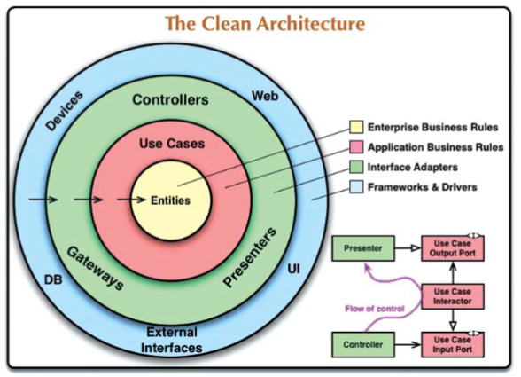
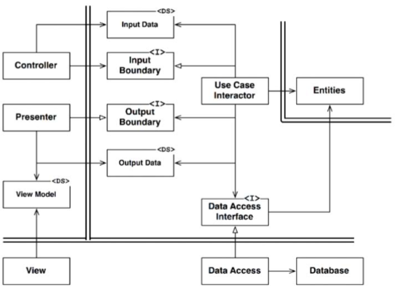

# Chapter 22 : Clean architecture
--------------------

Trải qua vài thập kỷ gần đây, chúng ta đã thấy được rất nhiều ý tưởng liên quan tới kiến trúc của hệ thống. Bao gồm:

- Hexagonal Architecture (kiến trúc sáu cạnh, cũng được biết đến với tên gọi Ports and Adapters), được phát triển bởi Alistair Cockburn, và được áp dụng bởi Steve Freeman và Nat Pryce trong cuốn sách tuyệt vời của họ Growing Object Oriented Software with Tests
- DCI của James Coplien và Trygve Reenskaug
- BCE, được giới thiệu bởi Ivar Jacobson trong cuốn sách Object Oriented Software Engineering: A Use-Case Driven Approach.

Mặc dù tất cả những kiến trúc này có những thay đổi gì đó về chi tiết của chúng, nhưng nhìn chung chúng rất giống nhau. Tất cả chúng đều có chung mục đích, đó là tách biệt các vấn đề. Tất cả chúng đạt được sự tách biệt này bằng cách phân chia phần mềm thành nhiều layer (lớp). Mỗi kiến trúc có ít nhất một layer cho các quy tắc nghiệp vụ, và layer khác cho giao diện người dùng và giao diện hệ thống.

- *Independent of frameworks - Độc lập với các framework*. Kiến trúc đó không phụ thuộc vào sự tồn tại của bất cứ thư viện hàm nào. Nó cho phép bạn dùng các framework đó như là những công cụ, hơn là buộc bạn phải nhét hệ thống của bạn vào trong những ràng buộc giới hạn của chúng.
- *Testable - Có thể kiểm tra được*. Các quy tắc nghiệp vụ có thể được kiểm tra mà không cần giao diện, cơ sở dữ liệu, máy chủ web, hoặc bất cứ thành phần bên ngoài nào khác.
- *Independent of the UI - Độc lập với UI*. Phần UI có thể thay đổi dễ dàng, mà không phải thay đổi phần còn lại của hệ thống. Lấy ví dụ, một UI web có thể được thay thế bởi một UI console mà không phải thay đổi các quy tắc nghiệp vụ.
- *Independent of the database - Độc lập với cơ sở dữ liệu*. Bạn có thể thay thế Oracle hoặc SQL Server bằng Mongo, BigTable, CouchDB, hoặc một thứ gì khác. Các quy tắc nghiệp vụ của bạn không bị gắn chặt với cơ sở dữ liệu.
- *Independent of any external agency - Độc lập với bất cứ tác nhân bên ngoài nào*. Quả thực, các quy tắc nghiệp vụ của bạn không biết bất cứ thứ gì về giao diện với thế giới bên ngoài.

Biểu đồ trong hình dưới đây là một nỗ lực tích hợp tất cả các kiến trúc này vào trong một ý tưởng có thể thực hiện được:

## The dependency rule

Các vòng tròn đồng tâm trong hình trên biểu diễn các vùng khác nhau của phần mềm. Nói chung, càng vào bên trong thì phần mềm càng có cấp độ cao. Các vòng tròn bên ngoài là các cơ chế. Các vòng tròn bên trong là các chính sách.

Quy tắc bao trùm khiến cho kiến trúc này hoạt động được là Quy tắc phụ thuộc:

Các phụ thuộc mã nguồn chỉ được hướng vào trong, hướng vào các chính sách cấp cao hơn.

Vòng tròn bên trong không thể biết bất cứ điều gì về vòng tròn bên ngoài. Cụ thể là tên của bất cứ thứ gì khai báo ở vòng tròn bên ngoài không được nhắc tới trong code của vòng tròn bên trong. Nó bao gồm các hàm, các lớp, các biến, hoặc bất cứ thực thể phần mềm được đặt tên nào khác.

Tương tự như vậy, định dạng dữ liệu được khai báo ở vòng tròn bên ngoài không được dùng bởi một vòng tròn nào ở bên trong, đặc biệt là nếu những định dạng đó được tạo ra bởi một framework ở vòng tròn bên ngoài. Chúng ta không muốn bất cứ thứ gì ở vòng tròn bên ngoài ảnh hướng đến các vòng tròn bên trong.

### Enities 
Các entity đóng gói lại các Quy tắc nghiệp vụ quan trọng của toàn bộ doanh nghiệp. Một entity có thể là một đối tượng với những method, hoặc nó có thể là một bộ các cấu trúc dữ liệu hoặc hàm. Điều này không phải là vấn đề quan trọng miễn là các entity này có thể được dùng bởi nhiều ứng dụng khác nhau trong doanh nghiệp.

Nếu bạn không có một doanh nghiệp và chỉ đơn giản là đang viết một ứng dụng, thì những entity này là các đối tượng nghiệp vụ của ứng dụng đó. Chúng đóng gói lại các quy tắc cấp cao và chung nhất. Chúng ít có khả năng thay đổi khi một thứ gì đó bên ngoài thay đổi. Lấy ví dụ, bạn sẽ không muốn những đối tượng này bị ảnh hưởng chỉ bởi một thay đổi về việc điều hướng trang hoặc bảo mật. Không một thay đổi vận hành nào tới bất cứ ứng dụng cụ thể nào được ảnh hưởng tới layer entity.

### Use cases

Phần mềm ở lớp use case bao gồm các quy tắc nghiệp vụ ứng dụng cụ thể. Nó đóng gói lại và triển khai tất cả các use case của hệ thống. Những use case này điều khiển dòng dữ liệu vào và ra khỏi các entity, và hướng những entity đó sử dụng các Quy tắc nghiệp vụ quan trọng của chúng để đạt được các mục tiêu của use case.

Chúng ta không mong muốn những thay đổi trong layer này sẽ ảnh hưởng tới các entity. Chúng ta cũng không mong muốn layer này bị ảnh hưởng bởi những thay đổi từ bên ngoài như cơ sở dữ liệu, UI, hoặc bất cứ các framework chung nào. Lớp use case này được tách biệt khỏi những vấn đề đó.

Tuy nhiên, chúng ta lại mong những thay đổi về vận hành của ứng dụng sẽ bị ảnh hưởng bởi các use case và do đó tới phần mềm trong các layer này. Nếu các chi tiết của một use case thay đổi, thì chắc chắn code trong các layer này cũng sẽ bị ảnh hưởng.

### Interface adapters
Phần mềm trong layer bộ chuyển đổi interface là một tập hợp các bộ chuyển đổi để chuyển dữ liệu từ định dạng thuận tiện nhất cho các use case và entity, sang dạng thuận tiện nhất cho các tác nhân bên ngoài như cơ sở dữ liệu hoặc web. Đó chính là layer này, lấy ví dụ, nó sẽ bao gồm toàn bộ kiến trúc MVC của một GUI. Tất cả các presenter, view, và controller đều thuộc về layer bộ chuyển đổi interface. Các model chỉ là các cấu trúc dữ liệu được truyền từ các controller tới các use case, và sau đó trở về từ các use case sang presenter và view.

Tương tự, dữ liệu được chuyển đổi, trong layer này, từ dạng thuận tiện nhất cho các entity và use case, sang dạng thuận tiện nhất cho bất cứ framework lưu trữ nào đang được sử dụng (ví dụ cơ sở dữ liệu). Không code nào bên trong vòng tròn này biết bất cứ thứ gì về cơ sở dữ liệu. Nếu cơ sở dữ liệu này là cơ sở dữ liệu SQL, thì tất cả SQL phải được giới hạn trong lớp này – và cụ thể là đối với các phần của lớp này có liên quan đến cơ sở dữ liệu.

Trong layer này cũng gồm bất cứ bộ chuyển đổi nào khác cần để chuyển dữ liệu từ dạng bên ngoài nào đó, ví dụ như một dịch vụ bên ngoài, sang dạng bên trong được sử dụng bởi các use case và các entity.

### Framework and drivers
Lớp ngoài cùng của mô hình này  thường là tập hợp của các framework và các công cụ như cơ sở dữ liệu và web framework. Thông thường bạn không phải viết quá nhiều trong layer này, ngoài việc viết code kết nối để giao tiếp với vòng tròn bên trong kế tiếp.

Layer framework và driver là nơi mà tất cả phần chi tiết ở trong đó. Web là một chi tiết. Cơ sở dữ liệu là một chi tiết. Chúng ta để những thứ này ở bên ngoài để chúng ít gây ảnh hưởng nhất có thể.

### Only four circles ?
Các vòng tròn trong hình minh họa có mục đích là giản đồ: Bạn có thể thấy bạn cần nhiều hơn là bốn vòng tròn này. Không có nguyên tắc nào nói bạn luôn luôn phải có bốn. Tuy nhiên, Nguyên tắc phụ thuộc luôn được áp dụng. Các phụ thuộc mã nguồn luôn hướng vào trong. Khi bạn di chuyển vào trong, thì mức độ trừu tượng và chính sách tăng dần lên. Vòng tròn ngoài cùng bao gồm những chi tiết cụ thể cấp thấp. Khi bạn di chuyển vào trong, thì phần mềm sẽ tăng dần tính trừu tượng và đóng gói các chính sách cấp cao hơn. Vòng tròn trong cùng là tổng quát nhất và là cấp cao nhất.

### Crossing Boundaries
Ở phía dưới bên phải của biểu đồ trong hình trước là một ví dụ về cách chúng ta cắt các đường ranh giới. Nó chỉ ra các controller và presenter liên lạc với các use case trong layer kế tiếp. Lưu ý về luồng điều khiển: Nó bắt đầu trong controller, di chuyển qua use case, và sau đó kết thúc việc thực thi trong presenter. Cũng lưu ý về các phụ thuộc mã nguồn: Mỗi điểm hướng vào các use case.

Chúng ta thường giải quyết mâu thuẫn rõ ràng này bằng cách dùng Nguyên Lý Đảo Ngược Phụ Thuộc. Lấy ví dụ, trong một ngôn ngữ như Java, chúng ta sẽ sắp xếp các interface và các liên hệ kế thừa như các phụ thuộc mã nguồn ngược lại với luồng điều khiển tại đúng điểm thích hợp qua ranh giới đó.

Lấy ví dụ, một use case cần gọi tới presenter. Việc gọi này không được thực hiện trực tiếp bởi vì nó sẽ vi phạm Quy Tắc Phụ Thuộc: Không thứ gì ở trong một vòng tròn bên ngoài được nhắc tới ở vòng tròn bên trong. Vì vậy chúng ta để use case đó gọi một interface (thấy ở Hình 22.1 là “use case output port” – cổng đầu ra của use case) trong vòng tròn bên trong, và để cho presenter ở vòng tròn bên ngoài triển khai nó.

Kỹ thuật tương tự cũng được sử dụng để vượt qua tất cả các ranh giới trong các kiến trúc đó. Chúng ta tận dụng ưu điểm của tính đa hình động để tạo ra các phụ thuộc mã nguồn ngược với luồng điều khiển sao cho chúng ta có thể tuân thủ được Quy Tắc Phụ Thuộc, cho dù luồng điều khiển đi theo hướng nào.

### Which data crosses the boundaries ?
Thông thường dữ liệu vượt qua các ranh giới bao gồm các cấu trúc dữ liệu đơn giản. Bạn có thể dùng các cấu trúc cơ bản hoặc các đối tượng chuyển giao dữ liệu (Data Transfer Object – DTO) đơn giản nếu muốn. Hoặc dữ liệu đó có thể đơn giản là các tham số trong khi gọi hàm. Hoặc bạn có thể gói nó thành một hashmap, hoặc xây dựng nó trong một đối tượng. Điều quan trọng là nó phải được tách biệt, các cấu trúc dữ liệu đơn giản được truyền qua các ranh giới. Chúng ta không muốn đi tắt và truyền vào đó các đối tượng Entity hoặc các hàng cơ sở dữ liệu. Chúng ta không muốn các cấu trúc dữ liệu có bất cứ một phụ thuộc nào vi phạm Quy Tắc Phụ Thuộc.

Lấy ví dụ, nhiều framework cơ sở dữ liệu trả về một định dạng dữ liệu thuận tiện khi phản hồi một lệnh query. Chúng ta có thể gọi đó là một “cấu trúc hàng”. Chúng ta không muốn truyền cấu trúc hàng đó vào trong qua ranh giới. Làm như vậy là đã vi phạm Quy Tắc Phụ Thuộc bởi vì nó buộc vòng tròn bên trong biết được một vài thứ về vòng tròn bên ngoài.

Do đó, khi chúng ta truyền dữ liệu vượt qua một ranh giới, nó luôn phải ở dạng phù hợp nhất với vòng tròn bên trong.

## A typical scenario
Biểu đồ trong hình dưới đây chỉ ra một kịch bản điển hình cho một hệ thống Java nền web dùng một cơ sở dữ liệu. Máy chủ web tập hợp dữ liệu đầu vào từ người dùng và truyền nó cho `Controller` ở phía trên bên trái. `Controller` đóng gói dữ liệu đó thành một đối tượng Java đơn thuần và truyền đối tượng đó qua `InputBoundary` tới `UseCaseInteractor`. `UseCaseInteractor` dịch dữ liệu đó và dùng nó để điều khiển hoạt động của `Entities`. Nó cũng dùng `DataAccessInterface` để mang dữ liệu được dùng bởi những `Entities` đó vào trong bộ nhớ từ `Database`. Sau khi hoàn thành, `UseCaseInteractor` tập hợp dữ liệu từ `Entities` và xây dựng một đối tượng Java đơn giản khác `OutputData`. `OutputData` sau đó được truyền qua interface `OutputBoundary` sang `Presenter`.

Công việc của `Presenter` là đóng gói lại OutputData vào trong một dạng có thể xem được `ViewModel`, đó cũng là một đối tượng Java đơn giản. `ViewModel` hầu như chỉ bao gồm các String và các cờ mà View dùng để hiển thị dữ liệu. Trong khi đó OutputData có thể bao gồm các đối tượng Date, `Presenter` sẽ nạp `ViewModel` với String tương ứng đã được định dạng phù hợp cho người dùng. Điều tương tự cũng được thực hiện với đối tượng Currency hoặc bất cứ dữ liệu liên quan đến nghiệp vụ nào khác. Tên gọi `Button` và `MenuItem` được đặt trong `ViewModel`, đó là các cờ để nói với View xem những `Button` và `MenuItem` đó có bị vô hiệu hóa không.

Điều này giúp cho View hầu như không phải làm gì hơn là di chuyển dữ liệu từ `ViewModel` vào trong trang HTML.

Lưu ý hướng của các phụ thuộc. Tất cả các phụ thuộc vượt qua ranh giới đều hướng vào trong, theo Quy Tắc Phụ Thuộc.

## Conclusion
Tuân thủ những quy tắc đơn giản này không khó, và nó sẽ tiết kiệm cho bạn rất nhiều công sức về sau. Bằng cách tách biệt phần mềm thành các layer và tuân thủ theo Quy Tắc Phụ Thuộc, bạn sẽ tạo ra một hệ thống mà về bản chất có thể kiểm tra được, với tất cả các lợi ích đã được nói ra. Khi bất cứ thành phần bên ngoài nào của hệ thống trở nên lỗi thời, ví dụ như cơ sở dữ liệu, hoặc web framework, bạn có thể thay thế những thành phần lỗi thời đó với lượng công sức tối thiểu.
