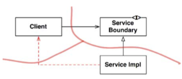
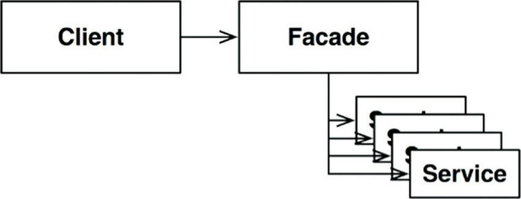

# Chapter 24 : Partial Boundaries
--------------------------

Các ranh giới kiến trúc toàn diện rất tốn kém. Chúng đòi hỏi các interface Boundary đa hình, các cấu trúc dữ liệu Input và Output, và tất cả việc quản lý phụ thuộc cần để phân tách hai phía vào trong các component có thể triển khai được và biên dịch được độc lập. Điều này mất rất nhiều công sức. Nó cũng cần rất nhiều công để bảo trì.

Trong nhiều trường hợp, một kiến trúc tốt có thể đánh giá chi phí của một ranh giới như vậy là quá cao – nhưng nó có thể vẫn muốn giữ một vị trí cho một ranh giới như vậy trong trường hợp cần thiết sau này.

Kiểu thiết kế dự đoán trước này thường làm nhiều người trong cộng đồng Agile nhăn mặt bởi nó vi phạm nguyên lý YAGNI: “You Aren’t Going to Need It.” (Bạn sẽ không cần đến nó đâu). Tuy nhiên, các kiến trúc sư đôi khi nhìn vào vấn đề này và nghĩ rằng “Vâng, nhưng tôi có thể cần”. Trong trường hợp đó, họ có thể triển khai ranh giới một phần.

## Skip the last step
Một cách để xây dựng ranh giới một phần là làm tất cả những công việc cần thiết để tạo ra các component có thể triển khai được và biên dịch được độc lập với nhau, và sau đó giữ chúng cùng nhau trong cùng một component. Các interface tương hỗ ở đó, các cấu trúc dữ liệu đầu vào/đầu ra ở đó, và tất cả mọi thứ được thiết lập – nhưng chúng ta biên dịch và triển khai tất cả trong một component.

Hiển nhiên, kiểu ranh giới một phần này đòi hỏi một lượng code và công sức thiết kế chuẩn bị tương đương như một ranh giới toàn diện. Tuy nhiên, nó không đòi hỏi việc phải quản trị nhiều component. Sẽ không có gánh nặng phải theo dõi số phiên bản hoặc quản lý việc phát hành. Không nên coi nhẹ sự khác biệt đó.

Đây là một chiến thuật ban đầu của `Fitnesse`. Component máy chủ web của `FitNesse` được thiết kế để có thể tách biệt khỏi wiki và phần testing của `FitNesse`. Ý tưởng là chúng tôi có thể muốn tạo ra các ứng dụng nền web khác bằng cách dùng web component đó. Đồng thời, chúng tôi không muốn người dùng phải download hai component. Hãy nhớ lại rằng một trong những mục tiêu thiết kế của chúng tôi là “download và đi”. Ý định của chúng tôi là người dùng sẽ download một file jar và chỉ việc thực thi nó chứ không cần phải săn tìm các file jar khác, hay phải xem sự tương thích phiên bản.v.v.

Câu chuyện của `FitNesse` cũngchỉ ra một trong những nguy hiểm của phương pháp này. Qua thời gian, khi đã trở nên rõ ràng là không bao giờ cần tách biệt web component, sự tách biệt giữa web component và wiki component đã trở nên yếu dần. Các phụ thuộc đã bắt đầu vượt qua ranh giới theo hướng sai. Ngày nay, việc phân tách lại chúng chỉ là một việc không cần thiết.

## One-dimensional Boundaries
Ranh giới kiến trúc toàn diện dùng các interface ranh giới tương hỗ để duy trì sự tách biệt ở cả hai hướng. Việc duy trì tách biệt ở cả hai hướng là rất tốn kém cả ở lần thiết lập đầu tiên và việc duy trì về sau.

Một cấu trúc đơn giản hơn phục vụ để giữ chỗ cho việc mở rộng về sau thành ranh giới toàn diện được thấy ở Hình 24.1. Nó là ví dụ điển hình của mẫu thiết kế Strategy truyền thống. Một interface `ServiceBoundary` được sử dụng bởi các client và được triển khai bởi các lớp `ServiceImpl`:

Cần phải rõ rằng điều này tạo tiền đề cho một ranh giới kiến trúc trong tương lai. Sự đảo ngược phụ thuộc cần thiết được đưa ra nhằm cố gắng tách biệt `Client` khỏi `ServiceImpl`. Cũng cần phải nói rõ rằng sự phân tách này có thể bị suy giảm khá nhanh, như được thể hiện bằng mũi tên gạch đứt đoạn trong biểu đồ. Nếu không có các interface tương hỗ, không có gì ngăn cản loại backchannel (kênh ngược) này ngoài sự cần cù và kỷ luật của các lập trình viên và các kiến trúc sư.

## Facades

Một ranh giới thậm chí còn đơn giản hơn là mẫu thiết kế Facade, được minh họa trong hình dưới đây. Trong trường hợp này, ngay cả việc đảo ngược phụ thuộc cũng bị hy sinh. Ranh giới này chỉ đơn giản được định nghĩa bởi lớp Facade, liệt kê tất cả các dịch vụ như là những method, và triển khai các lời gọi dịch vụ tới các lớp mà client không được truy cập:

Tuy nhiên lưu ý rằng `Client` vẫn sẽcó mộtphụ thuộc ngầm vào tất cả các lớp dịch vụ này. Trong các ngôn ngữ kiểu tĩnh, một thay đổi tới mã nguồn của một trong những lớp Service sẽ buộc `Client` phải biên dịch lại. Bạn cũng có thể tưởng tượng backchannel vẫn sẽ dễ dàng để tạo với cấu trúc này như thế nào.

## Conclusion

Chúng ta đã nhìn ba cách đơn giản để triển khai ranh giới kiến trúc một phần. Dĩ nhiên còn có nhiều cách hơn. Ba chiến thuật này chỉ đơn giản được đưa ra như những ví dụ.

Mỗi cách tiếp cận đều có cái giá phải trả cũng như lợi ích của nó. Mỗi cái đều thích hợp trong những ngữ cảnh nhất định, như một placeholder (giữ chỗ) cho một ranh giới toàn diện cuối cùng. Mỗi cái cũng có thể bị suy giảm nếu ranh giới đó không bao giờ được cụ thể hóa.

Nó là một trong những chức năng của một kiến trúc sư phải quyết định nơi nào một ranh giới kiến trúc có thể tồn tại một ngày, và triển khai ranh giới toàn phần hay một phần.

