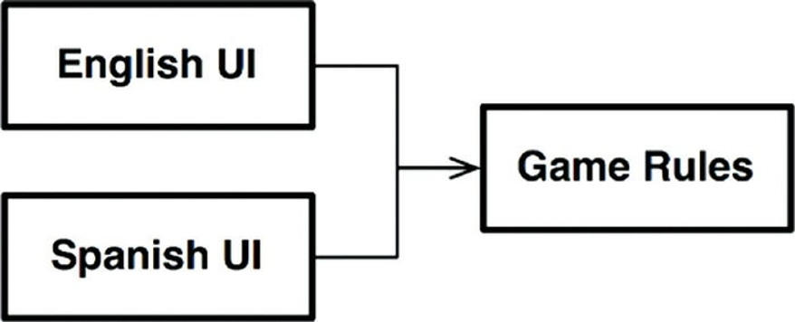
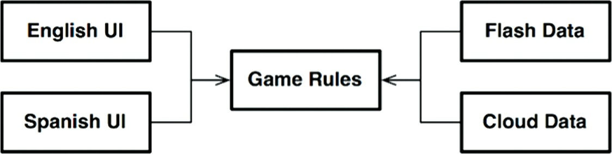
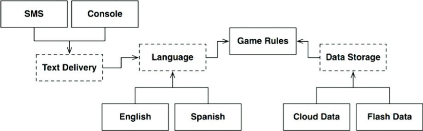
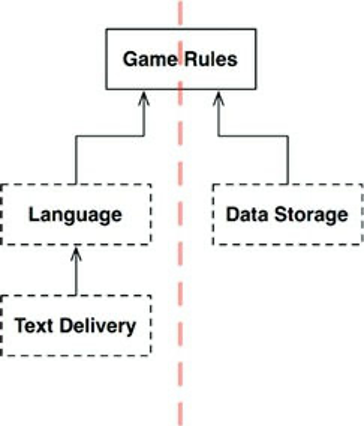
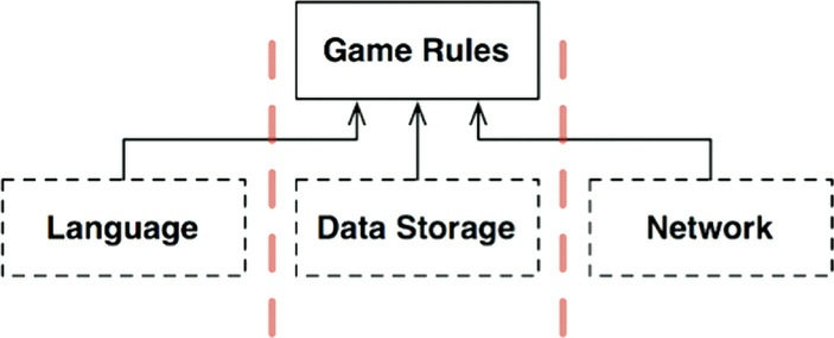
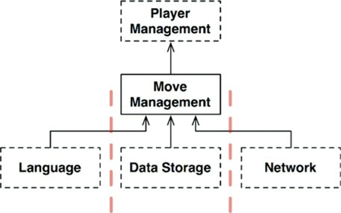
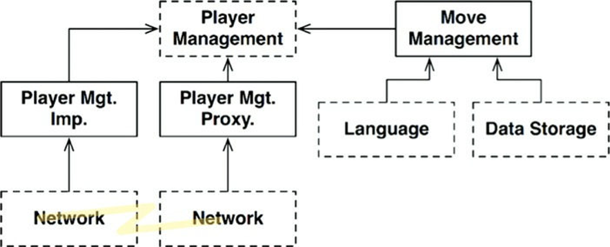

# Chapter 25 : Layers and Boundaries
--------------------------

Chúng ta dễ nghĩ rằng các hệ thống được hợp thành bởi ba component: UI, các quy tắc nghiệp vụ, và cơ sở dữ liệu. Đối với một vài hệ thống đơn giản, điều này là đủ. Nhưng đối với phần lớn hệ thống, số lượng các component sẽ lớn hơn con số đó.

Lấy ví dụ, hãy xem một trò chơi máy tính đơn giản. Chúng ta dễ dàng tưởng tượng ra ba component này. UI xử lý tất cả các gói tin từ người chơi tới các quy tắc của trò chơi. Các quy tắc trò chơi lưu trữ trạng thái của trò chơi với một số dạng cấu trúc dữ liệu bền vững. Những tất cả chỉ có vậy thôi ư?

## Hunt the Wumpus ?

Chúng ta hãy xây dựng dựa trên khung xương đó. Chúng ta hãy coi trò chơi đó là trò chơi phiêu lưu Săn Tìm Wumpus có từ năm 1972. Trò chơi nền văn bản (text-based game) này dùng các lệnh rất đơn giản như GO EAST (đi phía Đông) và SHOOT WEST (bắn phía Tây). Người chơi nhập một lệnh, và máy tính phản hồi bằng những gì người chơi nhìn, ngửi, nghe, và trải nghiệm. Người chơi sẽ săn tìm quái vật Wumpus trong một hệ thống các hang động, và phải tránh các cạm bẫy, hố sâu và những nguy hiểm khác đang đợi chờ. Nếu bạn thấy hứng thú, các quy tắc của trò chơi này có thể dễ dàng tìm thấy trên web.

Chúng ta hãy coi là chúng ta sẽ vẫn giữ UI nền văn bản, nhưng tách rời nó khỏi các quy tắc trò chơi sao cho phiên bản của chúng ta có thể dùng các ngôn ngữ khác cho các thị trường khác nhau. Các quy tắc trò chơi sẽ liên lạc với component UI dùng một API độc lập với ngôn ngữ, và UI sẽ dịch API đó thành ngôn ngữ con người thích hợp.

Nếu các phụ thuộc mã nguồn được quản lý đúng, như thấy ở Hình 25.1, thì bất cứ số component UI nào cũng có thể tái sử dụng các quy tắc trò chơi này. Các quy tắc trò chơi không biết, hoặc không cần quan tâm tới ngôn ngữ con người nào đang được sử dụng

Chúng ta cũng hãy xem trạng thái của trò chơi được lưu giữ trên những thiết bị lưu trữ như bộ nhớ flash, hoặc có thể trên cloud, hoặc cũng có thể chỉ trong RAM. Trong bất cứ trường hợp nào, chúng ta không muốn các quy tắc trò chơi biết các chi tiết này. Vì vậy, lại lần nữa, chúng ta sẽ tạo ra một API mà các quy tắc trò chơi có thể sử dụng để liên lạc với component lưu trữ dữ liệu.

Chúng ta không muốn các quy tắc trò chơi biết bất cứ thứ gì về các loại lưu trữ dữ liệu khác nhau, vì vậy các phụ thuộc phải được hướng đúng theo Quy Tắc Phụ Thuộc, như thấy ở hình dưới đây:

## Clean Architecture ?
Chúng ta có thể dễ dàng áp dụng phương pháp kiến trúc tinh gọn trong ngữ cảnh này[2], với tất cả các use case, các ranh giới, các entity, và các cấu trúc dữ liệu tương ứng. Nhưng chúng ta đã thực sự tìm thấy tất các ranh giới kiến trúc quan trọng chưa?

Lấy ví dụ, ngôn ngữ không chỉ là thay đổi duy nhất đối với UI. Chúng ta cũng có thể muốn thay đổi cơ chế mà chúng ta tương tác với văn bản. Lấy ví dụ, chúng ta có thể muốn dùng một cửa sổ shell bình thường, hoặc các tin nhắn văn bản, hoặc một ứng dụng chat. Có rất nhiều khả năng có thể.

Điều đó nghĩa là có một ranh giới kiến trúc tiềm năng được xác định bởi trục của những thay đổi này. Có lẽ chúng ta nên xây dựng một API đi qua ranh giới đó và tách biệt ngôn ngữ khỏi cơ chế liên lạc; ý tưởng đó được minh họa trong hình dưới đây:

Biểu đồ trong hình trên phức tạp hơn một chút, nhưng không có điều gì ngạc nhiên. Các khung đứt đoạn thể hiện các component trừu tượng để xác định một API được triển khai bởi các component phía trên hoặc phía dưới chúng. Lấy ví dụ, API `Language` được triển khai bởi `English` và `Spanish`.

`GameRules` liên lạc với `Language` thông qua một API mà `GameRules` định nghĩa và `Language` triển khai. `Language` liên lạc với `TextDelivery` dùng một API mà `Language` định nghĩa nhưng `TextDelivery` triển khai. API đó được định nghĩa và được sở hữu bởi người dùng, thay vì bởi người triển khai.

Nếu chúng ta nhìn vào bên trong `GameRules`, chúng ta sẽ thấy các interface `Boundary` đa hình được dùng bởi code bên trong `GameRules` và được triển khai bởi code bên trong component `Language`. Chúng ta cũng sẽ tìm thấy các interface `Boundary` đa hình được dùng bởi `Language` và được triển khai bởi code bên trong `GameRules`.

Nếu chúng ta nhìn vào bên trong `Language`, chúng ta sẽ thấy điều tương tự: Các interface `Boundary` được triển khai bởi code bên trong `TextDelivery`, và các interface `Boundary` đa hình được dùng bởi `TextDelivery` và được triển khai bởi `Language`.

Trong mỗi trường hợp, API được định nghĩa bởi các interface `Boundary` đó được sở hữu bởi component đầu nguồn.

Những thay đổi như English, SMS, và CloudData, được cung cấp bởi các interface đa hình được định nghĩa trong component API trừu tượng, và được triển khai bởi các component cụ thể phục vụ chúng. Lấy ví dụ, chúng ta sẽ muốn các interface đa hình được định nghĩa trong `Language` được triển khai bởi English và Spanish.

Chúng ta có thể đơn giản hóa biểu đồ này bằng cách loại bỏ tất cả những thay đổi và tập trung chỉ vào những component API.

Lưu ý rằng biểu đồ này được hướng như trong hình trên để cho tất cả các mũi tên hướng lên. Việc này đặt `GameRules` lên đầu. Hướng như vậy có ý nghĩa bởi vì `GameRules` là component bao gồm các chính sách cấp cao nhất.

Hãy xem đây là hướng của dòng thông tin. Tất cả đầu vào đi từ người dùng qua component `TextDelivery` ở dưới cùng bên trái. Thông tin đó được đưa dần lên qua component Language, được dịch thành các lệnh tới `GameRules`. `GameRules` xử lý đầu vào của người dùng và gửi dữ liệu thích hợp xuống DataStorage ở phía dưới bên phải.

Sau đó `GameRules` gửi đầu ra xuống trở lại Language, nó dịch API đó sang ngôn ngữ thích hợp và sau đó chuyển ngôn ngữ đó tới người dùng thông qua `TextDelivery`.

Việc tổ chức như vậy phân chia hiệu quả luồng dữ liệu thành hai luồng. Luồng bên trái quan tâm tới việc liên lạc với người dùng, và luông bên phải quan tâm tới lưu trữ dữ liệu. Cả hai luồng này gặp nhau ở đỉnh tại `GameRules`, đây là bộ xử lý cuối cùng của dữ liệu đi qua cả hai luồng.

## Crossing the Streams

Luôn có hai luồng dữ liệu trong ví dụ này phải không? Không, không phải tất cả. Hãy tưởng tượng rằng chúng ta thích chơi Săn Tìm Wumpus trên mạng với nhiều người chơi. Trong trường hợp này, chúng ta sẽ cần một component Network, như thấy ở hình dưới đây. Việc tổ chức này phân chia luồng dữ liệu thành ba luồng, tất cả được điều khiển bởi GameRules.

Như vậy, khi hệ thống trở nên phức tạp hơn, cấu trúc component có thể chia thành nhiều luồng như vậy.

## Spliting the Streams
Lúc này bạn có thể nghĩ rằng tất cả các luồng cuối cùng sẽ gặp nhau ở đỉnh trong một component đơn. Giá như cuộc sống đơn giản như vậy! Dĩ nhiên thực tế thì phức tạp hơn nhiều.

Hãy xem component GameRules của Săn Tìm Wumpus. Một phần của các quy tắc trò chơi xử lý những cơ chế của bản đồ. Chúng biết các hang động được kết nối như thế nào, và các đối tượng nào được đặt trong mỗi hang. Chúng biết cách di chuyển người chơi từ hang động này sang hang động khác, và cách xác định các sự kiện mà người chơi phải xử lý.

Nhưng có một tập các chính sách khác thậm chí còn ở cấp cao hơn – các chính sách biết về lượng máu của người chơi, và cái giá hoặc lợi ích của một sự kiện cụ thể. Những chính sách này có thể khiến cho người chơi mất máu dần, hoặc thêm được máu bằng cách phát hiện ra thức ăn. Các cơ chế cấp thấp hơn sẽ khai báo các sự kiện tới chính sách cấp cao hơn này, ví dụ như FoundFood hoặc FellInPit. Sau đó chính sách cấp cao hơn này sẽ quản lý trạng thái của người chơi (như thấy ở Hình 25.6). Cuối cùng chính sách đó sẽ quyết định xem người chơi thắng hay thua.

Đây là một ranh giới kiến trúc ư? Chúng ta có cần một API để tách biệt `MoveManagement` khỏi `PlayerManagement` không? Được, chúng ta hãy làm cho nó thú vị hơn một chút và thêm vào đó các micro-service.

Chúng ta hãy coi như chúng ta có một phiên bản massive multiplayer của Săn Tìm Wumpus. `MoveManagement` được xử lý cục bộ trong máy tính của người chơi, nhưng `PlayerManagement` được quản lý bởi một máy chủ. `PlayerManagement` cung cấp một API micro-service cho tất cả các component `MoveManagement` được kết nối.

Biểu đồ trong hình dưới đây mô tả kịch bản này một cách sơ lược. Các thành phần Network phức tạp hơn một chút so với minh họa – nhưng bạn có lẽ vẫn có thể hiểu được ý tưởng. Một ranh giới kiến trúc toàn diện tồn tại giữa `MoveManagement` và `PlayerManagement` trong trường hợp này:

## Conclusion

Tất cả điều này nghĩa là gì? Tại sao tôi lại lấy một chương trình đơn giản thế này, thứ mà có thể được triển khai bằng 200 dòng Kornshell, và ngoại suy nó ra với tất cả những ranh giới kiến trúc điên rồ này?

Ví dụ này có mục đích là chỉ ra những ranh giới kiến trúc tồn tại ở mọi nơi. Chúng ta, những kiến trúc sư, phải cẩn thận để nhận ra khi nào chúng được cần tới. Chúng ta cũng phải lưu ý về những ranh giới như vậy, khi được triển khai đầy đủ thì rất tốn kém. Cùng lúc đó, chúng ta phải nhận ra rằng khi những ranh giới như vậy bị bỏ qua, chúng sẽ rất đắt đỏ để thêm lại về sau – ngay cả khi với sự hiện diện của một bộ test suite đầy đủ toàn diện và các kỷ luật refactor.

Vậy chúng ta phải làm gì, hỡi các kiến trúc sư? Câu trả lời là không hài lòng. Một mặt, một vài người rất thông minh đã nói với chúng ta qua nhiều năm rằng chúng ta không nên dự đoán sự cần thiết của một trừu tượng. Đây là triết lý của YAGNI: “Bạn sẽ không cần nó đâu”. Thông điệp này có sự khôn ngoan, bởi việc xử lý kỹ thuật quá mức (over-engineering) thường tệ hơn nhiều so với xử lý kỹ thuật dưới mức (under-engineering). Tuy nhiên ngược lại, khi bạn phát hiện rằng bạn thực sự cần một ranh giới kiến trúc khi chúng không có, thì chi phí và rủi ro có thể là rất cao để bổ sung một ranh giới như vậy.

Vì vậy bạn hiểu rồi chứ. Hỡi Kiến Trúc Sư Phần Mềm, bạn phải nhìn thấy tương lai. Bạn phải dự đoán một cách thông minh. Bạn phải cân đo chi phí và xác định nơi mà các ranh giới kiến trúc nằm, và cái nào thì nên triển khai toàn phần, và cái nào thì nên triển khai một phần, và cái nào thì nên bỏ qua.

Nhưng đây không phải là quyết định một lần. Bạn không chỉ đơn giản quyết định lúc bắt đầu dự án xem ranh giới nào được triển khai và cái nào thì bỏ qua. Mà là bạn theo dõi. Bạn chú ý trong khi hệ thống phát triển. Bạn lưu ý nơi nào các ranh giới có thể được yêu cầu, và sau đó theo dõi cẩn thận những xung đột đầu tiên xảy ra bởi vì các ranh giới đó không tồn tại.

Lúc này, bạn cân nhắc giữa chi phí triển khai những ranh giới này so với chi phí khi bỏ qua chúng – và bạn sẽ xem lại quyết định đó thường xuyên. Mục tiêu của bạn là để triển khai các ranh giới đó đúng bước ngoặt nơi mà chi phí triển khai trở nên ít hơn chi phí khi bỏ qua.

Điều này cần một con mắt thận trọng.