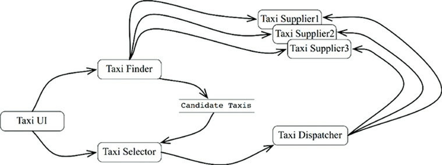
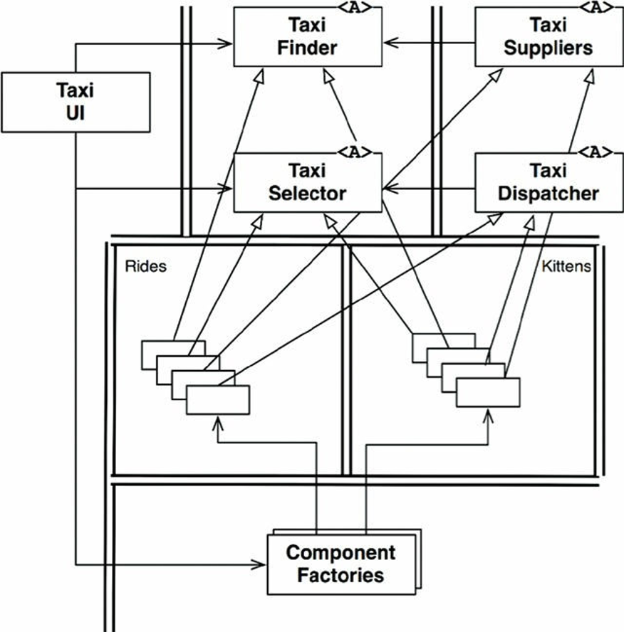
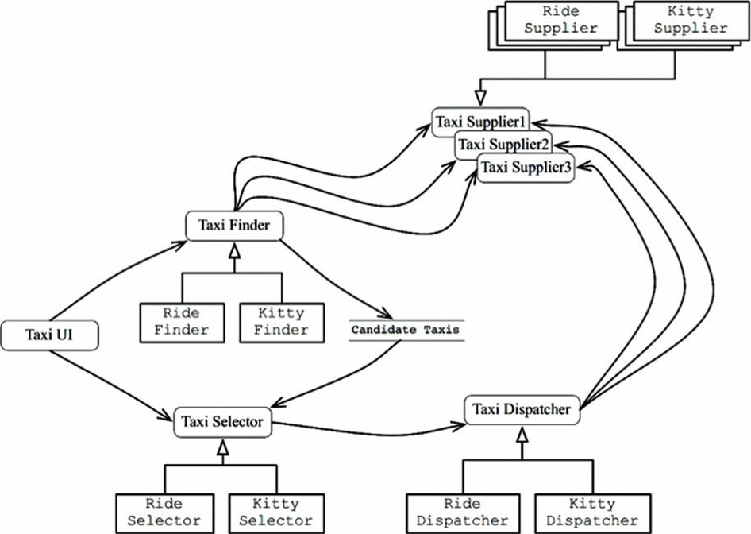

# Chapter 27 : Great and Small
---------------------

“Kiến trúc” hướng dịch vụ và “kiến trúc” micro-service đang trở nên rất phổ biến. Các lý do khiến chúng trở nên phổ biến hiện nay bao gồm:

- Các dịch vụ trở nên tách biệt rõ ràng với nhau. Nhưng như chúng ta sẽ thấy, điều này chỉ đúng một phần.
- Các dịch vụ xuất hiện để hỗ trợ việc phát triển và triển khai một cách độc lập. Lại một lần nữa, như chúng ta sẽ thấy, điều này cũng chỉ đúng một phần.

## Service architecture ?
Đầu tiên, hãy xem khái niệm rằng việc dùng các dịch vụ là một kiến trúc. Điều này rõ ràng là không đúng. Kiến trúc của một hệ thống được định nghĩa bởi các ranh giới phân tách chính sách cấp cao khỏi các chi tiết cấp thấp và tuân thủ Quy Tắc Phụ Thuộc. Các dịch vụ chỉ đơn giản phân tách các hành vi của ứng dụng tốn kém hơn một chút so với gọi hàm, và không nhất thiết có ý nghĩa lớn về mặt kiến trúc.

Điều này không có nghĩa là tất cả các dịch vụ phải có ý nghĩa về mặt kiến trúc. Việc tạo ra các dịch vụ để tách biệt các chức năng qua các process và các nền tảng thường có những lợi ích nhất định – dù chúng có tuân thủ Quy Tắc Phụ Thuộc hay không. Nhưng đó chỉ là những dịch vụ, bên trong và bản thân chúng, không xác định một kiến trúc.

Một ví dụ tương tự hữu ích là việc tổ chức của các hàm. Kiến trúc của một hệ thống nguyên khối hoặc dựa trên nền component được định nghĩa bởi các lời gọi hàm cụ thể qua các ranh giới kiến trúc và theo Quy Tắc Phụ Thuộc. Tuy nhiên, nhiều hàm khác trong các hệ thống này chỉ đơn giản tách biệt một hành vi khỏi những cái khác mà không có tầm quan trọng về kiến trúc.

Với các dịch vụ cũng vậy. Sau cùng, các dịch vụ chỉ là các lời gọi hàm vượt qua các ranh giới giữa các process và/hoặc giữa các nền tảng với nhau. Một số dịch vụ có tầm quan trọng về kiến trúc, và một số thì không. Điều chúng ta quan tâm tìm hiểu trong chương này là cái đầu tiên.

## Service benefits ?

Dấu hỏi ở tiêu đề phía trên biểu thị phần này sẽ thách thức niềm tin phổ biến hiện tại về kiến trúc dịch vụ. Chúng ta hãy xem xét từng lợi ích một.

### The decoupling fallcy ?
Một trong những lợi ích được mong muốn lớn nhất của việc chia một hệ thống thành các dịch vụ là các dịch vụ đó được tách rời mạnh khỏi nhau. Sau cùng, mỗi dịch vụ sẽ chạy trong một process khác nhau, hay thậm chí là một bộ vi xử lý khác nhau; do đó những dịch vụ đó sẽ không thể truy cập được biến của các dịch vụ khác. Hơn nữa, interface của mỗi dịch vụ phải được định nghĩa tốt.

Chắc chắn là có một số điều đúng về việc này – nhưng cũng không hẳn đúng lắm. Đúng là các dịch vụ được tách rời ở cấp các biến riêng lẻ. Tuy nhiên, chúng có thể vẫn bị gắn kết bởi các tài nguyên chia sẻ trong một bộ vi xử lý, hoặc trên một mạng máy tính. Hơn nữa, chúng vẫn bị gắn kết chặt chẽ bởi dữ liệu chúng chia sẻ.

Lấy ví dụ, nếu một trường mới được thêm vào một bản ghi dữ liệu được truyền giữa các dịch vụ, thì mỗi dịch vụ sử dụng trường mới đó phải được thay đổi. Các dịch vụ cũng phải nhất trí về việc biên dịch dữ liệu trong trường đó. Do vậy các dịch vụ này sẽ bị gắn kết chặt với bản ghi dữ liệu đó và do đó gián tiếp bị gắn kết với dữ liệu mà chúng chia sẻ.

Đối với các interface được định nghĩa tốt, thì lợi ích của việc tách rời chắc chắn là đúng – nhưng điều này cũng đúng đối với cả các hàm chức năng bình thường. Các interface dịch vụ không chặt chẽ hơn và cũng không được định nghĩa tốt hơn so với các interface hàm chức năng. Vậy thì rõ ràng, lợi ích này là một thứ gì đó viển vông.

### The fallacy of independent development and deployment
Một lợi ích được mong muốn khác của các dịch vụ là chúng có thể được quản lý và vận hành bởi một đội chuyên biệt. Đội phát triển có thể chịu trách nhiệm về việc viết, bảo trì, và vận hành dịch vụ như là một phần của chiến thuật dev-ops. Sự độc lập của việc phát triển và triển khai được coi là có thể mở rộng được. Mọi người tin rằng những hệ thống enterprise lớn có thể được tạo ra từ hàng tá, hàng trăm, hoặc thậm chí là hàng nghìn các dịch vụ có thể phát triển và triển khai độc lập với nhau. Việc phát triển, bảo trì, và vận hành của hệ thống có thể được phân chia giữa các đội phát triển độc lập với nhau.

Có một số điều đúng đối với niềm tin này – nhưng chỉ một số thôi. Đầu tiên, lịch sử đã chỉ ra rằng các hệ thống enterprise lớn có thể được xây dựng bằng các hệ thống nguyên khối và dựa trên nền tảng component cũng tốt như các hệ thống dựa trên nền dịch vụ. Do vậy các dịch vụ không phải là lựa chọn duy nhất để xây dựng các hệ thống có thể mở rộng được.

Thứ hai, ảo tưởng về việc tách rời nghĩa là các dịch vụ không thể luôn luôn được phát triển, triển khai, và vận hành một cách độc lập. Mở rộng ra thì chúng sẽ bị gắn kết với nhau bởi dữ liệu hoặc hành vi, việc phát triển, triển khai, và vận hành vẫn phải được phối hợp với nhau.

## The Kitty problem
Một ví dụ về hai ảo tưởng này, chúng ta hãy xem hệ thống tập hợp taxi của chúng ta một lần nữa. Hãy nhớ rằng, hệ thống này biết được nhiều nhà cung cấp taxi trong một thành phố, và cho phép các khách hàng đặt xe. Chúng ta hãy coi các khách hàng lựa chọn taxi dựa trên một số điều kiện, như thời gian lên xe, giá, độ sang trọng, và kinh nghiệm của lái xe.

Chúng ta muốn hệ thống của chúng ta có thể mở rộng được, vì vậy chúng ta chọn xây dựng nó với rất nhiều các micro-service nhỏ. Chúng ta chia nhỏ phòng phát triển ra thành nhiều đội nhỏ, mỗi đội chịu trách nhiệm để phát triển, bảo trì, và vận hành một số lượng nhỏ các dịch vụ tương ứng[1].

Biểu đồ trong Hình 27.1 chỉ ra cách các kiến trúc sư hư cấu của chúng ta sắp xếp các dịch vụ để triển khai ứng dụng này. Dịch vụ `TaxiUI` xử lý với các khách hàng, những người dùng các thiết bị di động để đặt taxi. Dịch vụ `TaxiFinder` kiểm tra trong kho các `TaxiSuppliers` khác nhau và xác định xem taxi nào là ứng viên có thể cho người dùng. Nó lưu những thứ này vào trong một bản ghi dữ liệu ngắn hạn gắn với người dùng đó. Dịch vụ TaxiSelector lấy các tiêu chuẩn của người dùng về giá, thời gian, độ sang trọng.v.v. để chọn một taxi thích hợp trong số những ứng viên. Nó chuyển taxi đó cho dịch vụ `TaxiDispatcher` để gọi chiếc taxi phù hợp đó.

Bây giờ chúng ta hãy xem hệ thống này đã được vận hành hơn một năm. Bộ phận lập trình viên của chúng ta đang hạnh phúc phát triển các chức năng mới trong khi bảo trì và vận hành tất cả các dịch vụ này.

Đến một ngày đẹp trời, phòng marketing họp với đội phát triển. Trong cuộc họp này, họ thông báo kế hoạch của họ về việc mở dịch vụ chuyển phát mèo con trong thành phố. Người dùng có thể đặt các chú mèo con để chuyển tới nhà họ hoặc tới nơi làm việc của họ.

Công ty sẽ thiết lập vài điểm tập kết mèo con quanh thành phố. Khi một chú mèo được đặt, thì một taxi gần đó sẽ được lựa chọn để lấy một chú mèo từ một trong những điểm tập kết đó, và sau đó chuyển nó tới địa chỉ thích hợp.

Một trong những hãng taxi đồng ý tham gia chương trình này. Một số khác cũng đồng ý theo. Một số khác thì có thể từ chối.

Dĩ nhiên, một số lái xe có thể bị dị ứng với mèo, vì vậy những lái xe này sẽ không bao giờ được lựa chọn cho dịch vụ này. Cũng vậy, một số khách hàng có dị ứng tương tự, vì vậy một taxi đã được dùng để chuyển phát mèo trong vòng 3 ngày gần đây thì sẽ không được lựa chọn để chở những khách hàng mà họ khai báo là bị dị ứng như vậy.

Nhìn vào biểu đồ các dịch vụ. Bao nhiêu dịch vụ này sẽ phải thay đổi để triển khai chức năng này? Tất cả. Rõ ràng, việc phát triển và triển khai chức năng mèo con sẽ phải phối hợp rất cẩn thận.

Nói cách khác, tất cả các dịch vụ bị gắn kết với nhau, và không thể được phát triển, triển khai, và bảo trì một cách độc lập.

Đây là vấn đề với những mối quan tâm xuyên suốt. Mọi hệ thống phần mềm đều phải đối mặt với vấn đề này, dù có phải là hướng dịch vụ hay không. Việc phân tách chức năng như được mô tả trong biểu đồ dịch vụ trong hình trên, là rất dễ chịu ảnh hưởng bởi các chức năng mới, thứ mà sẽ đi qua tất cả các hành vi chức năng này.

## Objects to the resuse
Chúng ta giải quyết vấn đề này trong một kiến trúc nền component như thế nào? Xem xét cẩn thận các nguyên lý thiết kế SOLID đã thúc đẩy chúng ta tạo một bộ các lớp mà có thể mở rộng đa hình để xử lý các chức năng mới.

Biểu đồ trong hình dưới đây chỉ ra chiến thuật này. Các lớp trong biểu đồ này tương ứng với các dịch vụ chỉ ra trong hình trước đó. Tuy nhiên, bạn hãy lưu ý về các ranh giới và cả các phụ thuộc theo Quy Tắc Phụ Thuộc.

Rất nhiều logic của các dịch vụ ban đầu được bảo toàn trong các lớp cơ sở của model đối tượng. Tuy nhiên, một phần logic đó được dành riêng cho chở khách đã được trích xuất vào trong component Rides. Chức năng mới về việc chuyển mèo con được đặt vào trong component Kitten. Hai component này ghi đè lên các lớp cơ sở trong component gốc bằng cách dùng mẫu thiết kế như Template Method hoặc Strategy.

Lưu ý lần nữa là hai component mới, Rides và Kittens, tuân theo Quy Tắc Phụ Thuộc. Cũng lưu ý về các lớp để triển khai các chức năng này được tạo bởi các factory dưới sự kiểm soát của UI.

Rõ ràng, trong sơ đồ này, khi chức năng Mèo con được triển khai, TaxiUI buộc phải thay đổi. Nhưng ngoài ra không còn phải thay đổi gì cả. Chỉ cần một file jar mới, hoặc Gem, hoặc DLL thêm vào hệ thống và được nạp động lúc đang chạy runtime.

Nhờ vậy mà chức năng Mèo con đã được tách rời, và có thể phát triển và triển khai độc lập.

## Component-based services
Câu hỏi hiển nhiên là: Chúng ta có thể làm như vậy với các dịch vụ không? Và câu trả lời là dĩ nhiên: Có chứ! Các dịch vụ không nhất thiết phải là những nguyên khối nhỏ. Thay vào đó, các dịch vụ có thể được thiết kế dùng các nguyên lý SOLID, và dùng một cấu trúc component sao cho các component mới có thể được thêm vào chúng mà không làm thay đổi các component đang tồn tại nằm trong dịch vụ đó.

Hãy nghĩ một dịch vụ trong Java là một tập các lớp trừu tượng trong một hoặc nhiều file jar. Hãy nghĩ mỗi chức năng mới hoặc mở rộng chức năng như một file jar khác bao gồm nhiều lớp mở rộng các lớp trừu tượng trong các file jar đầu tiên. Sau đó, việc triển khai một chức năng mới sẽ không còn trở thành vấn đề về việc triển khai lại các dịch vụ, mà chỉ đơn giản là vấn đề thêm các file jar mới để nạp các đường dẫn của các dịch vụ này. Nói cách khác, việc thêm chức năng mới tuân thủ Nguyên Lý Mở-Đóng.

Biểu đồ dịch vụ trong hình dưới đây chỉ ra cấu trúc này. Các dịch vụ vẫn tồn tại như trước đây, nhưng mỗi cái có một thiết kế component bên trong riêng, cho phép các chức năng mới được thêm vào như là những lớp kế thừa mới. Những lớp kế thừa này tồn tại trong các component của chính chúng:

## Conclusion

Các dịch vụ có lợi ích về khả năng mở rộng và khả năng phát triển của một hệ thống, nhưng bản thân chúng lại không phải là các thành phần quan trọng về kiến trúc. Kiến trúc của một hệ thống được định nghĩa bởi các ranh giới vẽ trong hệ thống đó, và bởi các phụ thuộc cắt qua những ranh giới đó. Kiến trúc đó không được định nghĩa bởi các cơ chế vật lý mà bởi các thành phần liên lạc và thực thi.

Một dịch vụ có thể là một component đơn, được bao quanh hoàn toàn bởi một ranh giới kiến trúc. Ngoài ra, một dịch vụ cũng có thể là hợp thành của một vài component được tách biệt bởi các ranh giới kiến trúc. Trong các trường hợp hiếm gặp, các client và các dịch vụ cũng có thể bị gắn kết đến mức không còn ý nghĩa về mặt kiến trúc gì cả.

