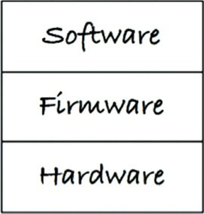
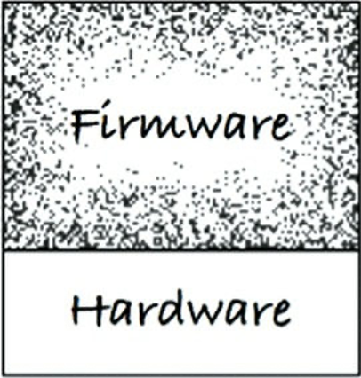
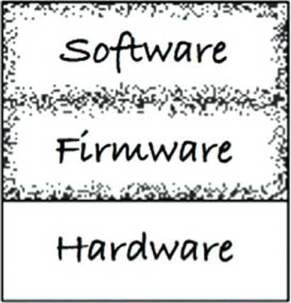
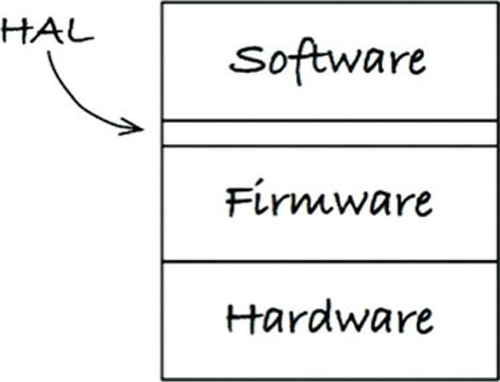
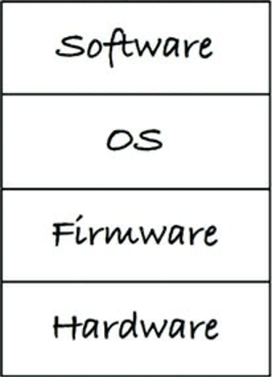
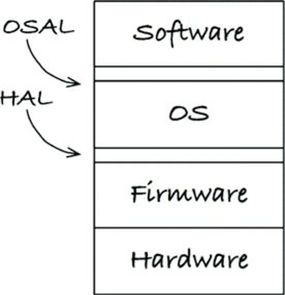

# Chapter 29 : Clean embedded architecture
----------------------

Cách đây ít lâu tôi đã đọc một bài viết có tiêu đề “Tầm quan trọng ngày càng lớn của việc duy trì phần mềm đối với DoD” trên trang blog của Doug Schmidt. Doug đã khẳng định như sau:

> "“Mặc dù phần mềm không bị hao mòn, nhưng firmware[2] và phần cứng sẽ trở nên lỗi thời, do đó sẽ luôn cần phải sửa đổi phần mềm" - "Although software does not wear out, firmware and hardware become obsolete, thereby requiring software modifications"

Đó là khoảnh khắc bừng sáng đối với tôi. Doug đã đề cập đến hai khái niệm mà tôi đã nghĩ đó là điều hiển nhiên – nhưng có lẽ là không. Phần mềm là thứ có thời gian sử dụng lâu dài, nhưng firmware sẽ trở nên lỗi thời khi phần cứng phát triển. Nếu bạn đã từng dành thời gian phát triển các hệ thống nhúng, thì bạn biết rằng phần cứng liên tục được phát triển và cải tiến. Cùng lúc đó, các chức năng được thêm vào “phần mềm” mới, và nó tiếp tục gia tăng về mức độ phức tạp.

Tôi muốn thêm vào lời phát biểu của Doug:

> "Mặc dù phần mềm không bị hao mòn, nhưng nó có thể bị hủy hoại bởi những phụ thuộc không kiểm soát trên firmware và phần cứng." - Although software does not ware out, it can be destroyed from within by unmanaged dependencies on firmware and hardware.

Tôi thích định nghĩa về firmware của Doug, nhưng chúng ta hay xem những định nghĩa khác đang có. Tôi đã tìm thấy được những định nghĩa này:

- “Firmware được lưu giữ trong các thiết bị nhớ không bị mất (non-volatile) như bộ nhớ ROM, EPROM, hoặc flash.” (https://en.wikipedia.org/wiki/Firmware)
- “Firmware là một chương trình phần mềm hoặc một bộ các câu lệnh được lập trình trên một thiết bị phần cứng.” (https://techterms.com/definition/firmware)
- “Firmware là phần mềm được nhúng vào trong một thiết bị phần cứng.” (https://www.lifewire.com/what-is-firmware-2625881)
- “Firmware là phần mềm (chương trình hoặc dữ liệu) được ghi vào bộ nhớ chỉ đọc (ROM).” (http://www.webopedia.com/TERM/F/firmware.html)


Lời phát biểu của Doug làm tôi nhận ra những định nghĩa được chấp nhận này về firmware là sai hoặc ít nhất là đã lỗi thời. Firmware không có nghĩa là code nằm trong ROM. Nó không phải là firmware bởi nơi mà nó được lưu trữ; đúng hơn, nó là firmware bởi vì cái nó phụ thuộc vào và nó thay đổi khó thế nào khi phần cứng phát triển. Phần cứng phát triển (dừng lại và nhìn vào chiếc điện thoại của bạn làm minh chứng), vì vậy chúng ta phải cấu trúc code nhúng của chúng ta với thực tế đó trong tâm trí.

Tôi không có gì phải chống lại firmware, hoặc các kỹ sư firmware (tôi đã từng tự mình viết một vài firmware). Nhưng những gì chúng ta thực sự cần là ít firmware hơn và nhiều software hơn. Thực tế là tôi lấy làm thất vọng vì các kỹ sư firmware viết quá nhiều firmware!

Các kỹ sư không lập trình nhúng (non-embedded) cũng viết firmware! Bạn, các lập trình viên không lập trình nhúng về cơ bản là đang viết firmware mỗi khi bạn sử dụng SQL trong code của bạn hoặc khi bạn dàn trải các phụ thuộc vào nền tảng trên code của bạn. Các lập trình viên ứng dụng Android viết firmware khi họ không tách biệt quy tắc nghiệp vụ của họ khỏi Android API.

Tôi đã từng tham gia vào nhiều nỗ lực nơi mà ranh giới giữa code sản phẩm (phần mềm) và code tương tác với phần cứng của sản phẩm (firmware) mờ nhạt tới mức gần như không tồn tại. Lấy ví dụ, vào cuối những năm 1990, tôi đã rất vui khi giúp thiết kế lại một hệ thống liên lạc chuyển đổi từ việc ghép kênh phân chia theo thời gian (time-division multiplexing – TDM) sang thoại qua IP (voice over IP – VOIP). VOIP là cách được sử dụng bây giờ, nhưng TDM được xem là đỉnh cao vào những năm 1950 và 1960, và được triển khai rộng rãi trong những năm 1980 và 1990.

Bất cứ khi nào chúng ta có một câu hỏi dành cho kỹ sư những hệ thống này về cách một cuộc gọi cần phản ứng với một tình huống nhất định, anh ta sẽ biến mất và xuất hiện một lúc sau với một câu trả lời rất chi tiết. “Anh lấy câu trả lời đó ở đâu vậy?” chúng tôi hỏi. “Từ code của sản phẩm hiện giờ,” anh ta trả lời. Code cũ rối mù là thông số kỹ thuật của sản phẩm mới! Code triển khai hiện tại không có sự tách biệt giữa TDM và quy tắc nghiệp vụ khi thực hiện cuộc gọi. Toàn bộ sản phẩm bị phụ thuộc vào phần cứng/công nghệ từ đầu cho tới cuối và không thể được tháo gỡ. Toàn bộ sản phẩm về cơ bản trở thành firmware.

Hãy xem một ví dụ khác: Các gói tin lệnh tới hệ thống này thông qua cổng serial. Không ngạc nhiên khi ở đó có một bộ xử lý/phân phát gói tin. Bộ xử lý gói tin biết về định dạng của các gói tin, có thể phân tích chúng, và sau đó có thể phân phát gói tin tới code để xử lý yêu cầu. Không gì trong những thứ này đáng ngạc nhiên, ngoại trừ bộ xử lý/phân phát gói tin nằm trong cùng một file với code tương tác với phần cứng UART. Bộ xử lý gói tin bị vấy bẩn với các chi tiết về UART. Bộ xử lý gói tin có thể là phần mềm với một vòng đời hữu dụng lâu dài, nhưng thay vào đó nó lại là firmware. Bộ xử lý gói tin đó đã bị từ chối cơ hội để trở thành phần mềm – và điều này là không đúng!

Tôi đã biết và hiểu việc cần phải tách biệt phần mềm khỏi phần cứng từ lâu, nhưng các từ của Doug đã làm rõ cách dùng khái niệm phần mềm và firmware trong mối liên hệ với những cái khác.

Đối với các kỹ sư và lập trình viên, thông điệp này rất rõ ràng: Hãy ngừng viết quá nhiều firmware và cho code của các bạn một cơ hội có một vòng đời hữu ích lâu dài. Dĩ nhiên, chỉ đòi hỏi nó sẽ không biến nó thành hiện thực. Chúng ta hãy nhìn xem cách bạn có thể duy trì được kiến trúc phần mềm nhúng tinh gọn để cho phần mềm một cơ hội chiến đấu để có được một vòng đời hữu ích lâu dài.

## App-titude test
Tại sao quá nhiều phần mềm nhúng tiềm năng lại trở thành firmware? Dường như phần lớn tập trung vào việc làm cho mã nhúng hoạt động, và ít tập trung hơn nhiều vào việc cấu trúc nó để có được một vòng đời hữu ích lâu dài. Kent Beck mô tả ba hoạt động trong việc xây dựng phần mềm (văn bản trong ngoặc là từ của Kent và từ nghiêng là bình luận của tôi):

- “Đầu tiên hãy làm cho nó hoạt động.” Sẽ chả có ý nghĩa gì nếu nó không hoạt động.
- “Sau đó hãy làm nó đúng.” Refactor code sao cho bạn và người khác có thể hiểu và phát triển nó khi cần thay đổi hoặc hiểu nó rõ hơn.
- “Sau đó hãy làm nó nhanh.” Refactor code để đạt được hiệu năng “cần thiết”.

Nhiều phần mềm hệ thống nhúng mà tôi đã thấy dường như chỉ được viết để “Làm cho nó hoạt động” trong đầu – và cũng có lẽ với ám ảnh về mục tiêu “Làm cho nó nhanh”, đạt được bằng cách thêm những tối ưu siêu nhỏ bất cứ khi có cơ hội. Trong cuốn The Mythical Man-Month (tạm dịch Thần thoại số người một tháng), Fred Brooks đề nghị chúng ta “lập kế hoạch để vứt đi.” Kent và Fred đã đưa ra gần như một lời khuyên giống nhau: Tìm hiểu những gì hoạt động, rồi sau đó tạo ra một giải pháp tốt hơn.

Phần mềm nhúng không phải đặc biệt khi nó đụng phải những vấn đề này. Phần lớn các ứng dụng không nhúng được xây dựng chỉ để làm việc, và rất ít quan tâm tới việc làm sao cho code được lập trình một cách đúng đắn để có một tuổi thọ hữu dụng lâu dài.

Làm cho một ứng dụng hoạt động là cái mà tôi gọi là kiểm tra App-titude đối với một lập trình viên. Các lập trình viên, dù là lập trình nhúng hay không, những người chỉ quan tâm bản thân họ có làm cho ứng dụng của họ hoạt động được hay không, đang làm cho sản phẩm của họ và những người thuê họ như bị chơi khăm. Có nhiều thứ để làm hơn là chỉ để cho một ứng dụng hoạt động được.

Một ví dụ về code được tạo ra trong khi vượt qua được bài kiểm tra App-titude, kiểm tra những hàm này được đặt trong một file của một hệ thống nhúng nhỏ:

```
ISR(TIMER1_vect) { ... }
ISR(INT2_vect) { ... }
void btn_Handler(void) { ... }
float calc_RPM(void) { ... }
static char Read_RawData(void) { ... } void Do_Average(void) { ... }
void Get_Next_Measurement(void) { ... } void Zero_Sensor_1(void) { ... }
void Zero_Sensor_2(void) { ... }
void Dev_Control(char Activation) { ... } char Load_FLASH_Setup(void) { ... }
void Save_FLASH_Setup(void) { ... }
void Store_DataSet(void) { ... }

float bytes2float(char bytes[4]) { ... } void Recall_DataSet(void) { ... }
void Sensor_init(void) { ... }
void uC_Sleep(void) { ... }
```

Danh sách các hàm theo thứ tự tôi thấy chúng trong file mã nguồn. Bây giờ, tôi sẽ tách biệt chúng và nhóm chúng theo vấn đề:

- Các hàm có logic nghiệp vụ:
    ```
    float calc_RPM(void) { ... }
    void Do_Average(void) { ... }
    void Get_Next_Measurement(void) { ... } void Zero_Sensor_1(void) { ... }
    void Zero_Sensor_2(void) { ... }
    ```
- Các hàm thiết lập nền tảng phần cứng
    ```
    ISR(TIMER1_vect) { ... }*
    ISR(INT2_vect) { ... }
    void uC_Sleep(void) { ... }
    Các hàm xử lý khi ấn nút on off void btn_Handler(void) { ... }
    void Dev_Control(char Activation) { ... }
    ```
- Các hàm lưu giá trị vào thiết bị lưu trữ vĩnh viễn:
    ```
    char Load_FLASH_Setup(void) { ... }

    void Save_FLASH_Setup(void) { ... }

    void Store_DataSet(void) { ... }
    float bytes2float(char bytes[4]) { ... }

    void Recall_DataSet(void) { ... }
    ```
- Các hàm không liên quan gì đến tên của nó
    ```
    void Sensor_init(void) {...}
    ```
Nhìn vào một số file khác trong ứng dụng này, tôi tìm thấy nhiều trở ngại để hiểu được code. Tôi cũng tìm thấy một file cấu trúc ám chỉ rằng cách duy nhất để kiểm tra bất cứ phần code nào là phải chạy trong hệ thống nhúng mục tiêu. Gần như mọi bit trong chỗ code này đều biết nó nằm trong một kiến trúc vi xử lý đặc biệt, dùng cấu trúc[4] C “mở rộng” để gắn code vào một bộ công cụ và vi xử lý cụ thể. Không có cách nào có thể làm cho chỗ code này có được một vòng đời hữu dụng lâu dài trừ khi sản phẩm này không bao giờ được chuyển sang một môi trường phần cứng khác.

Ứng dụng này hoạt động: Kỹ sư đã vượt qua bài kiểm tra App-titude. Nhưng ứng dụng không thể nói là có một kiến trúc nhúng tinh gọn được.

## The target-hardware bottleneck

Có nhiều vấn đề đặc biệt đối với các lập trình viên nhúng phải xử lý mà những lập trình viên không nhúng không phải làm – lấy ví dụ, không gian nhớ bị giới hạn, các ràng buộc và deadline thời gian thực, IO bị giới hạn, các interface không thuận tiện, và các cảm biến và kết nối tới thế giới thực. Phần lớn thời gian thì phần cứng được phát triển đồng thời với phần mềm và firmware. Khi một kỹ sư phát triển code cho loại hệ thống này, bạn có thể không có nơi nào để chạy thử code. Thậm chí có thể còn tệ hơn khi bạn nhận được phần cứng thì nhiều khả năng phần cứng đó sẽ có lỗi của chính nó, làm cho tiến độ phát triển phần mềm trở nên còn chậm hơn so với bình thường.

Vâng, hệ thống nhúng rất đặc biệt. Các kỹ sư nhúng rất đặc biệt. Nhưng việc phát triển hệ thống nhúng không đặc biệt đến mức các nguyên lý trong cuốn sách này không áp dụng được cho các hệ thống nhúng.

Một trong những vấn đề nhúng đặc biệt đó là tắc nghẽn phần cứng. Khi code nhúng được cấu trúc mà không áp dụng các nguyên lý kiến trúc tinh gọn và các kinh nghiệm thực tiễn, thì bạn sẽ thường phải đối mặt với kịch bản là bạn chỉ có thể kiểm tra code của bạn trên hệ thống mục tiêu. Nếu hệ thống mục tiêu là nơi duy nhất để thực hiện được việc kiểm tra, thì việc tắc nghẽn phần cứng mục tiêu sẽ làm bạn chậm lại.

### A Clean embedded architecture is a testable embedded architecture

Chúng ta hãy xem cách để áp dụng một số nguyên lý kiến trúc vào phần mềm và firmware hệ thống nhúng để giúp bạn loại bỏ được tắc nghẽn phần cứng mục tiêu này.

#### Layers 
Việc phân layer (lớp) có thể có nhiều cách. Chúng ta hãy bắt đầu với ba layer, như thấy trong Hình 29.1. Dưới cùng đó là phần cứng. Như Doug đã cảnh báo chúng ta, bởi công nghệ tiến bộ và định luật Moore, phần cứng sẽ thay đổi. Các linh kiện sẽ trở nên lỗi thời, và linh kiện mới dùng ít năng lượng hơn hoặc cung cấp hiệu năng tốt hơn hoặc rẻ hơn sẽ thay thế. Cho dù với bất cứ nguyên nhân nào, với vai trò một kỹ sư nhúng, tôi không muốn phải có một công việc đồ sộ nhiều hơn cần thiết khi việc cuối cùng thì phần cứng cũng sẽ không tránh khỏi việc phải thay đổi.




Việc tách biệt giữa phần cứng và phần còn lại của hệ thống được đưa ra ít nhất là một layer khi phần cứng đã được xác định trong hình dưới đây. Ở đây là nơi các vấn đề thường bắt đầu khi bạn có gắng vượt qua bài kiểm tra App-titude. Không gì ngăn các kiến thức chi tiết về phần cứng lan tràn khắp nơi trong code. Nếu bạn không cẩn thận về nơi bạn đặt các thứ và xác định module nào được cho phép biết về module khác, thì code của bạn sẽ rất khó để thay đổi. Tôi không chỉ nói về khi phần cứng thay đổi, mà còn cả khi người dùng đề nghị một sự thay đổi, hoặc khi một bug cần được sửa.



Việc trộn lẫn phần mềm và firmware với nhau là một anti-pattern (mẫu thiết kế xấu). Code theo mẫu này sẽ rất khó để thay đổi. Thêm vào đó, việc thay đổi cũng sẽ nguy hiểm, thường dẫn đến những hậu quả không mong muốn. Các bài kiểm tra hồi quy toàn bộ hệ thống sẽ cần phải có dù chỉ với những thay đổi nhỏ. Nếu bạn không tạo ra các bài kiểm tra tự động bên ngoài, chấp nhận nhàm chán với các bài kiểm tra thủ công, thì sau đó bạn có thể sẽ thấy xuất hiện các báo cáo bug mới.


#### The Hardware is a detail
Đường giữa phần mềm và firmware thường không được định nghĩa tốt như đường giữa code và phần cứng, như thấy ở hình dưới đây:



Một trong những công việc của bạn với vai trò là một lập trình viên phần mềm nhúng là làm rõ đường này. Tên của đường ranh giới giữa phần mềm và firmware là lớp trừu tượng phần cứng (Hardware Astraction Layer – HAL) (như trong hình dưới đây). Đây không phải là một ý tưởng mới: Nó đã có ở trên những chiếc PC từ những ngày trước khi có hệ điều hành Windows.



HAL tồn tại để phần mềm nằm bên trên nó, và API của nó cần được cắt tỉa cho phù hợp với nhu cầu của phần mềm. Lấy ví dụ, firmware có thể lưu trữ byte và các dãy byte trong bộ nhớ flash. Ngược lại, ứng dụng cần lưu trữ và đọc cặp tên/giá trị vào cơ chế lưu trữ bền vững nào đó. Phần mềm không cần quan tâm tới việc các cặp tên/giá trị được lưu trữ trong bộ nhớ flash, ổ đĩa cứng, trên đám mây, hoặc bộ nhớ trong nhân (core memory). HAL cung cấp một dịch vụ, và nó không phơi bày cho phần mềm biết về cách nó thực hiện. Việc triển khai flash là một chi tiết cần phải ẩn khỏi phần mềm.

Lấy ví dụ khác, một LED gắn với một bit GPIO. Firmware có thể cung cấp truy cập tới các bit GPIO, nơi mà HAL có thể cung cấp một API `Led_TurnOn(5)`. Đó là một lớp trừu tượng phần cứng ở cấp khá thấp. Chúng ta hãy xem việc nâng cấp trừu tượng từ góc độ phần cứng sang góc độ phần mềm/sản phẩm. LED thể hiện cái gì? Cho là nó thể hiện mức năng lượng thấp. Ở một mức nào đó, firmware (hoặc một gói hỗ trợ bo mạch) có thể cung cấp `Led_TurnOn(5)`, trong khi đó HAL cung cấp `Indicate_LowBattery()`. Bạn có thể thấy HAL diễn tả các dịch vụ được ứng dụng cần. Bạn cũng có thể thấy các layer đó có thể bao gồm nhiều layer nữa. Nó giống một mẫu thiết kế lặp lại hơn là một tập giới hạn các layer được định nghĩa trước. Việc gán các GPIO là các chi tiết cần phải được ẩn giấu khỏi phần mềm.


### Don't reveal hardware details to the user of the hal
Phần mềm của kiến trúc nhúng tinh gọn có thể kiểm tra được mà không cần có phần cứng mục tiêu. Một HAL thành công cung cấp đường nối hoặc tập hợp các điểm thay thế để tạo điều kiện cho việc thử nghiệm mà không cần phần cứng mục tiêu

#### The processor is a detail
Khi ứng dụng nhúng dùng một bộ công cụ đặc biêt, nó thường cung cấp các file header để <i>giúp bạn</i>[5]. Các trình biên dịch này thường tự do với ngôn ngữ C, thêm các từ khóa mới để truy cập các chức năng bộ vi xử lý của họ. Code trông giống như C, nhưng nó không phải là C thuần túy.

Đôi khi các trình biên dịch C được nhà sản xuất cung cấp thứ trông như các biến toàn cục để truy cập trực tiếp vào các thanh ghi bộ vi xử lý, các cổng IO, các bộ định thời đồng hồ, các bit IO, các bộ điều khiển ngắt, và các hàm vi xử lý khác. Việc truy cập được những thứ này một cách dễ dàng là điều hữu ích, nhưng hãy nhận ra rằng bất cứ đoạn code nào của bạn dùng những công cụ thuận tiện này sẽ không còn là ngôn ngữ C nữa. Nó sẽ không biên dịch được cho các bộ vi xử lý khác, hoặc có thể thậm chí với một trình biên dịch khác cho cùng một bộ vi xử lý.

Tôi ghét phải nghĩ rằng nhà cung cấp công cụ và vi mạch đang tỏ ra yếm thế, gắn chặt sản phẩm của họ với trình biên dịch đó. Chúng ta hãy cứ coi như đó là họ đang cố gắng giúp các kỹ sư nhúng được thuận tiện. Nhưng bây giờ đến lượt bạn phải sử dụng sự trợ giúp đó theo cách mà giúp bạn sẽ không bị ảnh hưởng trong tương lai. Bạn sẽ phải giới hạn những file nào được cho phép để biết về các phần mở rộng ngôn ngữ C đó.

Chúng ta hãy nhìn vào file header này được thiết kế cho dòng ACME của DSP – bạn biết đấy, cái được dùng bởi Wile E. Coyote:

```
#ifndef _ACME_STD_TYPES

#define _ACME_STD_TYPES

#if defined(_ACME_X42)
    typedef unsigned int	Uint_32;
    typedef unsigned short	Uint_16;
    typedef unsigned char	Uint_8;

    typedef int	Int_32;
    typedef short	Int_16;
    typedef char	Int_8;

#elif defined(_ACME_A42)
    typedef unsigned long	Uint_32;
    typedef unsigned int	Uint_16;
    typedef unsigned char	Uint_8;

    typedef long	Int_32;
    typedef int	Int_16;
    typedef char	Int_8;
#else 
    #error <acmetypes.h> is not suppperted for this environment
#endif

#endif
```

File header `acmetypes.h` không nên sử dụng trực tiếp. Nếu làm như vậy, code của bạn sẽ bị gắn chặt vào một trong những ACME DSP. Bạn nói rằng bạn đang dùng một ACME DSP, vậy thì cái gì gây hại nhỉ? Bạn không thể biên dịch code của bạn trừ khi bạn thêm vào header này. Nếu bạn dùng header này và định nghĩa `__ACME_X42` hoặc `__ACME_A42`, thì số nguyên của bạn sẽ bị sai kích thước nếu bạn thử kiểm tra code của bạn ngoài hệ thống mục thiêu. Tệ hơn nữa, một ngày bạn sẽ muốn chuyển ứng dụng của bạn sang một vi xử lý khác, và bạn sẽ làm cho nhiệm vụ đó khó hơn rất nhiều bằng việc không lựa chọn khả năng chuyển đổi nền tảng (portability) và việc không giới hạn những file nào biết về ACME.

Thay vì dùng `acmetypes.h`, bạn nên cố gắng bám theo con đường tiêu chuẩn hóa hơn và dùng stdint.h. Nhưng nếu trình biên dịch mục tiêu không cung cấp stdint.h thì sao? Bạn có thể viết file header này. File stdint.h bạn viết cho hệ thống mục tiêu sẽ sử dụng file `acmetypes.h` để biên dịch được trông như sau:

```
#ifndef _STDINT_H_

#define _STDINT_H_

#include <acmetypes.h>

typedef Uint_32 uint32_t;
typedef Uint_16 uint16_t;
typedef Uint_8  uint8_t;

typedef Int_32  int32_t;
typedef Int_16  int16_t;
typedef Int_8   int8_t;

#endif
```
Hệ thống phần mềm nhúng và firmware của bạn sẽ sử dụng stdint.h để giúp cho code của bạn được sạch sẽ và có thể port sang nền tảng khác được. Nhất định, tất cả phần mềm phải được độc lập với bộ vi xử lý, nhưng không phải tất cả firmware đều có thể thế được. Đoạn code tiếp theo lấy lợi thế của các mở rộng của ngôn ngữ C để cho phép code truy cập vào các thiết bị ngoại vi trong bộ vi điều khiển này. Nó giống như sản phẩm của bạn dùng bộ vi điều khiển này để bạn có thể dùng các thiết bị ngoại vi tích hợp của nó. Hàm này xuất ra một dòng nói “hi” tới cổng đầu ra serial. (Ví dụ này dựa trên một code thực tế bên ngoài.)

```
void say_hi() {
    IE = 0b11000000;
 	SBUF0 = (0x68);
 	while(TI_0 == 0);
 	TI_0 = 0; 
 	SBUF0 = (0x69);
 	while(TI_0 == 0);
 	TI_0 = 0;
 	SBUF0 = (0x0a);
 	while(TI_0 == 0);
 	TI_0 = 0;
 	SBUF0 = (0x0d);
 	while(TI_0 == 0);
 	TI_0 = 0;
 	IE = 0b11010000;
}
```

Có rất nhiều vấn đề trong hàm nhỏ này. Một thứ có thể đập ngay vào mắt bạn là sự xuất hiện của `0b11000000`. Việc biểu diễn số nhị phân như thế này thật hay; C có thể làm như vậy không? Không may là không. Một vài vấn đề khác liên quan tới việc đoạn code này trực tiếp dùng các chức năng mở rộng của C:

- IE: các bit cho phép ngắt.
- SBUF0: Bộ nhớ đệm đầu ra serial.
- TI_0: Ngắt xóa bộ nhớ đệm truyền serial. Đọc thấy bằng 1 nghĩa là bộ nhớ đệm rỗng.

Các biến viết hoa thực tế truy cập các thiết bị ngoại vi gắn trong của vi điều khiển. Nếu bạn muốn điều khiển các ngắt và các ký tự đầu ra, bạn phải dùng những thiết bị ngoại vi này. Đúng là nó thuận tiện thật – nhưng nó không phải là ngôn ngữ C.

Một kiến trúc nhúng sạch sẽ dùng những thanh ghi truy cập thiết bị này một cách trực tiếp ở rất ít vị trí và giam chúng hoàn toàn trong firmware. Bất cứ thứ gì biết về những thanh ghi này sẽ trở thành firmware và hệ quả là nó sẽ bị gắn chặt với phần cứng. Việc gắn chặt code với bộ vi xử lý sẽ làm bạn đau đớn khi bạn muốn kiểm tra code hoạt động trước khi bạn có được phần cứng ổn định. Nó cũng sẽ làm bạn đau đớn khi bạn di chuyển ứng dụng nhúng của bạn sang một bộ vi xử lý mới.

Nếu bạn dùng một vi điều khiển như thế này, firmware của bạn có thể tách biệt các hàm cấp thấp với dạng nào đó của một lớp trừu tượng vi xử lý (Processor Abstraction Layer – PAL). Firmware phía trên layer PAL có thể được kiểm tra mà không cần vi xử lý thực, điều này sẽ làm cho nó trở nên ít “rắn” hơn.

#### The operating system is a detail
HAL cần thiết, nhưng liệu nó đã đủ chưa? Trong các hệ thống nhúng thuần, HAL có thể là tất cả những gì bạn cần để giữ cho code của bạn khỏi bị dính líu quá tới môi trường vận hành. Nhưng với những hệ thống nhúng dùng một hệ điều hành thời gian thực (RTOS) hay một vài phiên bản nhúng của Linux hoặc Windows thì sao?

Để code nhúng của bạn có cơ hội được sử dụng lâu dài, thì bạn phải đối xử với hệ điều hành đó như là một chi tiết và bảo vệ code của bạn khỏi phụ thuộc vào hệ điều hành (Operation System – OS).

Phần mềm truy cập vào các dịch vụ của môi trường vận hành thông qua OS. OS là lớp tách biệt phần mềm khỏi firmware (Hình 29.5). Dùng các chức năng của OS trực tiếp có thể gây ra nhiều vấn đề. Lấy ví dụ, điều gì xảy ra nếu nhà cung cấp RTOS của bạn bị thôn tính bởi một công ty khác mà tiền phí thì tăng lên, còn chất lượng thì đi xuống? Điều gì xảy ra nếu nhu cầu của bạn thay đổi và RTOS của bạn không còn có những khả năng mà bây giờ bạn đang yêu cầu? Bạn sẽ phải thay đổi code rất nhiều. Điều này không chỉ là những thay đổi cú pháp đơn giản do API của OS mới, mà sẽ phải thay đổi với các khả năng khác và cả cách sử dụng nguyên gốc của OS mới.



Một kiến trúc nhúng tinh gọn sẽ tách biệt phần mềm khỏi hệ điều hành, thông qua một lớp trừu tượng hệ điều hành (Operating System Abstraction Layer) (như trong hình dưới). Trong một số trường hợp, việc triển khai layer này có thể đơn giản chỉ là thay đổi tên của một hàm. Trong một số trường hợp khác, nó có thể liên quan tới việc gói vài hàm lại với nhau.



Nếu bạn di chuyển phần mềm của bạn từ một RTOS này sang một cái khác, bạn biết rằng nó là điều khó khăn. Nếu phần mềm của bạn phụ thuộc vào OSAL thay vì trực tiếp phụ thuộc vào OS, thì bạn phần lớn sẽ chỉ phải viết một OSAL mới tương thích với OSAL cũ. Bạn thích làm cái nào hơn: sửa một đống code phức tạp đang có, hay viết code mới cho các interface và hành vi đã được định nghĩa? Đây không phải là một câu hỏi mẹo. Tôi chắn chắn chọn cái thứ hai.

Bây giờ bạn có thể bắt đầu thấy lo lắng về code trôi nổi. Tuy nhiên, thực sự, lớp này trở thành nơi tách biệt phần lớn code lặp liên quan tới việc sử dụng một OS. Việc lặp lại này không phải tạo ra một lãng phí lớn. Nếu bạn định nghĩa một OSAL, bạn cũng có thể khuyến khích các ứng dụng của bạn có một cấu trúc chung. Bạn có thể cung cấp các cơ chế truyền gói tin, thay vì sử dụng các luồng thủ công theo mô hình xử lý đồng thời của hệ điều hành.

OSAL có thể giúp cung cấp các điểm kiểm tra để cho code ứng dụng đáng giá của bạn trong lớp phần mềm có thể được kiểm tra mà không cần có phần cứng và hệ điều hành. Phần mềm của một kiến trúc nhúng tinh gọn có thể kiểm tra mà không cần hệ điều hành mục tiêu. Một OSAL thành công cung cấp một bộ các điểm thay thế để phục vụ việc kiểm tra không cần mục tiêu.

#### Programming to interfaces and substitutability
Ngoài ra việc thêm lớp HAL và có thể cả lớp OSAL vào giữa các lớp chính (phần mềm, OS, firmware, và phần cứng), bạn có thể – và nên – áp dụng các nguyên lý đã được mô tả trong cuốn sách này. Các nguyên lý này khuyến khích việc tách rời các vấn đề, lập trình cho các interface, và cho khả năng thay thế được.

Ý tưởng một kiến trúc phân lớp được xây dựng dựa trên ý tưởng lập trình cho các interface. Khi một module tương tác với những cái khác thông qua một interface, thì bạn có thể thay thế một nhà cung cấp dịch vụ bằng một nhà cung cấp khác. Nhiều người đọc sẽ viết một phiên bản printf của chính họ để triển khai trên mục tiêu. Chỉ cần interface của hàm printf của bạn cũng giống với phiên bản tiêu chuẩn của printf, thì bạn có thể ghi đè dịch vụ đó bằng một cái khác.

Một quy tắc kinh nghiệm cơ bản là dùng các file header làm các định nghĩa interface. Tuy nhiên, khi bạn làm vậy bạn phải cẩn thận về những thứ trong header file đó. Hãy giới hạn nội dung trong file header vào các khai báo hàm cũng như các hằng số và tên struct được các hàm cần sử dụng.

Đừng làm lộn xộn các file header interface với cả các cấu trúc dữ liệu, các hằng số, và các định nghĩa loại typedef chỉ được dùng khi triển khai. Đó không chỉ là vấn đề lộn xộn: Sự lộn xộn đó sẽ dẫn đến các phụ thuộc không mong muốn. Hãy giới hạn khả năng thấy của các chi tiết triển khai. Hãy dự tính những chi tiết triển khai đó có thể thay đổi. Càng ít nơi mà code biết các chi tiết, thì càng ít nơi mà bạn sẽ phải truy tìm và sửa đổi.

Một kiến trúc nhúng tinh gọn có thể kiểm tra được nằm giữa các lớp bởi vì các module tương tác với nhau thông qua interface. Mỗi interface cung cấp một điểm thay thế để phục vụ cho việc kiểm tra không mục tiêu.


#### DRY conditional directives
Một công dụng của khả năng thay thế thương bị bỏ qua liên quan đến cách các chương trình C và C++ xử lý các mục tiêu khác nhau hoặc các hệ điều hành khác nhau. Đó là xu hướng sử dụng biên dịch có điều kiện để bật hoặc tắt một đoạn code nào đó. Tôi nhớ lại một trường hợp đặc biệt có vấn đề khi câu lệnh #ifdef BOARD_V2 được đề cập tới vài nghìn lần trong một ứng dụng viễn thông.

Việc lặp lại code này vi phạm nguyên lý DRY[6] (Don’t Repeat Yourself – Không lặp lại chính mình). Nếu tôi thấy #ifdef BOARD_V2 chỉ một lần, thì thực sự đó không phải là một vấn đề. Sáu nghìn lần thì đó lại là cực kỳ vấn đề. Việc biên dịch có điều kiện dùng để xác định loại của phần cứng mục tiêu thường bị lặp lại trong các hệ thống nhúng. Nhưng chúng ta có thể làm được cách nào khác?

Điều gì xảy ra nếu có một lớp trừu tượng phần cứng HAL? Loại phần cứng này sẽ trở thành một chi tiết ẩn dưới lớp HAL đó. Nếu HAL cung cấp một bộ các interface, thay vì sử dụng việc biên dịch có điều kiện, thì chúng ta có thể dùng bộ liên kết linker hoặc một dạng gắn kết lúc runtime nào đó để kết nối phần mềm với phần cứng.

## Conclusion

Những lập trình viên phát triển phần mềm nhúng có nhiều thứ để học từ những kinh nghiệm bên ngoài phần mềm nhúng. Nếu bạn là một lập trình viên nhúng đang cầm cuốn sách này, bạn sẽ tìm thấy cả một kho tàng kiến thức phát triển phần mềm trong từng lời nói và ý tưởng.

Việc để cho tất cả code trở thành firmware không hề tốt cho sức khỏe lâu dài sản phẩm của bạn. Việc chỉ có thể kiểm tra trên phần cứng mục tiêu không hề tốt cho sức khỏe lâu dài sản phẩm của bạn. Một kiến trúc nhúng tinh gọn sẽ tốt cho sức khỏe lâu dài sản phẩm của bạn.
