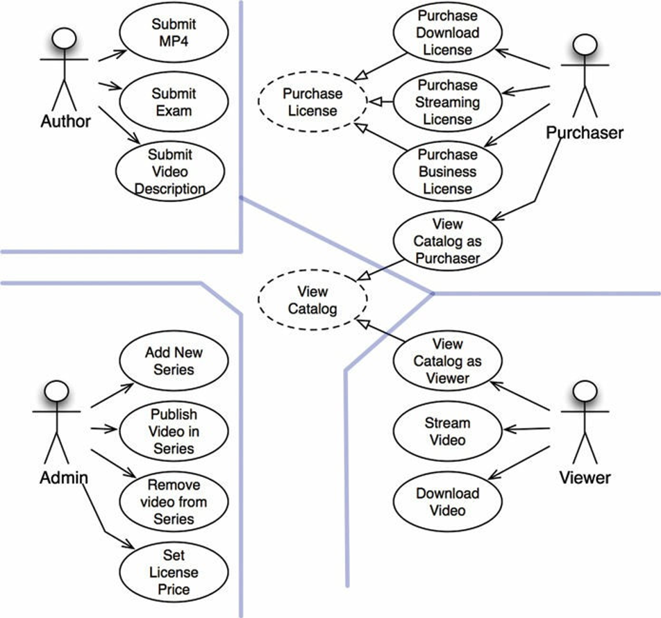
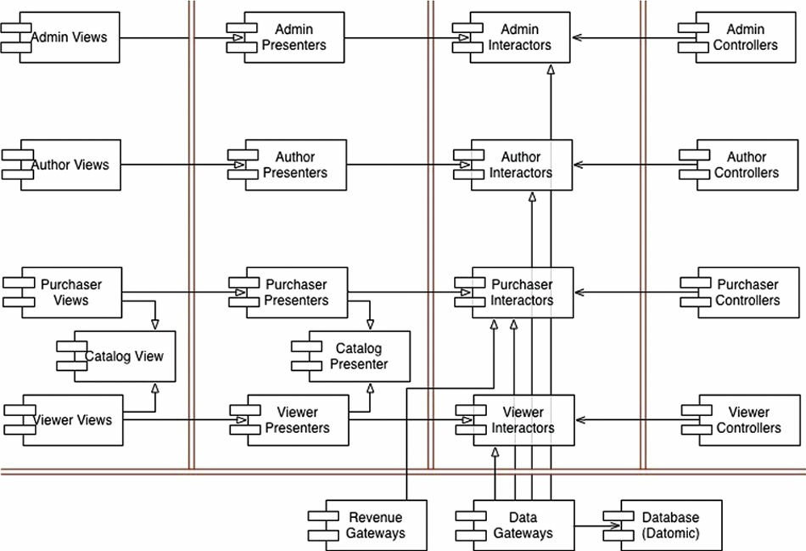

# Chapter 33 : Case study (Video Sales)
----------------------

Bây giờ đã đến lúc kết hợp tất cả những quy tắc và tư duy về kiến trúc này lại với nhau trong một nghiên cứu tình huống. Tình huống này sẽ ngắn và đơn giản, nó sẽ mô tả tất cả quy trình mà một kiến trúc sư giỏi sử dụng và các quyết định mà kiến trúc sư đó sẽ đưa ra.

## The product
Đối với tình huống này, tôi chọn một sản phẩm mà tôi đã khá quen thuộc: phần mềm cho một website bán video. Dĩ nhiên, nó gợi lại website `cleancoder.com`, trang web tôi bán các video hướng dẫn phần mềm của mình.

Ý tưởng cơ bản là đơn giản. Chúng tôi có một bộ video mà chúng tôi muốn bán. Chúng tôi bán chúng trên web, cho cả các cá nhân và các doanh nghiệp. Các cá nhân có thể trả một giá để xem video online, và một giá cao hơn để có thể download những video này và sở hữu chúng vĩnh viễn. Các giấy phép doanh nghiệp thì chỉ được xem online, và được mua thành những gói mà cho phép giảm giá theo số lượng.

Các cá nhân thường hành động như là cả người xem và người mua. Ngược lại, các doanh nghiệp thường có người mua các video để những người khác xem.

Các tác giả video cần cung cấp các file video của họ, viết mô tả, và các file phụ như ví dụ, vấn đề, giải pháp, mã nguồn, và các tài liệu khác.

Các quản trị viên cần thêm các serie video mới, thêm và xóa các video khỏi các serie đó, và thiết lập giá cho từng giấy phép sử dụng khác nhau.

Bước đầu của chúng ta trong việc xác định kiến trúc ban đầu của hệ thống là xác định ra các actor và các use case.

## Use case analysis
Hình dưới đây chỉ ra một phân tích use case thông thường :

Bốn actor chính là điều hiển nhiên. Theo Nguyên Lý Đơn Nhiệm, bốn actor này sẽ là bốn nguồn chính để thay đổi hệ thống. Mỗi khi một chức năng mới được thêm hoặc một chức năng đang tồn tại nào đó bị thay đổi, thì chức năng đó sẽ được đưa ra để phục vụ một trong những actor này. Do đó chúng ta muốn phân chia hệ thống đó sao cho một thay đổi đối với một actor sẽ không làm ảnh hưởng tới bất cứ actor nào khác.

Các use case được chỉ ra trong hình trên không phải là một danh sách đầy đủ. Lấy ví dụ, bạn sẽ không tìm thấy các use case log-in (đăng nhập) hay log-out (đăng xuất). Nguyên nhân cho sự bỏ qua này đơn giản là để điều chỉnh kích thước của vấn đề cho phù hợp trong cuốn sách này. Nếu tôi cho vào tất cả các use case khác, thì chương này sẽ có thể chuyển thành nguyên một cuốn sách được.

Lưu ý các use case được gạch đứt ở trung tâm hình trên. Chúng là các use case trừu tượng. Một use case trừu tượng là cái sẽ đặt một chính sách tổng quát để use case khác sẽ đắp thêm vào đó. Như bạn có thể thấy, cả hai use case View Catalog as Viewer and View Catalog as Purchaser đều kế thừa use case trừu tượng View Catalog.

Một mặt, tôi không hoàn toàn cần để tạo ra trừu tượng đó. Tôi có thể để cho use case trừu tượng đó ra khỏi biểu đồ mà không ảnh hưởng đến bất cứ tính năng nào của sản phẩm tổng thể. Mặt khác, hai use case này quá giống nhau đến mức tôi nghĩ tốt hơn là nhận ra điểm tương đồng này và tìm cách để hợp nhất nó sớm trong phân tích.

## Component architecture
Bây giờ chúng ta đã biết các actor và các use case, chúng ta có thể tạo ra một kiến trúc component sơ bộ (hình dưới đây).

Các đường kép trong hình thể hiện các ranh giới kiến trúc như thường lệ. Bạn có thể nhìn thấy việc phân chia các `view`, `presenter`, `interactor`, và `controller`. Bạn cũng có thể thấy là tôi đã phá mỗi hạng mục này bởi các actor tương ứng của chúng.

Mỗi component trong hình dưới đây biểu diễn một file `.jar` hoặc một file `.dll.` Mỗi component này sẽ bao gồm các `view`, `presenter`, `interactor`, và `controller` được phân bổ cho nó.

Lưu ý rằng các component đặc biệt Catalog `View` và `Catalog Presenter`. Đây là cách tôi xử lý use case trừu tượng `View Catalog`. Tôi coi như những `view` và `presenter` này sẽ được code thành các lớp trừu tượng bên trong các component đó, và component kế thừa sẽ bao gồm các lớp `view` và `presenter` kế thừa từ những lớp trừu tượng đó.

Tôi sẽ chia tất cả hệ thống này thành những component, và phát hành chúng dưới dạng các file `.jar` hoặc `.dll` chứ? Có thể hoặc không. Tôi sẽ chắc chắn chia môi trường build và biên dịch theo cách này, sao cho tôi có thể build các component có thể phát hành một cách độc lập như vậy. Tôi cũng có quyền kết hợp tất cả những thành phần phát hành được đó thành một số lượng ít hơn nếu cần thiết. Lấy ví dụ, như phân chia trong Hình 33.2, chúng ta có thể dễ dàng kết hợp chúng thành năm file `.jar` – tương ứng với view, presenter, interactor, controller, và các tiện ích. Sau đó tôi có thể triển khai độc lập những component này mà gần như thay đổi độc lập với những cái khác.

Một cách nhóm khả thi khác là đặt các view và presenter cùng nhau trong cùng một file `.jar`, và đặt các interactor, controller, và các tiện ích trong file `.jar` của chính chúng. Vẫn còn một cách khác, thậm chí còn đơn giản hơn, đó là tạo ra hai file `.jar`, với các view và presenter trong mỗi file, và những thứ khác ở file còn lại.

Giữ những lựa chọn này mở sẽ cho phép chúng ta thay đổi cách mà chúng ta triển khai hệ thống theo cách mà hệ thống thay đổi theo thời gian.

## Dependecy management

Luồng điều khiển trong hình trên thực hiện từ phải sang trái. Đầu vào thực hiện ở các controller, và đầu vào đó được xử lý thành kết quả bởi các interactor. Sau đó presenter định dạng những kết quả đó, và view hiển thị kết quả của presenter.

Lưu ý rằng không phải tất cả các mũi tên đều chảy từ phải sang trái. Thực tế, đa phần chúng trở từ trái sang phải. Đó là bởi vì kiến trúc này tuân thủ Quy Tắc Phụ Thuộc. Tất cả các phụ thuộc vượt qua đường ranh giới theo một chiều, chúng luôn hướng vào component chứa các chính sách cấp cao hơn.

Cũng lưu ý rằng mối liên hệ đang sử dụng (using – mũi tên mở) hướng theo luồng điều khiển, và mối liên hệ kế thừa (inheritance – mũi tên đóng) hướng ngược với luồng điều khiển. Điều này mô tả việc sử dụng Nguyên Lý Mở-Đóng để đảm bảo rằng luồng phụ thuộc theo đúng hướng, và những thay đổi tới các chi tiết cấp thấp không gây ảnh hưởng tới các chính sách cấp cao.

## Conclusion
Biểu đồ kiến trúc trong hình trên bao gồm hai chiều tách biệt. Đầu tiên là việc tách biệt các actor dựa trên Nguyên Lý Đơn Nhiệm; thứ hai là Quy Tắc Phụ Thuộc. Mục tiêu của cả hai là tách biệt được các component có thể thay đổi vì những lý do khác nhau và với tốc độ khác nhau. Các lý do khác nhau tương ứng với các actor; tốc độ khác nhau tương ứng với các cấp chính sách khác nhau.

Một khi bạn cấu trúc code theo cách này, bạn sẽ có thể pha trộn và khớp nhu cầu bạn cần với việc triển khai hệ thống thực tế. Bạn có thể nhóm các component này thành các thành phần triển khai được theo bất cứ cách nào có nghĩa, và dễ dàng thay đổi việc nhóm đó khi các điều kiện thay đổi.