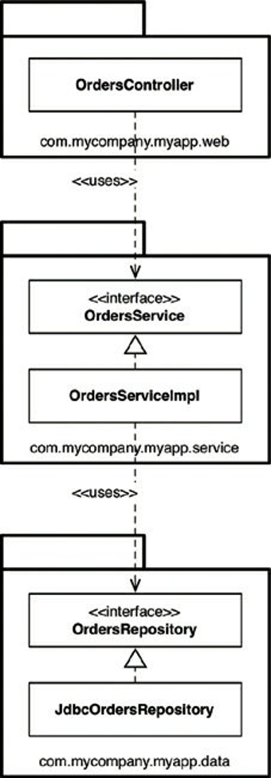
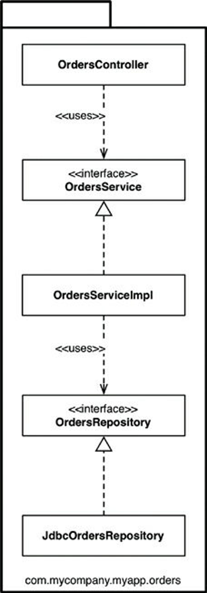
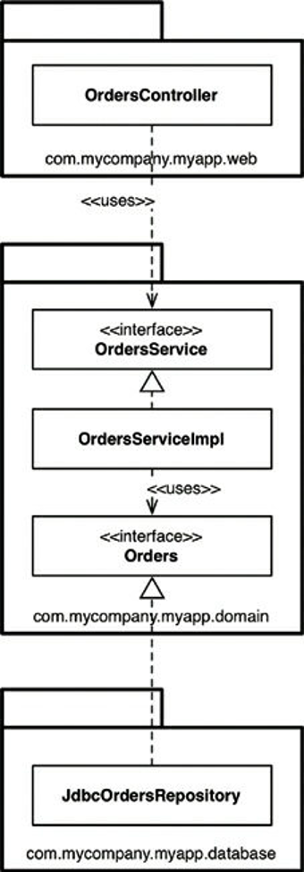
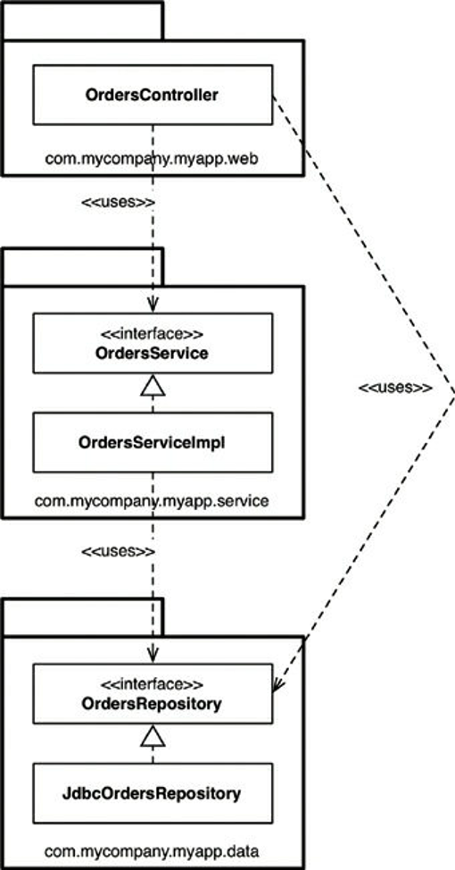
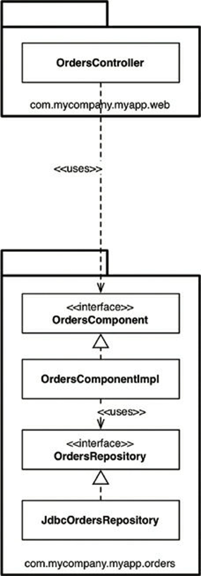
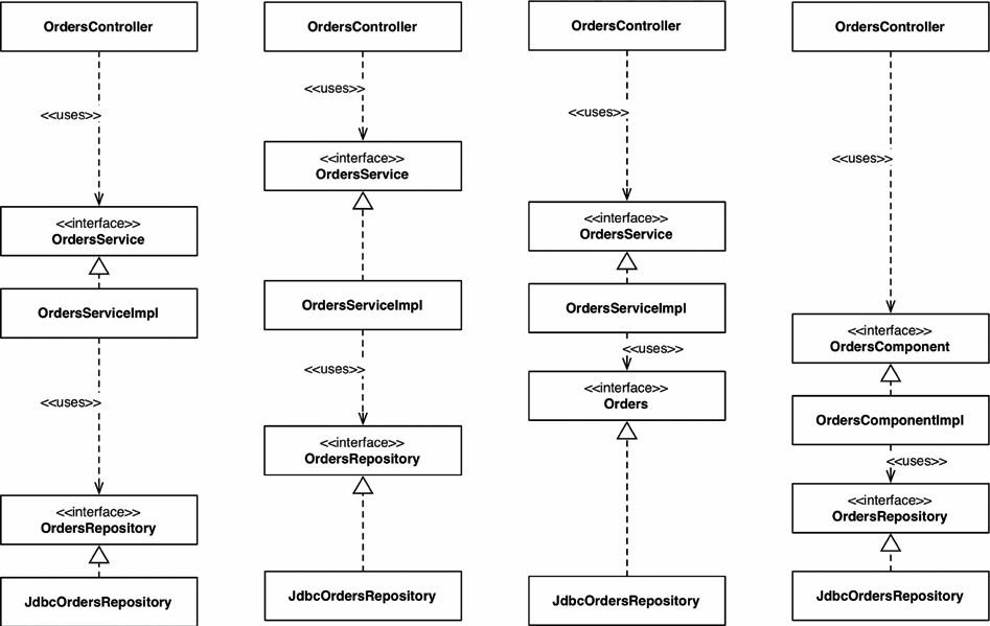
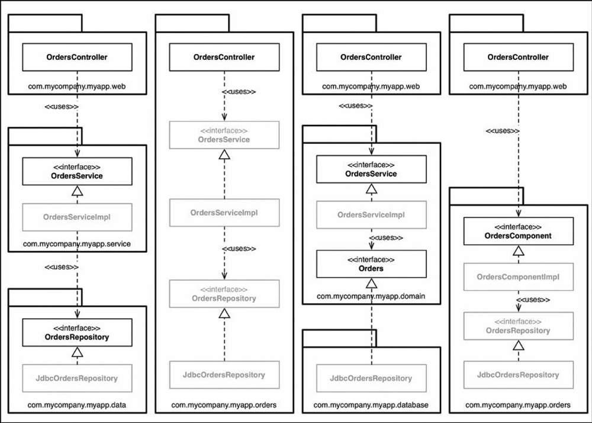
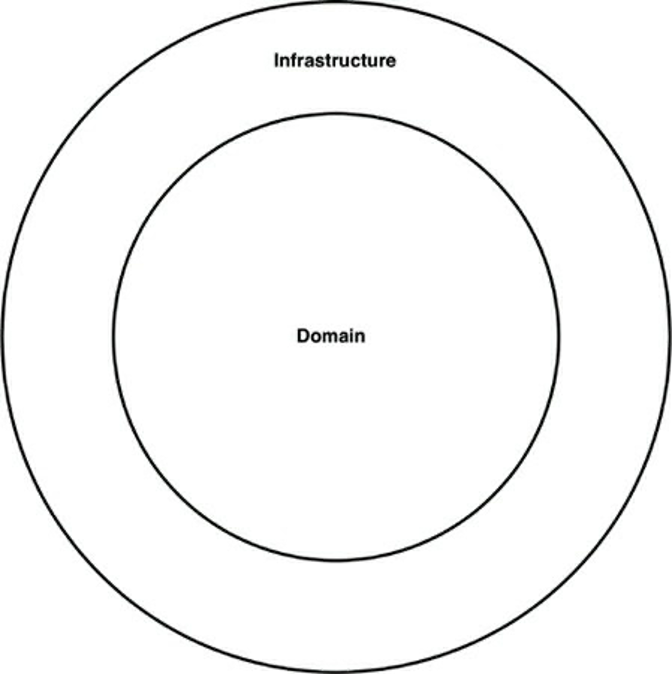

# Chapter 34 : The missing chapter
----------------------

Tất cả lời khuyên mà bạn đọc được cho tới nay chắc chắn sẽ giúp bạn thiết kế phần mềm tốt hơn, bao gồm các lớp và các component có ranh giới được xác định rõ, trách nhiệm rõ ràng, và các phụ thuộc được quản lý. Nhưng hóa ra điều khủng khiếp lại nằm trong các chi tiết lúc triển khai, và bạn thực sự sẽ dễ dàng rơi vào rào cản cuối cùng đó nếu bạn không suy nghĩ kỹ.

Chúng ta hãy tưởng tượng rằng chúng ta đang xây dựng một cửa hàng sách online, và một use case mà chúng ta được đề nghị để triển khai là về các khách hàng có thể xem tình trạng đơn hàng của họ. Mặc dù đây là một ví dụ Java, nhưng các nguyên lý cũng có thể áp dụng tương tự cho các ngôn ngữ lập trình khác. Lúc này, chúng ta hãy đặt Kiến Trúc Tinh Gọn sang một bên và nhìn vào số lượng phương pháp để thiết kế và tổ chức code.

## Package by layer
Đầu tiên, và có lẽ là phương pháp thiết kế đơn giản nhất là kiến trúc phân lớp theo chiều ngang truyền thống, chúng ta tách biệt code dựa theo nó làm cái gì từ quan điểm kỹ thuật. Đây thường được gọi là “đóng gói bởi layer”. Hình 34.1 chỉ ra nó trông như thế nào dưới dạng biểu đồ lớp UML.

Trong kiến trúc phân lớp thông thường này, chúng ta có một layer cho code web, một layer cho “quy tắc nghiệp vụ” của chúng ta, và một layer để lưu trữ. Nói cách khác, code được chia theo chiều ngang thành những layer để nhóm những thứ tương tự nhau. Trong một “kiến trúc phân lớp chặt chẽ”, các layer chỉ được phụ thuộc vào layer thấp hơn kế tiếp. Trong Java, các layer thường được triển khai thành các gói (package). Như bạn có thể thấy trong Hình 34.1, tất cả phụ thuộc giữa các layer (các gói) đều hướng xuống. Trong ví dụ này, chúng ta có những loại Java sau:

- `OrdersController`: Một web controller, thứ gì đó giống như một Spring MVC controller, dùng để xử lý các yêu cầu từ web.
- `OrdersService`: Một interface định nghĩa “quy tắc nghiệp vụ” liên quan tới các đơn hàng.
- `OrdersServiceImpl`: Triển khai của dịch vụ đặt hàng.[1]
- `OrdersRepository`: Một interface định nghĩa cách chúng ta truy cập tới thông tin đơn hàng được lưu trữ.
- `JbdcOrdersRepository`: Triển khai của interface `OrdersRepository`.

Trong bài viết “Presentation Domain Data Layering”[2], Martin Fowler nói rằng áp dụng một kiến trúc phân lớp là một phương pháp hay để khởi đầu. Không phải riêng ông ấy nghĩ vậy. Nhiều cuốn sách, hướng dẫn, các khóa đào tạo, và code mẫu mà bạn tìm thấy cũng sẽ chỉ cho bạn theo con đường tạo ra một kiến trúc phân lớp. Đó là một cách rất nhanh để giúp thứ bạn làm ra chạy được mà không quá phức tạp. Vấn đề như Martin đã chỉ ra là một khi phần mềm của bạn phát triển về độ lớn và độ phức tạp, thì bạn sẽ nhanh chóng thấy rằng ba component đó là không đủ, và bạn sẽ cần nghĩ cách module hóa nó hơn nữa.

Một vấn đề khác như tôi đã nói, kiến trúc phân lớp không hề đề cấp bất cứ thứ gì về lĩnh vực nghiệp vụ (business domain). Hãy đặt code cho hai kiến trúc phân lớp, từ hai lĩnh vực nghiệp vụ rất khác nhau, cạnh nhau và chúng có thể trông giống nhau một cách kỳ lạ: web, các dịch vụ, và các kho lưu trữ (repository). Ngoài ra còn có một vấn đề lớn khác với kiến trúc phân lớp, nhưng chúng ta sẽ bàn tới vấn đề đó sau.

## Package by feature
Một lựa chọn khác để tổ chức code của bạn là sử dụng kiểu “đóng gói bởi chức năng”. Đây là một phương pháp cắt dọc, dựa trên các chức năng liên quan, các khái niệm lĩnh vực, hoặc các gốc tổng hợp (để sử dụng thuật ngữ thiết kế hướng lĩnh vực). Trong các triển khai thông thường mà tôi đã thấy, tất cả các kiểu được đặt trong một gói Java đơn, được đặt tên để phản ánh khái niệm đang được nhóm lại.

Với cách này, như thấy ở hình dưới đây, chúng ta có các interface và các lớp tương tự như trước, nhưng tất cả chúng được đặt trong một gói Java đơn thay vì chia thành ba gói. Đây là một cách refactor đơn giản từ kiểu “đóng gói bởi layer”, nhưng bây giờ cách tổ chức cấp cao nhất của code lại có thể nói lên được về lĩnh vực nghiệp vụ. Bây giờ chúng ta có thể biết rằng code base này có gì đó để làm với đơn hàng thay vì web, các dịch vụ, và các kho lưu trữ. Một lợi ích khác đó là có thể dễ dàng tìm thấy tất cả code mà bạn cần sửa đổi trong trường hợp cần thay đổi use case “xem đơn hàng”. Tất cả nằm trong một gói Java duy nhất thay vì dàn trải nhiều nơi[3].

Tôi thường thấy các đội phát triển phần mềm nhận ra rằng họ có các vấn đề với cách phân lớp ngang (“đóng gói bởi layer”) và thay vào đó chuyển sang cách phân lớp dọc (“đóng gói bởi chức năng”). Theo ý kiến của tôi, cả hai đều chưa tối ưu. Nếu bạn đã đọc cuốn sách này tới đây, bạn có thể đang nghĩ rằng chúng ta có thể làm tốt hơn nữa – và bạn đã đúng.

## Ports and adapters
Như tôi đã nói, các phương pháp như “ports và adapters”, “hexagonal architecture”, “boundaries, controllers, entities”.v.v. hướng tới việc tạo ra một kiến trúc có phần code tập trung vào nghiệp vụ/lĩnh vực được độc lập và tách biệt khỏi những chi tiết triển khai kỹ thuật như framework và cơ sở dữ liệu. Để tổng kết, bạn thường nhìn code base như vậy được cấu thành bởi một “bên trong” (lĩnh vực) và một “bên ngoài” (hạ tầng), như được đề nghị trong hình dưới:

Vùng “bên trong” bao gồm tất cả các khái niệm lĩnh vực, trong khi đó vùng “bên ngoài” bao gồm các tương tác với thế giới bên ngoài (ví dụ các UI, cơ sở dữ liệu, tích hợp với hãng thứ ba). Quy tắc chính ở đây đó là “bên ngoài” phụ thuộc vào “bên trong” – không bao giờ ngược lại. Hình dưới cho thấy một phiên bản về cách use case “xem đơn hàng” có thể được triển khai.

Gói `com.mycompany.myapp.doamin` ở đây là “bên trong”, và các gói khác là “bên ngoài”. Lưu ý về cách luồng phụ thuộc hướng vào “bên trong”. Người đọc để ý kỹ sẽ thấy `OrdersRepository` từ các biểu đồ trước đã được đổi tên thành Orders. Việc này là do phương pháp thiết kế hướng lĩnh vực, nó khuyến khích việc đặt tên mọi thứ ở “bên trong” theo “ngôn ngữ lĩnh vực thường gặp”. Nói cách khác, chúng ta nói về “đơn hàng” khi chúng ta có một cuộc thảo luận về lĩnh vực đó, chứ không phải là “kho chứa đơn hàng”.

## Package by component

Mặc dù tôi hoàn toàn đồng ý với các cuộc thảo luận về SOLID, REP, CCP, và CRP và phần lớn các lời khuyên trong cuốn sách này, tôi đi tới một kết luận hơi khác về cách tổ chức code. Vì vậy tôi sẽ biểu diễn lựa chọn khác ở đây, tôi gọi nó là “đóng gói bởi component”. Để bạn được biết về một số kinh nghiệm của tôi, tôi đã dành phần lớn sự nghiệp của mình để xây dựng phần mềm doanh nghiệp, chủ yếu bằng Java, qua nhiều lĩnh vực nghiệp vụ khác nhau.

Những hệ thống phần mềm này cũng thay đổi rất đa dạng. Một lượng lớn là nền web, nhưng một số khác là dạng client-server (máy khách-máy chủ)[4], phân tán, message-based (nền gói tin), hoặc một số loại khác. Mặc dù các công nghệ khác nhau, nhưng nhìn chung kiến trúc của hầu hết các hệ thống phần mềm đó đều dựa trên kiến trúc phân lớp truyền thống.

Tôi đã từng đề cập tới tới các nguyên nhân tại sao kiến trúc phân lớp lại bị xem như tệ, nhưng đó không phải là toàn bộ câu truyện. Mục đích của một kiến trúc phân lớp là để tách biệt code có cùng chức năng. Các thứ về web được tách biệt khỏi phần quy tắc nghiệp vụ, còn quy tắc nghiệp vụ thì lại được tách biệt khỏi việc truy cập dữ liệu. Như chúng ta đã thấy từ biểu đồ lớp UML, từ góc độ triển khai, một layer thường tương đương với một Java package. Từ góc độ về khả năng truy cập code, để `OrdersController` có thể có một phụ thuộc vào interface `OrdersService`, interface `OrdersService` cần được đánh dấu là public, bởi vì chúng ở trong các gói khác nhau. Tương tự như vậy, interface `OrdersRepository` cần được đánh dấu là public để nó có thể được nhìn thấy từ bên ngoài của gói repository, bởi lớp `OrdersServiceImpl`.

Trong một kiến trúc phân lớp chặt chẽ, các mũi tên phụ thuộc luôn phải hướng xuống, với các layer chỉ phụ thuộc vào layer thấp hơn liền kề. Điều này tạo ra một đồ thị phụ thuộc không vòng lặp, sạch đẹp, đạt được bằng cách đưa ra một số quy tắc về cách các thành phần trong một code base phải phụ thuộc vào nhau. Vấn đề lớn ở đây là chúng ta có thể ăn gian bằng cách đưa vào một số phụ thuộc không mong muốn, để vẫn tạo ra được một biểu đồ phụ thuộc không vòng lặp đẹp đẽ.

Hãy xem như có ai đó mới gia nhập đội của bạn, và bạn đưa cho người mới đó một use case khác liên quan tới Orders để triển khai. Do là người mới, anh ta muốn tạo ấn tượng mạnh và triển khai use case này càng nhanh càng tốt. Sau khi ngồi xuống với một tách cà phê được vài phút, anh ta phát hiện ra lớp `OrdersController` đang có, vì vậy anh ta quyết định đó là nơi bắt đầu trang web liên quan tới Orders mới. Nhưng nó cần một số dữ liệu Orders từ cơ sở dữ liệu. Anh chàng mới nảy ra ý tưởng: “Ồ, có một interface `OrdersRepository` cũng đã có sẵn đây rồi. Ta có thể đơn giản dependency-inject triển khai này vào controller của ta. Hoàn hảo!”. Sau một vài phút nữa hacking, trang web đã có thể hoạt động. Nhưng biểu đồ UML kết quả sẽ trông như ở Hình 34.5.

Các mũi tên phụ thuộc vẫn trỏ xuống, nhưng `OrdersController` bây giờ thêm vào đó lại bỏ qua OrdersService ở một số use case. Cách tổ chức này thường được gọi là một kiến trúc phân lớp thoải mái (relaxed layered architecture), tại đó các layer được phép bỏ qua các lớp liền kề. Trong một số tình huống, đây là kết quả mong muốn – lấy ví dụ, nếu bạn đang có tuân theo mẫu thiết kế CQRS[5]. Trong nhiều trường hợp khác, việc nhảy qua layer quy tắc nghiệp vụ là điều không mong muốn, đặc biệt nếu quy tắc nghiệp vụ đó chịu trách nhiệm để đảm bảo việc truy xuất được ủy quyền tới từng bản ghi dữ liệu, lấy ví dụ.

Mặc dù use case mới hoạt động, nhưng có lẽ nó không được triển khai theo cách mà chúng ta mong muốn. Tôi thấy điều này xảy ra nhiều với các đội mà tôi đã từng tư vấn, và nó thường được tiết lộ khi các đội này bắt đầu hình dung code base của họ sẽ thực sự trông như thế nào, thường là lần đầu tiên.

Điều chúng ta cần ở đây là một hướng dẫn – một nguyên lý kiến trúc – nói thứ gì đó đại loại như “Web controller không bao giờ được truy cập repository trực tiếp.” Dĩ nhiên, câu hỏi ở đây là sự tuân thủ. Nhiều đội tôi đã từng gặp đơn giản nói rằng “Chúng tôi tuân thủ nguyên lý này thông qua kỷ luật tốt và các buổi review code, bởi vì chúng tôi tin tưởng các lập trình viên của chúng tôi.” Sự tự tin này nghe thì rất hay, nhưng tất cả chúng ta đều biết điều gì sẽ xảy ra khi ngân sách và deadline bắt đầu lờ mờ đến gần.

Một số lượng nhỏ hơn nhiều các đội phát triển đã nói với tôi rằng họ dùng các công cụ phân tích thống kê (như Ndpend, Structure101, Checkstyle) để kiểm tra và tự động ép buộc các vi phạm kiến trúc trong khi build. Bản thân bạn có thể nhìn thấy những quy tắc này; chúng thường được biểu diễn dưới dạng regular expression hoặc các chuỗi ký tự wildcard cho biết “các loại trong package **/web không được chấp nhận các loại trong **/data”; và chúng được thực thi sau bước biên dịch.

Cách tiếp cận này hơi thô nhưng nó có thể thực hiện được công việc này, báo cáo các vi phạm của các nguyên lý kiến trúc mà bạn đã định nghĩa khi đội phát triển và bạn build không thành công. Vấn đề với cả hai cách tiếp cận này là chúng đều có thể sai, và vòng lặp phản hồi dài hơn bình thường. Nếu không được dùng cẩn thận, phương pháp này có thể biến code base thành một “quả bóng bùn lớn[6]”. Cá nhân tôi thích dùng trình biên dịch để ép buộc kiến trúc nếu có thể.

Điều này mang tới cho chúng ta lựa chọn “đóng gói bởi component”. Nó là một cách tiếp cận lai mọi thứ mà chúng ta đã thấy cho đến nay, với mục tiêu là gộp tất cả các trách nhiệm liên quan thành một component thô duy nhất trong một package Java. Đó là về việc lấy cái nhìn dịch vụ làm trung tâm của một hệ thống phần mềm, đó cũng là điều mà chúng ta đang thấy với kiến trúc micro service. Cũng giống như cách mà kiến trúc “ports and apdaters” coi web chỉ như một cơ chế truyền thông tin khác, “đóng gói bởi component” giúp cho giao diện người dùng tách biệt khỏi các component thô này. Hình 34.6 chỉ ra use case “xem đơn hàng” có thể trông như thế nào.

Về bản chất, phương pháp này gộp “quy tắc nghiệp vụ” và code bền vững thành một thứ duy nhất, mà tôi gọi đó là một “component”. Tôi đã trình bày định nghĩa về “component” trước đó trong cuốn sách, nói rằng:

Component là một đơn vị triển khai. Chúng là thực thể nhỏ nhất mà có thể được triển khai như là một phần của hệ thống. Trong Java, chúng là các file jar.

Định nghĩa của tôi về một component có khác một chút: “Đó là một nhóm các chức năng có quan hệ với nhau phía sau một interface sạch đẹp, được nằm bên trong một môi trường thực thi như là một ứng dụng.” Định nghĩa này đến từ “mô hình kiến trúc phần mềm C4[7]” của tôi, đó là một cách phân cấp đơn giản để nghĩ về các cấu trúc tĩnh của một hệ thống phần mềm dưới dạng các container, component, và class (hoặc code). Nó nói rằng một hệ thống phần mềm được làm từ một hoặc nhiều container (ví dụ như các ứng dụng web, ứng dụng di động, ứng dụng độc lập, cơ sở dữ liệu, hệ thống file), mỗi hệ thống chứa một hoặc nhiều component, đến lượt những component lại được triển khai bởi một hoặc nhiều class (hoặc code). Liệu mỗi component nằm trong một file jar riêng biệt là một vấn đề trực giao không?

Một lợi ích chính của phương pháp “đóng gói bởi component” là nếu bạn đang viết code mà cần làm điều gì đó với Orders, thì chỉ có một nơi duy nhất để tới đó là OrdersComponent. Bên trong component này, việc tách biệt các vấn đề vẫn được duy trì, vì vậy quy tắc nghiệp vụ được tách biệt khỏi dữ liệu lưu trữ, nhưng đó là một chi tiết triển khai component mà người sử dụng không cần thiết biết tới. Điều này na ná với thứ bạn có thể gặp nếu bạn sử dụng các micro-service hoặc Kiến Trúc Hướng Dịch Vụ – một OrdersService tách biệt mà đóng gói mọi thứ liên quan tới việc xử lý các đơn hàng. Điểm khác biệt chính là chế độ tách rời. Bạn có thể nghĩ component được định nghĩa tốt trong một ứng dụng nguyên khối là một bước đi vững chắc sang kiến trúc micro-service.

## The Devil is in the implementation details
Bốn cách tiếp cận đều trông giống như những cách khác nhau để tổ chức code và do đó, có thể được coi là những phong cách kiến trúc khác nhau. Tuy nhiên, cảm nhận này bắt đầu mất đi rất nhanh nếu bạn có các chi tiết triển khai sai.

Một điều tôi thường thấy là việc sử dụng quá tự do câu lệnh public trong các ngôn ngữ như Java. Hầu như chúng ta, các lập trình viên, theo bản năng sử dụng từ khóa public mà không cần suy nghĩ nhiều. Nó nằm trong bộ nhớ cơ (muscle memory) của chúng ta. Nếu bạn không tin tôi, hãy nhìn vào các mẫu code của các cuốn sách, hướng dẫn, và các framework mã nguồn mở trên GitHub. Xu hướng này là rất rõ ràng, bất kể phong cách kiến trúc nào mà một code base hướng tới áp dụng – các layer ngang, các layer dọc, ports and adapters, hoặc thứ gì đó khác. Việc đánh dấu tất cả các loại của bạn là public nghĩa là bạn không tận dụng ưu điểm của các tiện ích mà ngôn ngữ lập trình của bạn cung cấp cho khả năng đóng gói. Trong một số trường hợp, không có gì ngăn cản ai đó viết code để khởi tạo một lớp triển khai cụ thể một cách trực tiếp, vi phạm phong cách kiến trúc dự định.

## Organization versus encapsulation
Nhìn vào vấn đề này theo cách khác, nếu bạn để tất cả các loại trong ứng dụng Java của bạn là public, thì các package đơn giản chỉ là một cơ chế tổ chức (một nhóm, giống như các thư mục), hơn là được dùng để đóng gói. Do các loại public có thể sử dụng ở bất cứ nơi nào trong code base, nên bạn có thể loại bỏ các package cho gọn bởi vì chúng cung cấp rất ít giá trị thực tế. Kết quả là nếu bạn bỏ qua các package (bởi vì chúng không cung cấp bất cứ ý nghĩa gì về mặt đóng gói và ẩn giấu), thì loại kiến trúc bạn muốn tạo ra không còn thực sự quan trọng. Nếu bạn nhìn lại vào các biều đồ UML ví dụ, các package Java trở thành một chi tiết không liên quan nếu tất các loại đều được đánh dấu là public. Về bản chất, cả bốn phương pháp kiến trúc được trình bày trước đó trong chương này chính xác là giống nhau khi chúng ta lạm dụng từ khóa public (như trong hình dưới).

Hãy xem kỹ những mũi tên nằm giữa mỗi loại trong hình dưới: Tất cả chúng đều giống nhau bất kể bạn đang cố gắng áp dụng phương pháp kiến trúc nào. Về lý thuyết các phương pháp này rất khác nhau, nhưng về mặt cú pháp thì chúng giống hệt nhau. Hơn nữa, bạn có thể tranh luận rằng khi bạn để cho tất cả các loại là public, thì thứ mà bạn thực sự có chỉ là bốn cách để mô tả một kiến trúc phân lớp theo chiều ngang truyền thống. Đây là một thủ thuật khéo léo, và dĩ nhiên không ai lại để tất cả các kiểu Java của họ là public. Trừ khi họ làm vậy. Và tôi đã từng thấy điều đó.

Các từ khóa truy cập (access modifier) trong Java không phải hoàn hảo[8], nhưng bỏ qua chúng chỉ khiến chúng ta gặp rắc rối. Cách mà các loại Java được đặt trong các package thực tế có thể tạo ra một sự khác biệt lớn tới cách các loại có thể truy cập được (hoặc không thể truy cập được) khi các từ khóa truy cập của Java được áp dụng một cách thích hợp. Nếu tôi mang các package này trở lại và đánh dấu (bằng cách làm mờ đồ họa) những kiểu mà từ khóa truy cập có thể làm cho nó trở nên hạn chế hơn, thì bức tranh sẽ trở nên khá thú vị (Hình 34.8).

Di chuyển từ trái sang phải, trong phương pháp “đóng gói bởi layer”, các interface `OrdersService` và `OrdersRepository` cần đặt là `public`, bởi vì chúng truyền các phụ thuộc từ các lớp bên ngoài của package xác định của chúng. Ngược lại, các lớp triển khai (`OrdersServiceImpl` và `JdbcOrdersRepository`) có thể được làm hạn chế hơn (package protected). Không ai cần biết về chúng; chúng là một chi tiết triển khai.

Trong phương pháp “đóng gói bởi chức năng”, `OrdersController` cung cấp một điểm vào duy nhất bên trong package đó, vì vậy những thứ khác có thể được đặt là package protected. Một cảnh báo lớn ở đây đó là không gì khác trong code base, bên ngoài package này, có thể truy cập thông tin liên quan tới `Orders` trừ khi chúng đi qua controller đó. Điều này có thể là điều mong muốn hoặc không.

Trong phương pháp “ports and adpaters”, các interface `OrdersService` và Orders truyền các phụ thuộc từ các package khác, vì vậy chúng cần được đặt là `public`. Một lần nữa, các lớp triển khai có thể được đạt là package protected và được chèn phụ thuộc lúc runtime.

Cuối cùng, trong phương pháp “đóng gói bởi component”, interface `OrdersComponent` có một phụ thuộc được truyền từ controller, còn mọi thứ khác có thể được đặt là package protected. Bạn càng có ít loại `public`, thì bạn càng có ít số lượng phụ thuộc. Bây giờ không có cách nào mà code bên ngoài package đó có thể dùng interface hoặc triển khai `OrdersRepository` một cách trực tiếp, vì vậy chúng ta có thể dựa vào trình biên dịch để cưỡng ép nguyên lý kiến trúc này. Bạn có thể làm điều tương tự trong .NET với từ khóa internal, mặc dù bạn sẽ cần tạo ra một cụm riêng đối với mỗi component.

Để cho rõ ràng hoàn toàn, những gì mà tôi mô tả ở đây liên quan tới một ứng dụng nguyên khối, nơi tất cả code đều nằm trong một cây mã nguồn duy nhất. Nếu bạn đang xây dựng một ứng dụng như vậy (và nhiều người khác cũng vậy), thì tôi chắc chắn sẽ khuyến khích bạn nghiêng về phía sử dụng trình biên dịch để ép buộc các nguyên lý kiến trúc của bạn, hơn là dựa vào kỷ luật tự giác và các công cụ hậu biên dịch.

## Other decoupling modes
Ngoài ngôn ngữ lập trình mà bạn đang sử dụng, thường có những cách khác để bạn có thể tách rời sự phụ thuộc mã nguồn của bạn. Với Java, bạn có các framework như OSGi và hệ thống module Java 9 mới. Với các hệ thống module, nếu được dùng đúng, thì bạn có thể tạo ra một sự phân biệt giữa các loại là public và các loại là published. Lấy ví dụ, bạn có thể tạo ra một module Orders có tất cả các loại được đánh dấu là public, nhưng lại chỉ phát hành một tập nhỏ trong những loại này để sử dụng bên ngoài. Còn lâu mới đến lúc đó, nhưng tôi rất háo hức về việc hệ thống module Java 9 sẽ cung cấp cho chúng ta một công cụ khác để xây dựng phần mềm tốt hơn, và một lần nữa khơi dậy sự quan tâm của mọi người về tư duy thiết kế.

Một tùy chọn khác là tách rời các phụ thuộc của bạn ở cấp độ mã nguồn, bằng cách phân chia code trên các cây mã nguồn khác nhau. Nếu chúng ta lấy ví dụ “ports and adapters”, chúng ta có thể có ba cây mã nguồn:

- Mã nguồn dành cho nghiệp vụ và lĩnh vực (mọi thứ độc lập với việc lựa chọn framework và công nghệ): `OrdersService`, `OrdersServiceImpl`, và `Orders`.
- Mã nguồn dành cho web: `OrdersControllers`.
- Mã nguồn dành cho lưu trữ dữ liệu: `JdbcOrdersRepository`.

Hai cây mã nguồn sau có phụ thuộc lúc biên dịch vào code nghiệp vụ và lĩnh vục, thứ mà bản thân không biết điều gì về code web hoặc lưu trữ dữ liệu. Từ quan điểm triển khai, bạn có thể làm việc này bằng cách cấu hình các module riêng biệt hoặc các dự án trong công cụ build của bạn (như Maven, Gradle, MSBuild). Tốt nhất là bạn nên lặp lại mẫu thiết kế này, có một cây mã nguồn tách riêng cho mỗi loại và mỗi component trong ứng dụng của bạn. Tuy nhiên, đấy là một giải pháp lý tưởng hóa, bởi vì có những vấn đề về hiệu suất, độ phức tạp, và các vấn đề bảo trì liên quan tới việc chia nhỏ mã nguồn của bạn theo cách này.

Một phương pháp đơn giản hơn mà một số người sử dụng cho code “ports and adapters” của họ là chỉ có hai cây mã nguồn:

- Code lĩnh vực (phần “bên trong”)
- Code hạ tầng (phần “bên ngoài”)

Điều này phản ánh một cách đẹp đẽ trên biểu đồ (như trong hình dưới) mà nhiều người sử dụng để tổng kết kiến trúc “ports and adapters”, và có một phụ thuộc lúc biên dịch từ phần hạ tầng tới phần lĩnh vực.

Phương pháp để tổ chức mã nguồn này cũng hiệu quả, nhưng hãy cẩn thận đến những đánh đổi có thể xảy ra. Đó là thứ mà tôi gọi là “mẫu thiết kế xấu Périphérique của ports and adapters.” Thành phố Paris, nước Pháp, có một con đường vành đai được gọi là Đại lộ Périphérique, nó cho phép bạn đi vòng quanh Paris mà không cần đi vào những khu phức hợp của thành phố. Việc có tất cả code hạ tầng của bạn trong một cây mã nguồn duy nhất nghĩa là có thể xảy ra khả năng code hạ tầng trong một khu vực của ứng dụng của bạn (ví dụ như web controller) có thể gọi trực tiếp code trong vùng khác của ứng dụng của bạn (ví dụ như kho cơ sở dữ liệu), mà không cần đi qua phần lĩnh vực. Điều này đặc biệt đúng nếu bạn quên áp dụng các từ khóa truy cập thích hợp cho phần code đó.

## Conclusion : The missing advice
Điểm chính của chương này là để nhấn mạnh rằng những ý định thiết kế tốt nhất của bạn có thể bị hủy hoại trong nháy máy nếu bạn không xem xét đến tính phức tạp của chiến thuật triển khai. Hãy nghĩ về việc chuyển thiết kế mong muốn của bạn thành các cấu trúc code như thế nào, cách để tổ chức code, và chế độ tách rời nào sẽ được áp dụng trong thời gian chạy runtime và trong thời gian biên dịch. Hãy để các lựa chọn mở nếu có thể nhưng hãy thực dụng, và tính đến cả kích thước đội phát triển, trình độ kỹ năng của họ, và độ phức tạp của giải pháp đi kèm với những giới hạn về thời gian và ngân sách của bạn. Hãy nghĩ về việc sử dụng trình biên dịch của bạn để giúp bạn ép buộc kiểu kiến trúc được lựa chọn, và đề phòng sự gắn kết xảy ra trong các khu vực khác, ví dụ như các mô hình dữ liệu. Điều khủng khiếp thật sự nằm trong các chi tiết lúc triển khai.

