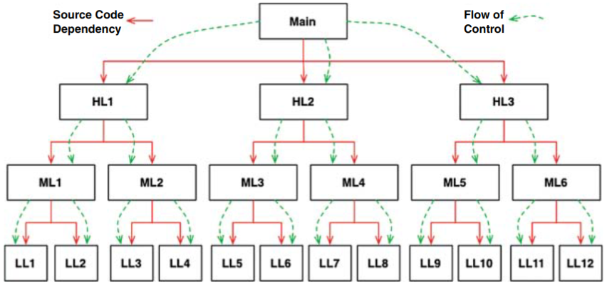
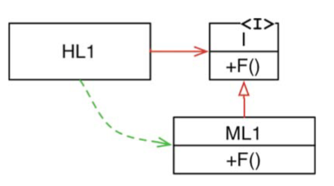

# Chapter 5 : Object-oriented programming
---------

Như chúng ta sẽ thấy, cơ sở của một kiến trúc tốt là phải hiểu và ứng dụng được các nguyên lý của object-oriented design (OO). Nhưng OO ở đây có nghĩa là gì ???

Câu trả lời có thế là "OO là một cách có thể mô hình hóa được thế giới thực". Chúng ta có thể dựa vào 3 khái niệm sau để giải thích bản chất của OO: *encapsulation, inheritance, polymorphism*. Ngụ ý rằng, OO là sự kết hợp của 3 tính chất này, hoặc ít nhất là một ngôn ngữ OO phải hỗ trợ 3 tính chất đó.

## Encapsulation
Lý do mà encapsulation được đề cập như là một phần định nghĩa của OO là các ngôn ngữ OO cung cấp khả năng có thể đóng gói được data và function một cách dễ dàng và hiệu quả.

Ta có thể hình dung một đường vẽ bao quanh data và các function, và bên ngoài đường biên đó, data sẽ bị dấu đi và chỉ có một vài function là biết được data đó. Chúng ta có thể thấy khái niệm này được biểu diễn thông qua các private data members và các public member function trong một class.

Hãy thử xem xét tính đóng gói thông qua một ví dụ chương trình được viết bằng C như sau:

```c
// point.h
struct Point;
struct Point* makePoint(double x, double y);
double distance(struct Point *p1, struct Point *p2);
```

```c
// point.c
#include "point.h"
#include <stdlib.h>
#include <math.h>

struct Point {
    double x,y;
};

struct Point* makePoint(double x, double y) {
    struct Point* p = malloc(sizeof(struct Point));
    p->x = x;
    p->y = y;
    return p;
}

double distance(struct Point *p1, struct Point *p2){
    double dx = p1->x - p2->x;
    double dy = p1->y - p2->y;
    return sqrt(dx*dx + dy*dy);
}
```

Như vậy, user của `point.h` sẽ không có quyền truy cập vào các member của struct `Point`, nhưng họ vẫn có thể gọi được `makePoint()`, `distance()`, nhưng họ lại không biết được phần cài đặt chi tiết của các function này.

Đây chính là một ví dụ tuyệt vời của encapsulation, trong một ngôn ngữ không phải thuộc dạng thuần OOP. Ta khai báo các cấu trúc dữ liệu và các function trong các header file, và cài đặt chúng trong các file implementation. Và người dùng của chúng ta sẽ không bao giờ có thể truy cập vào được các file cài đặt ấy.

Nhưng ví dụ hoàn hảo bằng C này bị phá vỡ khi được viết lại bằng C++. Các C++ compiler, chúng cần biết được kích thước của các instances của mỗi class, và vì thế, chúng cần các member variables của class được khai báo trong header file của class đó. Vì vậy, `Point` được viết lại như sau:

```cpp
// point.h
class Point {
    public: 
        Point(double x, double y);
        double distance(const Point &p) const;

    private:
        double x;
        double y;
};
```

```cpp
// point.cc
#include <point.h>
#include <math.h>

Point::Point(double x, double y) : x(x), y(y) { }

double Point::distance(const Point &p) const {
    double dx = x - p.x;
    double dy = y - p.y;
    return sqrt(dx * dx + dy * dy);
}
```
Client của `point.h` giờ đây có thể biết về các member variables `x` và `y`. Tuy rằng compiler sẽ chặn quyền truy cập vào chúng, nhưng client đã biết rằng chúng đang tồn tại, và nếu như mà name của các member này bị thay đổi thì file `point.cc` sẽ phải biên dịch lại. Và như vậy, tính đóng gói đã bị phá vỡ.

Cách đóng gói này được chữa cháy bằng việc đưa vào các từ khóa như `private`, `protected`, `public`. Java và C sharp thì xóa bỏ hoàn toàn việc phân chia header/implementation, do đó còn làm giảm tính đóng gói hơn nữa, trong các ngôn ngữ này, không thể nào tách rời phần khai báo và định nghĩa các thành viên trong một class được.

Như vậy, thật khó để khẳng định rằng OO phụ thuộc vào encapsulation, nhiều ngôn ngữ OOP có rất ít hoặc thậm chí là không có tính chất này.

## Inheritance

Kế thừa đơn giản chỉ là khai báo lại một nhóm các biến và function trong một phạm vi kèm theo. Các developer C được thực hiện thủ công tính chất này rất lâu trước khi có các ngôn ngữ OOP.

```c
// namesPoint.h
struct NamedPoint;

struct NamedPoint* mekNamedPoint(double x, double y, char *name);
void setName(struct NamedPoint *np, char *name);
char* getName(struct NamedPoint *np);
```

```c
// namedPoint.c
#include "namedPoint.h"
#include <stdlib.h>

struct NamedPoint {
    double x, y;
    char *name;
};

struct NamedPoint* makeNamedPoint(double x, double y, char *name) {
    struct NamedPoint *p = malloc(sizeof(struct NamedPoint));
    p->x = x;
    p->y = y;
    p->name = name;
    return p;
}

void setName(struct NamedPoint* np, char* name) {
    np->name = name;
}

char* getName(struct NamedPoint *np) {
    return np->name;
}
```

```c
//main.c
#include "point.h"
#include "namedPoint.h"
#include <stdio.h>

int main(int ac, char **av){
    struct NamedPoint *origin = makeNamedPoint(0.0, 0.0, "origin");
    struct NamedPoint *upperRight = makeNamedPoint(0.0, 0.0, "upperRight");
    printf("distance=%f\n",
        distance(
                (struct Point*) origin,
                (struct Point*) upperRight
        ));
}
```
Nếu bạn xem cẩn thận chương trình main, bạn sẽ thấy rằng cấu trúc dữ liệu `NamedPoint` hoạt động như thể nó là kế thừa của cấu trúc dữ liệu `Point`. Điều này bởi vì thứ tự của hai trường đầu tiên trong `NamedPoint` cũng tương tự như `Point`. Nói ngắn ngọn, `NamedPoint` có thể giả dạng `Point` vì `NamedPoint` đơn thuần là một tập cha của `Point` và vẫn duy trì thứ tự của các biến thành viên tương ứng với `Point`.

Ngón nghề kiểu này là một cách làm phổ biến của các lập trình viên trước khi xuất hiện OO. Thực tế là kiểu làm như vậy chính là cách mà C++ triển khai tính kế thừa đơn.

Do đó chúng ta có thể nói rằng chúng ta có một dạng kế thừa từ lâu trước khi các ngôn ngữ OO được phát minh ra. Mặc dù lời phát biểu đó cũng không được đúng lắm. Chúng ta đã có một mẹo, nhưng nó không được thuận tiện như tính kế thừa thực tế. Hơn nữa, việc đa kế thừa sẽ khó hơn đáng kể nếu dùng mẹo như vậy.

Cũng cần chú ý rằng trong `main.c`, tôi đã ép chuyển các tham số `NamePoint` thành `Point`. Trong ngôn ngữ OO thực sự thì việc chuyển đổi lên như vậy sẽ được thực hiện ngầm.

Công bằng mà nói thì các ngôn ngữ OO không cho chúng ta một điều gì hoàn toàn mới cả, chúng chỉ giúp chúng ta đóng giả các cấu trúc dữ liệu một cách thuận tiện hơn nhiều mà thôi.

Tóm lại: Chúng ta không được gì thêm từ tính đóng gói của OO, và có lẽ chỉ một nửa điểm cho tính kế thừa. Tính đến lúc này, đó không phải là một điểm số thật sự tuyệt vời.

Nhưng chúng ta vẫn còn một đặc tính nữa cần xem xét.

## Polymorphism
Chúng ta có hành vi đa hình trước các ngôn ngữ OO không? Dĩ nhiên là chúng ta có. Hay xem chương trình copy C đơn giản này.

```c
#include <stdio.h>
void copy() {
    int c;
    while ((c=getchar()) != EOF) 
        putchar(c);
}
```

Hàm `getchar()`  được đọc từ `STDIN`. Nhưng thiết bị nào là `STDIN`? Hàm `putchar()` ghi ra `STDOUT`. Nhưng đó là thiết bị nào? Các hàm này có tính đa hình – hành vi của chúng phụ thuộc vào loại của `STDIN` và `STDOUT`.

Mặc dù `STDIN` và `STDOUT` là các interface kiểu Java được triển khai cho mỗi thiết bị. Dĩ nhiên, không có interface nào trong ví dụ chương trình C này – vì vậy việc gọi hàm `getchar()` thực tế đã được chuyển tới driver thiết bị để đọc các ký tự như thế nào?

Câu trả lời cho câu hỏi đó khá dễ hiểu. Hệ điều hành UNIX đòi hỏi mọi driver của thiết bị IO đều phải cung cấp năm hàm tiêu chuẩn: `open`, `close`, `read`, `write`, và `seek`. Dấu hiệu của những hàm này bắt buộc phải giống nhau đối với tất cả các driver IO.

Cấu trúc dữ liệu `FILE` bao gồm năm con trỏ tới hàm. Trong ví dụ của chúng ta, nó trông như sau:

```c
struct FILE {
    void (*open)(char *name, int mode);
    void (*close)();
    int (*read)();
    void (*write)(char);
    void (*seek)(long index, int mode);
};
```
Driver IO cho console sẽ xác định những hàm này và nạp vào cấu trúc dữ liệu FILE bằng địa chỉ của chúng – kiểu như thế này:

```c
#include "file.h"

void open(char *name, int mode) {/*....*/}
void close() {/*....*/};
int read() {int c; /*...*/ return c;}
void write(char c) {/*.....*/}
void seek(long index, int mode) {/*...*/}

struct FILE console = {open, close, read, write, seek};
```

Bây giờ nếu `STDIN` được định nghĩa là `FILE*`, và nếu nó trỏ tới cấu trúc dữ liệu console, thì hàm `getchar()` có thể được triển khai theo cách này:

```c
extern struct FILE* STDIN;

int getchar() {
    return STDIN->read;
}
```

Nói cách khác, hàm `getchar()` đơn giản là gọi tới hàm trỏ tới bởi con trỏ `read` của cấu trúc dữ liệu `FILE` được trỏ tới bởi `STDIN`.

Mẹo đơn giản này là cơ sở cho tất cả tính đa hình trong OO. Lấy ví dụ, trong C++ mọi hàm ảo (virtual function) nằm trong một lớp sẽ có một con trỏ trong một bảng gọi là `vtable`, và tất cả các lệnh gọi tới các hàm ảo đều phải đi qua bảng đó. Hàm tạo của lớp dẫn xuất đơn giản là nạp phiên bản của những hàm này của chúng vào bảng `vtable` của đối tượng được tạo.

Điều cuối cùng tôi muốn nói đó là tính đa hình là một ứng dụng của các con trỏ trỏ tới các hàm. Những lập trình viên đang dùng con trỏ tới hàm để đạt được hành vi đa hình kể từ khi kiến trúc Von Neumann lần đầu tiên được triển khai vào cuối những năm 1940. Nói cách khác, OO không cung cấp điều gì mới mẻ cả.

À, nhưng điều đó cũng không chính xác lắm. Các ngôn ngữ OO có thể không cho chúng ta tính đa hình, nhưng chúng đã làm cho tính đa hình trở nên an toàn hơn và thuận tiện hơn rất nhiều.

Vấn đề với việc sử dụng trực tiếp con trỏ trỏ tới hàm để tạo ra hành vi đa hình đó là rất nguy hiểm. Việc sử dụng như vậy được thực hiện bởi một tập những quy ước thủ công. Bạn phải nhớ tuân thủ theo quy ước này để khởi tạo các con trỏ. Bạn phải nhớ tuân thủ quy ước này để gọi tới tất các hàm của bạn qua những con trỏ đó. Nếu bất cứ lập trình viên nào quên không nhớ tới những quy ước này thì kết quả là bug phát sinh sẽ cực kỳ khó để tìm ra và loại bỏ.

Các ngôn ngữ OO đã loại bỏ được những quy ước này và do đó nó loại bỏ được các mối nguy hiểm này. Việc dùng một ngôn ngữ OO để tạo ra tính đa hình chỉ là việc đơn giản. Thực sự là nó đã cung cấp một sức mạnh to lớn mà những lập trình viên C ngày xưa chỉ có thể nằm mơ mới có được. Với những cơ bản này, chúng ta có thể kết luận rằng OO áp dụng kỷ luật đối với việc chuyển giao quyền kiểm soát gián tiếp.

## The power of Polymorphism

Tính đa hình thì có gì tuyệt vời như vậy? Để đánh giá được tốt hơn về sự lôi cuốn của nó, chúng ta hãy xem lại ví dụ về chương trình copy. Điều gì xảy ra với chương trình đó nếu một thiết bị IO mới được tạo ra? Cho là chúng ta muốn dùng chương trình copyđó để copy dữ liệu từ một thiết bị nhận diện chữ viết sang thiết bị tổng hợp giọng nói: Chúng ta sẽ cần phải thay đổi chương trình copy đó để làm việc với những thiết bị mới này như thế nào?

Chúng ta sẽ không cần bất cứ thay đổi nào hết! Thực vậy, chúng ta thậm chí không cần phải biên dịch lại chương trình copy này.Tại sao? Bởi vì mã nguồn của chương trình copy không phụ thuộc vào mã nguồn của các driver IO. Một khi những driver IO này triển khai năm hàm tiêu chuẩn được định nghĩa bởi FILE, thì chương trình copy này sẽ vui vẻ sử dụng chúng.

Nói ngắn gọn, các thiết bị IO trở thành những plugin cho chương trình copy.

Tại sao hệ điều hành UNIX lại làm các plugin thiết bị IO như vậy? Bởi vì như chúng ta đã học, vào cuối những năm 1950, các chương trình của chúng ta cần phải độc lập với các thiết bị. Tại sao? Bởi vì chúng tôi đã viết rất nhiều chương trình phụ thuộc vào thiết bị, chỉ để khám phá ra rằng chúng tôi thực sự muốn những chương trình này có thể làm được những công việc tương tự nhưng dùng bằng một thiết bị khác.

Lấy ví dụ, chúng tôi thường viết các chương trình đọc dữ liệu đầu vào từ các bộ thẻ, và sau đó đục lỗ những bộ thẻ mới làm đầu ra. Nhưng sau đó, các khách hàng của chúng tôi đã ngừng đưa cho chúng tôi những bộ thẻ và bắt đầu đưa cho chúng tôi những cuộn băng từ. Đây là thứ rất bất tiện, bởi vì nó có nghĩa là chúng tôi phải viết lại phần lớn các chương trình ban đầu. Nó sẽ rất thuận tiện nếu các chương trình như vậy có thể làm việc thay thế lẫn nhau được giữa các tấm thẻ hoặc băng từ.

Kiến trúc plugin (cắm vào) được sáng chế để hỗ trợ cho việc độc lập với thiết bị IO, và nó đã được triển khai trên hầu như tất cả các hệ điều hành kể từ khi nó được giới thiệu.

Ngay cả vậy, đa phần các lập trình viên đã không mở rộng ý tưởng này cho các chương trình của chính họ, bởi vì việc sử dụng con trỏ hàm là điều rất nguy hiểm.

OO cho phép kiến trúc plugin được dùng bất cứ nơi nào, cho bất cứ thứ gì.

## Dependency inversion

Chúng ta hãy tưởng tượng phần mềm sẽ như thế nào trước khi chúng ta có một cơ chế an toàn và thuận tiện để thực hiện tính đa hình. Trong một cây gọi hàm thông thường, các hàm chính gọi các hàm ở cấp cao, rồi các hàm này lại gọi các hàm cấp trung, rồi lại gọi các hàm cấp thấp. Tuy nhiên, trong cây gọi hàm đó, những phụ thuộc (dependency) mã nguồn không thể tránh được khi chúng được sử dụng trong luồng điều khiển.



Đối với hàm `main` để gọi một hàm ở cấp cao hơn, nó sẽ phải đưa ra tên của module bao gồm hàm đó. Trong C, đó là câu lệnh `#include`. Trong Java, đó là câu lệnh `import`. Trong C#, đó là câu lệnh `using`. Quả thực, tất cả các hàm gọi đều buộc phải đưa ra tên của module bao gồm các hàm được gọi.

Yêu cầu này đã đưa ra cho kiến trúc sư phần mềm một số tùy chọn, nếu có. Luồng điều khiển được quyết định bởi hành vi của hệ thống và các phụ thuộc mã nguồn được quyết định bởi luồng điều khiển đó.





Trong hình trên , module `HL1` gọi hàm `F()` trong module `ML1`. Thực tế là nó gọi hàm này thông qua một interface là một cổng của mã nguồn. Vào lúc chạy runtime, interface này không tồn tại. HL1 chỉ đơn giản là gọi hàm `F()` bên trong `ML1`.

Tuy nhiên, hãy chú ý rằng những phụ thuộc mã nguồn này (mối liên hệ kế thừa) giữa `ML1` và interface `I` chỉ theo hướng ngược nhau so với luồng điều khiển. Điều này được gọi là dependency inversion (đảo ngược phụ thuộc), và ý nghĩa của nó đối với kiến trúc phần mềm là rất sâu sắc.

Thực tế, các ngôn ngữ OO cung cấp cơ chế đa hình thuận tiện và an toàn nghĩa là bất cứ phụ thuộc mã nguồn nào, bất kể ở đâu, cũng có thể được đảo ngược (*any source code dependency, no matter where it is, can be inverted.*).

Bây giờ hãy nhìn vào cây gọi hàm trong Hình 5.1, và nhiều phụ thuộc mã nguồn của nó. Bất cứ phụ thuộc mã nguồn nào trong số đó cũng có thể được thay đổi bằng cách chèn thêm một interface giữa chúng.

Với cách tiếp cận này, các kiến trúc sư phần mềm đang làm việc trong các hệ thống viết bằng ngôn ngữ OO có quyền kiểm soát tuyệt đối các hướng của tất cả phụ thuộc mã nguồn với luồng điều khiển. Bất kể module nào đang gọi và module nào được gọi, thì kiến trúc sư phần mềm cũng có thể trỏ tới phụ thuộc mã nguồn theo hướng nào cũng được.

Đó chính là sức mạnh! Đó là sức mạnh mà OO đã tạo ra. Đó chính là cái được gọi là OO – ít nhất là từ quan điểm của một kiến trúc sư phần mềm.

Nói ngắn gọn, nếu mã nguồn trong một component bị thay đổi thì chỉ component đó cần phải được triển khai lại. Điều này được gọi là khả năng triển khai độc lập (*independent deployability*).

Nếu các module trong hệ thống của bạn có thể được triển khai độc lập nhau thì chúng sẽ có thể được phát triển độc lập bởi các nhóm phát triển khác nhau. Đó chính là khả năng phát triển độc lập.

## Conclusion

OO là cái gì? Câu hỏi này thì có nhiều ý kiến và nhiều câu trả lời. Tuy nhiên, đối với kiến trúc sư phần mềm thì câu trả lời rất rõ ràng: OO là khả năng thông qua việc sử dụng tính đa hình, để đạt được sự kiểm soát tuyệt đối đối với những phụ thuộc mã nguồn bên trong hệ thống. Nó cho phép các kiến trúc sư phần mềm tạo ra một cấu trúc plugin, trong đó các module bao gồm các hàm cấp cao độc lập với các module gồm những chi tiết ở cấp thấp. Các chi tiết cấp thấp này ở dạng các module plugin có thể được triển khai và phát triển độc lập với các module gồm các hàm cấp cao.

