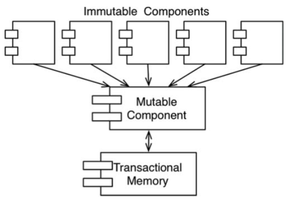

# Chapter 6: Functional Programming
------------


Bằng nhiều cách, các khái niệm của lập trình chức năng thậm chí đã có trước cả chính việc lập trình. Mẫu hình này hoàn toàn dựa trên $\lambda$-calculus được phát minh bởi Alonzo Church trong những năm 1930.


## Squares of Integers

Để giải thích thế nào là lập trình chức năng thì tốt nhất là chúng ta hãy xem xét một số ví dụ. Chúng ta hãy nghiên cứu một vấn đề đơn giản sau: in ra bình phường của 25 số nguyên đầu tiên.

Với java, ta có thể viết như sau:
```java
public class Squint {
    public static void main(String args[]) {
        for (int i = 0; i < 25; i++) {
            System.out.println(i*i);
        }
    }
}
```

Với ngôn ngữ như Clojure, một ngôn ngữ bắt nguồn từ Lisp, là kiểu ngôn ngữ chức năng, chúng ta có thể triển khai chương trình tương tự như sau:

```clojure
(println (take 25 (map (fn [x] (* x x)) (range))))
```

Nếu bạn không biết về Lisp, thì trông đoạn code này sẽ thấy lạ lẫm. Vì vậy tôi sẽ diễn giải một chút và thêm một vài bình luận.

```clojure
(println ;___________________ Print
    (take 25 ;_________________ the first 25
        (map (fn [x] (* x x)) ;__ squares
            (range)))) ;___________ of Integers
```
Rõ ràng là `println`, `take`, `map`, và `range` tất cả đều là các hàm chức năng. Trong Lisp, bạn gọi một chức năng bằng cách đặt nó trong dấu ngoặc đơn. Lấy ví dụ, `(range)` sẽ gọi hàm `range`.

Câu lệnh `(fn [x] (* x x))` là một hàm ẩn danh gọi tới nhiều hàm khác, truyền tham số đầu vào của nó hai lần. Nói cách khác, nó tính toán bình phương đầu vào của nó.

Nhìn vào tổng thể lần nữa, tốt nhất là chúng ta bắt đầu với hàm được gọi trong cùng.

- Hàm `range` trả về danh sách không giới hạn các số nguyên bắt đầu từ số 0.
- Danh sách này được truyền vào hàm `map`, nó gọi hàm bình phương ẩn danh với mỗi phần tử, và tạo ra một danh sách số bình phương mới.
- Danh sách số bình phương này được truyền vào trong hàm `take`, và trả về một danh sách mới với chỉ 25 phần tử đầu tiên.
- Hàm `println` in đầu vào của nó là danh sách của 25 số tự nhiên bình phương đầu tiên.

Nếu bạn thấy khiếp với cái khái niệm danh sách không giới hạn thì đừng lo. Chỉ 25 phần tử đầu tiên của danh sách không giới hạn đó là thực sự được tạo ra. Đó là bởi vì không phần tử nào của danh sách không giới hạn đó được tính ra cho đến khi nó được truy cập tới.

Nếu bạn thấy tất cả điều này gây khó hiểu thì bạn có thể tìm một khoảng thời gian thích hợp để học tất cả về Clojure và lập trình chức năng. Tôi không có ý định dạy tất cả các chủ đề đó ở đây.

Thay vào đó, mục tiêu của tôi là chỉ ra cho bạn thấy sự khác biệt rõ rệt giữa các chương trình Clojure và Java. Chương trình Java dùng một biến thay đổi được (mutable variable) – biến thay đổi trạng thái trong suốt quá trình thực thi của chương trình. Biến đó là biến điều khiển vòng lặp. Không có biến thay đổi được nào tồn tại trong chương trình dùng Clojure. Trong chương trình Clojure, các biến giống như x được khởi tạo, nhưng chúng không bao giờ được sửa đổi.

Điều này dẫn chúng ta tới một phát biểu gây ngạc nhiên: Các biến trong các functional language không thay đổi.


## Immutability and Architecture
Tại sao điểm này lại được coi là một điểm quan trọng của kiến trúc phần mềm. Tại sao các kiến trúc sư lại lo ngại về tính thay đổi được của các biến? Câu trả lời đơn giản vô cùng: Tất cả các tình trạng race, các tình trạng deadlock, và các vấn đề liên quan đến cập nhật dữ liệu đồng thời đều do các biến thay đổi giá trị được. Bạn sẽ không thể gặp phải tình trạng race hoặc vấn đề về cập nhật dữ liệu đồng thời nếu không biến nào được cập nhật cả. Bạn sẽ không thể bị deadlock nếu không có các khóa thay đổi được.

Nói cách khác, tất cả các vấn đề mà chúng ta gặp phải trong các ứng dụng đồng thời – tất cả các vấn đề chúng ta gặp phải trong các ứng dụng đòi hỏi đa luồng, và đa bộ xử lý – sẽ không thể xảy ra nếu không có các biến thay đổi được.

Với vai trò của một kiến trúc sư, bạn sẽ cần phải rất lưu ý tới các vấn đề của việc xử lý đồng thời. Bạn muốn đảm bảo rằng hệ thống mà bạn thiết kế sẽ bền vững kể cả với sự hiện diện của nhiều luồng và nhiều bộ xử lý. Câu hỏi mà bạn sẽ hỏi bản thân đó là tính không đổi có áp dụng thực tế được hay không.

Câu trả lời cho câu hỏi đó có thể khẳng định nếu bạn có được một nguồn không gian lưu trữ vô hạn và tốc độ xử lý vô hạn. Nếu những nguồn tài nguyên này không phải vô hạn, thì câu trả lời có bớt quả quyết đi một chút. Thực vậy, tính không đổi có thể áp dụng thực tế được, nếu chúng ta có một số thỏa hiệp nhất định.

Chúng ta hãy xem một vài thỏa hiệp như vậy.

## Segregation of Mutability

Một trong những thỏa hiệp phổ biến nhất liên quan tới tính không đổi đó là phân đoạn ứng dụng, hoặc các dịch vụ bên trong ứng dụng đó, thành những component thay đổi được (mutable component) và component không đổi được (immutable component). Các component không đổi thực hiện các nhiệm vụ của chúng theo cách lập trình chức năng thuần túy, mà không sử dụng bất cứ các biến thay đổi được nào. Các component không đổi được giao tiếp với một hoặc nhiều component khác không phải dạng chức năng thuần túy, và cho phép trạng thái của các biến được thay đổi 




Vì trạng thái thay đổi làm cho các component đó phải đối mặt với tất cả các vấn đề của việc xử lý đồng thời, nên một kinh nghiệm thông thường là sử dụng một loại bộ nhớ giao dịch (transactional memory) để bảo vệ các biến thay đổi được khỏi các cập nhật đồng thời và các tình trạng race (race condition).

Bộ nhớ giao dịch đơn giản là xem các biến trong bộ nhớ cũng tương tự như cách một cơ sở dữ liệu xử lý các bản ghi trên ổ đĩa lưu trữ. Nó bảo vệ những biến này theo kiểu một giao dịch – một kiểu dựa trên thử lại (retry-based).

Một ví dụ đơn giản cho cách tiếp cận này là chức năng atom của Clojure:

```clojure
(def counter (atom 0)) ; initialize counter to 0

(swap! counter inc) ; safely increment counter.
```
Trong đoạn code này, biến `counter` được định nghĩa là một `atom`. Trong Clojure, một `atom` là một dạng đặc biệt của biến mà giá trị của nó cho phép thay đổi với những điều kiện rất nghiêm ngặt mà được cưỡng bức bởi hàm `swap!`.

Hàm `swap!`chúng ta thấy ở đoạn code trên, có hai tham số: `atom`thay đổi được, và một hàm tính toán giá trị mới được lưu trong `atom` này. Trong đoạn code ví dụ của chúng ta, `counter` `atom` sẽ được thay đổi thành giá trị tính toán bởi hàm inc, đơn giản là tăng tham số của nó.

Chiến thuật được dùng bởi `swap!` là một thuật toán so sánh và hoán đổi truyền thống. Giá trị của `counter` được đọc và truyền cho inc. Khi inc trả về, giá trị của `counter` bị khóa và so sánh với giá trị được truyền cho inc. Nếu giá trị này như nhau thì giá trị trả về bởi inc được lưu trữ trong `counter` và khóa sẽ được mở. Nếu ngược lại thì khóa đóng và chiến thuật này được thử lại từ đầu.

Hàm `atom` đủ dùng cho những ứng dụng đơn giản. Không may là nó không thể đảm bảo an toàn hoàn toàn cho việc cập nhật đồng thời và deadlock nếu nhiều biến phụ thuộc cùng tham gia. Trong những trường hợp đó chúng ta có thể sử dụng các phương tiện thích hợp hơn.

Điều tôi muốn nói ở đây là những chương trình có cấu trúc tốt sẽ được phân đoạn thành những component không thay đổi giá trị biến và những component thay đổi biến. Kiểu phân đoạn này được hỗ trợ bằng việc sử dụng những công cụ thích hợp để bảo vệ những biến thay đổi được này.

Các kiến trúc sư sẽ cần phải khôn ngoan để đẩy việc xử lý dữ liệu vào những component không thay đổi được càng nhiều càng tốt, và chuyển càng nhiều code càng tốt ra khỏi những component mà bắt buộc phải cho phép thay đổi giá trị biến.

## Event sourcing

Những giới hạn của bộ nhớ và năng lực xử lý đang nhanh chóng được mở rộng. Ngày nay các bộ xử lý thông thường có thể xử lý hàng tỷ câu lệnh mỗi giây và RAM có tới hàng tỷ byte. Chúng ta càng có nhiều bộ nhớ, và bộ xử lý càng nhanh thì chúng ta càng ít cần trạng thái thay đổi được.

Lấy một ví dụ đơn giản, hãy tưởng tượng một ứng dụng ngân hàng đảm bảo duy trì số dư tài khoản của các khách hàng. Nó thay đổi những số dư này khi các giao dịch rút tiền và gửi tiền được thực hiện.

Bây giờ bạn hãy tưởng tượng rằng thay vì lưu số dư tài khoản, chúng ta chỉ lưu các giao dịch. Bất cứ khi nào ai dó muốn biết về số dư của một tài khoản, chúng ta chỉ đơn giản cộng vào tất cả các giao dịch của tài khoản đó, từ lúc ban đầu. Phương pháp này không đòi hỏi phải có những biến thay đổi được.

Hiển nhiên, cách tiếp cận này nghe có vẻ vô lý. Trải qua thời gian, số lượng các giao dịch sẽ tăng lên mà không có giới hạn, và năng lực xử lý đòi hỏi để tính toán số tổng sẽ trở nên không thể chịu nổi. Để làm cho phương pháp này hoạt động mãi mãi, chúng ta sẽ cần một bộ nhớ không giới hạn và năng lực xử lý không giới hạn.

Nhưng có lẽ chúng ta sẽ không phải làm cho phương pháp này hoạt động mãi mãi. Và có lẽ chúng ta sẽ có đủ không gian nhớ và đủ năng lực tính toán để làm cho phương pháp tính này hoạt động trong một tuổi thọ thích hợp của ứng dụng này.

Đây là ý tưởng đằng sau nguồn sự kiện (event sourcing[1]). Nguồn sự kiện là một chiến thuật mà ở đó chúng ta lưu các giao dịch, chứ không phải trạng thái. Khi cần truy xuất trạng thái, chúng ta chỉ đơn giản áp dụng tất cả các giao dịch từ lúc bắt đầu.

Dĩ nhiên, chúng ta có thể đi đường tắt. Lấy ví dụ, chúng ta có thể tính toán và lưu trạng thái sau mỗi buổi đêm. Sau đó, khi cần dữ liệu trạng thái, chúng ta chỉ cần tính toán các giao dịch tính từ lúc nửa đêm.

Bây giờ hãy xem yêu cầu về việc lưu trữ dữ liệu của phương pháp này: Chúng ta sẽ cần rất nhiều không gian nhớ. Thực tế là, bộ nhớ dữ liệu hiện đang phát triển nhanh đến nỗi bây giờ chúng ta xem hàng nghìn tỷ byte chỉ là con số nhỏ – vì vậy có thể xem như chúng ta có rất nhiều bộ nhớ.

Quan trọng hơn nữa, không gì bị xóa hoặc bị cập nhật từ bộ nhớ dữ liệu như vậy. Kết quả là ứng dụng của chúng ta không phải CRUD[2]; mà chúng chỉ phải CR. Ngoài ra, vì cả việc cập nhật và việc xóa đều không xảy ra trong bộ nhớ dữ liệu, nên sẽ không thể có bất kỳ sự cố cập nhật đồng thời nào xảy ra.

Nếu chúng ta có đủ không gian bộ nhớ và có đủ năng lực xử lý tính toán, chúng ta có thể làm cho ứng dụng của mình hoàn toàn không thay đổi được – và do đó hoàn toàn là chức năng.

Nếu điều này vẫn nghe vô lý, thì có thể hữu ích nếu bạn nhớ rằng đây chính xác là cách mà hệ thống quản lý mã nguồn của bạn hoạt động đấy.

## Conclusion

Để tổng kết:

- Lập trình cấu trúc là kỷ luật áp đặt với việc chuyển giao điều khiển trực tiếp.
- Lập trình hướng đối tượng là kỷ luật áp đặt với việc chuyển giao điều khiển gián tiếp.
- Lập trình chức năng là kỷ luật áp đặt với việc gán giá trị biến.
Mỗi loại trong ba mẫu hình này đều lấy đi một thứ gì đó từ chúng ta. Mỗi loại đều hạn chế một khía cạnh nào đó về cách mà chúng ta viết code. Không một loại mẫu hình nào cho chúng ta thêm một sức mạnh hay một khả năng nào cả.

Cái mà chúng ta đã học qua một nửa thế kỷ vừa qua là những cái mà chúng ta không nên làm (*What we have learned over the last half-century is what not to do.*).

Với nhận thức đó, chúng ta phải đối diện với một sự thật không hề dễ chịu: Phần mềm không phải là công nghệ phát triển nhanh chóng. Các nguyên tắc của phần mềm ngày nay thì vẫn như vậy so với năm 1946, khi mà Alan Turing đã viết những dòng code đầu tiên chạy trên máy tính điện tử. Các công cụ thì đã thay đổi, kể cả phần cứng cũng đã thay đổi, nhưng bản chất của phần mềm thì vẫn giữ nguyên. Phần mềm – các chương trình máy tính – được viết ra từ các chuỗi, lựa chọn, lặp lại, và gián tiếp. Không hơn. Không kém.