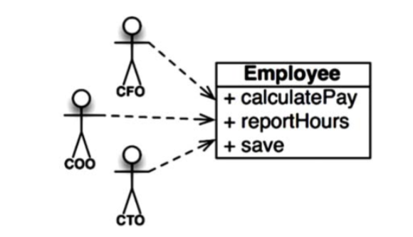
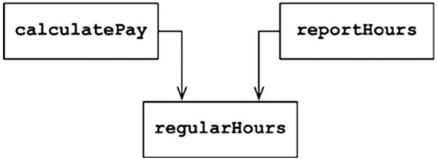
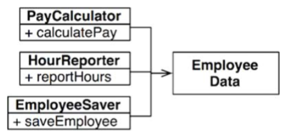
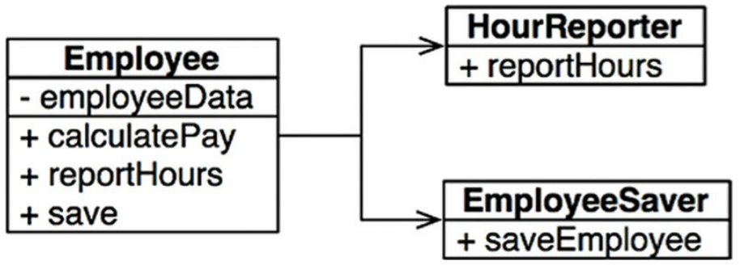

# Design Principles
----------------

Các hệ thống phần mềm tốt đều bắt đầu với việc làm cho code sạch sẽ. Một mặt, nếu các viên gạch không được làm tốt thì kiến trúc của tòa nhà cũng sẽ không có ý nghĩa gì. Mặt khác, từ những viên gạch tốt bạn cũng có thể tạo ra một đống hỗn độn. Đó chính là lý do các nguyên lý SOLID cần được áp dụng.

Các nguyên lý SOLID chỉ cho chúng ta biết cách để sắp xếp các hàm và cấu trúc dữ liệu của chúng ta thành những lớp, và những lớp này cần được liên kết với nhau như thế nào. Việc dùng từ “lớp” không có ý ám chỉ rằng những nguyên lý chỉ áp dụng được cho phần mềm hướng đối tượng. Một lớp chỉ đơn giản là một nhóm các hàm và dữ liệu được gắn kết với nhau. Mọi hệ thống phần mềm đều có những nhóm như vậy, mặc dù chúng có được gọi là lớp hay không. Các nguyên lý SOLID đều có thể áp dụng cho những nhóm này.

Mục đích của những nguyên lý này là để tạo ra các cấu trúc phần mềm cấp trung để:

- Dễ thay đổi.
- Dễ hiểu.
- Trở thành các component cơ bản để có thể dùng được trong nhiều hệ thống phần mềm.

Thuật ngữ “cấp trung” đề cập đến thực tế là những nguyên lý này được áp dụng bởi những lập trình viên làm việc ở cấp độ module. Chúng được áp dụng ngay phía trên cấp độ code và giúp xác định được loại cấu trúc phần mềm được sử dụng bên trong các module và các component.

Cũng giống như có khả năng tạo ra một đống hỗn độn từ những viên gạch tốt, việc tạo ra một đống hỗn độn trên toàn hệ thống từ những component cấp trung được thiết kế tốt cũng có thể xảy ra. Vì lý do này, một khi chúng ta nói xong các nguyên lý SOLID này, chúng ta sẽ di chuyển tới nguyên lý này trong thế giới component, và sau đó là tới các nguyên lý của kiến trúc cấp cao.

Lịch sử của các nguyên lý SOLID này thì khá dài. Tôi đã bắt đầu ráp chúng lại với nhau vào cuối những năm 1980 trong khi tranh luận về các nguyên lý thiết kế phần mềm với những người khác trên mạng USENET (một dạng sơ khai của Facebook). Trải qua nhiều năm, các nguyên lý này cũng đã xê dịch và thay đổi. Một số đã bị xóa bỏ. Một số khác thì được gộp lại với nhau. Một số khác thì được thêm vào. Nhóm cuối cùng đã được ổn định vào đầu những năm 2000, mặc dù tôi đã thể hiện chúng với một thứ tự khác.

Khoảng vào năm 2004, Michael Feathers đã gửi cho tôi một email nói rằng tôi có thể sắp xếp lại những nguyên lý đó được không, những chữ cái đầu tiên của chúng được đánh vần thành từ SOLID – và do đó các nguyên lý SOLID đã ra đời.

Các chương sau sẽ mô tả từng nguyên lý này một cách tỉ mỉ. Ở đây chúng ta có thể tổng quát như sau:

- SRP: Single Responsibility Principle (Nguyên Lý Đơn Nhiệm). Một hệ quả tích cực đối với luật Conway: cấu trúc tốt nhất đối với một hệ thống phần mềm bị ảnh hưởng nhiều bởi cấu trúc xã hội của tổ chức sử dụng nó sao cho mỗi module phần mềm có một và chỉ một lý do để thay đổi.
- OCP: Open-Closed Principle (Nguyên Lý Mở-Đóng). Bertrand Meyer đã làm cho nguyên lý này trở nên nổi tiếng vào những năm 1980. Ý chính ở đây là làm sao cho hệ thống phần mềm có thể dễ dàng thay đổi được, chúng phải được thiết kế để cho phép hành vi của những hệ thống này được thay đổi bằng cách thêm code mới, hơn là thay đổi code hiện có.
- LSP: Liskov Substitution Principle (Nguyên Lý Thay Thế Liskov). Định nghĩa nổi tiếng của Barbara Liskov về kiểu phụ (subtype), từ năm 1988. Nói ngắn gọn, nguyên lý này nói rằng để xây dựng hệ thống phần mềm từ những phần thay thế lẫn nhau được, thì các bộ phận đó phải tuân theo một nguyên tắc cho phép các bộ phận đó có thể thay thế cho nhau được.
- ISP: Interface Segregation Principle (Nguyên Lý Tách Riêng Interface). Nguyên lý này khuyên những người thiết kế phần mềm tránh phụ thuộc vào những thứ mà họ không dùng.
- DIP: Dependency Inversion Principle (Nguyên Lý Đảo Ngược Phụ Thuộc). Code triển khai chức năng ở tầng cao không nên phụ thuộc vào code triển khai chi tiết ở tầng thấp. Thay vào đó, phần triển khai chi tiết cần phải phụ thuộc vào chức năng ở tầng cao.

Những nguyên lý này được mô tả chi tiết trong nhiều cuốn sách đã được xuất bản trong nhiều năm qua. Các chương sau sẽ tập trung vào ý nghĩa đối với kiến trúc phần mềm của những nguyên lý này thay vì lặp lại những cuộc thảo luận chi tiết. 

# Chapter 7: SRP - The Single Responbility Principle
--------------

Trong tất cả các nguyên lý SOLID thì Nguyên Lý Đơn Nhiệm SRP có lẽ ít được hiểu đúng nhất. Có vẻ đó là do nó có một cái tên không thực sự đúng. Các lập trình viên quá dễ dàng để nghe tên và sau đó cho rằng nó có nghĩa là mỗi module chỉ nên làm một việc duy nhất.

Đừng nhầm lẫn, có một nguyên lý như vậy. Một hàm nên làm một và chỉ một thứ duy nhất. Chúng ta dùng nguyên lý đó khi chúng ta refactor các hàm lớn thành những hàm nhỏ hơn; chúng ta dùng nó ở các mức thấp nhất. Nhưng đó không phải là một trong những nguyên lý SOLID – đó không phải là SRP.

Trong lịch sử, nguyên lý SRP đã được mô tả theo cách sau:

*A module should have one, and only one, reason to change (Một module chỉ nên có một và chỉ một lý do duy nhất để thay đổi)*

Các hệ thống phần mềm được thay đổi để thỏa mãn các người dùng và các khách hàng; những người dùng và khách hàng này là “lý do để thay đổi” mà nguyên lý này đã đề cập tới. Quả thực, chúng ta có thể nói lại nguyên lý này như sau:

*A module should be responsible to one, and only one, user or stakholder (Một module chỉ nên chịu trách nhiệm cho một và chỉ một người dùng hoặc khách hàng duy nhất)*

Thật không may, các từ “người dùng” và “khách hàng” không thực sự là từ chính xác được dùng ở đây. Có thể sẽ có nhiều hơn một người dùng hoặc khách hàng đều muốn hệ thống thay đổi theo cách giống nhau. Thay vào đó, chúng ta sẽ thể hiện bằng một nhóm – một hoặc nhiều người yêu cầu thay đổi đó. Chúng ta sẽ gọi nhóm đó là một 'actor' (diễn viên).

Do đó phiên bản cuối cùng của SRP là:

*A module should be responsible to one, and only one, actor*

Bây giờ, từ “module” mà chúng ta nói tới có nghĩa là gì? Định nghĩa đơn giản nhất thì đó là một file mã nguồn. Đa phần thì định nghĩa đó là đúng. Mặc dù, một số ngôn ngữ và môi trường phát triển phần mềm không dùng các file mã nguồn để chứa code của chúng. Trong những trường hợp đó một module có thể coi là một tập hợp các hàm và cấu trúc dữ liệu liên hệ chặt chẽ với nhau.

Từ “liên kết chặt chẽ - cohesive”  ám chỉ tới SRP. Liên kết chặt chẽ đó là lực gắn kết phần code chịu trách nhiệm cho một actor lại với nhau.

Có lẽ cách tốt nhất để hiểu về nguyên lý này là hãy xem những dấu hiệu vi phạm nó.

## Symmptom 1: Accidental Duplication

Ví dụ ưa thích của tôi đó là lớp `Employee` trong một ứng dụng trả lương tháng. Nó có ba method: `calculatePay()`, `reportHours()`, và `save()` 

Lớp này vi phạm SRP bởi vì ba method này chịu trách nhiệm cho ba actor rất khác nhau.

- Method `calculatePay()` được dành cho bộ phận kế toán, báo cáo lại cho CFO.
- Method `reportHours()` được dành cho bộ phận nhân sự, báo cáo lại cho COO.
- Method `save()` được dành cho những admin quản lý dữ liệu (DBA), báo cáo lại cho CTO.

Việc đặt mã nguồn của cả ba method này vào trong một lớp `Employee` duy nhất sẽ làm cho một actor này bị ràng buộc bởi một actor khác. Sự ràng buộc này có thể khiến hành vi của nhóm CFO sẽ ảnh hưởng tới thứ gì đó mà nhóm COO phụ thuộc vào.

Lấy ví dụ, cứ cho là hàm `calculatePay()`và hàm `reportHours()` chia sẻ một thuật toán chung để tính toán số giờ không phải làm thêm. Cũng cho là các lập trình viên đó, đã cẩn thận không để bị lặp code và đặt thuật toán đó vào một hàm tên là `regularHours()`

Bây giờ nếu nhóm của CFO quyết định cách tính giờ không làm thêm cần phải được thay đổi. Ngược lại, nhóm của COO trong phòng nhân sự lại không muốn thay đổi đó bởi vì họ dùng số giờ không làm thêm cho một mục đích khác.

Một lập trình viên được giao nhiệm vụ thực hiện thay đổi này, và thấy rằng hàm `regularHours()` được gọi bởi method `calculatePay()`. Không may thay, lập trình viên đó không chú ý rằng hàm đó cũng được gọi bởi hàm `reportHours()`.

Lập trình viên đó đã thực hiện thay đổi được yêu cầu và kiểm tra nó cẩn thận. Nhóm của CFO đã xác nhận hàm mới hoạt động như mong muốn và hệ thống cuối cùng được triển khai.

Dĩ nhiên, nhóm của COO thì không biết về điều gì đang xảy ra. Nhân viên HR tiếp tục dùng bản báo cáo được tạo ra bởi hàm `reportHours()` – nhưng bây giờ chúng không còn cho con số chính xác nữa. Cuối cùng vấn đề này đã được phát hiện, và COO thì tái mặt vì dữ liệu sai đã khiến công ty mất hàng triệu đô-la.

Tất cả chúng ta đã thấy điều gì đã xảy ra. Các vấn đề này xảy ra bởi vì chúng ta đã đặt phần code mà những actor khác nhau phụ thuộc vào đó quá gần nhau. SRP chỉ ra rằng cần phải tách biệt phần code mà những actor khác nhau phụ thuộc vào đó (*separate the code that different actors depend on*).

## Symptom 2: Merges

Không quá khó để tưởng tượng việc ghép sẽ là bình thường đối với các file mã nguồn bao gồm nhiều method khác nhau. Tình huống này đặc biệt có thể xảy ra nếu những method đó chịu trách nhiệm cho các actor khác nhau.

Lấy ví dụ, cho là admin quản trị dữ liệu trong nhóm của CTO quyết định sẽ thay đổi schema đơn giản của bảng Employee trong cơ sở dữ liệu. Cũng cho là thư ký HR trong nhóm của COO quyết định rằng họ cần một thay đổi định dạng của bản báo cáo thời gian làm việc.

Hai lập trình viên khác nhau, có thể từ hai nhóm khác nhau, lấy về mã nguồn lớp Employee và bắt đầu thực hiện việc thay đổi. Không may thay, những thay đổi của họ lại bị xung đột. Kết quả là phải ghép mã nguồn.

Tôi có lẽ không cần phải nói cho bạn việc ghép mã nguồn là một công việc nguy hiểm. Các công cụ của chúng ta ngày nay khá tốt, nhưng không một công cụ nào có thể giải quyết được mọi trường hợp ghép mã nguồn. Cuối cùng thì nó sẽ luôn luôn tồn tại những rủi rõ.

Trong ví dụ của chúng ta, việc ghép dữ liệu đặt cả CTO và COO vào một mối nguy. Chúng ta cũng không lường được rằng liệu CFO có bị ảnh hưởng hay không.

Có nhiều dầu hiệu khác mà chúng ta có thể tìm hiểu, nhưng tất cả chúng đều liên quan tới việc nhiều người thay đổi cùng một file mã nguồn vì những lý do khác nhau.

Một lần nữa, cách thức để tránh gặp phải vấn đề này là cần phải tách biệt code dành cho các actor khác nhau ra.

## Solutions

Có nhiều giải pháp khác nhau cho vấn đề này. Mỗi cách sẽ di chuyển những hàm này vào những lớp khác nhau.

Có lẽ cách hiển nhiên nhất để giải quyết vấn đề là tách biệt dữ liệu khỏi các hàm. Ba lớp chia sẻ truy cập tới `EmployeeData`, đó là một cấu trúc dữ liệu đơn giản không có method nào (Hình 7.3). Mỗi lớp chỉ giữ mã nguồn cần thiết cho các hàm đặc trưng của nó. Ba lớp này cũng không được phép biết về nhau. Do đó bất cứ sự lặp lại vô tình nào cũng sẽ tránh được

Hạn chế của phương án này đó là các lập trình viên bây giờ có ba lớp mà họ phải khởi tạo và theo dõi. Một giải pháp phổ biến cho vấn đề này là dùng *Facade pattern* (Hình 7.4)

`EmployeeFacade` chỉ bao gồm rất ít code. Nó chịu trách nhiệm khởi tạo và chuyển việc thực hiện chức năng cho những lớp này.

Một vài lập trình viên thì thích việc giữ cho phần logic nghiệp vụ quan trọng nhất nằm gần với dữ liệu. Việc này có thể thực hiện bằng cách giữ cho method quan trọng nhất nằm trong lớp `Employee` ban đầu và sau đó dùng lớp đó như là một Facade cho các method ít quan trọng hơn.

Bạn có thể phản đối những giải pháp này trên cơ sở là mọi lớp sẽ chỉ chứa một method. Điều này hầu như sẽ không xảy ra. Số lượng các method cần để tính toán lương, tạo một báo cáo, và lưu dữ liệu có thể lớn hơn trong mỗi trường hợp. Mỗi lớp này sẽ có nhiều method private trong chúng.

Mỗi lớp này bao gồm một họ các method được xem là thuộc cùng một phạm vi. Bên ngoài phạm vi đó thì không ai biết những thành viên private của họ đó tồn tại.

## Conclusion

*The Single Responbility Principle* nói về các method và các lớp – nhưng nó thể hiện dưới một dạng khác ở hai cấp cao hơn. Ở cấp độ component, nó trở thành Nguyên Lý Đóng Chung (Common Closure Principle). Ở cấp độ kiến trúc, nó trở thành Trục Thay Đổi (Axis of Change) chịu trách nhiệm cho việc tạo ra các ranh giới kiến trúc. Chúng ta sẽ nghiên cứu tất cả các ý tưởng này trong các chương tiếp theo.