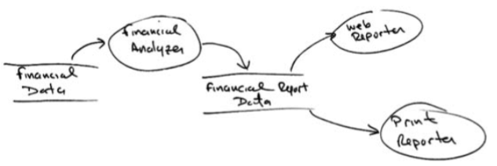
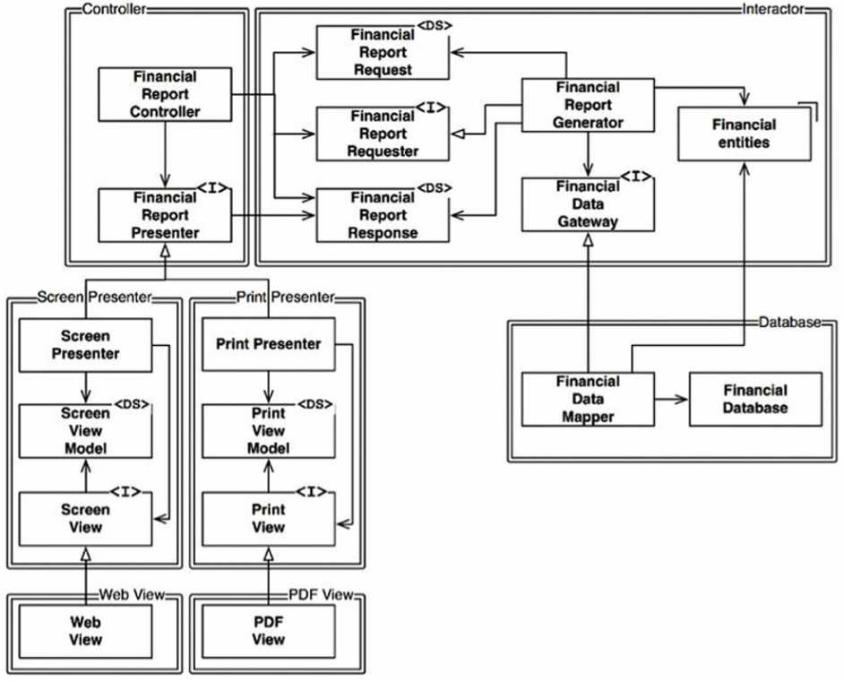
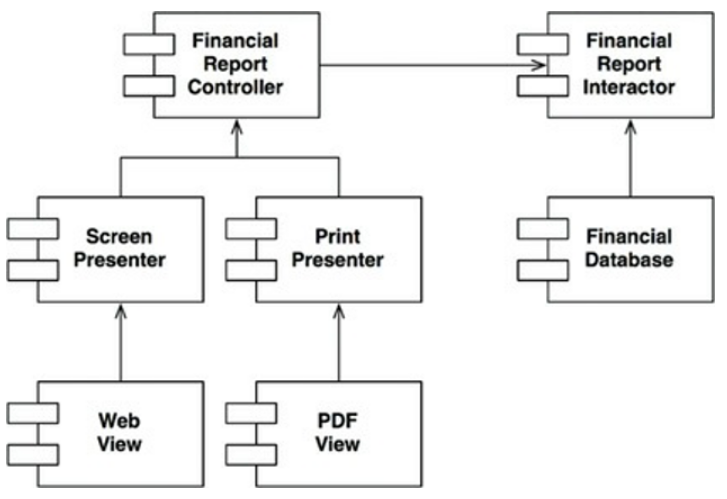

# Chapter 8: The Open - Closed principle
-------------

Nguyên lý OCP được đưa ra vào năm 1988 bởi Bertrand Meyer. Nguyên lý này nói rằng:

*A software artifact should be open for extension but closed for modification (Phần mềm phải mở cho việc mở rộng nhưng phải đóng cho việc sửa đổi)*

Nói cách khác, hành vi của một phần mềm có thể được mở rộng, mà không phải sửa đổi nó.

Dĩ nhiên điều này là nguyên nhân căn bản nhất mà chúng ta nghiên cứu kiến trúc phần mềm. Rõ ràng là nếu một việc yêu cầu mở rộng đơn giản mà lại buộc phải có những thay đổi to lớn đối với phần mềm thì kiến trúc sư của hệ thống phần mềm đó đã có một thất bại rõ ràng.

Phần lớn các sinh viên thiết kế phần mềm đều nhận ra rằng OCP là nguyên lý hướng dẫn họ trong việc thiết kế các lớp và module. Nhưng nguyên lý này thậm chí còn có ý nghĩa to lớn hơn khi chúng ta xem xét tới cấp độ của các component kiến trúc.

Một thử nghiệm được cân nhắc sẽ làm rõ điều này.

## A thought experiment

Hãy tưởng tượng, tại một thời điểm, chúng ta có một hệ thống hiển thị tổng kết tài chính trên một trang web. Dữ liệu trên trang này có thể cuộn được, và các số âm được tô màu đỏ.

Bây giờ hãy tưởng tượng các khách hàng yêu cầu thông tin tương tự như vậy được chuyển thành một bản báo cáo được in trên giấy đen trắng. Báo cáo này cần được phân trang cho đúng, với các đầu trang, cuối trang, và nhãn các cột thích hợp. Các số âm cần được bao quanh bởi dấu ngoặc đơn.

Rõ ràng là một số code mới phải được viết. Nhưng bao nhiêu code cũ sẽ phải thay đổi đây?

Một kiến trúc phần mềm tốt sẽ giảm lượng code phải thay đổi xuống tới mức tối thiểu. Lý tưởng sẽ là không phải thay đổi.

Như thế nào? Bằng cách tách biệt một cách hợp lý những thứ có khả năng thay đổi vì những lý do khác nhau (Nguyên Lý Đơn Nhiệm), và sau đó tổ chức lại các phụ thuộc của những thứ đó (Nguyên Lý Đảo Ngược Phụ Thuộc).

Bằng cách áp dụng SRP, chúng ta có thể có được cái nhìn về luồng dữ liệu như chỉ ra ở Hình 8.1. Một số quy trình phân tích kiểm tra dữ liệu tài chính và tạo ra dữ liệu có thể báo cáo được, sau đó nó được định dạng một cách thích hợp bởi hai bộ xử lý báo cáo.

Căn bản ở đây là việc tạo ra báo cáo liên quan tới hai trách nhiệm riêng biệt: tính toán ra dữ liệu báo cáo, và biểu diễn dữ liệu đó thành biểu mẫu dạng web và dạng cho máy in.

Có được sự tách biệt này rồi chúng ta cần tổ chức lại các phụ thuộc mã nguồn để đảm bảo rằng những thay đổi tới một trong những trách nhiệm đó không gây ra những thay đổi ở những cái khác. Ngoài ra, sự tổ chức mới cần phải đảm bảo rằng hành vi đó có thể được mở rộng mà không phải thực hiện việc sửa đổi.

Chúng ta đạt được điều này bằng cách phân vùng các hoạt động xử lý thành những lớp, và tách biệt những lớp đó thành các component, như chỉ ra bởi các đường kép trong biểu đồ ở Hình 8.2. Trong hình này, component ở góc trên bên trái là *Controller* (bộ điều khiển). Ở góc trên bên phải, chúng ta có *Interactor* (bộ tương tác). Ở góc dưới bên phải là *Database* (cơ sở dữ liệu). Cuối cùng, ở góc dưới bên trái là bốn component thể hiện các *Presenter* và các *View*.

Các lớp được đánh dấu `<I>` là các interface; còn các lớp được đánh dấu `<DS>` là các cấu trúc dữ liệu (Data Structure). Đầu mũi tên mở nghĩa là các mối liên hệ sử dụng. Đầu mũi tên đóng nghĩa là các mối liên hệ triển khai hoặc kế thừa.

Điều đầu tiên cần chú ý đó là tất cả các phụ thuộc ở đây đều là các phụ thuộc mã nguồn. Một mũi tên chỉ từ lớp A sang lớp B nghĩa là mã nguồn của lớp A có gọi tới tên của lớp B, nhưng lớp B không gọi gì tới lớp A. Do đó, trong Hình trên, `FinancialDataMapper` biết về `FinancialDataGateway` thông qua mối liên hệ triển khai, nhưng `FinancialDataGateway` không biết chút gì về `FinancialDataMapper`.

Điều chú ý nữa là mỗi đường kép chỉ được cắt theo một hướng duy nhất. Điều này có nghĩa là mối liên hệ giữa tất cả các component là đều đơn hướng, như thấy trong biểu đồ component ở hình dưới. Các mũi tên này chỉ hướng về các component mà chúng ta muốn bảo vệ khỏi thay đổi.

Hãy để tôi nói lại lần nữa: Nếu component A được bảo vệ khỏi những thay đổi trong component B thì component B nên phụ thuộc vào component A.

Chúng ta muốn bảo vệ *Controller* khỏi những thay đổi trong *Presenters*. Chúng ta muốn bảo vệ *Presenters* khỏi những thay đổi trong *Views*. Chúng ta muốn bảo vệ *Interactor* khỏi những thay đổi từ bất cứ cái gì.

*Interactor* nằm ở vị trí thích hợp nhất để thực hiện nguyên lý OCP. Những thay đổi về Database, hoặc *Controller*, hoặc *Presenters*, hoặc *Views*, sẽ không gây ảnh hưởng gì đến *Interactor*.

Tại sao *Interactor* cần phải giữ vị trí đặc quyền như vậy? Bởi vì nó bao gồm tất cả các quy tắc nghiệp vụ (business rules). *Interactor* bao gồm các logic ở cấp cao nhất của ứng dụng. Tất cả các component khác thì sẽ xử lý với các vấn đề ngoại vi. *Interactor* thì sẽ xử lý vấn đề trung tâm.

Mặc dù *Controller* là ngoại vi đối với *Interactor*, nhưng nó vẫn là trung tâm của *Presenters* và *Views*. Và trong khi *Presenters* có thể là ngoại vi của *Controller*, nhưng chúng lại là trung tâm đối với *Views*.

Lưu ý rằng điều này tạo ra một hệ thống phân cấp bảo vệ dựa trên khái niệm “cấp độ”. *Interactors* là khái niệm ở cấp cao nhất, vì vậy chúng được bảo vệ nhiều nhất. *Views* là một trong những khái niệm ở cấp độ thấp nhất, vì vậy chúng ít được bảo vệ nhất. *Presenters* có cấp độ cao hơn *Views*, nhưng thấp hơn so với *Controller* hoặc *Interactor*.

Đây chính là cách mà OCP hoạt động ở cấp độ kiến trúc. Các kiến trúc sư sẽ tách biệt chức năng dựa trên câu hỏi như thế nào, tại sao, và khi nào thì nó bị thay đổi, và sau đó tổ chức các chức năng tách biệt đó thành một hệ thống phân cấp của các component. Các component ở cấp cao trong hệ thống phân cấp đó sẽ được bảo vệ khỏi những thay đổi từ những component ở cấp thấp hơn.

## Directional Control
Nếu bạn thấy sợ hãi với thiết kế lớp như thấy ở trên thì hãy nhìn lại. Phần lớn sự phức tạp trong biểu đồ đó là có mục đích để đảm bảo rằng các phụ thuộc giữa các component được trỏ cho đúng hướng.

Lấy ví dụ, inteface `FinancialDataGateway` giữa `FinancialReportGenerator` và `FinancialDataMapper` tồn tại để đảo sự ngược phụ thuộc, nếu không sẽ trỏ từ component *Interactor* tới component *Database*. Điều này cũng đúng với interface `FinancialReportPresenter`, và hai interface *View*.

## Information Hiding
*Interface* *FinancialReportRequester* lại nhằm mục đích khác. Nó được dùng để bảo vệ tránh *FinancialReportController* biết quá nhiều về bên trong của *Interactor*. Nếu *interface* này không có thì Controller sẽ có phụ thuộc bắc cầu với *FinancialEntities*.

Các phụ thuộc bắc cầu vi phạm nguyên lý tổng quát đó là các thực thể phần mềm không được phụ thuộc vào thứ mà chúng không dùng trực tiếp. Chúng ta sẽ gặp lại nguyên lý đó lần nữa khi chúng ta nói về Nguyên Lý Tách Biệt *Interface* (*Interface* Segregation Principle) và Nguyên Lý Tái Sử Dụng Chung (Common Reuse Principle).

Vì vậy, mặc dù ưu tiên đầu tiên của chúng ta là bảo vệ *Interactor* khỏi những thay đổi từ *Controller*, nhưng chúng ta cũng muốn bảo vệ *Controller* khỏi những thay đổi từ *Interactor* bằng cách ẩn những thông tin bên trong của *Interactor*.

## Conclusion
OCP là một trong những động lực thúc đẩy kiến trúc của hệ thống phần mềm. Mục đích là làm cho hệ thống có thể dễ dàng mở rộng mà không gặp phải tình trạng phải thay đổi quá nhiều. Mục đích này đạt được bằng cách phân chia hệ thống thành những component, và sắp xếp những component này thành một hệ thống phân cấp phụ thuộc để bảo vệ những component ở cấp cao khỏi những thay đổi từ những component ở cấp thấp hơn.