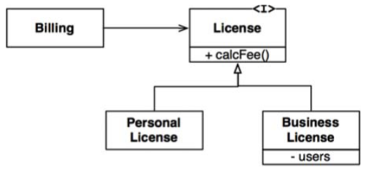
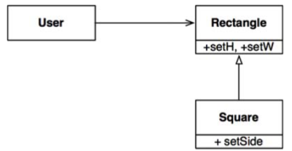

# Chapter 9 : LSP - The Liskov Substitution Principle
-------------

Vào năm 1988, Barbara Liskov đã viết như sau để định nghĩa các subtype (kiểu phụ)

*What is wanter here is something like the following substitution property: If for each object 01 of type S there is an object o2 of type T such that for all programs P defined in terms of T, the behavior of P is unchanged when o1 is substituted o2 then S is a subtype of T (Thứ cần ở đây là một thứ gì đó đại loại có đặc tính thay thế như sau: Nếu đối với mỗi đối tượng o1 của kiểu S có một đối tượng o2 của kiểu T sao cho tất cả các chương trình P được định nghĩa theo T, thì hành vi của P không bị thay đổi khi o1 được thay thế bởi o2 thì khi đó S là một subtype của T)*

Để hiểu ý tưởng này, được biết đến là Nguyên Lý Thay Thế Liskov (LSP), chúng ta hãy nhìn vào một số ví dụ.

## Guiding the use of Inheritance
Hãy tưởng tượng chúng ta có một lớp tên là `License`, như thấy ở hình dưới đây. Lớp này có một method tên là `calcFee()`, được gọi bởi ứng dụng Billing. Có hai subtype của `License`: `PersonalLicense` và `BusinessLicense`. Chúng dùng các thuật toán khác nhau để tính toán phí giấy phép sử dụng.



Thiết kế này tuân thủ theo nguyên lý LSP bởi vì hành vi của ứng dụng `Billing` dù thế nào đi nữa cũng không phụ thuộc vào hai subtype mà nó sử dụng. Cả hai subtype này đều có thể được thay thế cho kiểu `License`.


## The Square/Rectangle problem
Một ví dụ kinh điển vi phạm nguyên lý LSP đó là vấn đề hình vuông/hình chữ nhật nổi tiếng (hoặc không nổi tiếng, tùy theo quan điểm của bạn) 




Trong ví dụ này, `Square` không phải là một subtype đúng của `Rectangle` bởi vì chiều cao và chiều rộng của `Rectangle` có thể thay đổi độc lập với nhau; ngược lại, chiều cao và chiều rộng của `Square` buộc phải thay đổi cùng nhau. Do đó lớp User nghĩ rằng nó đang giao tiếp với một `Rectangle` thì nó có thể dễ dàng bị nhầm lẫn. Đoạn code sau chỉ ra tại sao:

```c
Rectangle r = ....
r.setW(5);
r.setH(2);
assert(r.area() == 10);
```

Nếu đoạn code … tạo ra một `Square`, thì câu lệnh assert trên sẽ lỗi.

Các duy nhất để chống lại kiểu vi phạm LSP như vậy là thêm các cơ chế cho lớp User (ví dụ như lệnh if) để phát hiện xem `Rectangle` có phải là `Square` hay không. Do hành vi của User bị phụ thuộc vào loại mà nó dùng nên những loại đó không thay thế cho nhau được.

## LSP and architecture
Trong những năm đầu của cuộc cách mạng hướng đối tượng, chúng tôi đã nghĩ LSP là cách hướng dẫn để sử dụng tính kế thừa, như chỉ ra trong các phần trước. Tuy nhiên, trải qua nhiều năm, LSP đã chuyển hóa thành một nguyên lý thiết kế phần mềm rộng hơn, gắn liền với các interface và các cách triển khai.

Các interface trong câu hỏi có thể có nhiều dạng. Chúng ta có thể có interface kiểu Java, được triển khai bằng vài lớp. Hoặc chúng ta có thể có vài lớp Ruby chia sẻ các mẫu method giống nhau. Hoặc chúng ta có thể có một tập các dịch vụ mà tất cả phản hồi cho cùng một interface REST.

Trong tất cả các tình huống này, hoặc hơn nữa, LSP đều có thể áp dụng được bởi vì luôn có những người dùng phụ thuộc vào các interface được định nghĩa tốt, và vào khả năng thay thế của các cách triển khai những interface đó.

Cách tốt nhất để hiểu về LSP là từ quan điểm kiến trúc để nhìn thấy điều gì sẽ xảy ra với kiến trúc của hệ thống khi nguyên lý này bị vi phạm.

## Example LSP violation
Giả sử chúng ta đang xây dựng một bộ tổng hợp cho nhiều dịch vụ cung cấp xe taxi. Các khách hàng dùng website của chúng ta để tìm xe taxi thích hợp nhất để đi, không quan tâm tới taxi của hãng nào. Sau khi khách hàng đã lựa chọn, thì hệ thống của chúng ta sẽ gửi lệnh tới taxi được lựa chọn bằng cách dùng một dịch vụ REST.

Bây giờ giả sử URI của dịch vụ REST này là một phần thông tin được lưu trữ trong cơ sở dữ liệu lái xe. Sau khi hệ thống của chúng ta đã lựa chọn lái xe thích hợp cho khách hàng thì nó lấy URI từ bản ghi của lái xe đó và sau đó dùng nó để gửi lệnh tới lái xe.

Hãy xem tài xế Bob có địa chỉ URI gửi lệnh giống như sau:

```
purplecab.com/driver/Bob
```
Hệ thống của chúng ta sẽ gắn thông tin lệnh vào trong URI này và gửi nó bằng một lệnh PUT, như sau:

```
purplecab.com/driver/Bob

        /pickupAddress/24 Maple St.

        /pickupTime/153

        /destination/ORD
```

Rõ ràng, điều này nghĩa là tất cả các dịch vụ gửi lệnh, cho tất cả các công ty khác nhau, đều buộc phải tuân thủ cùng một interface REST. Chúng phải xử lý các trường pickupAddress, pickupTime, và destination giống nhau.

Bây giờ giả sử hãng taxi Acme đã thuê vài lập trình viên mà họ thì lại không đọc tài liệu kỹ thuật kỹ lưỡng. Họ đã viết tắt trường destination thành chỉ là dest. Acme là hãng taxi lớn nhất vùng, và vợ cũ của CEO của Acme là vợ mới của CEO của chúng ta và… Vâng, bạn hiểu rồi chứ. Điều gì sẽ xảy với kiến trúc của hệ thống của chúng ta?

Dĩ nhiên, chúng ta cần phải thêm một trường hợp đặc biệt. Yêu cầu gửi lệnh cho bất cứ lái xe nào của Acme sẽ phải được xây dựng bằng một bộ các quy định khác với tất cả các lái xe còn lại.

Cách đơn giản nhất để thực hiện được nhiệm vụ này là thêm một câu lệnh if vào module đó để tạo ra lệnh gọi xe đó:

```
if (driver.getDispatchUri().startsWith("acme.com"))...
```
Nhưng, dĩ nhiên, không kiến trúc sư nào lại cho phép một câu lệnh như vậy được tồn tại trong hệ thống. Bản thân việc đặt từ “acme” vào trong code đã tạo điều kiện cho tất cả các loại lỗi bí ẩn và kinh khủng có thể xảy ra, chưa nói tới vấn đề về rò rỉ bảo mật.

Lấy ví dụ, điều gì sẽ xảy ra nếu Acme trở nên thành công hơn và mua lại hãng taxi Purple. Điều gì sẽ xảy ra nếu công ty hợp nhất đó vẫn duy trì việc tách riêng thương hiệu và tách riêng website, nhưng lại hợp nhất tất cả hệ thống của các công ty ban đầu? Chúng ta sẽ phải thêm một lệnh if nữa cho “purple” chăng?

Kiến trúc sư của chúng ta sẽ phải ngăn ngừa hệ thống này khỏi các bug như vậy bằng cách tạo ra một loại module tạo lệnh nào đó mà nó được điều khiển bởi một cơ sở dữ liệu cấu hình được đánh mã bởi địa chỉ URI gửi lệnh. Dữ liệu cấu hình có thể sẽ trông kiểu như sau:

|URI            | Dispatch Format|
|:--------------|:--------------:|
|Acme.com     |/pickupAddress/%s/pickupTime/%s/dest/%s|
|*.*         |/pickupAddress/%s/pickupTime/%s/destination/%s|

Và như vậy kiến trúc sư của chúng ta đã phải thêm một cơ chế phức tạp đáng kể để xử lý với thực tế là các interface của các dịch vụ REST không thay thế được lẫn nhau.

## Conclusion
Nguyên lý LSP có thể và cần phải được mở rộng tới cấp độ kiến trúc. Một ví dụ đơn giản về việc vi phạm khả năng thay thế được lẫn nhau như thấy ở trên đã có thể khiến cho kiến trúc của hệ thống bị ngập một lượng đáng kể các cơ chế xử lý thêm.