# Chapter 1: Escaping monolithic hell
----------------------------

Chỉ mới đến buổi trưa thứ Hai, nhưng Mary, Giám đốc Công nghệ của Food to Go, Inc. (FTGO), đã cảm thấy nản lòng. Ngày của cô bắt đầu khá tốt đẹp. Tuần trước, cô đã dành thời gian với các kiến trúc sư phần mềm và nhà phát triển khác tại một hội nghị xuất sắc, nơi cô học về các kỹ thuật phát triển phần mềm mới nhất, bao gồm triển khai liên tục và kiến trúc microservices. Mary cũng đã gặp lại các bạn học cùng lớp Công nghệ Thông tin từ Trường Đại học North Carolina A&T và chia sẻ những câu chuyện chiến tranh lãnh đạo công nghệ. Hội nghị đã khiến cô cảm thấy mạnh mẽ và háo hức để cải thiện cách FTGO phát triển phần mềm.

Thật không may, cảm giác đó đã nhanh chóng tan biến. Buổi sáng đầu tiên quay lại văn phòng, cô vừa trải qua một cuộc họp đau đớn khác với các chuyên gia kỹ thuật và doanh nghiệp cấp cao. Họ đã dành hai giờ để thảo luận về lý do tại sao đội phát triển sẽ lại bỏ lỡ một ngày phát hành quan trọng nữa. Thật đáng tiếc, loại cuộc họp như vậy đã trở nên ngày càng phổ biến trong vài năm qua. Mặc dù đã áp dụng phương pháp phát triển linh hoạt, tốc độ phát triển đang giảm đi, khiến cho việc đạt được mục tiêu kinh doanh trở nên gần như không thể. Và để làm tình hình trở nên tồi tệ hơn, không có vẻ có một giải pháp đơn giản.

Hội nghị đã khiến Mary nhận ra rằng FTGO đang chịu đựng một trường hợp của "địa ngục monolithic" và điều trị là áp dụng kiến trúc microservices. Nhưng kiến trúc microservices và các thực hành phát triển phần mềm tiên tiến đi kèm mô tả tại hội nghị như một giấc mơ khó nắm bắt. Mary không rõ làm thế nào cô có thể chiến đấu với những vấn đề ngày nay trong khi đồng thời cải thiện cách phần mềm được phát triển tại FTGO.

May mắn thay, như bạn sẽ tìm hiểu trong cuốn sách này, có một cách. Nhưng trước hết, hãy xem xét những vấn đề mà FTGO đang phải đối mặt và làm thế nào họ đã đến được đây.

## The slow march toward monolithic hell
Kể từ khi ra mắt vào cuối năm 2005, FTGO đã phát triển vượt bậc. Ngày nay, đây là một trong những công ty phân phối thức ăn trực tuyến hàng đầu tại Hoa Kỳ. Thậm chí, kế hoạch mở rộng quốc tế của doanh nghiệp cũng đang đứng trước nguy cơ do trễ trên việc triển khai các tính năng cần thiết.

Ở cơ bản, ứng dụng FTGO khá đơn giản. Người tiêu dùng sử dụng trang web hoặc ứng dụng di động của FTGO để đặt đơn đặt thức ăn tại các nhà hàng địa phương. FTGO phối hợp mạng lưới người đưa đơn hàng. Nó cũng chịu trách nhiệm thanh toán cho người đưa đơn hàng và nhà hàng. Nhà hàng sử dụng trang web của FTGO để chỉnh sửa menu và quản lý đơn đặt hàng. Ứng dụng sử dụng các service web khác nhau, bao gồm Stripe cho thanh toán, Twilio cho tin nhắn và service Email Đơn giản của Amazon (SES) cho email.

Như nhiều ứng dụng doanh nghiệp cũ khác, ứng dụng FTGO là một "địa ngục monolithic", bao gồm một tệp Java Web Application Archive (WAR) duy nhất. Qua các năm, nó đã trở thành một ứng dụng lớn, phức tạp. Mặc dù đội phát triển FTGO đã cố gắng hết sức, nó đã trở thành một ví dụ về mô hình Big Ball of Mud (www.laputan.org/mud/). Như Foote và Yoder, tác giả của mô hình đó nói, đó là một "cấu trúc lộn xộn, rối ren, lỏng lẻo, đầy băng dính và dây buộc, một khu rừng mã lực đầy mãi."

Tốc độ cung cấp phần mềm đã giảm đi. Để làm tình hình trở nên tồi tệ hơn, ứng dụng FTGO đã được viết bằng một số framework ngày càng lạc hậu. Ứng dụng FTGO đang thể hiện tất cả các triệu chứng của "địa ngục monolithic."

Phần tiếp theo mô tả kiến trúc của ứng dụng FTGO. Sau đó, nó nói về lý do tại sao kiến trúc monolithic hoạt động tốt ban đầu. Chúng ta sẽ tìm hiểu về cách ứng dụng FTGO đã phát triển vượt ra khỏi kiến trúc của mình và làm thế nào điều đó đã dẫn đến "địa ngục monolithic."

FTGO là một ứng dụng Java doanh nghiệp điển hình. Hình dưới hiển thị kiến trúc của nó. Ứng dụng FTGO có một hexagonal architecture, đó là một kiến trúc mô tả chi tiết hơn trong chương 2. Trong hexagonal architecture, lõi của ứng dụng bao gồm logic kinh doanh. Xung quanh logic kinh doanh là các adapter khác nhau triển khai giao diện người dùng và tích hợp với hệ thống bên ngoài.

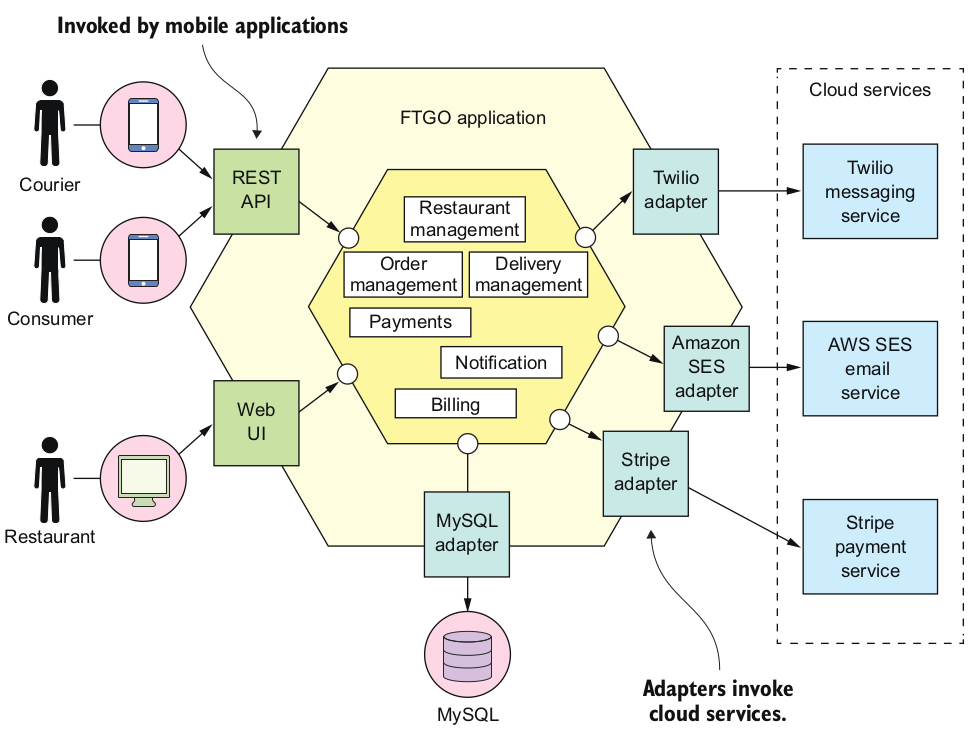

Business logic bao gồm các mô-đun, mỗi mô-đun là một bộ sưu tập các đối tượng thuộc miền. Ví dụ về các mô-đun bao gồm `Order Management`, `Delivery Management`, `Billing` và `Payments`. Có nhiều bộ chuyển đổi tương tác với các hệ thống bên ngoài. Một số là adapter vào (inbound adapters), chúng xử lý các yêu cầu bằng cách gọi business logic, bao gồm các adapter API REST và giao diện người dùng web. Các adapter xuất (outbound adapters) khác, cho phép business logic truy cập cơ sở dữ liệu MySQL và gọi các service đám mây như Twilio và Stripe.

Mặc dù có một kiến trúc có vẻ là mô-đun, ứng dụng FTGO được đóng gói dưới dạng một tệp WAR duy nhất. Ứng dụng là một ví dụ về kiến trúc phần mềm theo kiểu monolithic, một cách tổ chức hệ thống như một thành phần duy nhất có thể thực thi hoặc triển khai. Nếu ứng dụng FTGO được viết bằng ngôn ngữ Go (GoLang), nó sẽ là một tệp thực thi duy nhất. Một phiên bản của ứng dụng sử dụng Ruby hoặc NodeJS sẽ là một cấu trúc thư mục duy nhất chứa mã nguồn. Kiến trúc monolithic không phải là điều xấu inherently. Những nhà phát triển FTGO đã đưa ra một quyết định tốt khi họ chọn kiến trúc monolithic cho ứng dụng của họ.

### The benifits of the monolithic architecure
Ở những ngày đầu của FTGO, khi ứng dụng còn tương đối nhỏ, kiến trúc monolithic của ứng dụng mang lại nhiều lợi ích:

- *Simple to develop* — Môi trường phát triển tích hợp (IDEs) và các công cụ phát triển khác tập trung vào việc xây dựng một ứng dụng duy nhất.
- *Easy to make radical changes to the application* — Bạn có thể thay đổi mã nguồn và cấu trúc cơ sở dữ liệu, xây dựng và triển khai.
- *Straightforward to test* — Những người phát triển đã viết các bài kiểm thử end-to-end khởi chạy ứng dụng, gọi API REST và kiểm thử giao diện người dùng với Selenium.
- *Straightforward to deploy* — Mọi nhà phát triển chỉ cần sao chép tệp WAR đến một máy chủ đã cài đặt Tomcat.
- *Easy to scale* — FTGO chạy nhiều phiên bản của ứng dụng sau một load balancer.

Tuy nhiên, theo thời gian, quá trình phát triển, kiểm thử, triển khai và mở rộng trở nên khó khăn hơn nhiều. Hãy xem xét vì sao.

### Living in monolithic hell
Rất tiếc, như các nhà phát triển của FTGO đã phát hiện, kiến trúc monolithic có một hạn chế lớn. Ứng dụng thành công như FTGO thường có thói quen vượt ra khỏi kiến trúc monolithic. Mỗi sprint, nhóm phát triển FTGO triển khai thêm một số stories, làm cho mã nguồn trở nên lớn hơn. Hơn nữa, khi công ty trở nên thành công hơn, kích thước của nhóm phát triển tăng đều đặn. Không chỉ điều này tăng tỷ lệ tăng trưởng của mã nguồn, mà còn làm tăng chi phí quản lý.

Như hình dưới cho thấy, ứng dụng FTGO nhỏ và đơn giản ban đầu đã phát triển qua các năm thành một kiến trúc monolithic khổng lồ. Tương tự, nhóm phát triển nhỏ giọt đã trở thành nhiều nhóm Scrum, mỗi nhóm làm việc trên một khu vực chức năng cụ thể. Do vượt ra khỏi kiến trúc của mình, FTGO đã rơi vào tình trạng kiến trúc monolithic tồi tệ. Quá trình phát triển chậm chạp và đau đớn. Phát triển và triển khai theo phong cách Agile là không thể. Hãy xem tại sao điều này đã xảy ra.

#### Complexity intimidates developers

Một vấn đề lớn của ứng dụng FTGO là nó quá phức tạp. Nó quá lớn để bất kỳ nhà phát triển nào có thể hiểu đầy đủ. Kết quả là, việc sửa lỗi và triển khai đúng các tính năng mới đã trở nên khó khăn và tốn thời gian. Những hạn chót thời gian thường bị bỏ lỡ.

Để làm cho tình hình trở nên tồi tệ hơn, sự phức tạp áp đảo này thường là một vòng xoáy xuống dốc. Nếu mã nguồn khó hiểu, một nhà phát triển sẽ không thực hiện những thay đổi đúng đắn. Mỗi thay đổi làm cho mã nguồn trở nên phức tạp hơn một cách tăng dần và khó hiểu hơn. Kiến trúc sạch sẽ, modul được hiển thị trước đó trong hình minh họa về hexagonal architecture không phản ánh thực tế. FTGO dần trở thành một quả cầu lớn, không thể hiểu được và khó hiểu.

Mary nhớ rằng gần đây cô đã tham gia một hội nghị, nơi cô gặp một nhà phát triển đang viết một công cụ để phân tích các phụ thuộc giữa hàng nghìn JAR trong ứng dụng có hàng triệu dòng mã nguồn (LOC) của họ. Lúc đó, công cụ đó có vẻ như là điều mà FTGO có thể sử dụng. Nhưng bây giờ cô không chắc chắn nữa. Mary nghi ngờ rằng một phương pháp tốt hơn là chuyển đổi sang một kiến trúc phù hợp hơn với một ứng dụng phức tạp: microservices.

## Development is slow
Ngoài việc phải chiến đấu với sự phức tạp áp đảo, các nhà phát triển FTGO cảm thấy nhiệm vụ phát triển hàng ngày chậm chạp. Ứng dụng lớn gánh nặng và làm chậm chạp IDE của một nhà phát triển. Xây dựng ứng dụng FTGO mất thời gian dài. Hơn nữa, vì nó quá lớn, ứng dụng mất thời gian lâu để khởi động. Kết quả là, chu kỳ chỉnh sửa-xây dựng-chạy-thử nghiệm mất thời gian dài, ảnh hưởng đến năng suất một cách nghiêm trọng.

#### Path from commit to deployment is long and arduous
Một vấn đề khác của ứng dụng FTGO là triển khai các thay đổi vào sản xuất là một quá trình dài và đau đớn. Nhóm thường triển khai cập nhật lên production một lần mỗi tháng, thường vào cuối tuần, thường là vào đêm thứ sáu hoặc thứ bảy. Mary liên tục đọc rằng trạng thái của Software-as-a-Service (SaaS) đang tiên tiến là triển khai liên tục: triển khai các thay đổi lên production nhiều lần mỗi ngày trong giờ làm việc. Rõ ràng, tính đến năm 2011, Amazon.com triển khai một thay đổi vào production mỗi 11,6 giây mà không ảnh hưởng đến người dùng bao giờ! Đối với các nhà phát triển FTGO, việc cập nhật production hơn một lần mỗi tháng dường như là một giấc mơ xa vời. Và việc áp dụng triển khai liên tục dường như là không thể.

FTGO đã một phần áp dụng phương pháp Agile. Nhóm kỹ thuật được chia thành các đội và sử dụng các sprint kéo dài hai tuần. Thật không may, hành trình từ mã nguồn hoàn chỉnh đến chạy trên production là dài và gian nan. Một vấn đề khi nhiều nhà phát triển cam kết vào cùng một mã nguồn là quá trình xây dựng thường ở trạng thái không thể phát hành. Khi các nhà phát triển FTGO cố gắng giải quyết vấn đề này bằng cách sử dụng nhánh tính năng, sự cố gắng của họ dẫn đến những quá trình hợp nhất dài và đau đớn. Do đó, khi một nhóm hoàn thành sprint của mình, một giai đoạn dài của thử nghiệm và ổn định mã nguồn theo sau.

Một lý do khác làm cho thời gian triển khai lên production trở nên dài là thời gian kiểm thử. Bởi vì mã nguồn quá phức tạp và tác động của một thay đổi không được hiểu rõ, các nhà phát triển và máy chủ Continuous Integration (CI) phải chạy toàn bộ bộ kiểm thử. Một số phần của hệ thống thậm chí đòi hỏi kiểm thử bằng tay. Việc chẩn đoán và sửa nguyên nhân gây ra sự cố thử nghiệm cũng mất thời gian. Kết quả là mất một vài ngày để hoàn thành một chu kỳ kiểm thử.

#### Scaling is difficult
Nhóm FTGO cũng gặp vấn đề khi mở rộng ứng dụng của họ. Điều này là do các mô-đun ứng dụng khác nhau có yêu cầu tài nguyên xung đột. Dữ liệu nhà hàng, ví dụ, được lưu trữ trong một cơ sở dữ liệu lớn trong bộ nhớ, lý tưởng là triển khai trên các máy chủ có nhiều bộ nhớ. Ngược lại, mô-đun xử lý hình ảnh đòi hỏi nhiều CPU và tốt nhất là triển khai trên các máy chủ có nhiều CPU. Do các mô-đun này thuộc cùng một ứng dụng, FTGO phải làm m compromisation đối với cấu hình máy chủ.

#### Delivering a reliable monolith is challenging
Một vấn đề khác của ứng dụng FTGO là sự thiếu độ tin cậy. Do đó, thường xuyên xuất hiện sự cố sản xuất. Một nguyên nhân khiến nó không tin cậy là việc kiểm thử ứng dụng một cách kỹ lưỡng là khó khăn, do kích thước lớn của nó. Thiếu khả năng kiểm thử này có nghĩa là lỗi xâm nhập vào sản xuất. Để làm cho tình hình tồi tệ hơn, ứng dụng thiếu cách ly lỗi, vì tất cả các mô-đun đều chạy trong cùng một quy trình. Đôi khi, một lỗi trong một mô-đun - ví dụ, một rò rỉ bộ nhớ - làm đổ sập tất cả các phiên bản của ứng dụng, một cách tuần tự. Nhóm phát triển FTGO không thích được thông báo vào giữa đêm vì sự cố sản xuất. Người kinh doanh càng không thích sự mất lợi nhuận và niềm tin.

#### Locked into increasingly obsolete technology stack
Khía cạnh cuối cùng của "địa ngục mô-đun" mà đội FTGO trải qua là kiến trúc buộc họ sử dụng một ngăn xếp công nghệ ngày càng lạc hậu. Kiến trúc mô-đun làm cho việc áp dụng các framework và ngôn ngữ mới trở nên khó khăn. Việc viết lại toàn bộ monolithic application để sử dụng một công nghệ mới và có vẻ tốt hơn sẽ rất đắt đỏ và rủi ro cao. Do đó, các nhà phát triển bị bó buộc với các lựa chọn công nghệ họ đã chọn từ đầu dự án. Rất nhiều lần, họ phải duy trì một ứng dụng được viết bằng một ngăn xếp công nghệ ngày càng lạc hậu.

Spring framework đã tiếp tục phát triển trong khi vẫn giữ nguyên tính tương thích ngược, vì vậy lí thuyết FTGO có thể đã có khả năng nâng cấp. Thật không may, ứng dụng FTGO sử dụng các phiên bản framework không tương thích với các phiên bản mới của Spring. Đội phát triển chưa bao giờ có thời gian để nâng cấp những framework đó. Kết quả là, các phần quan trọng của ứng dụng được viết bằng các framework ngày càng lỗi thời. Hơn nữa, các nhà phát triển FTGO muốn thử nghiệm các ngôn ngữ không phải JVM như GoLang và NodeJS. Thật tiếc, điều này không thể thực hiện được với một monolithic application.

## 1.2 Why this book is relevant to you
Có khả năng bạn là một nhà phát triển, kiến trúc sư, CTO hoặc VP của bộ phận kỹ thuật. Bạn đang chịu trách nhiệm cho một ứng dụng đã phát triển ra khỏi kiến trúc mô-đun của mình. Giống như Mary tại FTGO, bạn đang đối mặt với những khó khăn trong việc phát triển phần mềm và muốn biết cách thoát khỏi "địa ngục mô-đun." Hoặc có thể bạn lo sợ rằng tổ chức của bạn đang trên con đường dẫn đến "địa ngục mô-đun" và bạn muốn biết cách thay đổi hướng trước khi quá muộn. Nếu bạn cần thoát khỏi hoặc tránh khỏi "địa ngục mô-đun," cuốn sách này là dành cho bạn.

Cuốn sách này dành nhiều thời gian để giải thích các khái niệm kiến trúc microservices. Mục tiêu của tôi là bạn có thể tìm thấy nội dung này dễ tiếp cận, không phụ thuộc vào ngăn xếp công nghệ bạn đang sử dụng. Điều bạn cần là quen với cơ bản của kiến trúc và thiết kế ứng dụng doanh nghiệp. Cụ thể, bạn cần biết về:

- Kiến trúc ba tầng (Three-tier architecture)
- Thiết kế ứng dụng web (Web application design)
- Cách phát triển logic kinh doanh bằng thiết kế hướng đối tượng (Object-oriented design)
- Cách sử dụng hệ quản trị cơ sở dữ liệu quan hệ: SQL và giao dịch ACID
- Cách sử dụng giao tiếp giữa các tiến trình bằng cách sử dụng một trung tâm thông điệp và REST APIs
- An ninh, bao gồm xác thực và ủy quyền

Các ví dụ mã nguồn trong cuốn sách này được viết bằng Java và framework Spring. Điều này có nghĩa là để hưởng lợi nhiều nhất từ các ví dụ, bạn cũng cần quen với framework Spring.

## 1.4 Microservices architecture to the rescue
Mary đã kết luận rằng FTGO phải chuyển đổi sang kiến trúc microservices.

Thú vị là, kiến trúc phần mềm có rất ít liên quan đến yêu cầu chức năng. Bạn có thể triển khai một bộ use case - yêu cầu chức năng của ứng dụng - với bất kỳ kiến trúc nào. Trên thực tế, việc ứng dụng thành công như FTGO trở thành "đống lớn của bùn" là khá phổ biến.

Tuy nhiên, kiến trúc lại quan trọng vì cách nó ảnh hưởng đến các yêu cầu về chất lượng service, còn được gọi là yêu cầu phi-chức năng, thuộc tính chất lượng hoặc ilities. Khi ứng dụng FTGO phát triển, nhiều thuộc tính chất lượng đã bị ảnh hưởng, đặc biệt là những thuộc tính ảnh hưởng đến tốc độ cung cấp phần mềm: khả năng bảo trì, mở rộng và kiểm thử.

Một nhóm có tinh thần kỷ luật có thể làm chậm lại tốc độ lao đến "địa ngục mô-đun." Các thành viên trong nhóm có thể nỗ lực duy trì tính mô-đun của ứng dụng. Họ có thể viết các bài kiểm thử tự động toàn diện. Tuy nhiên, họ không thể tránh khỏi vấn đề của một đội ngũ lớn làm việc trên một ứng dụng duy nhất. Cũng như họ không thể giải quyết vấn đề của một ngăn xếp công nghệ ngày càng lỗi thời. Điều tốt nhất mà một nhóm có thể làm là trì hoãn điều không thể tránh khỏi. Để thoát khỏi "địa ngục mô-đun," họ phải chuyển đổi sang một kiến trúc mới: kiến trúc Microservices.

Hiện nay, có sự nhất trí ngày càng tăng rằng nếu bạn đang xây dựng một ứng dụng lớn, phức tạp, bạn nên xem xét việc sử dụng kiến trúc microservices. Nhưng microservices là gì chính xác? Thật không may, tên gọi không giúp ích gì nhiều vì nó nhấn mạnh quá nhiều vào kích thước. Có nhiều định nghĩa về kiến trúc microservices. Một số hiểu tên gọi quá một cách đen tối và cho rằng một service nên nhỏ như là ví dụ, 100 dòng mã. Những người khác cho rằng một service chỉ nên mất hai tuần để phát triển. Adrian Cockcroft, trước đây làm việc tại Netflix, định nghĩa kiến trúc microservices như một kiến trúc hướng service gồm các phần tử có mối quan hệ lỏng lẻo và có ngữ cảnh giới hạn. Đó không phải là một định nghĩa tồi, nhưng nó hơi khó hiểu một chút. Hãy xem chúng ta có thể làm tốt hơn không.

### 1.4.1 Scale cube and microservices
Định nghĩa của tôi về kiến trúc microservices được lấy cảm hứng từ cuốn sách xuất sắc của Martin Abbott và Michael Fisher, "The Art of Scalability" (Addison-Wesley, 2015). Cuốn sách này mô tả một mô hình tính mở rộng có ích, ba chiều: khối mở rộng (scale cube), như được hiển thị trong hình 1.3.

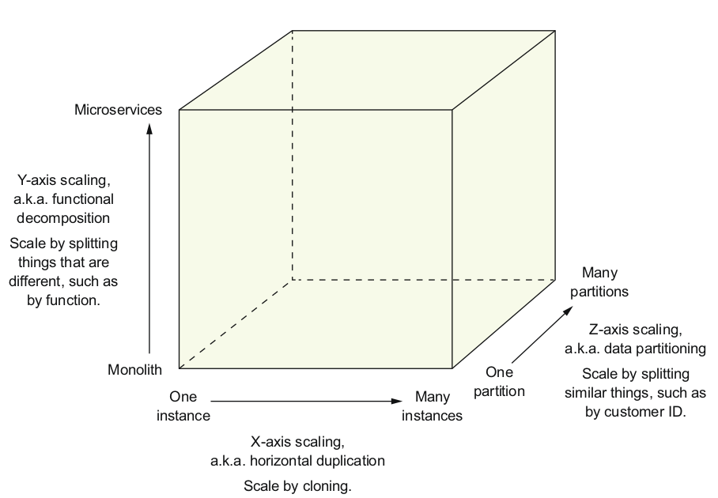

The model defines three ways to scale an application: X, Y, and Z.

#### X-axis scaling load balancers requests across mutiple instances

Mở rộng theo trục X là một cách phổ biến để mở rộng ứng dụng kiến trúc monolithic. Hình trên cho thấy cách mở rộng theo trục X hoạt động. Bạn chạy nhiều instance của ứng dụng sau một load balancer. Load balancer phân phối yêu cầu giữa N instance đồng nhất của ứng dụng. Điều này là một cách tuyệt vời để cải thiện khả năng chứa và khả dụng của một ứng dụng.

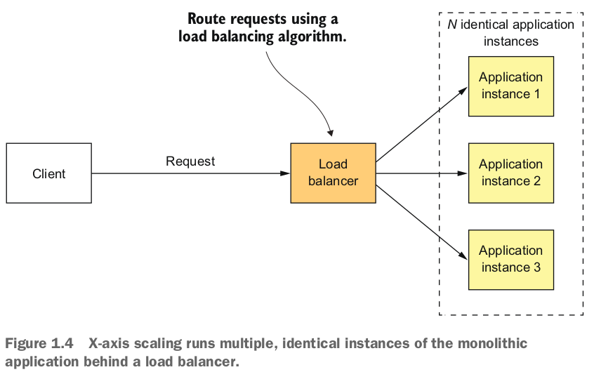

#### Z-axis scaling routes request based on an attribute of the request
Mở rộng theo trục Z cũng chạy nhiều instance của ứng dụng monolithic, nhưng khác với mở rộng theo trục X, mỗi instance chỉ chịu trách nhiệm cho một phần của dữ liệu. Hình dưới đây cho thấy cách mở rộng theo trục Z hoạt động. Router ở phía trước các instance sử dụng thuộc tính yêu cầu để định tuyến nó đến instance thích hợp. Một ứng dụng có thể, ví dụ, định tuyến yêu cầu bằng cách sử dụng `userId`.

Trong ví dụ này, mỗi instance ứng dụng chịu trách nhiệm cho một phần của người dùng. Router sử dụng `userId` được chỉ định bởi Authorization header yêu cầu để chọn một trong N instance đồng nhất của ứng dụng. Mở rộng theo trục Z là một cách tuyệt vời để mở rộng ứng dụng để xử lý lượng giao dịch và dữ liệu tăng lên.

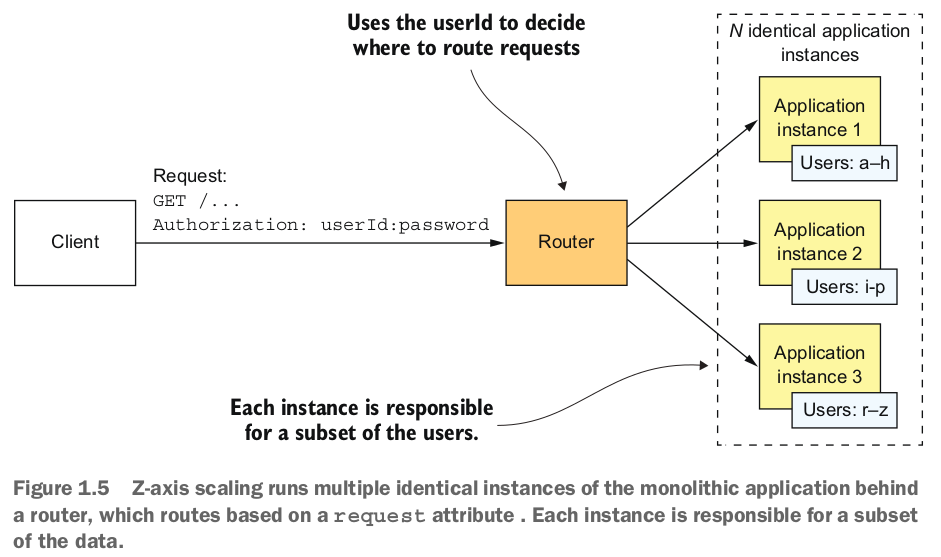

#### Y-axis scaling functionally decompose an application into services
Mở rộng theo trục X và Z cải thiện khả năng và sẵn có của ứng dụng. Tuy nhiên, cả hai phương pháp đều không giải quyết vấn đề về sự phức tạp của quá trình phát triển và ứng dụng tăng lên. Để giải quyết những vấn đề đó, bạn cần áp dụng mở rộng theo trục Y, hoặc phân giải chức năng (functional decompose). Hình 1.6 cho thấy cách mở rộng theo trục Y hoạt động: bằng cách chia ứng dụng monolithic thành một tập hợp các service.

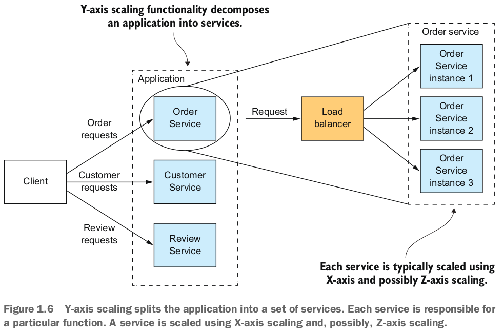

Một service là một ứng dụng mini thực hiện chức năng tập trung hẹp, chẳng hạn như quản lý đơn hàng, quản lý khách hàng, và như vậy. Một service được mở rộng bằng cách sử dụng mở rộng theo trục X, tuy nhiên, một số service có thể cũng sử dụng mở rộng theo trục Z. Ví dụ, service Đặt hàng bao gồm một tập hợp các phiên bản service được load balancer.

Định nghĩa cấp cao về kiến trúc microservice (microservices) là một kiến trúc chức năng phân giải một ứng dụng thành một tập hợp các service. Lưu ý rằng định nghĩa này không nói về kích thước gì cả. Thay vào đó, điều quan trọng là mỗi service có một tập hợp trách nhiệm tập trung và nhất quán. Trong phần sau của cuốn sách, tôi sẽ thảo luận về ý nghĩa của điều đó. Bây giờ hãy xem xét làm thế nào kiến trúc microservice là một dạng của tính mô-đun.

### 1.4.2 Microservices as a form of modularity
Tính mô-đun là rất quan trọng khi phát triển các ứng dụng lớn, phức tạp. Một ứng dụng hiện đại như FTGO quá lớn để được phát triển bởi một cá nhân. Nó cũng quá phức tạp để được hiểu bởi một người duy nhất. Các ứng dụng cần phải được phân giải thành các mô-đun được phát triển và hiểu bởi các người khác nhau. Trong một ứng dụng monolithic, các mô-đun được định nghĩa bằng cách sử dụng sự kết hợp của các cấu trúc ngôn ngữ lập trình (như gói Java) và các sản phẩm xây dựng (như các tệp JAR Java). Tuy nhiên, như các nhà phát triển FTGO đã phát hiện, phương pháp này thường không hoạt động tốt trong thực tế. Các ứng dụng monolithic có tuổi thọ lâu dài thường suy giảm thành các big ball of mud (quả cầu lớn của bùn).

Kiến trúc microservice sử dụng service làm đơn vị của tính mô-đun. Một service có một API, đó là ranh giới không thể xâm phạm và khó có thể vi phạm. Bạn không thể bỏ qua API và truy cập vào một lớp nội bộ như bạn có thể với một gói Java. Kết quả là, việc bảo toàn tính mô-đun của ứng dụng qua thời gian trở nên dễ dàng hơn nhiều. Có nhiều lợi ích khác khi sử dụng service như các khối xây dựng, bao gồm khả năng triển khai và mở rộng chúng một cách độc lập.

### 1.4.3 Each service has its own database
Một đặc điểm quan trọng của kiến trúc microservices là các service được liên kết lỏng lẻo và chỉ giao tiếp thông qua các API. Một cách để đạt được sự liên kết lỏng lẻo là mỗi service có cơ sở dữ liệu riêng. Trong cửa hàng trực tuyến, ví dụ, service Đặt hàng có một cơ sở dữ liệu chứa bảng ORDERS và service Khách hàng có cơ sở dữ liệu của mình, chứa bảng CUSTOMERS. Trong quá trình phát triển, các nhà phát triển có thể thay đổi lược đồ của một service mà không cần phải phối hợp với các nhà phát triển làm việc trên các service khác. Tại thời điểm chạy, các service được cô lập lẫn nhau - ví dụ, một service sẽ không bao giờ bị chặn vì service khác giữ một khóa cơ sở dữ liệu.

Bây giờ sau khi chúng ta đã định nghĩa kiến trúc microservices và mô tả một số đặc điểm quan trọng của nó, hãy xem xét cách nó áp dụng vào ứng dụng FTGO.

**Note :** The requirement for each service to have its own database doesn’t mean it has its own database server. You don’t, for example, have to spend 10 times more on Oracle RDBMS licenses. Chapter 2 explores this topic in depth.

### 1.4.4 The FTGO microservice architecture
Phần còn lại của cuốn sách này sẽ thảo luận sâu về kiến trúc microservices của ứng dụng FTGO. Nhưng trước hết, hãy nhìn nhanh vào ý nghĩa của việc áp dụng phân rã theo chiều Y cho ứng dụng này. Nếu chúng ta áp dụng phân rã theo chiều Y cho ứng dụng FTGO, chúng ta sẽ có kiến trúc được mô tả trong hình 1.7. Ứng dụng đã được phân rã bao gồm nhiều service frontend và backend. Chúng ta cũng sẽ áp dụng phân rã theo chiều X và có thể theo chiều Z, để khi chạy, có nhiều phiên bản của mỗi service.

Các service frontend bao gồm một Cổng API và Giao diện người dùng Web Nhà hàng. Cổng API, đóng vai trò của một facade và được mô tả chi tiết trong chương 8, cung cấp các REST API được sử dụng bởi ứng dụng di động của người tiêu dùng và người giao hàng. Giao diện người dùng Web Nhà hàng thực hiện giao diện web được sử dụng bởi các nhà hàng để quản lý thực đơn và xử lý đơn hàng.

Logic kinh doanh của ứng dụng FTGO bao gồm nhiều service backend. Mỗi service backend có một REST API và cơ sở dữ liệu riêng. Các service backend bao gồm các thành phần sau:

- `Order Service` : Manages orders
- `Delivery Service` : Manages delivery of orders from restaurants to consumers
- `Restaurant Service` : Maintains information about restaurants.
- `Kitchen Service` : Manages the preparation of orders.
- `Accounting Serivce` : Handles billing and payments.

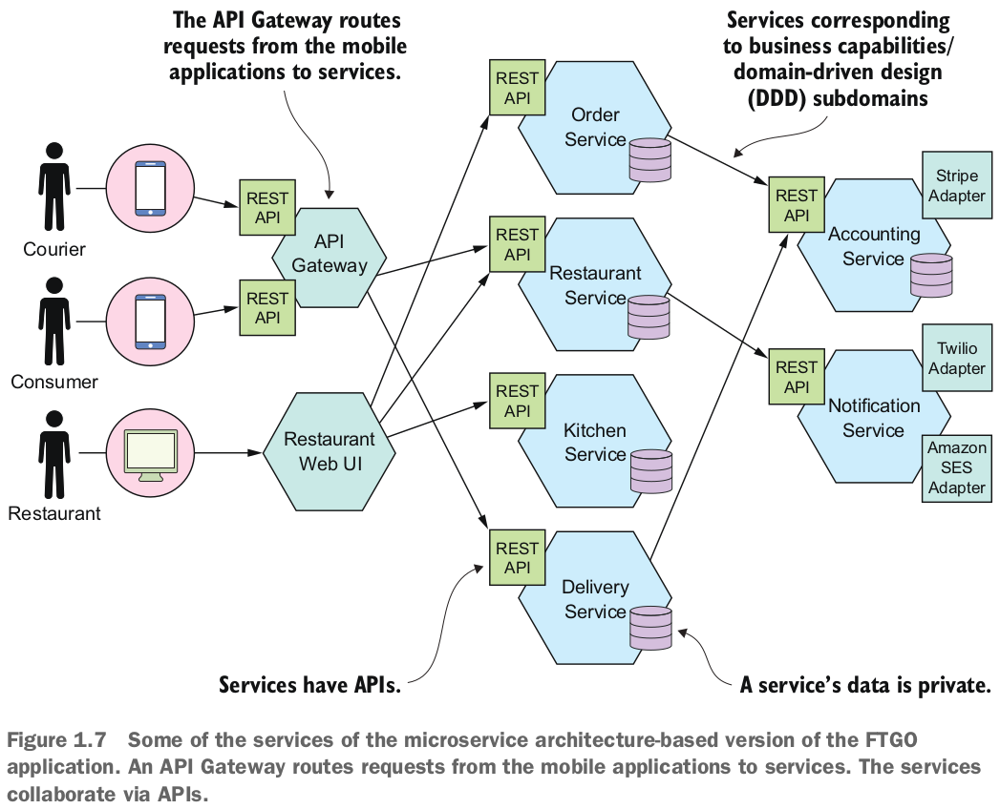

Nhiều service tương ứng với các mô-đun đã được mô tả trước đó trong chương này. Điều khác biệt là mỗi service và API của nó được định nghĩa rất rõ ràng. Mỗi service có thể được phát triển, kiểm thử, triển khai và mở rộng độc lập. Ngoài ra, kiến trúc này làm rất tốt công việc bảo toàn tính mô-đun. Một nhà phát triển không thể bỏ qua API của một service và truy cập các thành phần nội tại của nó. Chương 13 mô tả cách chuyển đổi một ứng dụng monolithic hiện tại thành microservices.

### 1.4.5 Comparing the microservices architecture and SOA
Một số nhà phê bình của kiến trúc microservices cho rằng nó không có gì mới - đó chỉ là kiến trúc service hướng (SOA). Ở mức độ cao, có một số điểm tương đồng. SOA và kiến trúc microservices là những kiểu kiến trúc tổ chức một hệ thống dưới dạng một tập hợp các service. Nhưng như bảng 1.1 cho thấy, khi nghiên cứu sâu hơn, bạn sẽ gặp những sự khác biệt đáng kể.

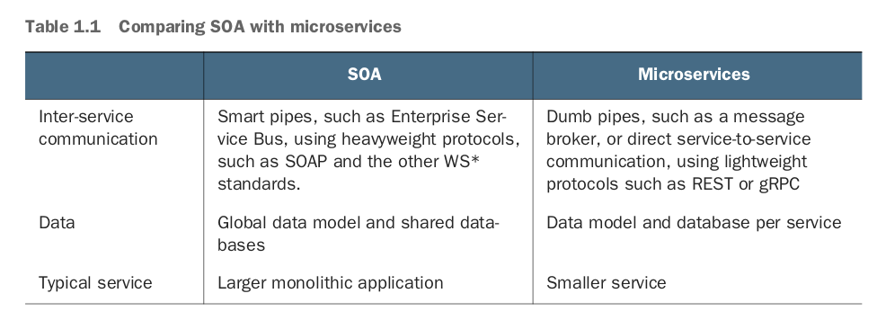

Ứng dụng SOA và kiến trúc microservices thường sử dụng các bộ công nghệ khác nhau. Ứng dụng SOA thường sử dụng các công nghệ nặng như SOAP và các tiêu chuẩn khác của WS*. Họ thường sử dụng một ESB, một *smart pipe* chứa logic xử lý kinh doanh và xử lý tin nhắn để tích hợp các service. Ứng dụng được xây dựng bằng kiến trúc microservices thì thường sử dụng các công nghệ mã nguồn mở nhẹ. Các service giao tiếp thông qua các *dump pipes*, như các nhà môi giới tin nhắn hoặc giao thức nhẹ như REST hoặc gRPC.

SOA và kiến trúc microservices cũng khác nhau trong cách họ xử lý dữ liệu. Ứng dụng SOA thường có mô hình dữ liệu toàn cầu và chia sẻ cơ sở dữ liệu. Ngược lại, như đã đề cập trước đó, trong kiến trúc microservices, mỗi service có cơ sở dữ liệu riêng. Hơn nữa, như mô tả trong chương 2, mỗi service thường được coi là có domain model riêng.

Một sự khác biệt quan trọng khác giữa SOA và kiến trúc microservices là kích thước của các service. SOA thường được sử dụng để tích hợp các ứng dụng lớn, phức tạp và monolithic. Mặc dù các service trong kiến trúc microservices không phải lúc nào cũng nhỏ bé, chúng thường nhỏ hơn nhiều. Do đó, một ứng dụng SOA thường bao gồm một số service lớn, trong khi một ứng dụng dựa trên kiến trúc microservices thường bao gồm hàng chục hoặc hàng trăm service nhỏ hơn.

## 1.5 Benefits and drawbacks of the microservices architecture

### 1.5.1 Benefits of the microservices architecture
Kiến trúc microservices mang lại những lợi ích sau đây:
- Nó cho phép việc triển khai liên tục và triển khai ứng dụng lớn, phức tạp.
- service nhỏ và dễ bảo trì.
- service có thể triển khai độc lập.
- service có thể mở rộng độc lập.
- Kiến trúc microservices cho phép các nhóm độc lập.
- Nó cho phép thử nghiệm và áp dụng công nghệ mới một cách dễ dàng.
- Nó có khả năng cách ly lỗi tốt hơn.

#### Enables the continuous delivery and deployment of alarge, complex applications
Lợi ích quan trọng nhất của kiến trúc microservices là nó cho phép triển khai và cung cấp liên tục cho các ứng dụng lớn, phức tạp. Như mô tả sau trong phần 1.7, continuous delivery/deployment là một phần của DevOps, một bộ các thực hành để cung cấp phần mềm một cách nhanh chóng, thường xuyên và đáng tin cậy. Các tổ chức DevOps hiệu suất cao thường triển khai các thay đổi vào production mà gặp ít vấn đề về môi trường production.

Có ba cách mà kiến trúc microservices hỗ trợ continuous delivery/deployment:
- Nó có khả năng kiểm thử cần thiết cho continuous delivery/deployment - Kiểm thử tự động là một thực hành quan trọng của continuous delivery/deployment. Vì mỗi service trong kiến trúc microservices tương đối nhỏ, việc viết kiểm thử tự động trở nên dễ dàng và thực hiện nhanh chóng hơn. Kết quả là ứng dụng sẽ ít lỗi hơn.
- Nó có khả năng triển khai cần thiết cho continuous delivery/deployment - Mỗi service có thể triển khai độc lập với các service khác. Nếu các nhà phát triển chịu trách nhiệm cho một service cần triển khai một thay đổi chỉ địa phương cho service đó, họ không cần phải phối hợp với các nhà phát triển khác. Họ có thể triển khai các thay đổi của họ. Kết quả là việc triển khai thay đổi thường xuyên vào production trở nên dễ dàng hơn.
- Nó cho phép các nhóm phát triển hoạt động độc lập và lỏng lẻo - Bạn có thể tổ chức tổ chức kỹ thuật như một tập hợp của các nhóm nhỏ (ví dụ, nhóm "two-pizza"). Mỗi nhóm chịu trách nhiệm độc lập cho việc phát triển và triển khai một hoặc nhiều service liên quan. Như hình 1.8 thể hiện, mỗi nhóm có thể phát triển, triển khai và mở rộng các service của họ độc lập với tất cả các nhóm khác. Kết quả là tốc độ phát triển cao hơn.

Khả năng triển khai và cung cấp liên tục mang lại nhiều lợi ích kinh doanh:
- Giảm thời gian đưa sản phẩm ra thị trường, giúp doanh nghiệp nhanh chóng phản hồi từ khách hàng.
- Nó giúp doanh nghiệp cung cấp loại service đáng tin cậy mà khách hàng ngày nay đang mong đợi.
- Sự hài lòng của nhân viên cao hơn vì họ dành nhiều thời gian hơn để cung cấp các tính năng có giá trị thay vì chữa cháy vấn đề.

Do đó, kiến trúc microservices đã trở thành một phần quan trọng của bất kỳ doanh nghiệp nào phụ thuộc vào công nghệ phần mềm.

#### Each service is small and easily maintained
Một lợi ích khác của kiến trúc microservices là mỗi service tương đối nhỏ. Mã nguồn dễ hiểu hơn đối với nhà phát triển. Bộ mã nguồn nhỏ không làm chậm IDE, làm tăng hiệu suất của nhà phát triển. Ngoài ra, mỗi service thường bắt đầu nhanh hơn rất nhiều so với một monolith lớn, điều này cũng làm tăng hiệu suất của nhà phát triển và gia tăng tốc độ triển khai.

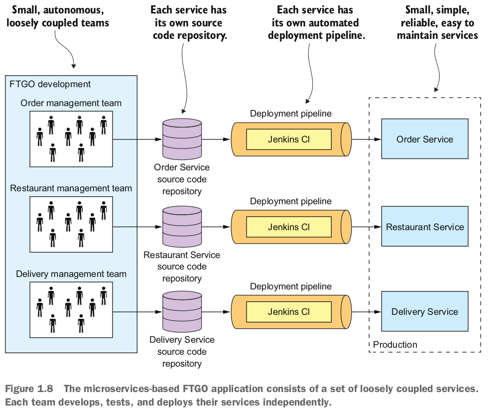

#### Services are independently scable
Mỗi service trong kiến trúc microservices có thể được mở rộng độc lập so với các service khác bằng cách sử dụng phân chia theo trục X và phân chia theo trục Z. Hơn nữa, mỗi service có thể triển khai trên phần cứng phù hợp nhất với yêu cầu tài nguyên của nó. Điều này khác biệt khá lớn so với việc sử dụng kiến trúc monolith, nơi các thành phần có yêu cầu tài nguyên khác nhau một cách rõ ràng - ví dụ, tiêu tốn CPU vs. tiêu tốn bộ nhớ - phải được triển khai cùng nhau.

#### Better fault ioslation
Kiến trúc microservices có khả năng cô lập lỗi tốt hơn. Ví dụ, một rò rỉ bộ nhớ trong một service chỉ ảnh hưởng đến service đó. Các service khác sẽ tiếp tục xử lý các yêu cầu một cách bình thường. Ngược lại, một thành phần không hoạt động đúng trong một kiến trúc monolith sẽ làm hỏng toàn bộ hệ thống.

#### Easly experiment with and adopt new technology
Cuối cùng nhưng không kém phần quan trọng, kiến trúc microservices loại bỏ bất kỳ cam kết dài hạn nào đối với một ngăn xếp công nghệ. Theo nguyên tắc, khi phát triển một service mới, các nhà phát triển có tự do chọn bất kỳ ngôn ngữ và framework nào phù hợp nhất cho service đó. Trong nhiều tổ chức, việc hạn chế lựa chọn là hợp lý, nhưng điểm chính là bạn không bị ràng buộc bởi các quyết định trong quá khứ.

Hơn nữa, vì các service nhỏ, việc viết lại chúng bằng ngôn ngữ và công nghệ tốt hơn trở nên thiết thực. Nếu việc thử nghiệm một công nghệ mới thất bại, bạn có thể vứt bỏ công việc đó mà không đe dọa toàn bộ dự án. Điều này khác biệt hoàn toàn so với khi sử dụng kiến trúc monolith, nơi các lựa chọn công nghệ ban đầu của bạn hạn chế đáng kể khả năng sử dụng các ngôn ngữ và framework khác trong tương lai.

### 1.5.2 Drawbacks of the microservice architecture
Tất nhiên, không có công nghệ nào là giải pháp toàn diện, và kiến trúc microservices cũng có một số hạn chế và vấn đề đáng kể. Thực tế, hầu hết cuốn sách này nói về cách giải quyết những hạn chế và vấn đề này. Khi đọc về các thách thức, đừng lo lắng. Sau này trong cuốn sách này, tôi sẽ mô tả cách để giải quyết chúng.

Dưới đây là các hạn chế và vấn đề chính của kiến trúc microservices:
- Tìm ra bộ service phù hợp là một thách thức.
- Hệ thống phân tán là phức tạp, làm cho việc phát triển, kiểm thử và triển khai trở nên khó khăn.
- Triển khai tính năng mà bao gồm nhiều service yêu cầu sự phối hợp cẩn thận.
- Quyết định khi nào nên áp dụng kiến trúc microservices là khó khăn.

Hãy cùng xem xét từng vấn đề một cách chi tiết.

#### Finding the right services is challenging
Một thách thức khi sử dụng kiến trúc microservices là không có một thuật toán cụ thể, rõ ràng để phân tách một hệ thống thành các service. Như với nhiều phần của phát triển phần mềm, điều này có phần nghệ thuật. Điều làm tình hình trở nên tồi tệ hơn là nếu bạn phân tách một hệ thống một cách không đúng, bạn sẽ xây dựng một *distributes monolith* phân tán, một hệ thống bao gồm các service kết nối cùng nhau và phải triển khai cùng nhau. Một *distributes monolith* phân tán có nhược điểm của cả hai kiến trúc monolith và microservices.

#### Distributes systems are complex
Một vấn đề khác khi sử dụng kiến trúc microservices là nhà phát triển phải đối mặt với sự phức tạp bổ sung khi tạo ra một hệ thống phân tán. Các service phải sử dụng một cơ chế giao tiếp giữa các tiến trình. Điều này phức tạp hơn so với việc gọi phương thức đơn giản. Hơn nữa, một service phải được thiết kế để xử lý sự cố một phần và xử lý trường hợp service từ xa không có sẵn hoặc hiển thị độ trễ cao.

Việc triển khai các trường hợp sử dụng mà bao gồm nhiều service đòi hỏi việc sử dụng các kỹ thuật mới lạ. Mỗi service có cơ sở dữ liệu riêng của mình, điều này làm khó khăn trong việc triển khai giao dịch và truy vấn trên các service. Như mô tả trong chương 4, một ứng dụng dựa trên microservices phải sử dụng những gì được gọi là các cử chỉ để duy trì tính nhất quán dữ liệu trên các service. Chương 7 giải thích rằng một ứng dụng dựa trên microservices không thể truy xuất dữ liệu từ nhiều service bằng cách sử dụng truy vấn đơn giản. Thay vào đó, nó phải triển khai các truy vấn bằng cách sử dụng hoặc là sự hợp thành API hoặc là các góc nhìn CQRS.

Các IDE và các công cụ phát triển khác được tập trung vào việc xây dựng các ứng dụng monolith và không cung cấp hỗ trợ cụ thể cho việc phát triển các ứng dụng phân tán. Việc viết các bài kiểm thử tự động mà liên quan đến nhiều service là một thách thức. Đây là những vấn đề cụ thể đối với kiến trúc microservices. Do đó, các nhà phát triển của tổ chức của bạn phải có kỹ năng phát triển và triển khai phần mềm phức tạp để thành công trong việc sử dụng microservices.

Kiến trúc microservices cũng đưa ra sự phức tạp vận hành đáng kể. Nhiều phần di chuyển hơn - nhiều phiên bản của các loại service khác nhau - phải được quản lý trong môi trường sản xuất. Để triển khai microservices thành công, bạn cần mức độ tự động hóa cao. Bạn phải sử dụng các công nghệ như:
- Công cụ triển khai tự động, như Netflix Spinnaker
- Một nền tảng PaaS sẵn có, như Pivotal Cloud Foundry hoặc Red Hat OpenShift
- Một nền tảng điều phối Docker, như Docker Swarm hoặc Kubernetes

Tôi mô tả các tùy chọn triển khai cụ thể hơn trong chương 12.

#### Deploying featues spanning multiple services needs careful coordination
Một thách thức khác khi sử dụng kiến trúc microservices là việc triển khai các tính năng mà bao gồm nhiều service đòi hỏi sự phối hợp cẩn thận giữa các nhóm phát triển khác nhau. Bạn phải tạo ra một kế hoạch triển khai mà sắp xếp việc triển khai service dựa trên các phụ thuộc giữa các service. Điều này khác biệt khá lớn so với một kiến trúc monolith, nơi bạn có thể dễ dàng triển khai các cập nhật cho nhiều thành phần một cách nguyên tử.

#### Deciding when to adopt is diffcult

Một vấn đề khác khi sử dụng kiến trúc microservice là quyết định vào thời điểm nào trong vòng đời của ứng dụng bạn nên sử dụng kiến trúc này. Khi phát triển phiên bản đầu tiên của một ứng dụng, bạn thường không gặp các vấn đề mà kiến trúc này giải quyết. Hơn nữa, việc sử dụng một kiến trúc phức tạp và phân tán sẽ làm chậm quá trình phát triển. Điều đó có thể là một thách thức lớn đối với các startup, nơi vấn đề lớn nhất thường là làm thế nào để nhanh chóng tiến triển mô hình kinh doanh và ứng dụng kèm theo.

Việc sử dụng kiến trúc microservice làm cho việc lặp lại nhanh chóng trở nên khó khăn hơn. Một startup gần như chắc chắn sẽ bắt đầu với một ứng dụng monolithic.

Sau này, khi vấn đề là làm thế nào để xử lý sự phức tạp, đó là lúc cần phân tách chức năng ứng dụng thành một tập hợp các microservice. Bạn có thể gặp khó khăn trong việc tái cấu trúc do sự phụ thuộc rối ren. Chương 13 sẽ đi qua các chiến lược để tái cấu trúc một ứng dụng monolithic thành microservices.

Như bạn có thể thấy, kiến trúc microservice mang lại nhiều lợi ích, nhưng cũng có một số vấn đề đáng kể. Vì những vấn đề này, việc áp dụng một kiến trúc microservice không nên được thực hiện một cách dễ dàng. Nhưng đối với các ứng dụng phức tạp, như một ứng dụng web tiếp cận người tiêu dùng hoặc ứng dụng service phần mềm dưới dạng service (SaaS), đó thường là lựa chọn đúng đắn. Các trang web nổi tiếng như eBay, Amazon.com, Groupon và Gilt đã tiến hóa từ một kiến trúc monolithic thành một kiến trúc microservice.

Khi sử dụng kiến trúc microservice, bạn phải giải quyết nhiều vấn đề thiết kế và kiến trúc. Hơn nữa, nhiều trong số những vấn đề này có nhiều giải pháp khác nhau, mỗi giải pháp đều có một tập hợp khác nhau của các sự đánh đổi. Không có một giải pháp lý tưởng duy nhất. Để hỗ trợ quyết định của bạn, tôi đã tạo ra pattern language kiến trúc Microservice. Tôi tham chiếu đến pattern language này trong phần còn lại của cuốn sách khi tôi giảng dạy về kiến trúc microservice. Hãy xem xét pattern language là gì và tại sao nó hữu ích.

## 1.6 The Microservice architecture pattern language
Kiến trúc và thiết kế đều liên quan đến việc ra quyết định. Bạn cần phải quyết định xem kiến trúc monolithic hay microservice là phù hợp nhất cho ứng dụng của bạn. Khi đưa ra những quyết định này, bạn cần phải xem xét nhiều sự đánh đổi. Nếu bạn chọn kiến trúc microservice, bạn sẽ cần phải giải quyết nhiều vấn đề.

Một cách tốt để mô tả các tùy chọn kiến trúc và thiết kế khác nhau và cải thiện quá trình ra quyết định là sử dụng một pattern language. Hãy xem xét tại sao chúng ta cần các pattern và một pattern language, sau đó chúng ta sẽ thăm dò pattern language kiến trúc Microservice.

### 1.6.1 Micorservice architecture is not a silver bullet

Trong quyển sách The Mythical Man-Month (Addison-Wesley Professional, 1995), tác giả Fred Brooks đã nói rằng trong kỹ thuật phần mềm, không có viên đạn bạc nào. Điều đó có nghĩa là không có kỹ thuật hoặc công nghệ nào, nếu được áp dụng, sẽ mang lại cho bạn một bước nhảy vọt về năng suất. Tuy nhiên, nhiều thập kỷ sau đó, các nhà phát triển vẫn tranh cãi mãnh liệt về các viên đạn bạc yêu thích của họ, hoàn toàn tin rằng công nghệ yêu thích của họ sẽ mang lại cho họ một bước nhảy vọt lớn về năng suất.

Nhiều cuộc tranh luận theo mô hình suck/rock (http://nealford.com/memeagora/2009/08/05/suck-rock-dichotomy.html), một thuật ngữ được Neal Ford đặt ra để mô tả cách mọi thứ trong thế giới phần mềm hoặc rất tốt hoặc rất tồi, không có sự cân nhắc. Những cuộc tranh luận này có cấu trúc như sau: nếu bạn làm X, thì một con chó sẽ chết, vì vậy vì vậy bạn phải làm Y. Ví dụ, lập trình đồng bộ so với lập trình reactive, lập trình hướng đối tượng so với lập trình hàm, Java so với JavaScript, REST so với messaging. Tất nhiên, thực tế phức tạp hơn nhiều. Mọi công nghệ đều có nhược điểm và hạn chế thường bị bỏ qua bởi những người ủng hộ. Do đó, việc áp dụng một công nghệ thường đi theo chu trình hype của Gartner (https://en.wikipedia.org/wiki/Hype_cycle), trong đó một công nghệ mới nổi đi qua năm giai đoạn, bao gồm đỉnh của kỳ vọng phồn thịnh (nó rất tốt), tiếp theo là thung lũng của sự thất vọng (nó rất tồi), và kết thúc với mặt bằng của năng suất (chúng ta hiểu rõ các sự đánh đổi và khi nào sử dụng nó).

Microservices không miễn dịch với hiện tượng viên đạn bạc. Việc xác định xem kiến trúc này có phù hợp cho ứng dụng của bạn phụ thuộc vào nhiều yếu tố. Do đó, đưa ra lời khuyên luôn sử dụng kiến trúc microservices là lời khuyên tồi, nhưng cũng là lời khuyên tồi nếu không bao giờ sử dụng nó. Như với nhiều điều, điều đó phụ thuộc vào từng trường hợp cụ thể.

Lý do cơ bản của những cuộc tranh luận về công nghệ được phân hóa và hype này là con người chủ yếu được thúc đẩy bởi cảm xúc của họ. Jonathan Haidt, trong quyển sách xuất sắc của ông The Righteous Mind: Why Good People Are Divided by Politics and Religion (Vintage, 2013), sử dụng phép ẩn dụ của một con voi và người điều khiển của nó để mô tả cách tư duy của con người hoạt.

### 1.6.2 Patterns and pattern languages
Một *pattern* là một giải pháp có thể tái sử dụng cho một vấn đề xảy ra trong một ngữ cảnh cụ thể. Đó là một ý tưởng có nguồn gốc từ kiến trúc thế giới thực và đã được chứng minh là hữu ích trong kiến trúc và thiết kế phần mềm. Khái niệm về pattern được tạo ra bởi Christopher Alexander, một kiến trúc sư thực tế. Ông cũng tạo ra khái niệm về ngôn ngữ pattern, một bộ sưu tập các pattern liên quan giải quyết các vấn đề trong một lĩnh vực cụ thể. Cuốn sách của ông A Pattern Language: Towns, Buildings, Construction (Oxford University Press, 1977) mô tả một ngôn ngữ pattern cho kiến trúc bao gồm 253 pattern. Các pattern này bao gồm các giải pháp cho các vấn đề ở mức độ cao, như nơi đặt thành phố ("Access to water"), đến các vấn đề ở mức độ thấp, như cách thiết kế một căn phòng ("Light on two sides of every room"). Mỗi pattern này giải quyết một vấn đề bằng cách sắp xếp các đối tượng vật lý với phạm vi từ thành phố đến cửa sổ.

Các tác phẩm của Christopher Alexander đã truyền cảm hứng cho cộng đồng phần mềm áp dụng khái niệm pattern và ngôn ngữ pattern. Cuốn sách Design Patterns: Elements of Reusable Object-Oriented Software (Addison-Wesley Professional, 1994) của Erich Gamma, Richard Helm, Ralph Johnson và John Vlissides là một tuyển tập các pattern thiết kế hướng đối tượng. Cuốn sách đã phổ biến hóa pattern giữa các nhà phát triển phần mềm. Từ những năm 1990, các nhà phát triển phần mềm đã tài liệu hóa nhiều pattern phần mềm. Một pattern phần mềm giải quyết một vấn đề kiến trúc hoặc thiết kế phần mềm bằng cách xác định một tập hợp các yếu tố phần mềm cộng tác.

Hãy tưởng tượng, ví dụ, bạn đang xây dựng một ứng dụng ngân hàng phải hỗ trợ nhiều chính sách phạt quá hạn khác nhau. Mỗi chính sách xác định giới hạn về số dư của tài khoản và các khoản phí tính cho tài khoản đã vượt quá. Bạn có thể giải quyết vấn đề này bằng cách sử dụng pattern Strategy, một pattern nổi tiếng từ cuốn sách Design Patterns. Giải pháp được xác định bởi pattern Strategy bao gồm ba phần:
- Một giao diện chiến lược gọi là Overdraft gói gọn thuật toán vượt quá hạn chế
- Một hoặc nhiều lớp chiến lược cụ thể, mỗi lớp cho một ngữ cảnh cụ thể
- Lớp Account sử dụng thuật toán

pattern Strategy là một pattern thiết kế hướng đối tượng, vì vậy các yếu tố của giải pháp là các lớp. Sau này trong phần này, tôi sẽ mô tả các pattern thiết kế ở mức độ cao, nơi giải pháp bao gồm các service cộng tác.

Một lý do tại sao pattern rất có giá trị là vì một pattern phải mô tả ngữ cảnh mà nó áp dụng. Ý tưởng rằng một giải pháp cụ thể cho một ngữ cảnh cụ thể và có thể không hoạt động tốt trong các ngữ cảnh khác là một cải tiến so với cách công nghệ thường được thảo luận trước đây. Ví dụ, một giải pháp giải quyết vấn đề ở quy mô của Netflix có thể không phải là cách tiếp cận tốt nhất cho một ứng dụng với ít người dùng hơn.

Giá trị của một pattern, tuy nhiên, vượt xa việc yêu cầu bạn xem xét ngữ cảnh của một vấn đề. Nó buộc bạn phải mô tả các khía cạnh quan trọng khác nhưng thường bị bỏ qua của một giải pháp. Một cấu trúc pattern thường được sử dụng bao gồm ba phần đặc biệt có giá trị:
- Forces
- Ngữ cảnh kết quả
- Các pattern liên quan

Hãy xem xét mỗi phần này, bắt đầu với Forces.

#### Forces: The issues that you must address when solving a problem
Phần force của một pattern mô tả các force (vấn đề) mà bạn phải giải quyết khi giải quyết một vấn đề trong một ngữ cảnh nhất định. Các force có thể xung đột, vì vậy có thể không thể giải quyết tất cả chúng. Những force nào quan trọng hơn phụ thuộc vào ngữ cảnh. Bạn phải ưu tiên giải quyết một số force hơn các force khác. Ví dụ, mã phải dễ hiểu và có hiệu suất tốt. Mã được viết theo phong cách reactive có hiệu suất tốt hơn so với mã đồng bộ, nhưng thường khó hiểu hơn. Liệt kê rõ ràng các force là hữu ích vì nó làm rõ những vấn đề cần được giải quyết.

#### Resulting Context: The consequences of applying a pattern
Phần resulting context của một pattern mô tả các hậu quả của việc áp dụng pattern đó. Nó bao gồm ba phần:
- Lợi ích: Những lợi ích của pattern, bao gồm các lực lượng đã được giải quyết
- Nhược điểm: Những nhược điểm của pattern, bao gồm các lực lượng chưa được giải quyết
- Vấn đề: Các vấn đề mới được giới thiệu sau khi áp dụng pattern

Phần ngữ cảnh kết quả cung cấp một cái nhìn trọn vẹn hơn và ít thiên vị hơn về giải pháp, giúp ra quyết định thiết kế tốt hơn.

#### Related Patterns: The five different types of relationships

Phần về các pattern liên quan của một pattern mô tả mối quan hệ giữa pattern đó và các pattern khác. Có năm loại mối quan hệ giữa các pattern:

- Tiền nhiệm (Predecessor): Một pattern tiền nhiệm là một pattern thúc đẩy nhu cầu cho pattern này. Ví dụ, pattern kiến trúc Microservice là pattern tiền nhiệm cho các pattern khác trong ngôn ngữ pattern, ngoại trừ pattern kiến trúc monolithic.
- Kế cận (Successor): Một pattern giải quyết một vấn đề đã được giới thiệu bởi pattern này. Ví dụ, nếu bạn áp dụng pattern kiến trúc Microservice, sau đó bạn phải áp dụng nhiều pattern kế cận khác, bao gồm các pattern dicovery service và pattern Curcuit breaker.
- Lựa chọn (Alternative): Một pattern cung cấp một giải pháp thay thế cho pattern này. Ví dụ, pattern kiến trúc Monolithic và pattern kiến trúc Microservice là cách kiến trúc tương tự cho một ứng dụng. Bạn chọn một hoặc một cái khác.
- Tổng quát hóa (Generlization): Một pattern là một giải pháp tổng quát cho một vấn đề. Ví dụ, trong chương 12, bạn sẽ tìm hiểu về các cách triển khai khác nhau của pattern Một service mỗi máy chủ.
- Chuyên biệt hóa (Specialization): Một dạng chuyên biệt của một pattern cụ thể. Ví dụ, trong chương 12, bạn sẽ tìm hiểu rằng pattern Triển khai service như một container là một dạng chuyên biệt của Một service mỗi máy chủ.

Ngoài ra, bạn có thể tổ chức các pattern giải quyết các vấn đề trong một lĩnh vực vấn đề cụ thể thành các nhóm. Mô tả rõ ràng về các pattern liên quan cung cấp hướng dẫn quý giá về cách giải quyết một vấn đề cụ thể một cách hiệu quả. Hình 1.9 dưới đây cho ta thất cách mà mối quan hệ giữa các pattern được thể hiện như thế nào.

Các loại mối quan hệ khác nhau giữa các pattern được hiển thị trong hình 1.9 được biểu diễn như sau:
- Đại diện cho mối quan hệ tiền nhiệm-kế cận
- Các pattern là các giải pháp thay thế cho cùng một vấn đề
- Chỉ ra rằng một pattern là một dạng chuyên biệt hóa của một pattern khác
- Các pattern áp dụng cho một lĩnh vực vấn đề cụ thể

Một tập hợp các pattern liên quan thông qua các mối quan hệ này đôi khi tạo thành những gì được gọi là một Pattern language. Các pattern trong một Pattern language hoạt động cùng nhau để giải quyết các vấn đề trong một lĩnh vực cụ thể. Đặc biệt, tôi đã tạo ra Pattern language kiến trúc Microservice. Đó là một bộ sưu tập các pattern kiến trúc và thiết kế phần mềm liên quan cho các service nhỏ. Hãy cùng xem xét Pattern language này.

### 1.6.3 Overview of the Micorservice architecture pattern language
Pattern language kiến trúc Microservice là một bộ sưu tập các pattern giúp bạn thiết kế một ứng dụng sử dụng kiến trúc microservice. Hình 1.10 thể hiện cấu trúc cấp cao của Pattern language. Pattern language đầu tiên giúp bạn quyết định liệu có nên sử dụng kiến trúc microservice hay không. Nó mô tả kiến trúc đơnolithic và kiến trúc microservice, cùng với lợi ích và hạn chế của chúng. Sau đó, nếu kiến trúc microservice phù hợp với ứng dụng của bạn, Pattern language sẽ giúp bạn sử dụng nó một cách hiệu quả bằng cách giải quyết các vấn đề kiến trúc và thiết kế khác nhau.

Pattern language bao gồm một số nhóm các pattern. Bên trái trong hình 1.10 là nhóm các pattern kiến trúc ứng dụng, pattern kiến trúc đơnolithic và pattern kiến trúc microservice. Đó là những pattern chúng tôi đã thảo luận trong chương này. Phần còn lại của Pattern language bao gồm các nhóm các pattern là các giải pháp cho các vấn đề được giới thiệu bằng cách sử dụng pattern kiến trúc Microservice.

Các pattern cũng được chia thành ba lớp:
- Pattern cơ sở hạ tầng : Giải quyết các vấn đề chủ yếu là vấn đề hạ tầng ngoài quá trình phát triển.
- Hạ tầng ứng dụng : Đây là các pattern cho các vấn đề hạ tầng có ảnh hưởng đến cả quá trình phát triển.
- Các pattern ứng dụng : Giải quyết các vấn đề mà các nhà phát triển phải đối mặt.

Các pattern này được nhóm lại dựa trên loại vấn đề mà chúng giải quyết. Hãy cùng xem xét các nhóm pattern chính.

#### Patterns for decomposing an application into services

Quyết định cách phân chia một hệ thống thành một tập hợp các service là một nghệ thuật, nhưng có một số chiến lược có thể giúp ích. Hai pattern phân rã được hiển thị trong hình 1.11 là hai chiến lược khác nhau bạn có thể sử dụng để xác định kiến trúc của ứng dụng của bạn.

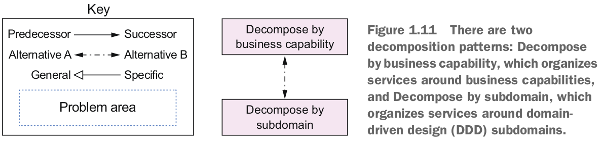

Chương 2 sẽ làm rõ chi tiết các patterns này.

#### Communication patterns
Ứng dụng được xây dựng bằng cách sử dụng kiến trúc microservice là một hệ thống phân tán. Do đó, việc giao tiếp giữa tiến trình (IPC) là một phần quan trọng của kiến trúc microservice. Bạn phải đưa ra một loạt các quyết định kiến trúc và thiết kế về cách các service của bạn giao tiếp với nhau và với thế giới bên ngoài. Hình 1.12 hiển thị các pattern giao tiếp, được tổ chức thành năm nhóm:

- Communication style: Loại cơ chế IPC nào bạn nên sử dụng?
- Discovery: Làm thế nào một khách hàng của một service xác định địa chỉ IP của một phiên bản service để, ví dụ, nó thực hiện một yêu cầu HTTP?
- Reliability: Làm thế nào để bạn đảm bảo rằng giao tiếp giữa các service là đáng tin cậy mặc dù các service có thể không khả dụng?
- Transactional messaging: Bạn nên tích hợp việc gửi tin nhắn và xuất bản sự kiện với các giao dịch cơ sở dữ liệu nào cập nhật dữ liệu kinh doanh?
- External API: Làm thế nào các khách hàng của ứng dụng của bạn giao tiếp với các service?

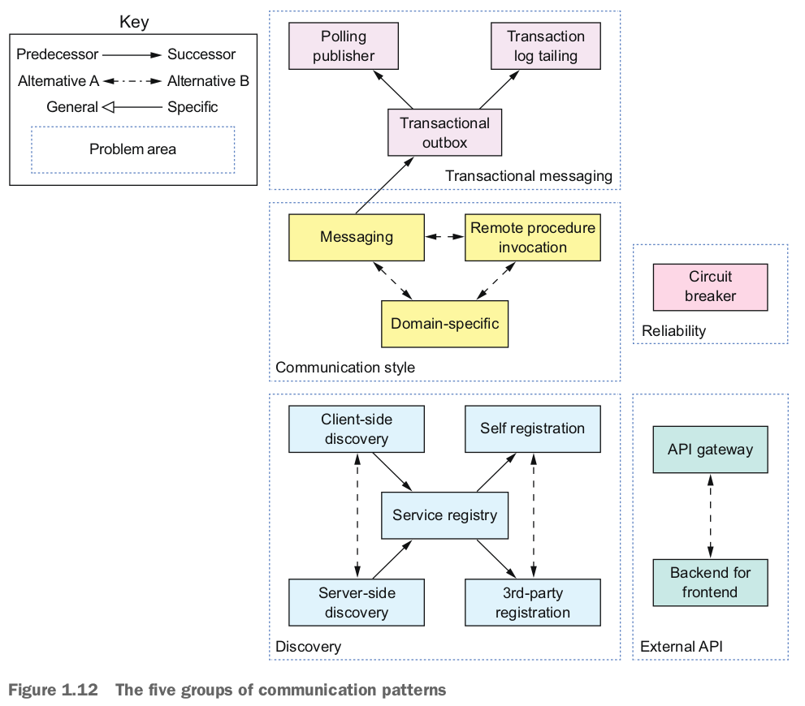

Chương 3 xem xét bốn nhóm pattern đầu tiên: Communication style, Discovery, Reliability và Transactional messaging. Chương 8 xem xét các pattern External API.

#### Data consistency patterns for implementing transaction management
Như đã đề cập trước đó, để đảm bảo sự lỏng lẻo trong việc kết nối, mỗi service có cơ sở dữ liệu riêng của mình. Thật không may, việc có một cơ sở dữ liệu cho mỗi service đưa ra một số vấn đề đáng kể. Tôi mô tả trong chương 4 rằng cách tiếp cận truyền thống sử dụng các giao dịch phân tán (2PC) không phải là một lựa chọn khả thi cho một ứng dụng hiện đại. Thay vào đó, một ứng dụng cần duy trì tính nhất quán dữ liệu bằng cách sử dụng pattern Saga. Hình 1.13 hiển thị các pattern liên quan đến dữ liệu.

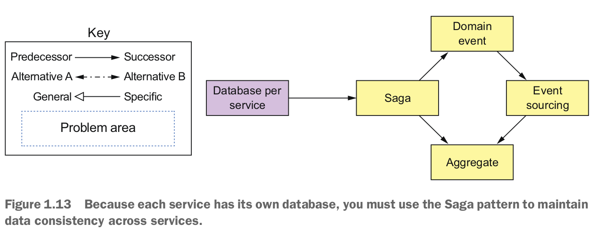

#### Patterns for querying data in a microservice architecture

Vấn đề khác khi sử dụng một cơ sở dữ liệu cho mỗi service là một số truy vấn cần nối dữ liệu thuộc sở hữu của nhiều service. Dữ liệu của một service chỉ có thể truy cập thông qua API của nó, vì vậy bạn không thể sử dụng các truy vấn phân tán đối với cơ sở dữ liệu của nó. Hình 1.14 hiển thị một vài pattern bạn có thể sử dụng để triển khai các truy vấn.

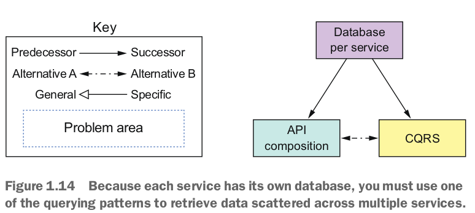

Đôi khi bạn có thể sử dụng pattern API composition, trong đó gọi các API của một hoặc nhiều service và tổng hợp kết quả. Đôi khi, bạn phải sử dụng pattern Command Query Responsibility Segregation (CQRS), giữ một hoặc nhiều bản sao của dữ liệu dễ truy vấn. Chương 7 xem xét các cách triển khai truy vấn khác nhau.

#### Service deployment patterns

Triển khai một ứng dụng monolithic không phải lúc nào cũng dễ dàng, nhưng nó đơn giản trong ý nghĩa là chỉ có một ứng dụng để triển khai. Bạn phải chạy nhiều phiên bản của ứng dụng đằng sau một trình cân bằng tải.
So với đó, việc triển khai một ứng dụng dựa trên microservices phức tạp hơn nhiều. Có thể có hàng chục hoặc hàng trăm service được viết bằng nhiều ngôn ngữ và frameworks khác nhau. Có nhiều yếu tố di chuyển hơn cần được quản lý. Hình 1.15 hiển thị các pattern triển khai.
Cách truyền thống, và thường là thủ công, để triển khai ứng dụng trong một định dạng đóng gói cụ thể cho ngôn ngữ, ví dụ như các tập tin WAR, không phù hợp với kiến trúc microservice. Bạn cần một cơ sở triển khai tự động hóa cao. Lý tưởng nhất, bạn nên sử dụng một nền tảng triển khai cung cấp cho nhà phát triển một giao diện người dùng đơn giản (dòng lệnh hoặc giao diện đồ họa) để triển khai và quản lý service của họ. Nền tảng triển khai thường sẽ dựa trên các máy ảo (VMs), containers, hoặc công nghệ serverless. Chương 12 xem xét các tùy chọn triển khai khác nhau.

#### Observabilty patterns provide insight into application behavior
Một phần quan trọng trong việc vận hành một ứng dụng là hiểu về hành vi hoạt động tại thời gian chạy và sửa chữa các vấn đề như yêu cầu thất bại và độ trễ cao. Mặc dù việc hiểu và sửa chữa một ứng dụng monolithic không phải lúc nào cũng dễ dàng, nhưng điều này giúp là các yêu cầu được xử lý theo cách đơn giản, trực tiếp. Mỗi yêu cầu đến được load balancer đến một phiên bản ứng dụng cụ thể, thực hiện một số cuộc gọi đến cơ sở dữ liệu và trả về một phản hồi. Ví dụ, nếu bạn cần hiểu cách xử lý một yêu cầu cụ thể, bạn nhìn vào tệp nhật ký của phiên bản ứng dụng đã xử lý yêu cầu đó.

Ngược lại, việc hiểu và chẩn đoán các vấn đề trong một kiến trúc microservice phức tạp hơn nhiều. Một yêu cầu có thể di chuyển giữa nhiều service trước khi một phản hồi cuối cùng được trả về cho một máy khách. Do đó, không có một tệp nhật ký duy nhất để xem xét. Tương tự, các vấn đề về độ trễ khó chẩn đoán hơn vì có nhiều nghi phạm.

Bạn có thể sử dụng các pattern sau để thiết kế các service quan sát được:
- Health check API — Tiết lộ một điểm cuối trả về trạng thái sức khỏe của service.
- Log aggregation — Ghi lại hoạt động của service và ghi nhật ký vào một máy chủ nhật ký trung tâm, cung cấp tính năng tìm kiếm và cảnh báo.
- Distributed tracing — Gán cho mỗi yêu cầu bên ngoài một ID duy nhất và theo dõi yêu cầu khi chúng di chuyển giữa các service.
- Exception tracking — Báo cáo các ngoại lệ cho một service theo dõi ngoại lệ, điều này loại bỏ các ngoại lệ trùng lặp, cảnh báo cho các nhà phát triển và theo dõi quá trình giải quyết của mỗi ngoại lệ.
- Application metrics — Bảo quản các số liệu thống kê, như số lượng và đồng hồ đo, và tiết lộ chúng cho một máy chủ số liệu thống kê.
- Audit logging — Ghi lại các hành động của người dùng.

Chương 11 mô tả những pattern này một cách chi tiết hơn.

#### Patterns for the autometed testing of services
Kiến trúc microservice giúp việc kiểm thử các service cá nhân dễ dàng hơn vì chúng nhỏ hơn nhiều so với ứng dụng monolithic. Tuy nhiên, đồng thời, việc kiểm thử rằng các service khác nhau hoạt động cùng nhau cũng rất quan trọng, trong khi tránh sử dụng các kiểm thử từ đầu đến cuối phức tạp, chậm chạp và dễ vỡ để kiểm thử nhiều service cùng nhau. Dưới đây là các pattern để đơn giản hóa quá trình kiểm thử bằng cách kiểm thử các service một cách độc lập:
- Consumer-driven contract test — Xác minh rằng một service đáp ứng mong đợi của các khách hàng của nó.
- Consumer-side contract test — Xác minh rằng khách hàng của một service có thể liên lạc với service.
- Service component test — Kiểm thử một service một cách độc lập.

Các chương 9 và 10 mô tả những pattern kiểm thử này một cách chi tiết hơn.

#### Pattern for handling cross-cutting concerns
Trong kiến trúc microservice, có nhiều vấn đề mà mỗi service phải triển khai, bao gồm các pattern quan sát và các pattern phát hiện. Nó cũng phải triển khai pattern Externalized Configuration, cung cấp các tham số cấu hình như thông tin đăng nhập cơ sở dữ liệu cho một service trong thời gian chạy. Khi phát triển một service mới, việc triển khai lại những vấn đề này từ đầu sẽ mất quá nhiều thời gian. Một cách tiếp cận tốt hơn nhiều là áp dụng pattern Microservice Chassis và xây dựng các service trên một framework xử lý các vấn đề này. Chương 11 mô tả những pattern này một cách chi tiết hơn.

#### Security patterns
Trong kiến trúc microservice, người dùng thường được xác thực bởi cổng API. Sau đó, nó phải chuyển thông tin về người dùng, như danh tính và vai trò, đến các service mà nó gọi. Một giải pháp phổ biến là áp dụng pattern Access token. Cổng API chuyển một mã token truy cập, chẳng hạn như JWT (JSON Web Token), đến các service, có thể xác thực mã token và nhận thông tin về người dùng. Chương 11 thảo luận về pattern Access token một cách chi tiết hơn.

Không ngạc nhiên, các pattern trong ngôn ngữ pattern kiến trúc Microservice tập trung vào việc giải quyết các vấn đề kiến trúc và thiết kế. Bạn chắc chắn cần có kiến trúc đúng để phát triển phần mềm một cách thành công, nhưng đó không phải là chỉ vấn đề. Bạn cũng phải xem xét quy trình và tổ chức.

## 1.7 Beyond microservices: Process and organization
Đối với một ứng dụng lớn, phức tạp, kiến trúc microservice thường là lựa chọn tốt nhất. Nhưng ngoài việc có kiến trúc đúng đắn, phát triển phần mềm thành công còn đòi hỏi bạn cũng phải có tổ chức, và quy trình phát triển và triển khai.

Hình 1.16 cho thấy mối quan hệ giữa quy trình, tổ chức và kiến trúc.

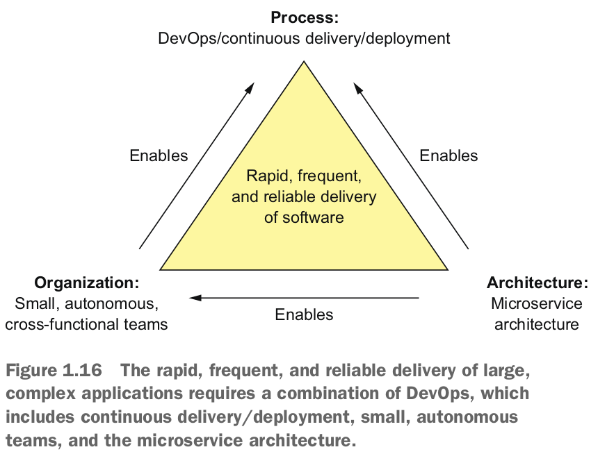

### 1.7.1 Sofware development and delivery organization
Thành công không thể tránh khỏi việc đội ngũ kỹ sư sẽ phát triển. Một mặt, điều này là điều tốt vì có nhiều nhà phát triển hơn có thể làm nhiều việc hơn. Nhưng vấn đề với các nhóm lớn là, như Fred Brooks đã viết trong The Mythical Man-Month, chi phí giao tiếp của một nhóm có kích thước N là O(N^2). Nếu nhóm trở nên quá lớn, nó sẽ trở nên không hiệu quả, do chi phí giao tiếp. Hãy tưởng tượng, ví dụ, cố gắng tổ chức một cuộc họp hàng ngày với 20 người.

Giải pháp là phân chia lại một đội ngũ lớn thành nhiều đội nhỏ. Mỗi đội nhỏ, bao gồm không quá 8-12 người. Nó có một nhiệm vụ cụ thể hướng tới doanh nghiệp: phát triển và có thể vận hành một hoặc nhiều service thực hiện một tính năng hoặc khả năng kinh doanh. Đội là đa chức năng và có thể phát triển, kiểm thử và triển khai các service của mình mà không cần phải giao tiếp hoặc phối hợp thường xuyên với các đội khác.

#### Phương pháp đảo ngược Conway

Để phát triển phần mềm một cách hiệu quả khi sử dụng kiến trúc microservices, bạn cần xem xét đến Định luật Conway (https://en.wikipedia.org/wiki/Conway%27s_law), do Melvin Conway nêu ra, nói rằng:
> "Các tổ chức thiết kế hệ thống... bị ràng buộc để tạo ra các thiết kế giống như cấu trúc giao tiếp của các tổ chức này."

Nói cách khác, kiến trúc ứng dụng của bạn phản ánh cấu trúc của tổ chức đã phát triển nó. Do đó, việc áp dụng Định luật Conway theo chiều ngược lại (www.thoughtworks.com/radar/techniques/inverse-conway-maneuver) và thiết kế tổ chức của bạn sao cho cấu trúc của nó phản ánh kiến trúc microservices là rất quan trọng. Bằng cách này, bạn đảm bảo rằng các nhóm phát triển của bạn giống như các service với mức độ liên kết lỏng lẻo.

### 1.7.2 Software development and delivery process
Sử dụng kiến trúc microservices với quy trình phát triển theo phong cách waterfall giống như lái một chiếc Ferrari kéo bởi ngựa - bạn lãng phí phần lớn lợi ích của việc sử dụng microservices. Nếu bạn muốn phát triển một ứng dụng với kiến trúc microservices, thì việc áp dụng các thực hành phát triển và triển khai linh hoạt như Scrum hoặc Kanban là cần thiết. Tốt hơn hết, bạn nên thực hành continuous delivery/deployment, một phần của DevOps.

Jez Humble định nghĩa continuous delivery như sau:

> Continuous Delivery là khả năng đưa các thay đổi của mọi loại - bao gồm các tính năng mới, thay đổi cấu hình, sửa lỗi và thử nghiệm - vào sản xuất, hoặc vào tay người dùng, một cách an toàn và nhanh chóng một cách bền vững.

Một đặc điểm chính của continuous delivery là phần mềm luôn có thể phát hành. Nó phụ thuộc vào mức độ tự động hóa cao, bao gồm kiểm thử tự động. Continuous deployment đưa continuous delivery một bước tiến xa hơn trong việc tự động triển khai mã có thể phát hành vào sản xuất. Các tổ chức hoạt động hiệu quả cao thực hành continuous deployment triển khai nhiều lần mỗi ngày vào môi trường sản xuất, có ít sự cố sản xuất hơn rất nhiều và phục hồi nhanh chóng từ bất kỳ sự cố nào xảy ra (https://puppet.com/resources/whitepaper/state-of-devops-report). Như đã mô tả trước đó trong phần 1.5.1, kiến trúc microservices hỗ trợ trực tiếp continuous delivery/deployment.

#### Move fast without breaking things
Mục tiêu của continuous delivery/deployment (và, nói chung, DevOps) là phát triển phần mềm một cách nhanh chóng nhưng đáng tin cậy. Bốn chỉ số hữu ích để đánh giá quá trình phát triển phần mềm là như sau:
- Deployment frequency — Số lần phần mềm được triển khai vào môi trường sản xuất
- Lead time — Thời gian từ khi một nhà phát triển check-in một thay đổi đến khi thay đổi đó được triển khai
- Mean time to recover — Thời gian để phục hồi từ một vấn đề sản xuất
- Change failure rate — Phần trăm thay đổi dẫn đến vấn đề sản xuất

Trong một tổ chức truyền thống, Deployment frequency thấp và thời gian dẫn cao. Những nhà phát triển và nhân viên vận hành thường phải thức khuya để sửa các vấn đề cuối cùng trong khoảng thời gian bảo trì. Ngược lại, một tổ chức DevOps thường phát hành phần mềm thường xuyên, thậm chí nhiều lần trong một ngày, với ít vấn đề sản xuất hơn. Ví dụ, Amazon đã triển khai các thay đổi vào sản xuất mỗi 11,6 giây vào năm 2014 (www.youtube.com/watch?v=dxk8b9rSKOo), và Netflix có thời gian dẫn là 16 phút cho một thành phần phần mềm (https://medium.com/netflix-techblog/how-we-build-code-at-netflix-c5d9bd727f15).
### 1.7.3 The human side of adopting microservices
Việc áp dụng kiến trúc microservice thay đổi cả kiến trúc, tổ chức và quy trình phát triển của bạn. Cuối cùng, nó thay đổi môi trường làm việc của con người, như đã đề cập trước đó, là những sinh vật cảm xúc. Nếu bị bỏ qua, cảm xúc của họ có thể làm cho quá trình chuyển đổi sang microservices trở thành một hành trình gập ghềnh. Mary và các nhà lãnh đạo FTGO khác sẽ gặp khó khăn trong việc thay đổi cách FTGO phát triển phần mềm.

Cuốn sách bán chạy nhất Managing Transitions (Da Capo Lifelong Books, 2017) của William và Susan Bridges giới thiệu khái niệm về quá trình chuyển đổi, đó là quá trình người dùng phản ứng cảm xúc với một sự thay đổi. Nó mô tả một Mô hình Chuyển đổi ba giai đoạn:

- Kết thúc, Mất mát và Buông bỏ (Ending, Losing and Letting Go) — Giai đoạn đảo lộn và phản kháng cảm xúc khi mọi người được giới thiệu với một thay đổi buộc họ phải rời khỏi vùng thoải mái của họ. Họ thường than phiền về việc mất đi cách làm cũ. Ví dụ, khi mọi người tái tổ chức thành các nhóm chức năng chéo, họ cảm thấy nhớ những đồng đội cũ của mình. Tương tự, một nhóm mô hình dữ liệu nắm giữ mô hình dữ liệu toàn cầu sẽ bị đe dọa bởi ý tưởng mỗi service có một mô hình dữ liệu riêng.

- Khu vực Trung gian (The Neutral Zone) — Giai đoạn trung gian giữa cách làm cũ và mới, nơi mọi người thường bối rối. Họ thường đang gặp khó khăn trong việc học cách làm mới.

- Bắt đầu Mới (The New Begining) — Giai đoạn cuối cùng khi mọi người đã nhiệt tình chấp nhận cách làm mới và bắt đầu trải nghiệm các lợi ích.

Cuốn sách mô tả cách quản lý tốt nhất cho mỗi giai đoạn của quá trình chuyển đổi và tăng khả năng thực hiện thành công sự thay đổi. FTGO chắc chắn đang gặp khó khăn từ "địa ngục monolithic" và cần di chuyển sang một kiến trúc microservice. Nó cũng phải thay đổi tổ chức và quy trình phát triển của mình. Tuy nhiên, để FTGO hoàn thành mục tiêu này một cách thành công, nó phải xem xét mô hình chuyển đổi và cân nhắc cảm xúc của mọi người.

Trong chương tiếp theo, bạn sẽ tìm hiểu về mục tiêu của kiến trúc phần mềm và cách phân rã một ứng dụng thành các service.