# Chapter 2 : Decomposition strategies
-------------------

Đôi khi bạn phải cẩn thận với điều bạn mong muốn. Sau một cuộc chiến lược sôi nổi, Mary cuối cùng đã thuyết phục được doanh nghiệp rằng việc chuyển sang một kiến trúc microservice là đúng đắn. Cảm thấy một sự kích động kết hợp với một số lo lắng, Mary đã có một cuộc họp sáng dài cùng các kiến trúc sư của mình để thảo luận về nơi bắt đầu. Trong quá trình thảo luận, trở nên rõ ràng rằng một số khía cạnh của ngôn ngữ mẫu kiến trúc Microservice, chẳng hạn như triển khai và khám phá service, là mới và không quen thuộc, nhưng lại đơn giản. Thách thức chính, là bản chất của kiến trúc microservice, là phân rã chức năng của ứng dụng thành các service. Mặt đầu tiên và quan trọng nhất của kiến trúc, do đó, là định nghĩa các service. Trong khi họ đứng xung quanh bảng trắng, nhóm FTGO tự hỏi chính xác làm thế nào để làm điều đó!

Trong chương này, bạn sẽ tìm hiểu cách định nghĩa một kiến trúc microservice cho một ứng dụng. Tôi mô tả các chiến lược phân rã một ứng dụng thành các service. Bạn sẽ tìm hiểu rằng các service được tổ chức xung quanh các vấn đề business chứ không phải là các vấn đề kỹ thuật. Tôi cũng chỉ ra cách sử dụng các ý tưởng từ thiết kế theo lĩnh vực (DDD) để loại bỏ các lớp god, là các lớp được sử dụng trong toàn bộ một ứng dụng và gây ra các phụ thuộc rối rắm ngăn cản phân rã.

Tôi bắt đầu chương này bằng cách định nghĩa kiến trúc microservice dựa trên các khái niệm về kiến trúc phần mềm. Sau đó, tôi mô tả một quy trình để định nghĩa một kiến trúc microservice cho một ứng dụng bắt đầu từ yêu cầu của nó. Tôi thảo luận về các chiến lược phân rã một ứng dụng thành một bộ sưu tập các service, các rào cản của nó và cách vượt qua chúng. Hãy bắt đầu bằng cách xem xét khái niệm về kiến trúc phần mềm.

## 2.1 What is the microservice architecture exactly ?
Chương 1 mô tả ý tưởng chính của kiến trúc microservice là phân rã chức năng. Thay vì phát triển một ứng dụng lớn, bạn cấu trúc ứng dụng dưới dạng một bộ các service. Mặt một cách mô tả kiến trúc microservice như một loại phân rã chức năng là hữu ích. Nhưng mặt khác, nó để lại một số câu hỏi chưa được trả lời, bao gồm kiến trúc microservice liên quan như thế nào đến các khái niệm rộng lớn hơn về kiến trúc phần mềm? Một service là gì? Và kích thước của một service quan trọng như thế nào?

Để trả lời những câu hỏi đó, chúng ta cần lùi lại một bước và xem xét ý nghĩa của kiến trúc phần mềm. Kiến trúc của một ứng dụng phần mềm là cấu trúc cấp cao của nó, bao gồm các phần thành và các phụ thuộc giữa những phần đó. Như bạn sẽ thấy trong phần này, kiến trúc của một ứng dụng là đa chiều, vì vậy có nhiều cách để mô tả nó. Lý do kiến trúc quan trọng là vì nó xác định các thuộc tính phần mềm hoặc -ilities của ứng dụng. Truyền thống, mục tiêu của kiến trúc đã là sự mở rộng, đáng tin cậy và an ninh. Nhưng ngày nay, quan trọng là kiến trúc cũng cho phép phát triển phần mềm nhanh chóng và an toàn. Bạn sẽ tìm hiểu rằng kiến trúc microservice là một kiểu kiến trúc cụ thể mang lại cho ứng dụng tính bảo trì, kiểm thử và triển khai cao.

Tôi bắt đầu phần này bằng cách mô tả khái niệm về kiến trúc phần mềm và lý do tại sao nó quan trọng. Tiếp theo, tôi thảo luận về ý tưởng của một kiểu kiến trúc. Sau đó, tôi định nghĩa kiến trúc microservice là một kiểu kiến trúc cụ thể. Hãy bắt đầu bằng cách xem xét khái niệm về kiến trúc phần mềm.

### 2.1.1 What is software architecture and why does it matter?

Kiến trúc rõ ràng là quan trọng. Có ít nhất hai hội nghị được dành riêng cho chủ đề này: Hội nghị Kiến trúc Phần mềm O’Reilly (https://conferences.oreilly.com/software-architecture) và hội nghị SATURN (https://resources.sei.cmu.edu/news-events/events/saturn/). Nhiều nhà phát triển có mục tiêu trở thành một kiến trúc sư. Nhưng kiến trúc là gì và tại sao nó quan trọng?

Để trả lời câu hỏi đó, trước tiên tôi định nghĩa ý nghĩa của thuật ngữ kiến trúc phần mềm. Sau đó, tôi thảo luận về cách kiến trúc của một ứng dụng là đa chiều và được mô tả tốt nhất bằng một bộ sưu tập các quan điểm hoặc bản thiết kế. Tiếp theo, tôi mô tả rằng kiến trúc phần mềm quan trọng vì ảnh hưởng của nó đối với các thuộc tính chất lượng phần mềm của ứng dụng.

#### A definition of software architecture
Có nhiều định nghĩa về kiến trúc phần mềm. Ví dụ, bạn có thể xem trên trang https://en.wikiquote.org/wiki/Software_architecture để đọc một số trong số chúng. Định nghĩa yêu thích của tôi đến từ Len Bass và đồng nghiệp tại Viện Kỹ thuật Phần mềm (www.sei.cmu.edu), người đã đóng một vai trò quan trọng trong việc xác định kiến trúc phần mềm là một ngành học. Họ định nghĩa kiến trúc phần mềm như sau:

> "Kiến trúc phần mềm của một hệ thống máy tính là tập hợp các cấu trúc cần thiết để suy luận về hệ thống, bao gồm các phần tử phần mềm, mối quan hệ giữa chúng và các thuộc tính của cả hai."

(Documenting Software Architectures của Bass và cộng sự)

Đây rõ ràng là một định nghĩa khá trừu tượng. Nhưng bản chất của nó là kiến trúc của một ứng dụng là sự phân rã của nó thành các phần (các phần tử) và mối quan hệ (các mối quan hệ) giữa các phần đó. Phân rã là quan trọng vì một số lý do:
- Nó thuận lợi cho việc phân chia lao động và kiến thức. Nó cho phép nhiều người (hoặc nhiều nhóm) có kiến thức chuyên môn có thể làm việc hiệu quả cùng nhau trên một ứng dụng.
- Nó xác định cách các phần tử phần mềm tương tác với nhau.

Chính sự phân rã thành các phần và mối quan hệ giữa các phần đó quyết định các -ilities của ứng dụng.

#### The 4+1 view model of software architecture
Cụ thể hơn, kiến trúc của một ứng dụng có thể được xem từ nhiều góc độ khác nhau, giống như kiến trúc của một tòa nhà có thể được xem từ các góc độ cấu trúc, ống nước, điện và các góc độ khác. Phillip Krutchen đã viết một bài báo cổ điển mô tả mô hình xem 4+1 của kiến trúc phần mềm, “Architectural Blueprints—The ‘4+1’ View Model of Software Architecture” (www.cs.ubc.ca/~gregor/teaching/papers/4+1view-architecture.pdf). Mô hình 4+1, được minh họa trong Hình 2.1, xác định bốn góc độ khác nhau của một kiến trúc phần mềm. Mỗi góc độ mô tả một khía cạnh cụ thể của kiến trúc và bao gồm một tập hợp cụ thể các phần tử phần mềm và các mối quan hệ giữa chúng.

Mục đích của mỗi góc độ là như sau:
- Logic view - Các phần tử phần mềm được tạo ra bởi các nhà phát triển. Trong ngôn ngữ hướng đối tượng, các phần tử này là các lớp và gói. Các mối quan hệ giữa chúng là các mối quan hệ giữa các lớp và gói, bao gồm kế thừa, liên kết và phụ thuộc.
- Implementation view - Đầu ra của hệ thống xây dựng. Góc nhìn này bao gồm các module, đại diện cho mã được đóng gói, và các thành phần, đó là các đơn vị thực thi hoặc triển khai bao gồm một hoặc nhiều module. Trong Java, một module là một tệp JAR, và một thành phần thường là một tệp WAR hoặc một tệp JAR thực thi. Các mối quan hệ giữa chúng bao gồm các mối quan hệ phụ thuộc giữa các module và các mối quan hệ hợp thành giữa các thành phần và module.
- Process view - Các thành phần khi chạy. Mỗi phần tử là một quy trình, và các mối quan hệ giữa các quy trình đại diện cho giao tiếp giữa các quy trình.
- Deployment - Cách các quy trình được ánh xạ vào các máy. Các phần tử trong góc nhìn này bao gồm các máy (vật lý hoặc ảo) và các quy trình. Các mối quan hệ giữa các máy đại diện cho mạng lưới. Góc độ này cũng mô tả mối quan hệ giữa các quy trình và máy.

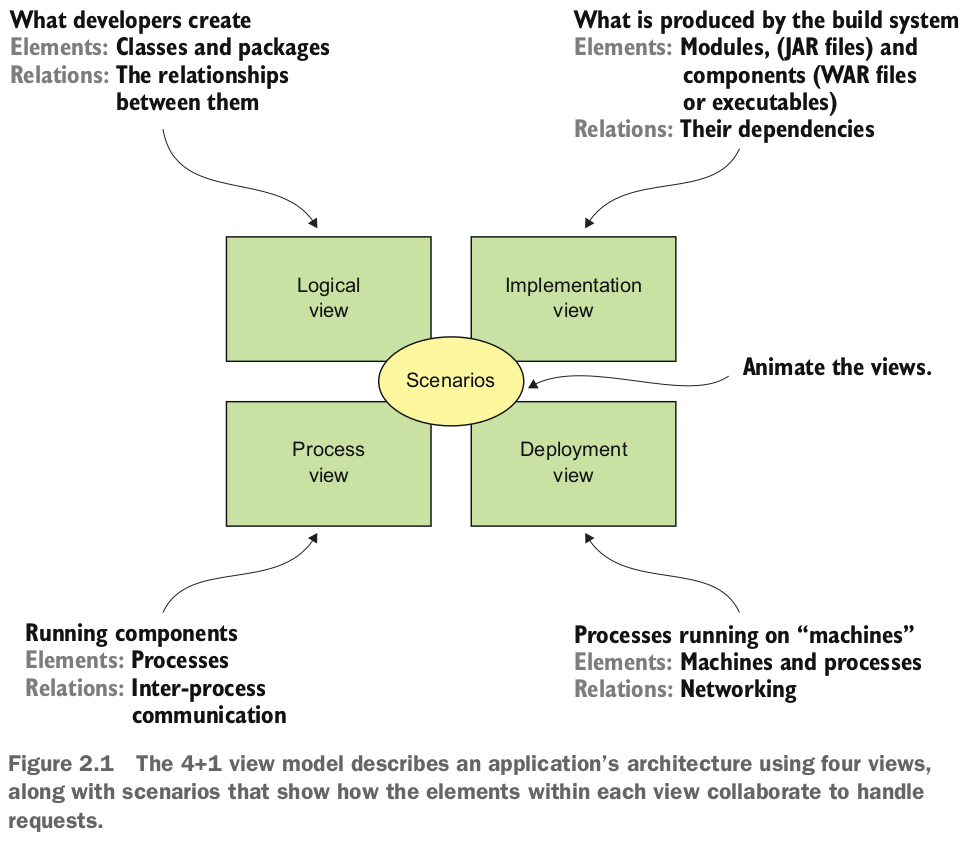

Ngoài bốn góc độ này, còn có các kịch bản - +1 trong mô hình 4+1 - làm sống động các góc độ. Mỗi kịch bản mô tả cách các thành phần kiến trúc trong một góc độ cụ thể cộng tác để xử lý một yêu cầu. Một kịch bản trong góc độ logic, ví dụ, cho thấy cách các lớp cộng tác. Tương tự, một kịch bản trong góc độ quy trình cho thấy cách các quy trình cộng tác.

Mô hình xem 4+1 là một cách tuyệt vời để mô tả kiến trúc của một ứng dụng. Mỗi góc độ mô tả một khía cạnh quan trọng của kiến trúc, và các kịch bản minh họa cách các phần tử của một góc độ cộng tác. Bây giờ hãy xem tại sao kiến trúc lại quan trọng.

#### Why architecture matters
Một ứng dụng có hai loại yêu cầu. Loại đầu tiên bao gồm yêu cầu functional, xác định những gì ứng dụng phải làm. Thông thường, chúng có dạng các trường hợp sử dụng hoặc câu chuyện người dùng. Kiến trúc ít liên quan đến các yêu cầu functional. Bạn có thể triển khai các yêu cầu functional với gần như bất kỳ kiến trúc nào, thậm chí là một cục bùn lớn.

Kiến trúc quan trọng vì nó cho phép một ứng dụng đáp ứng loại thứ hai của yêu cầu: các yêu cầu quality of service của nó. Đây cũng được biết đến là các yêu cầu về chất lượng và được gọi là -ilities. Các yêu cầu về quality of service xác định các tính chất thời gian chạy như khả năng mở rộng và đáng tin cậy. Chúng cũng xác định các tính chất thời gian phát triển bao gồm khả năng bảo trì, khả năng kiểm tra và khả năng triển khai. Kiến trúc bạn chọn cho ứng dụng của mình xác định mức độ nó đáp ứng các yêu cầu chất lượng này.

### 2.1.2 Overview of architectural styles
Trong thế giới vật lý, kiến trúc của một tòa nhà thường tuân theo một phong cách cụ thể, chẳng hạn như Victoria, American Craftsman, hoặc Art Deco. Mỗi phong cách là một bộ quyết định thiết kế hạn chế các đặc điểm và vật liệu xây dựng của một tòa nhà. Khái niệm về phong cách kiến trúc cũng áp dụng cho phần mềm. David Garlan và Mary Shaw (An Introduction to Software Architecture, Tháng 1 năm 1994) , những người tiên phong trong lĩnh vực kiến trúc phần mềm, định nghĩa một phong cách kiến trúc như sau:
> "Một phong cách kiến trúc, sau đó, xác định một họ các hệ thống như vậy dưới dạng một mẫu tổ chức cấu trúc. Cụ thể hơn, một phong cách kiến trúc xác định từ vựng của các thành phần và kết nối mà có thể được sử dụng trong các trường hợp của phong cách đó, cùng với một tập hợp các ràng buộc về cách chúng có thể được kết hợp."

Một phong cách kiến trúc cụ thể cung cấp một bảng màu hạn chế của các yếu tố (các thành phần) và mối quan hệ (các kết nối) mà bạn có thể sử dụng để xác định một cách nhìn về kiến trúc ứng dụng của bạn. Một ứng dụng thường sử dụng một kết hợp các phong cách kiến trúc. Ví dụ, sau này trong phần này tôi mô tả cách kiến trúc monolithic là một phong cách kiến trúc xác định cách tổ chức cấu trúc triển khai như một thành phần duy nhất (có thể thực thi/deploy). Kiến trúc microservice cấu trúc một ứng dụng dưới dạng một tập hợp các service lỏng lẻo kết nối.

#### The layered architectural style
Ví dụ cổ điển về một phong cách kiến trúc là kiến trúc lớp. Một kiến trúc lớp tổ chức các thành phần phần mềm thành các lớp. Mỗi lớp có một tập hợp rõ ràng các trách nhiệm. Một kiến trúc lớp cũng hạn chế các phụ thuộc giữa các lớp. Một lớp chỉ có thể phụ thuộc vào lớp ngay dưới nó (nếu là strict layering) hoặc bất kỳ lớp nào phía dưới nó.

Bạn có thể áp dụng kiến trúc lớp cho bất kỳ một trong bốn góc nhìn đã thảo luận trước đó. Một kiến trúc ba lớp phổ biến là kiến trúc lớp được áp dụng vào góc nhìn logic. Nó tổ chức các lớp của ứng dụng thành các tầng hoặc lớp sau đây:
- Tầng hiển thị : Chứa mã triển khai giao diện người dùng hoặc API bên ngoài
- Tầng business logic : Chứa business logic
- Tầng persistence : Triển khai logic tương tác với cơ sở dữ liệu

Kiến trúc lớp là một ví dụ tuyệt vời về một phong cách kiến trúc, nhưng nó cũng có một số hạn chế đáng kể:
- Chỉ có một tầng hiển thị : Nó không đại diện cho việc một ứng dụng có thể được gọi bởi nhiều hơn một hệ thống.
- Chỉ có một tầng persistence : Nó không đại diện cho việc một ứng dụng có khả năng tương tác với nhiều hơn một cơ sở dữ liệu.
- Xác định tầng business logic phụ thuộc vào tầng persistence : Trong lý thuyết, sự phụ thuộc này ngăn bạn kiểm thử business logic mà không cần cơ sở dữ liệu.

Ngoài ra, kiến trúc lớp làm biểu diễn sai lệch về các phụ thuộc trong một ứng dụng thiết kế tốt. Business logic thường xác định một giao diện hoặc một bộ sưu tập giao diện định nghĩa các phương thức truy cập dữ liệu. Tầng persistence xác định các lớp DAO triển khai các giao diện bộ sưu tập. Nói cách khác, các phụ thuộc là ngược lại so với điều được mô tả bởi một kiến trúc lớp.

Hãy xem xét một kiến trúc thay thế giải quyết những hạn chế này: kiến trúc hình lục giác.

#### About the hexagonal architecture style

Kiến trúc hình lục giác là một phương pháp thay thế cho phong cách kiến trúc lớp. Như hình 2.2 hiển thị, phong cách kiến trúc hình lục giác tổ chức góc nhìn logic một cách sao cho đặt Business logic ở trung tâm. Thay vì tầng hiển thị, ứng dụng có một hoặc nhiều adapter đầu vào xử lý yêu cầu từ bên ngoài bằng cách gọi Business logic. Tương tự, thay vì một tầng lưu trữ dữ liệu, ứng dụng có một hoặc nhiều adapter đầu ra được gọi bởi Business logic và gọi các ứng dụng bên ngoài. Một đặc điểm chính và lợi ích quan trọng của kiến trúc này là Business logic không phụ thuộc vào các adapter. Thay vào đó, chúng phụ thuộc vào nó.

Business logic có một hoặc nhiều cổng. Một cổng xác định một tập hợp các thao tác và là cách Business logic tương tác với những thứ ở bên ngoài nó. Trong Java, ví dụ, một cổng thường là một giao diện Java. Có hai loại cổng: cổng đầu vào và cổng đầu ra. Một cổng đầu vào là một API được tiếp xúc bởi Business logic, cho phép nó được gọi bởi các ứng dụng bên ngoài. Một ví dụ về cổng đầu vào là một giao diện service, xác định các phương thức công cộng của một service. Một cổng đầu ra là cách Business logic gọi các hệ thống bên ngoài. Một ví dụ về cổng đầu ra là một giao diện lưu trữ, xác định một bộ sưu tập các hoạt động truy cập dữ liệu.


Xung quanh Business logic là các adapter. Giống như các cổng, có hai loại adapter: đầu vào và đầu ra. Một adapter đầu vào xử lý các yêu cầu từ thế giới bên ngoài bằng cách gọi một cổng đầu vào. Một ví dụ về adapter đầu vào là một Điều khiển Spring MVC triển khai một tập hợp các điểm cuối REST hoặc một tập hợp các trang web. Một ví dụ khác là một khách hàng trình điều khiển thông điệp đăng ký thông điệp. Nhiều adapter đầu vào có thể gọi cùng một cổng đầu vào.

Một adapter đầu ra triển khai một cổng đầu ra và xử lý các yêu cầu từ Business logic bằng cách gọi một ứng dụng hoặc service bên ngoài. Một ví dụ về adapter đầu ra là một lớp đối tượng truy cập dữ liệu (DAO) triển khai các hoạt động để truy cập cơ sở dữ liệu. Một ví dụ khác là một lớp proxy gọi một service từ xa. Các adapter đầu ra cũng có thể xuất bản sự kiện.

Một lợi ích quan trọng của phong cách kiến trúc hình lục giác là nó giải trích Business logic khỏi logic hiển thị và truy cập dữ liệu trong các adapter. Business logic không phụ thuộc vào logic hiển thị hoặc logic truy cập dữ liệu. Nhờ sự phân tách này, việc kiểm thử Business logic một cách riêng lẻ dễ dàng hơn nhiều. Một lợi ích khác là nó phản ánh chính xác hơn kiến trúc của một ứng dụng hiện đại. Business logic có thể được gọi thông qua nhiều adapter, mỗi bộ triển khai một API hoặc giao diện người dùng cụ thể. Bunsiness logic cũng có thể gọi nhiều adapter, mỗi bộ triển khai một hệ thống bên ngoài khác nhau. Kiến trúc hình lục giác là một cách tuyệt vời để mô tả kiến trúc của mỗi service trong một kiến trúc service nhỏ.

Kiến trúc lớp và kiến trúc hình lục giác đều là ví dụ về phong cách kiến trúc. Mỗi phong cách xác định các khối xây dựng của một kiến trúc và áp đặt các ràng buộc về mối quan hệ giữa chúng. Kiến trúc hình lục giác và kiến trúc lớp, dưới dạng kiến trúc ba tầng, tổ chức góc nhìn logic. Bây giờ, hãy xác định kiến trúc service như một phong cách kiến trúc tổ chức góc nhìn triển khai.

### 2.1.3 The microservices architecture is an architectural style

Tôi đã thảo luận về mô hình xem 4+1 và phong cách kiến trúc, vì vậy tôi có thể xác định kiến trúc monolithic và microservice. Cả hai đều là phong cách kiến trúc. Kiến trúc monolithic là một phong cách kiến trúc tổ chức góc nhìn triển khai dưới dạng một thành phần duy nhất: một tệp thực thi hoặc WAR duy nhất. Định nghĩa này không nói gì về các góc nhìn khác. Một ứng dụng monolithic có thể, ví dụ, có một góc nhìn logic được tổ chức theo cách của một kiến trúc hình lục giác.

**Pattern: Monolithic architecture**"\
Structure the application as a single executable/deployable component. See http://microservices.io/patterns/monolithic.html

Kiến trúc microservice cũng là một phong cách kiến trúc. Nó tổ chức góc nhìn triển khai dưới dạng một tập hợp các thành phần: các tệp thực thi hoặc WAR files. Các thành phần này là các service, và các kết nối là các giao thức truyền thông cho phép các service đó hợp tác. Mỗi service có kiến trúc góc nhìn logic riêng của mình, thường là một kiến trúc hình lục giác. Hình 2.3 cho thấy một kiến trúc microservice có thể cho ứng dụng FTGO. Các service trong kiến trúc này tương ứng với các *business capability*, chẳng hạn như Quản lý Order và Quản lý Nhà hàng.

**Pattern: Microservice architecture**\
Structure the application as a collection of loosely coupled, independently deployable services. See http://microservices.io/patterns/microservices.html.


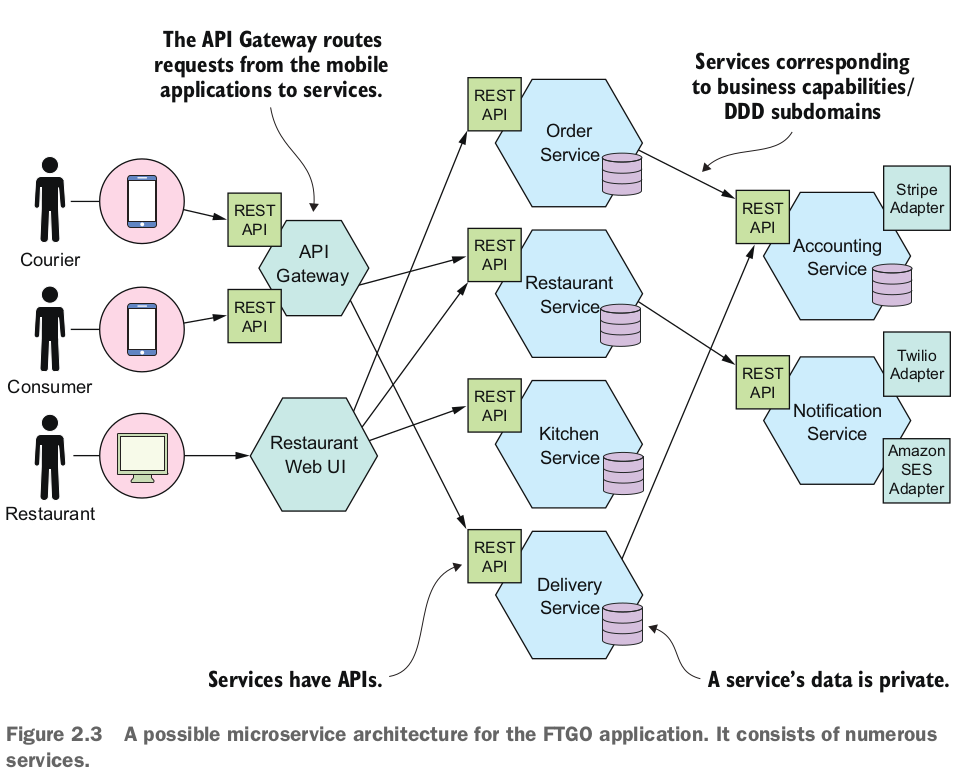

Trong phần sau của chương này, tôi mô tả ý nghĩa của *business capability*. Các kết nối giữa các service được triển khai bằng cách sử dụng các cơ chế giao tiếp giữa các tiến trình như REST APIs và thông báo bất đồng bộ. Chương 3 sẽ thảo luận chi tiết hơn về giao tiếp giữa các tiến trình.

Một hạn chế chính được áp đặt bởi kiến trúc microservice là các service được lỏng lẻo kết nối. Do đó, có các hạn chế về cách các service hợp tác. Để giải thích các hạn chế đó, tôi sẽ cố gắng định nghĩa thuật ngữ "service", mô tả ý nghĩa của việc lỏng lẻo kết nối, và giải thích tại sao điều này quan trọng.

#### What is a service ?

Một service là một thành phần phần mềm độc lập, có thể triển khai độc lập thực hiện một số chức năng hữu ích. Hình 2.4 hiển thị góc nhìn bên ngoài của một service, trong ví dụ này là service Đặt hàng. Một service có một API cung cấp cho các khách hàng của nó quyền truy cập vào chức năng của nó. Có hai loại hoạt động: Command và Queries. API bao gồm các Command, Queries và sự kiện. Một Command, như `createOrder()`, thực hiện các hành động và cập nhật dữ liệu. Một Queries, như `findOrderById()`, lấy dữ liệu. Một service cũng xuất bản sự kiện, như `OrderCreated`, được tiêu thụ bởi các khách hàng của nó.

API của một service đóng gói triển khai nội bộ của nó. Khác với trong một khối lớn, một nhà phát triển không thể viết mã thông qua API của nó. Do đó, kiến trúc microservice thúc đẩy tính phân cấp của ứng dụng.
Mỗi service trong kiến trúc microservice có kiến ​​trúc riêng và, có thể, ngăn xếp công nghệ riêng. Nhưng một service tiêu biểu có một kiến trúc lục giác. API của nó được thực hiện bởi các adapter tương tác với logic business của service. Adapter hoạt động gọi logic business và adapter sự kiện xuất bản các sự kiện phát ra từ logic business.

Sau này trong chương 12, khi tôi thảo luận về các công nghệ triển khai, bạn sẽ thấy rằng góc nhìn triển khai của một service có thể có nhiều hình thức. Thành phần có thể là một quy trình độc lập, một ứng dụng web hoặc gói OSGI chạy trong một container, hoặc một chức năng đám mây không cần máy chủ. Một yêu cầu quan trọng, tuy nhiên, là một service có một API và có thể triển khai độc lập.


#### What is losse coupling ?
Một đặc điểm quan trọng của kiến trúc microservice là các service được kết nối lỏng lẻo. Mọi tương tác với một service đều xảy ra thông qua API của nó, API này bao gồm chi tiết triển khai của service. Điều này cho phép triển khai của service thay đổi mà không ảnh hưởng đến các khách hàng của nó. Các service kết nối lỏng lẻo là yếu tố then chốt để cải thiện các thuộc tính thời gian phát triển của ứng dụng, bao gồm tính bảo trì và tính khả năng kiểm thử của nó. Chúng dễ hiểu hơn, dễ thay đổi và kiểm thử hơn nhiều.

Yêu cầu về việc các service phải kết nối lỏng lẻo và hợp tác chỉ thông qua API cấm các service giao tiếp thông qua cơ sở dữ liệu. Bạn phải xử lý dữ liệu lưu trữ của một service như các trường của một lớp và giữ chúng ở chế độ riêng tư. Việc giữ dữ liệu riêng tư cho phép một nhà phát triển thay đổi lược đồ cơ sở dữ liệu của service mà không cần phải dành thời gian phối hợp với các nhà phát triển làm việc trên các service khác. Việc không chia sẻ các bảng cơ sở dữ liệu cũng cải thiện sự cô lập khi chạy. Điều này đảm bảo, ví dụ, rằng một service không thể giữ khóa cơ sở dữ liệu mà chặn một service khác. Tuy nhiên, sau này, bạn sẽ tìm hiểu rằng một nhược điểm của việc không chia sẻ cơ sở dữ liệu là việc duy trì tính nhất quán của dữ liệu và Queries qua các service trở nên phức tạp hơn.

#### The role of shared libraies

Nhà phát triển thường đóng gói chức năng vào một thư viện (module) để nó có thể được tái sử dụng bởi nhiều ứng dụng mà không cần lặp lại mã. Cuối cùng, chúng ta sẽ ra sao ngày nay nếu thiếu các kho lưu trữ như Maven hoặc npm? Bạn có thể cảm thấy cám dỗ để cũng sử dụng các thư viện chung trong kiến trúc microservice. Trên bề mặt, nó trông như một cách tốt để giảm sự trùng lặp mã trong các service của bạn. Nhưng bạn cần đảm bảo rằng bạn không vô tình tạo ra sự kết nối giữa các service của mình.

Hãy tưởng tượng, ví dụ, rằng nhiều service cần cập nhật đối tượng business Order. Một cách tiếp cận là đóng gói chức năng đó như là một thư viện được sử dụng bởi nhiều service. Một mặt, việc sử dụng một thư viện loại bỏ sự trùng lặp mã. Mặt khác, hãy xem xét điều gì xảy ra khi các yêu cầu thay đổi theo cách ảnh hưởng đến đối tượng business Order. Bạn sẽ cần phải xây dựng và triển khai lại đồng thời các service đó. Một cách tiếp cận tốt hơn nhiều sẽ là triển khai chức năng có khả năng thay đổi, như quản lý Order, như một service.

Bạn nên cố gắng sử dụng thư viện cho các chức năng ít có khả năng thay đổi. Ví dụ, trong một ứng dụng điển hình, không hợp lý khi mỗi service đều triển khai một lớp Money chung. Thay vào đó, bạn nên tạo một thư viện được sử dụng bởi các service.

#### The size of a service is mostly unimportant
Một vấn đề với thuật ngữ microservice là điều đầu tiên bạn nghe là micro. Điều này ngụ ý rằng một service nên rất nhỏ. Điều này cũng đúng với các thuật ngữ dựa trên kích thước khác như miniservice hoặc nanoservice. Trong thực tế, kích thước không phải là một chỉ số hữu ích.

Một mục tiêu tốt hơn nhiều là định nghĩa một service thiết kế tốt là một service có khả năng được phát triển bởi một nhóm nhỏ với thời gian dẫn đầu tối thiểu và với sự hợp tác tối thiểu với các nhóm khác. Theo lý thuyết, một nhóm có thể chỉ chịu trách nhiệm cho một service duy nhất, vì vậy service đó chắc chắn không phải là micro. Ngược lại, nếu một service yêu cầu một nhóm lớn hoặc mất nhiều thời gian để kiểm thử, có thể hợp lý để chia nhóm và service đó. Hoặc nếu bạn liên tục cần phải thay đổi một service do sự thay đổi của các service khác hoặc nó gây ra các thay đổi trong các service khác, đó là một dấu hiệu cho thấy nó không phải là lỏng lẻo kết nối. Bạn thậm chí có thể đã xây dựng một monolith phân tán.

Kiến trúc microservice cấu trúc một ứng dụng như một tập hợp các service nhỏ, lỏng lẻo kết nối. Kết quả là, nó cải thiện các thuộc tính thời gian phát triển - bảo trì, kiểm thử, triển khai, và như vậy - và cho phép một tổ chức phát triển phần mềm tốt hơn nhanh chóng hơn. Nó cũng cải thiện khả năng mở rộng của một ứng dụng, mặc dù đó không phải là mục tiêu chính. Để phát triển một kiến trúc microservice cho ứng dụng của bạn, bạn cần xác định các service và xác định cách chúng hợp tác. Hãy xem cách làm điều đó.

## 2.2 Defining an application's microservice architecture

Làm thế nào để xác định một kiến trúc microservice? Như với bất kỳ công việc phát triển phần mềm nào, các điểm khởi đầu là các yêu cầu được viết, hy vọng là các chuyên gia lĩnh vực và có thể là một ứng dụng hiện có. Giống như nhiều phần trong phát triển phần mềm, việc xác định một kiến trúc là một nghệ thuật hơn là một khoa học. Phần này mô tả một quy trình đơn giản ba bước, như được thể hiện trong hình 2.5, để xác định kiến trúc của một ứng dụng. Tuy nhiên, quan trọng phải nhớ rằng đây không phải là một quy trình bạn có thể theo cơ cấu cơ khí. Điều này có thể là một quá trình lặp lại và liên quan đến nhiều sự sáng tạo.


Một ứng dụng tồn tại để xử lý các yêu cầu, vì vậy bước đầu tiên trong việc xác định kiến trúc của nó là rút gọn yêu cầu của ứng dụng thành các yêu cầu chính. Nhưng thay vì mô tả các yêu cầu dựa trên các công nghệ IPC cụ thể như REST hoặc messaging, tôi sử dụng khái niệm trừu tượng hơn về hoạt động của hệ thống. Một hoạt động của hệ thống là sự trừu tượng của một yêu cầu mà ứng dụng phải xử lý. Đó là một Command, làm mới dữ liệu, hoặc một Queries, lấy dữ liệu. Hành vi của mỗi Command được định nghĩa dưới dạng một domain model trừu tượng, cũng được rút ra từ các yêu cầu. Các hoạt động của hệ thống trở thành các kịch bản kiến trúc mà minh họa cách các service hợp tác.

Bước thứ hai trong quy trình là xác định phân rã thành các service. Có một số chiến lược để lựa chọn. Một chiến lược, có nguồn gốc từ lĩnh vực kiến trúc doanh nghiệp, là xác định các service tương ứng với khả năng business. Một chiến lược khác là tổ chức các service xung quanh các domain con của thiết kế domain. Kết quả cuối cùng là các service được tổ chức xung quanh các khái niệm business thay vì các khái niệm kỹ thuật.

Bước thứ ba trong việc xác định kiến trúc của ứng dụng là xác định API của mỗi service. Để làm điều đó, bạn gán mỗi hoạt động hệ thống được xác định trong bước đầu tiên cho một service. Một service có thể triển khai một hoạt động hoàn toàn bởi chính nó. Hoặc, nó có thể cần hợp tác với các service khác. Trong trường hợp đó, bạn xác định cách các service hợp tác, điều này thường yêu cầu các service hỗ trợ các hoạt động bổ sung. Bạn cũng cần quyết định xem bạn sử dụng cơ chế IPC nào mà tôi mô tả trong chương 3 để triển khai API của mỗi service.

Có một số rào cản đối với việc phân rã. Rào cản đầu tiên là độ trễ mạng. Bạn có thể phát hiện ra rằng một phân rã cụ thể sẽ không thực tế do quá nhiều lượt đi lại giữa các service. Một rào cản khác đối với phân rã là giao tiếp đồng bộ giữa các service giảm khả năng sẵn có. Bạn có thể cần sử dụng khái niệm các service tự chứa, được mô tả trong chương 3. Rào cản thứ ba là yêu cầu duy trì tính nhất quán dữ liệu trên các service. Bạn thường cần sử dụng saga, được thảo luận trong chương 4. Rào cản thứ tư và cuối cùng cho phân rã là các lớp god, được sử dụng trong toàn bộ ứng dụng. May mắn thay, bạn có thể sử dụng các khái niệm từ domain-driven design để loại bỏ các lớp god.

Phần này đầu tiên mô tả cách xác định các hoạt động của một ứng dụng. Sau đó, chúng ta sẽ xem xét các chiến lược và hướng dẫn cho việc phân rã một ứng dụng thành các service và các rào cản đối với phân rã và cách giải quyết chúng. Cuối cùng, tôi sẽ mô tả cách xác định API của mỗi service.

### 2.2.1 Identifying the system operations
Bước đầu tiên trong việc xác định kiến trúc của một ứng dụng là xác định các hoạt động hệ thống. Điểm khởi đầu là các yêu cầu của ứng dụng, bao gồm các user story và các kịch bản người dùng kèm theo (lưu ý rằng này khác với các kịch bản kiến trúc). Các hoạt động hệ thống được xác định và mô tả bằng cách sử dụng quy trình hai bước được thể hiện trong hình 2.6. Quy trình này được truyền cảm hứng từ quy trình thiết kế hướng đối tượng được covered trong cuốn sách Applying UML and Patterns của Craig Larman (Prentice Hall, 2004) (xem www.craiglarman.com/wiki/index.php?title=Book_Applying_UML_and_Patterns để biết chi tiết). Bước đầu tiên tạo ra domain model cấp cao bao gồm các lớp chính cung cấp từ vựng để mô tả các hoạt động của hệ thống. Bước thứ hai xác định các hoạt động của hệ thống và mô tả hành vi của mỗi hoạt động dưới dạng của domain model.

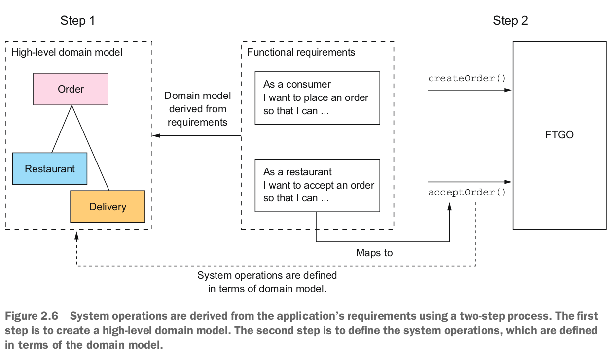

domain model được chủ yếu rút ra từ các danh từ của các câu chuyện người dùng, và các hoạt động hệ thống chủ yếu được rút ra từ các động từ. Bạn cũng có thể xác định domain model bằng một kỹ thuật gọi là Event Storming, mà tôi sẽ nói về trong chương 5.

Hành vi của mỗi hoạt động hệ thống được mô tả dựa trên tác động của nó đối với một hoặc nhiều đối tượng domain và mối quan hệ giữa chúng. Một hoạt động hệ thống có thể tạo, cập nhật hoặc xóa các đối tượng domain, cũng như tạo hoặc hủy bỏ mối quan hệ giữa chúng.

Hãy xem cách xác định một domain model cấp cao. Sau đó, tôi sẽ xác định các hoạt động hệ thống dựa trên domain model.

#### Creating a high-level domain model

Bước đầu tiên trong quá trình xác định các hoạt động hệ thống là phác thảo một Domain model cấp cao cho ứng dụng. Lưu ý rằng Domain model này đơn giản hơn nhiều so với những gì sẽ được triển khai cuối cùng. Ứng dụng thậm chí sẽ không có một Domain model duy nhất vì, như bạn sẽ sớm tìm hiểu, mỗi service đều có một Domain model riêng. Mặc dù là một sự đơn giản hóa đột ngột, một Domain model cấp cao lại hữu ích ở giai đoạn này vì nó định nghĩa từ vựng để mô tả hành vi của các hoạt động hệ thống.

Một Domain model được tạo ra bằng cách sử dụng các kỹ thuật tiêu chuẩn như phân tích các danh từ trong các câu chuyện và kịch bản và trò chuyện với các chuyên gia về domain. Hãy xem xét, ví dụ, câu chuyện `Place Order`. Chúng ta có thể mở rộng câu chuyện đó thành nhiều kịch bản người dùng bao gồm kịch bản sau:

```
Given a consumer
    And a restaurant
    And a delivery address/time that can be served by that restaurant
    And an order total that meets the restaurant's order minimum
When the consumer places an order for the restaurant
Then consumer's credit card is authorized
    And an order is created in the PENDING_ACCEPTANCE state
    And the order is associated with the consumer
    And the order is associated with the restaurant
```
The nouns in this user scenario hint at the existence of various classes, including `Consumer`, `Order`, `Restaurant`, and `CreditCard`.

Similarly, the `Accept Order` story can be expanded into a scenario such as this one:

```
Given an order that is in the PENDING_ACCEPTANCE state and a courier that is available to deliver the order
When a restaurant accepts an order with a promise to prepare by a particular time

Then the state of the order is changed to ACCEPTED
    And the order's promiseByTime is updated to the promised time
    And the courier is assigned to deliver the order
```

Kịch bản này gợi ra sự tồn tại của các lớp `Courier` và `Delivery`. Kết quả cuối cùng sau vài vòng lặp phân tích sẽ là một Domain model bao gồm, không ngạc nhiên, các lớp đó và các lớp khác như `MenuItem` và `Address`. Hình 2.7 là một sơ đồ lớp cho thấy các lớp chính.

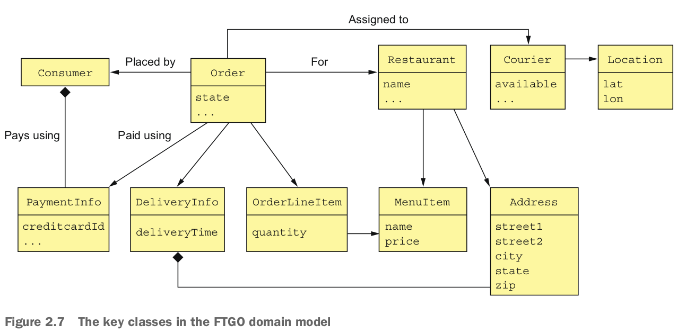

Các trách nhiệm của mỗi lớp như sau:
- `Consumer`: Người tiêu dùng đặt hàng.
- `Order`: Một đơn đặt hàng của người tiêu dùng. Nó mô tả đơn đặt hàng và theo dõi trạng thái của nó.
- `OrderLineItem`: Một mục trong một Order.
- `DeliveryInfo`: Thời gian và địa điểm giao hàng.
- `Restaurant`: Một nhà hàng chuẩn bị Order để giao đến người tiêu dùng.
- `MenuItem`: Một mục trên thực đơn của nhà hàng.
- `Courier`: Một người đưa Order đến người tiêu dùng. Nó theo dõi sự sẵn có của người giao hàng và vị trí hiện tại của họ.
- `Address`: Địa chỉ của một Người tiêu dùng hoặc một Nhà hàng.
- `Location`: Vĩ độ và kinh độ của một người đưa Order.

Một sơ đồ lớp như trong hình 2.7 minh họa một khía cạnh của kiến trúc ứng dụng. Nhưng nó không nhiều hơn là một hình ảnh đẹp mắt nếu thiếu các kịch bản để phác họa. Bước tiếp theo là định nghĩa các hoạt động hệ thống, tương ứng với các kịch bản kiến trúc.

#### Defining system operations
Sau khi bạn đã định nghĩa một Domain model cấp cao, bước tiếp theo là xác định các yêu cầu mà ứng dụng phải xử lý. Chi tiết của giao diện người dùng vượt ra ngoài phạm vi của cuốn sách này, nhưng bạn có thể tưởng tượng rằng trong mỗi kịch bản người dùng, giao diện người dùng sẽ thực hiện các yêu cầu đến logic business phía sau để truy xuất và cập nhật dữ liệu. FTGO chủ yếu là một ứng dụng web, điều này có nghĩa là hầu hết các yêu cầu đều dựa trên HTTP, nhưng có thể có một số khách hàng có thể sử dụng tin nhắn. Thay vì cam kết vào một giao thức cụ thể, vì vậy, việc sử dụng khái niệm trừu tượng hơn về một hoạt động hệ thống để đại diện cho các yêu cầu là có ý nghĩa.

Có hai loại hoạt động hệ thống:
- Command : Các hoạt động hệ thống tạo, cập nhật và xóa dữ liệu
- Queries : Các hoạt động hệ thống đọc (Queries) dữ liệu

Cuối cùng, những hoạt động hệ thống này sẽ tương ứng với các điểm cuối REST, RPC hoặc thông điệp, nhưng hiện tại nghĩ về chúng một cách trừu tượng là hữu ích. Hãy bắt đầu xác định một số Command hệ thống. Một điểm khởi đầu tốt cho việc xác định các Command hệ thống là phân tích các động từ trong các câu chuyện và kịch bản người dùng. Hãy xem xét, ví dụ, câu chuyện Đặt Hàng. Nó rõ ràng gợi ý rằng hệ thống phải cung cấp một hoạt động Tạo Order. Nhiều câu chuyện khác cũng tương ứng một cách trực tiếp với các Command hệ thống. Bảng 2.1 liệt kê một số Command hệ thống chính.

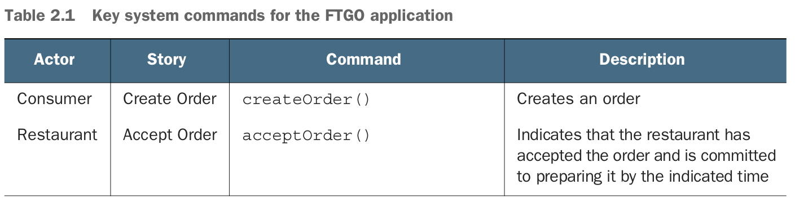


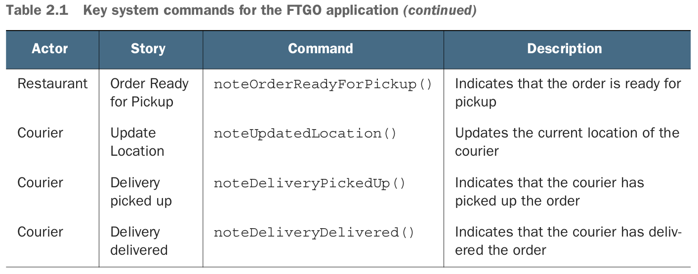

Một lệnh có một bản mô tả định nghĩa các tham số, giá trị trả về và hành vi của nó dựa trên các lớp Domain model. Bản mô tả hành vi bao gồm các điều kiện tiên quyết phải đúng khi hoạt động được gọi và các điều kiện hậu quả là đúng sau khi hoạt động được gọi. Dưới đây là ví dụ về mô tả của hoạt động hệ thống `createOrder()`:


Các tiền điều kiện phản ánh các điều đã được nêu ra trong kịch bản của người dùng Place Order mô tả trước đó. Các hậu điều kiện phản ánh các điều "thens" từ kịch bản. Khi một hoạt động hệ thống được gọi, nó sẽ xác minh các tiền điều kiện và thực hiện các hành động cần thiết để làm cho các hậu điều kiện trở thành đúng.

Dưới đây là bản mô tả của hoạt động hệ thống `acceptOrder()`:

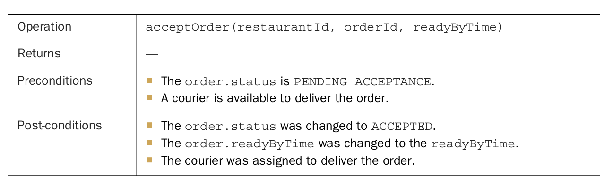

Các tiền và hậu điều kiện của nó phản ánh kịch bản của người dùng từ trước đó.

Hầu hết các hoạt động hệ thống có liên quan đến kiến trúc là các lệnh. Tuy nhiên, đôi khi, các truy vấn, là các hoạt động lấy dữ liệu, cũng quan trọng.

Ngoài việc thực hiện các lệnh, một ứng dụng cũng phải thực hiện các truy vấn. Các truy vấn cung cấp thông tin cho giao diện người dùng với những thông tin mà người dùng cần để đưa ra quyết định. Tại giai đoạn này, chúng ta chưa có một thiết kế giao diện người dùng cụ thể cho ứng dụng FTGO trong tâm trí, nhưng hãy xem xét, ví dụ, quá trình khi một người tiêu dùng đặt hàng:

1. Người dùng nhập địa chỉ giao hàng và thời gian giao hàng.
2. Hệ thống hiển thị các nhà hàng có sẵn.
3. Người dùng chọn nhà hàng.
4. Hệ thống hiển thị thực đơn.
5. Người dùng chọn mục và thanh toán.
6. Hệ thống tạo Order.

Kịch bản người dùng này gợi ý các truy vấn sau:
- `findAvailableRestaurants(deliveryAddress, deliveryTime)` — Lấy thông tin về các nhà hàng có sẵn có thể giao hàng đến địa chỉ giao hàng được chỉ định vào thời gian được chỉ định.
- `findRestaurantMenu(id)` — Lấy thông tin về một nhà hàng bao gồm các mục trong thực đơn.

Trong hai truy vấn này, `findAvailableRestaurants()` có lẽ là trọng tâm quan trọng nhất về mặt kiến trúc. Đây là một truy vấn phức tạp liên quan đến tìm kiếm địa lý. Phần tìm kiếm địa lý của truy vấn bao gồm việc tìm tất cả các điểm - nhà hàng - gần một vị trí cụ thể - địa chỉ giao hàng. Nó cũng lọc ra những nhà hàng đã đóng cửa khi cần chuẩn bị và lấy Order. Hơn nữa, hiệu suất là rất quan trọng, vì truy vấn này được thực hiện mỗi khi một người tiêu dùng muốn đặt hàng.

Domain model cao cấp và các hoạt động hệ thống nắm bắt những gì ứng dụng làm. Chúng giúp định rõ kiến trúc của ứng dụng. Hành vi của mỗi hoạt động hệ thống được mô tả dựa trên Domain model. Mỗi hoạt động hệ thống quan trọng đại diện cho một kịch bản quan trọng về mặt kiến trúc là một phần của mô tả của kiến trúc.

Sau khi xác định các hoạt động hệ thống, bước tiếp theo là xác định các service của ứng dụng. Như đã đề cập trước đó, không có một quy trình cơ khí nào để tuân theo. Tuy nhiên, có nhiều chiến lược phân rã khác nhau mà bạn có thể sử dụng. Mỗi chiến lược tấn công vấn đề từ một góc độ khác nhau và sử dụng thuật ngữ của riêng mình. Nhưng với tất cả các chiến lược, kết quả cuối cùng là giống nhau: một kiến trúc bao gồm các service được tổ chức chủ yếu xung quanh các khái niệm business chứ không phải kỹ thuật.

Let’s look at the first strategy, which defines services corresponding to business capabilities.

### 2.2.2 Defining services by applying the Decompose by business capability pattern
Một chiến lược để tạo ra một kiến trúc service microservice là phân rã theo khả năng business. Một khái niệm từ mô hình hạch toán business, một khả năng business là điều mà một doanh nghiệp thực hiện để tạo ra giá trị. Tập hợp các khả năng cho một doanh nghiệp cụ thể phụ thuộc vào loại hình doanh nghiệp. Ví dụ, các khả năng của một công ty bảo hiểm thường bao gồm Định giá, Quản lý yêu cầu, Thanh toán, Tuân thủ, và vân vân. Các khả năng của một cửa hàng trực tuyến bao gồm Quản lý Order, Quản lý tồn kho, Vận chuyển, và vân vân.

**Pattern: Decompose by business capability**\
Define services corresponding to business capabilities.\
See http://microservices.io/patterns/decomposition/decompose-by-business-capability.html.


#### Business capabilities define what an organization does
Các khả năng business của một tổ chức phản ánh các nghiệp vụ của tổ chức là gì. Chúng thường ổn định, so với cách mà tổ chức thực hiện business của mình, điều này thay đổi theo thời gian, đôi khi là một cách đáng kể. Điều này đặc biệt đúng trong thời đại hiện nay, với việc sử dụng công nghệ phát triển nhanh chóng để tự động hóa nhiều quy trình business. Ví dụ, chưa lâu, bạn đã gửi tiền vào ngân hàng bằng cách đưa chúng cho một nhân viên giao dịch. Sau đó, bạn có thể gửi tiền bằng máy ATM. Ngày nay, bạn có thể thuận tiện gửi tiền qua điện thoại thông minh của mình. Như bạn có thể thấy, khả năng business Gửi tiền vẫn ổn định, nhưng cách thức thực hiện đã thay đổi đáng kể.

#### Identifying business capabilities
Các khả năng business của một tổ chức được xác định thông qua việc phân tích mục đích, cấu trúc và quy trình business của tổ chức. Mỗi khả năng business có thể được coi là một service, trừ khi nó là hướng tới business chứ không phải kỹ thuật. Thông số kỹ thuật của nó bao gồm các thành phần khác nhau, bao gồm đầu vào, đầu ra và các thỏa thuận cấp service. Ví dụ, đầu vào của một khả năng business Bảo hiểm là đơn xin của người tiêu dùng, và các đầu ra bao gồm phê duyệt và giá.

Một khả năng business thường tập trung vào một đối tượng business cụ thể. Ví dụ, đối tượng Yêu cầu là trung tâm của khả năng quản lý Yêu cầu. Một khả năng thường có thể được phân giải thành các khả năng phụ. Ví dụ, khả năng quản lý Yêu cầu có một số khả năng phụ, bao gồm quản lý thông tin Yêu cầu, xem xét Yêu cầu và quản lý thanh toán Yêu cầu.

Dễ dàng tưởng tượng rằng các khả năng business cho FTGO bao gồm các yếu tố sau:
- Supplier management
   - Courier management : Quản lý thông tin người giao hàng
   - Restaurant information management : Quản lý menu nhà hàng và thông tin khác, bao gồm vị trí và giờ mở cửa
- Consumer management: Quản lý thông tin về người tiêu dùng
- Order talking and fulfillment
   - Order management : Cho phép người tiêu dùng tạo và quản lý Order
   - Restaurant order management : Quản lý việc chuẩn bị Order tại nhà hàng
   - Logistics
   - Courier avability management : Quản lý sẵn có thời gian thực của người giao hàng để giao hàng
   - Delivery management: Giao hàng cho người tiêu dùng
- Accounting
   - Consumer accounting: Quản lý thanh toán của người tiêu dùng
   - Restaurant accounting: Quản lý thanh toán cho nhà hàng
   - Courier accounting : Quản lý thanh toán cho người giao hàng
- ...

Các khả năng cấp cao bao gồm Quản lý nhà cung cấp, Quản lý người tiêu dùng, Tiếp nhận và thực hiện Order và Kế toán. Có lẽ sẽ có nhiều khả năng cấp cao khác, bao gồm các khả năng liên quan đến tiếp thị. Hầu hết các khả năng cấp cao được phân giải thành các khả năng phụ. Ví dụ, Tiếp nhận và thực hiện Order được phân giải thành năm khả năng phụ.

Một khía cạnh thú vị của cấu trúc này là có ba khả năng liên quan đến nhà hàng: Quản lý thông tin nhà hàng, Quản lý Order nhà hàng và Kế toán nhà hàng. Điều này bởi vì chúng đại diện cho ba khía cạnh rất khác nhau của hoạt động nhà hàng.

Tiếp theo, chúng ta sẽ xem cách sử dụng các khả năng business để định nghĩa các service.

#### From business capabilites to services
Sau khi xác định các khả năng business, bạn sau đó định nghĩa một service cho mỗi khả năng hoặc nhóm các khả năng liên quan. Hình 2.8 cho thấy sự ánh xạ từ các khả năng đến các service cho ứng dụng FTGO. Một số khả năng cấp cao, như khả năng Kế toán, được ánh xạ vào các service. Trong các trường hợp khác, các khả năng phụ được ánh xạ vào các service.

Quyết định ánh xạ từ cấp độ nào của cấu trúc khả năng sang các service, vì thế hơi chủ quan. Lý do cho việc ánh xạ cụ thể này của tôi như sau:
- Tôi ánh xạ các khả năng phụ của Quản lý nhà cung cấp thành hai service, vì Nhà hàng và Người giao hàng là hai loại nhà cung cấp rất khác nhau.
- Tôi ánh xạ khả năng Tiếp nhận và thực hiện Order thành ba service mỗi cái đều chịu trách nhiệm cho các giai đoạn khác nhau của quy trình. Tôi kết hợp các khả năng Quản lý sẵn có của người giao hàng và Quản lý giao hàng và ánh xạ chúng vào một service duy nhất vì chúng liên kết mật thiết.
- Tôi ánh xạ khả năng Kế toán thành một service riêng, vì các loại kế toán khác nhau có vẻ giống nhau.

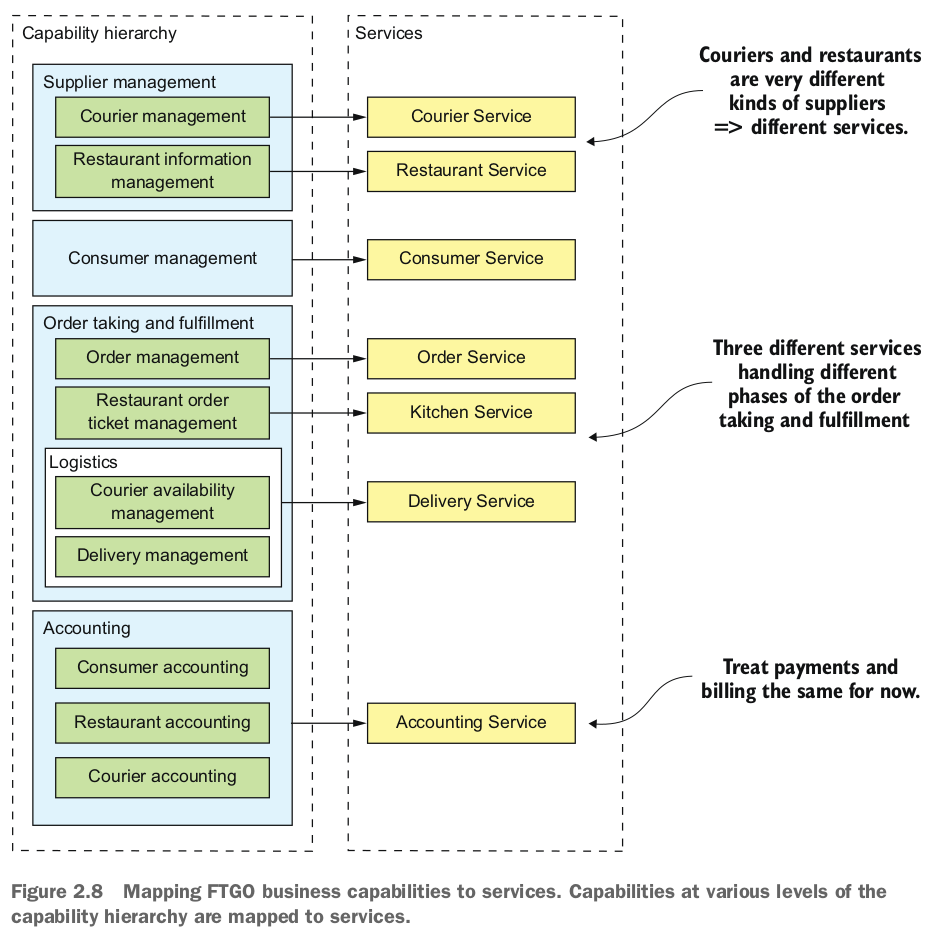

Sau này, có thể có lý do để tách riêng thanh toán (của nhà hàng và nhà giao hàng) và hóa đơn (của người tiêu dùng).

Một lợi ích chính của việc tổ chức các service xung quanh các khả năng là vì chúng ổn định, kiến trúc kết quả cũng sẽ tương đối ổn định. Các thành phần cá nhân của kiến trúc có thể tiến triển khi cách thức của doanh nghiệp thay đổi, nhưng kiến trúc vẫn giữ nguyên.

Tuy nhiên, cần nhớ rằng các service được hiển thị trong hình 2.8 chỉ là cố gắng đầu tiên để định nghĩa kiến trúc. Chúng có thể phát triển theo thời gian khi chúng ta tìm hiểu thêm về lĩnh vực ứng dụng. Đặc biệt, một bước quan trọng trong quá trình định nghĩa kiến trúc là điều tra cách các service hợp tác trong mỗi service kiến trúc quan trọng. Bạn có thể, ví dụ, phát hiện ra rằng một phân rã cụ thể không hiệu quả do sự giao tiếp giữa các tiến trình quá nhiều và bạn phải kết hợp service. Ngược lại, một service có thể phát triển về mức độ phức tạp đến mức đáng kể khiến nó trở thành đáng giá để tách thành nhiều service. Hơn nữa, ở mục 2.2.5, tôi mô tả một số rào cản đối với việc phân rã có thể khiến bạn phải xem xét lại quyết định của mình.

Hãy xem xét một cách khác để phân rã một ứng dụng dựa trên thiết kế dựa trên domain.

### 2.2.3 Defining services by applying the Decompose sub-domain pattern
DDD, như được mô tả trong cuốn sách xuất sắc Domain-driven design của Eric Evans (Addison-Wesley Professional, 2003), là một phương pháp để xây dựng các ứng dụng phần mềm phức tạp tập trung vào việc phát triển một mô hình domain đối tượng. Một mô hình domain bắt trọn kiến thức về một domain trong một hình thức có thể được sử dụng để giải quyết các vấn đề trong domain đó. Nó xác định từ vựng được sử dụng bởi nhóm, điều mà DDD gọi là Ngôn ngữ Phổ biến (Ubiquitous Language). Mô hình domain được phản ánh một cách chặt chẽ trong thiết kế và triển khai của ứng dụng. DDD có hai khái niệm rất hữu ích khi áp dụng kiến trúc microservice: các domain con và ngữ cảnh ràng buộc.

**Pattern: Decompose by subdomain**\
Define services corresponding to DDD subdomains. See http://microservices.io/patterns/decomposition/decompose-by-subdomain.html.

DDD khá khác biệt so với phương pháp truyền thống trong việc mô hình hóa doanh nghiệp, trong đó tạo ra một mô hình duy nhất cho toàn bộ doanh nghiệp. Trong một mô hình như vậy, sẽ có, ví dụ, một định nghĩa duy nhất cho mỗi thực thể kinh doanh, như khách hàng, Order, và như vậy. Vấn đề của mô hình hóa loại này là việc đưa ra quyết định cho các phần khác nhau của một tổ chức đồng ý với một mô hình duy nhất là một nhiệm vụ khổng lồ. Ngoài ra, điều này có nghĩa là từ quan điểm của một phần cụ thể của tổ chức, mô hình quá phức tạp cho nhu cầu của họ. Hơn nữa, mô hình miền có thể gây nhầm lẫn vì các phần khác nhau của tổ chức có thể sử dụng cùng một thuật ngữ cho các khái niệm khác nhau hoặc các thuật ngữ khác nhau cho cùng một khái niệm. DDD tránh được những vấn đề này bằng cách xác định nhiều mô hình miền, mỗi mô hình với phạm vi rõ ràng.

DDD xác định một mô hình miền riêng biệt cho mỗi miền con. Một miền con là một phần của miền, thuật ngữ của DDD dùng để chỉ không gian vấn đề của ứng dụng. Các miền con được xác định bằng cách sử dụng cùng một phương pháp như việc xác định các khả năng kinh doanh: phân tích doanh nghiệp và xác định các lĩnh vực chuyên môn khác nhau. Kết quả cuối cùng rất có thể sẽ là các miền con tương tự như các khả năng kinh doanh. Các ví dụ về miền con trong FTGO bao gồm Order taking, Order management, Kitchen management, Delivery, và Financials. Như bạn có thể thấy, các miền con này rất giống với các khả năng kinh doanh đã được mô tả trước đó.

DDD gọi phạm vi của một mô hình miền là một ngữ cảnh ràng buộc. Một ngữ cảnh ràng buộc bao gồm các tài liệu mã nguồn mà triển khai mô hình. Khi sử dụng kiến trúc microservice, mỗi ngữ cảnh ràng buộc là một service hoặc có thể là một tập hợp các service. Chúng ta có thể tạo ra một kiến trúc microservice bằng cách áp dụng DDD và xác định một service cho mỗi miền con. Bảng 2.9 cho thấy cách các miền con được ánh xạ thành các service, mỗi service với một mô hình miền riêng.


DDD và kiến trúc microservice hoàn toàn phù hợp. Khái niệm về miền con và ngữ cảnh ràng buộc trong DDD tương ứng tốt với các service trong kiến trúc microservice. Hơn nữa, khái niệm về các nhóm tự trị sở hữu service trong kiến trúc microservice hoàn toàn phù hợp với khái niệm trong DDD về mỗi mô hình miền được sở hữu và phát triển bởi một nhóm duy nhất. Hơn nữa, như tôi sẽ mô tả sau trong phần này, khái niệm về miền con với mô hình miền riêng biệt là một cách tuyệt vời để loại bỏ các god classes và qua đó làm cho việc phân rã dễ dàng hơn.

Phân rã theo miền con và phân rã theo khả năng kinh doanh là hai mẫu chính để xác định kiến trúc microservice của một ứng dụng. Tuy nhiên, cũng có một số hướng dẫn hữu ích cho quá trình phân rã có nguồn gốc từ thiết kế hướng đối tượng. Hãy xem xét chúng.

### 2.2.4 Decomposition guidelines
Cho đến nay trong chương này, chúng ta đã xem xét các cách chính để xác định một kiến trúc microservice. Chúng ta cũng có thể điều chỉnh và sử dụng một số nguyên lý từ thiết kế hướng đối tượng khi áp dụng mẫu kiến trúc microservice. Các nguyên lý này được tạo ra bởi Robert C. Martin và được mô tả trong cuốn sách cổ điển của ông "Designing Object Oriented C++ Applications Using The Booch Method" (Prentice Hall, 1995). Nguyên lý đầu tiên là Nguyên tắc Trách nhiệm Đơn lẻ (SRP), để xác định trách nhiệm của một lớp. Nguyên lý thứ hai là Nguyên tắc Đóng gói chung (CCP), để tổ chức các lớp vào các gói. Hãy xem xét những nguyên lý này và xem chúng có thể được áp dụng vào kiến trúc microservice như thế nào.

#### Single reposibility principle
Một trong những mục tiêu chính của kiến trúc và thiết kế phần mềm là xác định trách nhiệm của mỗi phần tử phần mềm. Nguyên lý Trách nhiệm Đơn lẻ được sử dụng như sau:

> "A class should have only one reason to change" - Robert C.Martin

Mỗi trách nhiệm mà một lớp có là một lý do tiềm ẩn để lớp đó thay đổi. Nếu một lớp có nhiều trách nhiệm thay đổi độc lập, lớp đó sẽ không ổn định. Bằng cách tuân thủ SRP, bạn định nghĩa các lớp mà mỗi lớp có một trách nhiệm duy nhất và do đó chỉ có một lý do để thay đổi.

Chúng ta có thể áp dụng SRP khi định nghĩa một kiến trúc microservice và tạo ra các service nhỏ, gắn kết mà mỗi service có một trách nhiệm duy nhất. Điều này sẽ giảm kích thước của các service và tăng tính ổn định của chúng. Kiến trúc mới của FTGO là một ví dụ về SRP trong hành động. Mỗi khía cạnh của việc đưa thức ăn đến người tiêu dùng - việc nhận đơn, chuẩn bị Order và giao hàng - đều là trách nhiệm của một service riêng biệt.


#### Common closure principle

Nguyên lý hữu ích khác là Nguyên lý Đóng gói Chung:

> "The classes in a package should be closed together against the same kinds of changes. A change that affects all the classes in that package" - Robert C.Martin

Ý tưởng là nếu hai lớp thay đổi theo cùng một cách vì cùng một nguyên nhân cơ bản, thì chúng thuộc về cùng một gói. Có thể, ví dụ, những lớp đó thực hiện một khía cạnh khác nhau của một quy tắc kinh doanh cụ thể. Mục tiêu là khi quy tắc kinh doanh đó thay đổi, các nhà phát triển chỉ cần thay đổi mã trong một số gói nhỏ (lý tưởng là chỉ một). Tuân thủ CCP cải thiện đáng kể khả năng bảo trì của một ứng dụng.

Chúng ta có thể áp dụng CCP khi tạo ra một kiến trúc microservice và đóng gói các thành phần thay đổi vì cùng một lý do vào cùng một service. Làm điều này sẽ giảm thiểu số lượng service cần phải thay đổi và triển khai khi một số yêu cầu thay đổi. Lý tưởng, một thay đổi chỉ ảnh hưởng đến một đội và một service duy nhất. CCP là phương thuốc chống lại mẫu anti-distributed monolith.

SRP và CCP là 2 trong số 11 nguyên lý được phát triển bởi Bob Martin. Chúng đặc biệt hữu ích khi phát triển một kiến trúc microservice. Chín nguyên lý còn lại được sử dụng khi thiết kế lớp và gói. Để biết thêm thông tin về SRP, CCP và các nguyên lý OOD khác, hãy xem bài viết "The Principles of Object Oriented Design" trên trang web của Bob Martin (http://butunclebob.com/ArticleS.UncleBob.PrinciplesOfOod).

Phân tách theo khả năng kinh doanh và theo miền phụ cùng với SRP và CCP là các kỹ thuật tốt để phân tách một ứng dụng thành các service. Để áp dụng chúng và phát triển thành công một kiến trúc microservice, bạn phải giải quyết một số vấn đề quản lý giao dịch và giao tiếp giữa các tiến trình.

### 2.2.5 Obstacles to decomposing an application into services
Dưới góc độ bề mặt, chiến lược tạo ra một kiến trúc microservice bằng cách định nghĩa các service tương ứng với khả năng kinh doanh hoặc các miền phụ có vẻ đơn giản. Tuy nhiên, bạn có thể gặp phải một số rào cản:
- Độ trễ mạng
- Sự giảm sẵn có do giao tiếp đồng bộ
- Duy trì tính nhất quán dữ liệu giữa các service
- Đạt được một cái nhìn nhất quán về dữ liệu
- Các lớp god ngăn chặn phân tách

Hãy xem xét mỗi rào cản, bắt đầu với độ trễ mạng.

#### Network latency
Độ trễ mạng là một vấn đề luôn hiện diện trong hệ thống phân tán. Bạn có thể phát hiện ra rằng một phân tách cụ thể thành các service dẫn đến một lượng lớn các chuyến đi giữa hai service. Đôi khi, bạn có thể giảm độ trễ xuống mức chấp nhận được bằng cách triển khai một API hàng loạt để lấy nhiều đối tượng trong một lượt đi duy nhất. Nhưng trong những tình huống khác, giải pháp là kết hợp các service, thay thế giao tiếp IPC đắt tiền bằng các cuộc gọi phương pháp hoặc hàm ở cấp độ ngôn ngữ.

#### Synchronous interprocess communication reduces avaibility
Một vấn đề khác là làm thế nào để triển khai giao tiếp giữa các service mà không làm giảm tính sẵn có. Ví dụ, cách tiếp cận rõ ràng nhất để triển khai hoạt động `createOrder()` là để service Đặt hàng gọi đồng bộ các service khác bằng cách sử dụng REST. Nhược điểm của việc sử dụng một giao thức như REST là nó làm giảm tính sẵn có của service Đặt hàng. Nó sẽ không thể tạo Order nếu bất kỳ service nào khác không sẵn có. Đôi khi đây là một sự đánh đổi đáng giá, nhưng trong chương 3, bạn sẽ tìm hiểu rằng việc sử dụng thông điệp bất đồng bộ, loại bỏ sự ràng buộc chặt chẽ và cải thiện tính sẵn có, thường là lựa chọn tốt hơn.

#### Maintaining data consistency across services
Một thách thức khác là duy trì tính nhất quán dữ liệu giữa các service. Một số hoạt động hệ thống cần cập nhật dữ liệu trong nhiều service. Ví dụ, khi một nhà hàng chấp nhận một Order, các cập nhật phải diễn ra ở cả service Kitchen và service Giao hàng. service Kitchen thay đổi trạng thái của phiếu. service Giao hàng lên lịch giao hàng cho Order. Cả hai cập nhật này phải được thực hiện một cách nguyên tử.

Giải pháp truyền thống là sử dụng cơ chế quản lý giao dịch phân tán dựa trên hai giai đoạn. Nhưng như bạn sẽ thấy trong chương 4, đây không phải là một lựa chọn tốt cho các ứng dụng hiện đại, và bạn phải sử dụng một phương pháp quản lý giao dịch rất khác, gọi là saga. Một saga là một chuỗi các giao dịch cục bộ được phối hợp bằng cách sử dụng thông điệp. Saga phức tạp hơn so với các giao dịch ACID truyền thống nhưng chúng hoạt động tốt trong nhiều tình huống. Một hạn chế của saga là chúng là nhất quán cuối cùng. Nếu bạn cần cập nhật một số dữ liệu một cách nguyên tử, thì nó phải nằm trong một service duy nhất, điều này có thể là một rào cản cho việc phân tách.


#### Obtaining a consistency view of the data
Một rào cản khác đối với việc phân tách là không thể có được một cái nhìn thực sự nhất quán về dữ liệu trên nhiều cơ sở dữ liệu. Trong một ứng dụng monolithic, các thuộc tính của các giao dịch ACID đảm bảo rằng một truy vấn sẽ trả về một cái nhìn nhất quán về cơ sở dữ liệu. Ngược lại, trong một kiến ​​trúc microservice, mặc dù cơ sở dữ liệu của mỗi service là nhất quán, bạn không thể có được một cái nhìn toàn cầu nhất quán về dữ liệu. Nếu bạn cần một cái nhìn nhất quán về một số dữ liệu, thì nó phải nằm trong một service duy nhất, điều này có thể ngăn chặn việc phân tách. May mắn thay, trong thực tế điều này hiếm khi gặp vấn đề.

#### God classes prevent decomposition
Một rào cản khác đối với việc phân tách là sự tồn tại của những lớp được gọi là god classes. God classes là những lớp phình ra được sử dụng khắp ứng dụng (http://wiki.c2.com/?GodClass). Một god class thường thực hiện logic kinh doanh cho nhiều khía cạnh khác nhau của ứng dụng. Thông thường, nó có một số lượng lớn các trường được ánh xạ vào một bảng cơ sở dữ liệu với nhiều cột. Hầu hết các ứng dụng đều có ít nhất một trong những lớp này, mỗi lớp đại diện cho một khái niệm quan trọng trong lĩnh vực: tài khoản trong ngân hàng, Order trong thương mại điện tử, chính sách trong bảo hiểm, v.v. Bởi vì một god class gói gọn cả trạng thái và hành vi cho nhiều khía cạnh khác nhau của một ứng dụng, nó là một rào cản không thể vượt qua để phân chia bất kỳ logic kinh doanh nào sử dụng nó thành các service.

Lớp Order là một ví dụ tốt về một god class trong ứng dụng FTGO. Điều này không ngạc nhiên - sau tất cả, mục đích của FTGO là giao hàng đơn đặt hàng đến khách hàng. Hầu hết các phần của hệ thống liên quan đến các đơn đặt hàng. Nếu ứng dụng FTGO có một mô hình miền duy nhất, lớp Order sẽ là một lớp rất lớn. Nó sẽ có trạng thái và hành vi tương ứng với nhiều phần khác nhau của ứng dụng. Hình 2.10 cho thấy cấu trúc của lớp này sẽ được tạo ra bằng các kỹ thuật mô hình truyền thống.

Như bạn có thể thấy, lớp Order có các trường và phương thức tương ứng với xử lý Order, quản lý đơn đặt hàng của nhà hàng, giao hàng và thanh toán. Lớp này cũng có một mô hình trạng thái phức tạp, do sự thật là một mô hình phải mô tả các chuyển đổi trạng thái từ các phần khác nhau của ứng dụng. Ở dạng hiện tại, lớp này làm cho việc phân chia mã thành các service trở nên rất khó khăn.

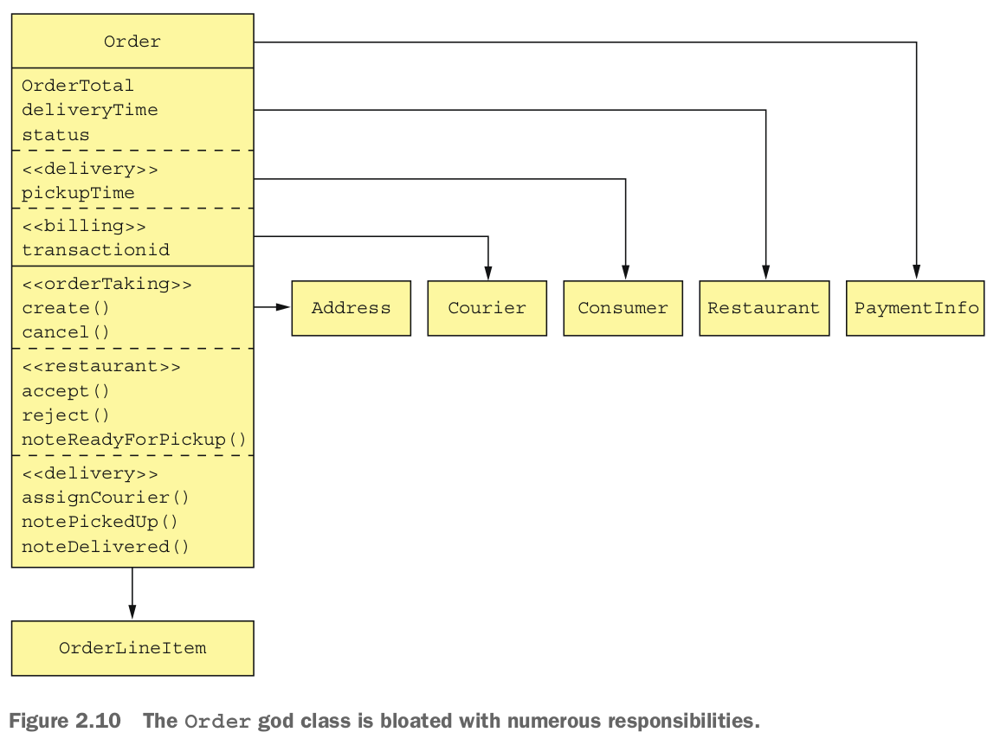

Một giải pháp là đóng gói lớp Order vào một thư viện và tạo một cơ sở dữ liệu Order trung tâm. Tất cả các service xử lý đơn đặt hàng sử dụng thư viện này và truy cập vào cơ sở dữ liệu. Vấn đề với cách tiếp cận này là nó vi phạm một trong những nguyên tắc chính của kiến trúc microservice và dẫn đến mối liên kết chặt chẽ không mong muốn. Ví dụ, bất kỳ thay đổi nào trong schema của Order đều yêu cầu các nhóm cập nhật mã của họ theo cách liên tục.

Một giải pháp khác là đóng gói cơ sở dữ liệu Order trong một service Order, mà được gọi bởi các service khác để lấy và cập nhật đơn đặt hàng. Vấn đề với thiết kế đó là service Order sẽ là một service dữ liệu với một mô hình miền nghèo nàn chứa ít hoặc không có logic kinh doanh. Không một trong những lựa chọn này là hấp dẫn, nhưng may mắn, DDD cung cấp một giải pháp.

Một cách tiếp cận tốt hơn nhiều là áp dụng DDD và xem xét mỗi service như một phần miền riêng biệt với một mô hình miền của riêng nó. Điều này có nghĩa là mỗi service trong ứng dụng FTGO liên quan đến đơn đặt hàng đều có một mô hình miền của riêng mình với phiên bản của lớp Order. Một ví dụ tuyệt vời về lợi ích của nhiều mô hình miền là service Delivery. Quan điểm của nó về một Order, như được hiển thị trong hình 2.11, cực kỳ đơn giản: địa chỉ nhận hàng, thời gian nhận hàng, địa chỉ giao hàng và thời gian giao hàng. Hơn nữa, thay vì gọi nó là một Order, service Giao hàng sử dụng tên phù hợp hơn là Delivery.

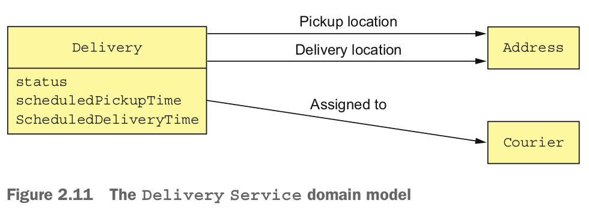

service Delivery không quan tâm đến bất kỳ thuộc tính khác của một Order. service Kitchen cũng có một cái nhìn đơn giản hơn về một Order. Phiên bản của nó về một Order được gọi là Ticket. Như hình 2.12 cho thấy, một Ticket đơn giản chỉ bao gồm một trạng thái, thời gian giao hàng yêu cầu, thời gian chuẩn bị, và một danh sách các mục hàng mô tả cho nhà hàng biết phải chuẩn bị gì. Nó không quan tâm đến khách hàng, thanh toán, giao hàng, v.v.

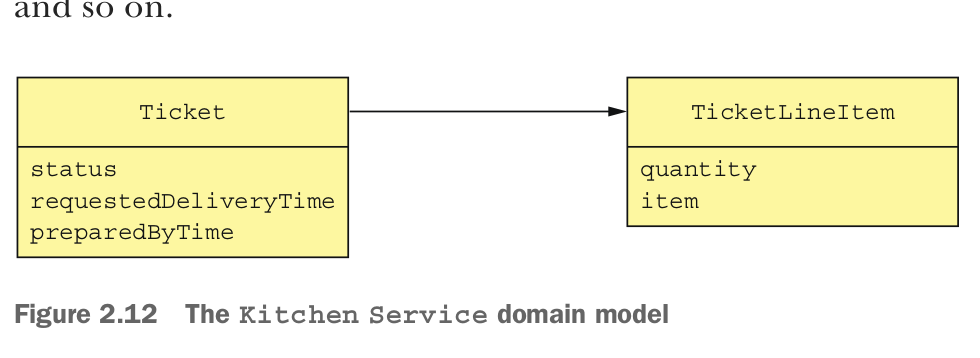

The Order service has the most complex view of an order, shown in figure 2.13. Even though it has quite a few fields and methods, it’s still much simpler than the original version.

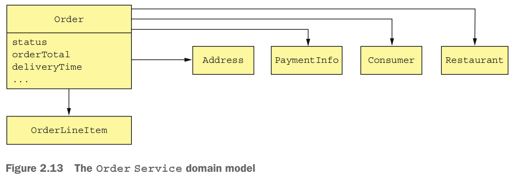

Các lớp Order trong mỗi mô hình miền biểu diễn các khía cạnh khác nhau của cùng một thực thể kinh doanh Order. Ứng dụng FTGO phải duy trì tính nhất quán giữa các đối tượng khác nhau này trong các service khác nhau. Ví dụ, khi service Đặt hàng đã xác nhận thẻ tín dụng của người tiêu dùng, nó phải kích hoạt việc tạo Ticket trong service Kitchen. Tương tự, nếu nhà hàng từ chối Order qua service Kitchen, nó phải được hủy trong service Đặt hàng và tiền của khách hàng phải được hoàn lại trong service thanh toán. Trong chương 4, bạn sẽ tìm hiểu cách duy trì tính nhất quán giữa các service, sử dụng cơ chế dựa trên sự kiện đã được đề cập trước đó là saga.
Ngoài việc tạo ra thách thức kỹ thuật, việc có nhiều mô hình miền cũng ảnh hưởng đến việc triển khai trải nghiệm người dùng. Một ứng dụng phải dịch giữa trải nghiệm người dùng, là mô hình miền riêng của nó, và các mô hình miền của mỗi service. Trong ứng dụng FTGO, ví dụ, trạng thái Order được hiển thị cho một người tiêu dùng được dẫn xuất từ thông tin Order được lưu trữ trong nhiều service. Quá trình dịch này thường được xử lý bởi cổng API, được thảo luận trong chương 8. Mặc dù có những thách thức này, nhưng rất quan trọng phải xác định và loại bỏ các lớp god khi định nghĩa một kiến trúc microservice.

Bây giờ chúng ta sẽ xem cách xác định các API service.

### 2.2.6 Defining service APIs
Chúng ta đã có một danh sách các hoạt động hệ thống và một danh sách các service tiềm năng. Bước tiếp theo là xác định API của mỗi service: các hoạt động và sự kiện của nó. Một hoạt động API của service tồn tại vì một trong hai lý do: một số hoạt động tương ứng với các hoạt động hệ thống. Chúng được gọi bởi các client bên ngoài và có thể là bởi các service khác. Các hoạt động khác tồn tại để hỗ trợ sự hợp tác giữa các service. Những hoạt động này chỉ được gọi bởi các service khác.

Một service phát các sự kiện chủ yếu để cho phép nó hợp tác với các service khác. Chương 4 mô tả cách sử dụng sự kiện để triển khai sagas, giữ tính nhất quán dữ liệu qua các service. Và chương 7 thảo luận về cách sử dụng sự kiện để cập nhật các chế độ xem CQRS, hỗ trợ truy vấn hiệu quả. Một ứng dụng cũng có thể sử dụng sự kiện để thông báo cho các client bên ngoài. Ví dụ, nó có thể sử dụng WebSockets để gửi sự kiện đến một trình duyệt.

Điểm khởi đầu cho việc xác định API của service là ánh xạ mỗi hoạt động hệ thống đến một service. Sau đó, chúng ta quyết định xem một service có cần phối hợp với các service khác để triển khai một hoạt động hệ thống hay không. Nếu cần phải hợp tác, chúng ta sau đó xác định các API mà các service khác phải cung cấp để hỗ trợ việc hợp tác. Hãy bắt đầu bằng cách xem xét cách phân công các hoạt động hệ thống cho các service.

#### Assigning system operations to services

Bước đầu tiên là quyết định service nào là điểm vào ban đầu cho một yêu cầu. Nhiều hoạt động hệ thống rõ ràng ánh xạ đến một service, nhưng đôi khi sự ánh xạ này không rõ ràng. Hãy xem xét ví dụ về hoạt động `noteUpdatedLocation()`, làm mới vị trí của người giao hàng. Mặt một, vì liên quan đến người giao hàng, hoạt động này nên được gán cho service Courier. Mặt khác, lại là service Giao hàng cần biết vị trí của người giao hàng. Trong trường hợp này, việc gán một hoạt động cho một service cần thông tin được cung cấp bởi hoạt động là một lựa chọn tốt hơn. Trong các tình huống khác, có thể hợp lý khi gán một hoạt động cho service có thông tin cần thiết để xử lý nó.

Bảng 2.2 cho thấy các service trong ứng dụng FTGO chịu trách nhiệm cho các hoạt động nào.

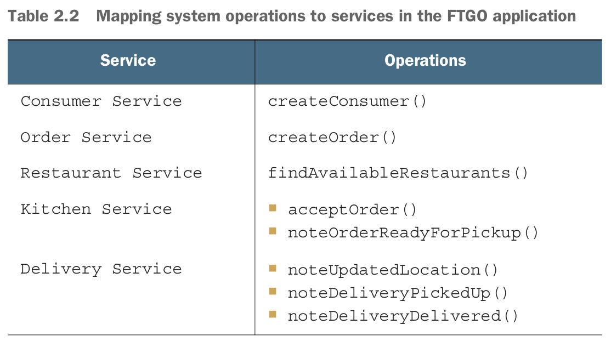

Sau khi đã gán hoạt động cho các service, bước tiếp theo là quyết định cách các service hợp tác để xử lý mỗi hoạt động hệ thống.


#### Determining the APIs required to support collaboration between services

Một số hoạt động hệ thống được xử lý hoàn toàn bởi một service duy nhất. Ví dụ, trong ứng dụng FTGO, Comsumer Service xử lý hoạt động `createConsumer()` hoàn toàn một mình. Nhưng một số hoạt động hệ thống bao gồm nhiều service. Dữ liệu cần thiết để xử lý một trong những yêu cầu này có thể được phân tán trên nhiều service. Ví dụ, để thực hiện hoạt động `createOrder()`, Order Service phải gọi các service sau để kiểm tra điều kiện tiên quyết và đảm bảo điều kiện sau khi hoạt động được thực hiện:
- Comsumer Service — Xác minh rằng người tiêu dùng có thể đặt hàng và lấy thông tin thanh toán của họ.
- Restaurant Service — Xác minh các mục hàng của đơn đặt hàng, xác minh địa chỉ/thời gian giao hàng nằm trong khu vực phục vụ của nhà hàng, xác minh đơn đặt hàng tối thiểu được đáp ứng, và lấy giá cho các mục hàng của đơn đặt hàng.
- Kitchen Service — Tạo Ticket.
- Accounting Service — Xác minh thẻ tín dụng của người tiêu dùng.

Tương tự, để thực hiện hoạt động hệ thống `acceptOrder()`, Kitchen Service phải gọi Delivery Serivce để lên lịch một người giao hàng giao hàng cho đơn đặt hàng.
Bảng 2.3 cho thấy các service, APIs được sửa đổi của chúng, và các service cộng tác của chúng. Để định nghĩa hoàn toàn các APIs của service, bạn cần phân tích từng hoạt động hệ thống và xác định yêu cầu hợp tác là gì.


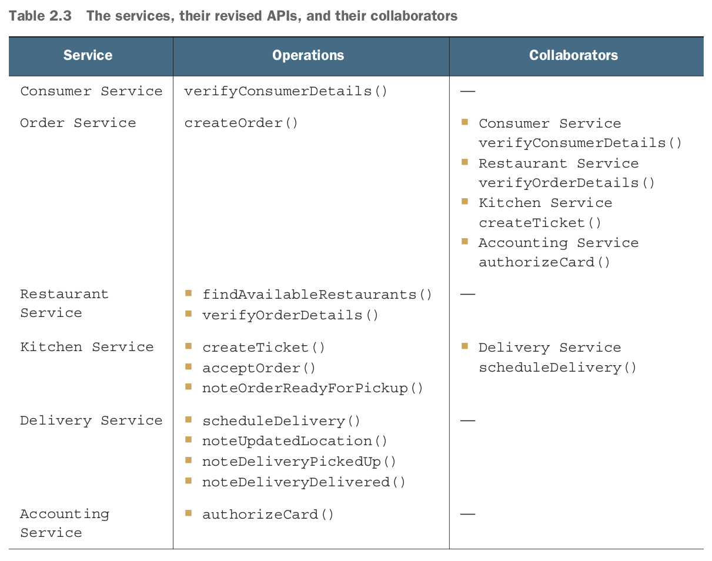

Cho đến nay, chúng ta đã xác định các service và các hoạt động mà mỗi service thực hiện.

Tuy nhiên, quan trọng phải nhớ rằng kiến ​​trúc chúng ta đã vẽ ra là rất trừu tượng. Chúng ta chưa chọn bất kỳ công nghệ IPC cụ thể nào. Hơn nữa, mặc dù thuật ngữ "hoạt động" gợi ý một loại cơ chế IPC dựa trên yêu cầu/phản hồi đồng bộ nào đó, nhưng bạn sẽ thấy rằng tin nhắn không đồng bộ đóng một vai trò quan trọng. Qua toàn bộ cuốn sách này, tôi mô tả các khái niệm về kiến trúc và thiết kế ảnh hưởng đến cách các service này hợp tác.

Chương 3 mô tả các công nghệ IPC cụ thể, bao gồm các cơ chế giao tiếp đồng bộ như REST, và thông điệp không đồng bộ sử dụng trung gian tin nhắn. Tôi thảo luận về cách giao tiếp đồng bộ có thể ảnh hưởng đến tính sẵn có và giới thiệu khái niệm về một service tự chứa, không gọi các service khác đồng bộ. Một cách để triển khai một service tự chứa là sử dụng mẫu CQRS, được đề cập trong chương 7. Ví dụ, Order Service có thể duy trì một bản sao của dữ liệu do Restaurant Service sở hữu để loại bỏ nhu cầu gọi đồng bộ Restaurant Service để xác minh một đơn đặt hàng. Nó giữ cho bản sao luôn được cập nhật bằng cách đăng ký nhận các sự kiện được xuất bản bởi Restaurant Service mỗi khi nó cập nhật dữ liệu của mình.

Chương 4 giới thiệu khái niệm saga và cách nó sử dụng tin nhắn không đồng bộ để phối hợp các service tham gia vào saga. Ngoài việc cập nhật dữ liệu đặt rải rác trên nhiều service một cách đáng tin cậy, saga cũng là một cách để triển khai một service tự chứa. Ví dụ, tôi mô tả cách hoạt động `createOrder()` được triển khai bằng một saga, sử dụng tin nhắn không đồng bộ để gọi các service như service Người tiêu dùng, service Nhà Kitchen, và service Kế toán.

Chương 8 mô tả khái niệm về cổng API, mở ra một API cho các client bên ngoài. Một cổng API có thể triển khai một hoạt động truy vấn bằng cách sử dụng mẫu hợp thành API, được mô tả trong chương 7, thay vì đơn giản là định tuyến nó đến service. Logic trong cổng API thu thập dữ liệu cần thiết cho truy vấn bằng cách gọi nhiều service và kết hợp kết quả. Trong tình huống này, hoạt động hệ thống được giao cho cổng API thay vì một service. Các service cần triển khai các hoạt động truy vấn cần thiết bởi cổng API.
