# Chapter 3: Interprocess communication in a microservice architecture

Mary và nhóm của cô ấy, giống như hầu hết các nhà publish triển khác, đã có một số kinh nghiệm với các cơ chế giao tiếp giữa các tiến trình (IPC). Ứng dụng FTGO có một REST API được sử dụng bởi các ứng dụng di động và mã JavaScript ở phía trình duyệt. Nó cũng sử dụng các service đám mây khác nhau, như service message Twilio và service thanh toán Stripe. Nhưng trong một ứng dụng monolithic như FTGO, các module gọi lẫn nhau thông qua các cuộc gọi phương thức hoặc hàm ở cấp độ ngôn ngữ lập trình. Các nhà publish triển FTGO nói chung không cần phải nghĩ về IPC trừ khi họ đang làm việc trên REST API hoặc các module liên kết với các service đám mây.

Ngược lại, như bạn đã thấy trong chương 2, kiến trúc microservice cấu trúc một ứng dụng dưới dạng một tập hợp các service. Những service đó thường phải hợp tác để xử lý một Request. Bởi vì các phiên bản service thường là các tiến trình chạy trên nhiều máy, chúng phải tương tác bằng cách sử dụng IPC. Nó đóng một vai trò quan trọng hơn nhiều trong kiến trúc microservice so với trong một ứng dụng monolithic. Do đó, khi họ di chuyển ứng dụng của họ sang microservices, Mary và phần còn lại của nhóm publish triển FTGO sẽ cần phải dành nhiều thời gian hơn để nghĩ về IPC.

Không thiếu các cơ chế IPC để lựa chọn. Ngày nay, lựa chọn thời thượng là REST (với JSON). Tuy nhiên, quan trọng là phải nhớ rằng không có viên đạn bạc. Bạn phải cân nhắc cẩn thận các lựa chọn. Chương này khám phá các lựa chọn IPC khác nhau, bao gồm REST và messaging, và thảo luận về các sự đánh đổi.

Việc lựa chọn cơ chế IPC là một quyết định kiến trúc quan trọng. Nó có thể ảnh hưởng đến tính sẵn có của ứng dụng. Hơn nữa, như tôi giải thích trong chương này và chương tiếp theo, IPC còn giao nhau với quản lý transaction. Tôi ủng hộ một kiến trúc bao gồm các service kết nối lỏng lẻo với nhau thông qua message Asynchronous. Các giao thức Synchoronous như REST chủ yếu được sử dụng để giao tiếp với các ứng dụng khác.

Tôi bắt đầu chương này với một cái nhìn tổng quan về giao tiếp giữa các tiến trình trong kiến trúc microservice. Tiếp theo, tôi mô tả IPC dựa trên lời gọi hàm từ xa, trong đó REST là ví dụ phổ biến nhất. Tôi đề cập đến các chủ đề quan trọng bao gồm publish hiện service và cách xử lý sự cố một phần. Sau đó, tôi mô tả IPC dựa trên messaging Asynchronous. Tôi cũng nói về việc mở rộng các Consumer trong khi bảo tồn thứ tự message, xử lý chính xác message trùng lặp và message transaction. Cuối cùng, tôi đi qua khái niệm về các service tự chứa xử lý các Request Synchoronous mà không giao tiếp với các service khác để cải thiện tính sẵn có.

## 3.1 Overview of interprocess communication in a mircoservice archietcture

Có rất nhiều công nghệ IPC khác nhau để lựa chọn. service có thể sử dụng các cơ chế giao tiếp dựa trên Request/Response Synchoronous, như REST dựa trên HTTP hoặc gRPC. Một cách khác, họ có thể sử dụng các cơ chế giao tiếp Asynchronous dựa trên message, như AMQP hoặc STOMP. Cũng có một loạt các định dạng message khác nhau. service có thể sử dụng các định dạng văn bản dễ đọc, như JSON hoặc XML. Hoặc họ có thể sử dụng một định dạng nhị phân hiệu quả hơn như Avro hoặc Protocol Buffers.

Trước khi đi vào chi tiết về các công nghệ cụ thể, tôi muốn đưa ra một số vấn đề thiết kế bạn nên xem xét. Tôi bắt đầu phần này bằng một cuộc thảo luận về các phong cách tương tác, đó là cách mô tả không phụ thuộc vào công nghệ về cách client và service tương tác. Tiếp theo, tôi thảo luận về sự quan trọng của việc xác định chính xác các API trong một kiến trúc microservice, bao gồm khái niệm thiết kế API-trước. Sau đó, tôi thảo luận về chủ đề quan trọng của sự tiến hóa API. Cuối cùng, tôi thảo luận về các lựa chọn khác nhau cho các định dạng message và cách chúng có thể xác định sự dễ dàng của việc tiến hóa API. Hãy bắt đầu bằng cách xem xét các phong cách tương tác.

### 3.1.1 Interaction styles
Trước tiên, việc suy nghĩ về kiểu tương tác giữa một service và các client của nó trước khi chọn cơ chế IPC (Inter-Process Communication) cho API của service là rất hữu ích. Suy nghĩ trước về kiểu tương tác sẽ giúp bạn tập trung vào các Request và tránh bị rối trong các chi tiết của một công nghệ IPC cụ thể. Ngoài ra, như mô tả trong phần 3.4, sự lựa chọn của kiểu tương tác ảnh hưởng đến tính sẵn có của ứng dụng của bạn. Hơn nữa, như bạn sẽ thấy trong các chương 9 và 10, điều này giúp bạn chọn chiến lược kiểm thử tích hợp phù hợp.

Có một loạt các kiểu tương tác giữa client và service. Như bảng 3.1 cho thấy, chúng có thể được phân loại theo hai chiều. Chiều đầu tiên là liệu tương tác có phải là một-một hay một-nhiều:

- One-to-one : Each client request is processed by exactly one service.
- One-to-many : Each request is processed by multiple services.

Chiều thứ hai là liệu tương tác có Synchoronous hay Asynchronous:
- Synchoronous - client mong đợi một Response kịp thời từ service và thậm chí có thể bị chặn trong khi chờ đợi.
- Asynchronous - client không bị chặn, và Response, nếu có, không nhất thiết phải được gửi ngay lập tức.


Các loại tương tác một-một khác nhau bao gồm:
- Request/Response - Một client service tạo Request đến một service và chờ đợi một Response. client mong đợi Response đến đúng thời điểm. Nó có thể thậm chí bị chặn trong khi chờ đợi. Đây là một kiểu tương tác thường dẫn đến các service được kết nối chặt chẽ.
- Asynchronous Request/Response - Một client service gửi một Request đến một service, và service trả lời một cách Asynchronous. client không bị chặn trong khi chờ đợi, vì service có thể không gửi Response trong thời gian dài.
- One-way notifications - Một client service gửi một Request đến một service, nhưng không mong đợi hoặc gửi Response.

Quan trọng nhớ rằng kiểu tương tác đồng bộ Resquest/Response chủ yếu không tương quan với các công nghệ IPC. Một service có thể, ví dụ, tương tác với một service khác bằng cách sử dụng kiểu tương tác Resquest/Response bằng REST hoặc messaging. Ngay cả khi hai service đang giao tiếp bằng cách sử dụng một trình publish messaging, service client có thể bị chặn trong khi chờ đợi Response. Điều này không nhất thiết có nghĩa là họ kết nối lỏng lẻo. Đó là điều tôi sẽ xem xét lại sau trong chương này khi thảo luận về tác động của việc giao tiếp giữa các service đối với tính sẵn có.
Các loại tương tác một-nhiều khác nhau bao gồm:
- Publish/Subscibr - Một client Publish một message thông báo, được tiêu thụ bởi không hoặc nhiều service quan tâm.
- Publish/Response asynchronous - Một client Publish một message Resquest và sau đó chờ một khoảng thời gian nhất định để nhận Response từ các service quan tâm.

Mỗi service thường sẽ sử dụng một sự kết hợp của các kiểu tương tác này. Nhiều service trong ứng dụng FTGO có cả API đồng bộ và asynchronous cho các hoạt động, và nhiều cũng Publish Event.

Hãy xem cách định nghĩa API của một service.

### 3.1.2 Defining APIs in a microservice achitecture
Các API hoặc giao diện là trung tâm của việc publish triển phần mềm. Một ứng dụng bao gồm các module. Mỗi module có một giao diện định nghĩa tập hợp các hoạt động mà client của module đó có thể gọi. Một giao diện được thiết kế tốt tiết lộ chức năng hữu ích trong khi ẩn đi việc thực hiện. Điều này cho phép việc thực hiện thay đổi mà không ảnh hưởng đến client.

Trong một ứng dụng đơnolithic, một giao diện thường được chỉ định bằng một cấu trúc ngôn ngữ lập trình như một giao diện Java. Một giao diện Java chỉ định một tập hợp các phương thức mà một client có thể gọi. Lớp thực hiện được ẩn khỏi client. Hơn nữa, vì Java là một ngôn ngữ kiểu tĩnh, nếu giao diện thay đổi để không tương thích với client, ứng dụng sẽ không biên dịch.

Các API và giao diện cũng quan trọng không kém trong kiến trúc microservices. API của một service là một hợp đồng giữa service và client của nó. Như mô tả trong chương 2, API của một service bao gồm các hoạt động, mà client có thể gọi, và các Event, được publish bởi service. Một hoạt động có tên, tham số và loại trả về. Một Event có một loại và một tập hợp các trường và, như mô tả trong phần 3.3, được publish đến một kênh message.

Thách thức là một API service không được định nghĩa bằng một cấu trúc ngôn ngữ lập trình đơn giản. Theo định nghĩa, một service và các client của nó không được biên dịch cùng nhau. Nếu một phiên bản mới của một service được triển khai với một API không tương thích, không có lỗi biên dịch. Thay vào đó, sẽ có các lỗi thời gian chạy.

Bất kể bạn chọn cơ chế IPC nào, việc định nghĩa chính xác một API của service bằng một loại ngôn ngữ định nghĩa giao diện (IDL) là rất quan trọng. Hơn nữa, có các lập luận tốt cho việc sử dụng phương pháp API-trước để định nghĩa các service (xem trang web https://www.programmableweb.com/news/how-to-design-great-apis-api-first-design-and-raml/how-to/2015/07/10 để biết thêm thông tin). Đầu tiên, bạn viết định nghĩa giao diện. Sau đó, bạn xem xét định nghĩa giao diện với các nhà publish triển client. Chỉ sau khi lặp lại định nghĩa API thì bạn thực hiện triển khai service. Việc thiết kế trước này tăng cơ hội xây dựng một service phù hợp với nhu cầu của client.

**API-first design is essential**\
Ngay cả trong các dự án nhỏ, tôi đã thấy các vấn đề xảy ra do các thành phần không đồng ý về một API. Ví dụ, trong một dự án, lập trình viên backend Java và lập trình viên frontend AngularJS đều nói rằng họ đã hoàn thành việc publish triển. Tuy nhiên, ứng dụng không hoạt động. API REST và WebSocket được ứng dụng frontend sử dụng để giao tiếp với backend được định nghĩa kém chất lượng. Kết quả là, hai ứng dụng không thể giao tiếp được!


Bản chất của định nghĩa API phụ thuộc vào cơ chế IPC mà bạn đang sử dụng. Ví dụ, nếu bạn đang sử dụng message, API bao gồm các kênh message, các loại message và các định dạng message. Nếu bạn đang sử dụng HTTP, API bao gồm các URL, các phương thức HTTP và các định dạng request và response. Sau này trong chương này, tôi sẽ giải thích cách định nghĩa API.

API của một service hiếm khi được cố định. Nó sẽ có khả năng publish triển qua thời gian. Hãy xem cách làm điều đó và xem xét các vấn đề bạn sẽ phải đối mặt.
### 3.1.3 Evolving APIs

Các API thường thay đổi qua thời gian khi các tính năng mới được thêm vào, các tính năng hiện có được thay đổi và (có thể) các tính năng cũ được loại bỏ. Trong một ứng dụng monolithic, việc thay đổi một API và cập nhật tất cả các người gọi thường khá đơn giản. Nếu bạn đang sử dụng một ngôn ngữ kiểu tĩnh, trình biên dịch sẽ giúp bằng cách cung cấp một danh sách các lỗi biên dịch. Thách thức duy nhất có thể là phạm vi của sự thay đổi. Điều này có thể mất một thời gian dài để thay đổi một API được sử dụng rộng rãi.

Trong một ứng dụng dựa trên microservices, việc thay đổi API của một service khó khăn hơn nhiều. Các client của một service là các service khác, thường được publish triển bởi các nhóm khác. Các client có thể thậm chí là các ứng dụng khác nằm ngoài tổ chức. Thông thường, bạn không thể ép buộc tất cả các client nâng cấp cùng một lúc với service. Hơn nữa, vì ứng dụng hiện đại thường không bao giờ ngừng hoạt động để bảo trì, bạn thường sẽ thực hiện một cập nhật cuốn lên của service của mình, vì vậy cả phiên bản cũ và mới của một service sẽ chạy đồng thời.

Quan trọng là phải có một chiến lược để xử lý những thách thức này. Cách bạn xử lý một sự thay đổi đối với một API phụ thuộc vào bản chất của sự thay đổi.

#### Use semantic versioning
Các quy định của Semantic Versioning (http://semver.org) là một hướng dẫn hữu ích về việc đánh phiên bản cho các API. Đó là một tập hợp các quy tắc chỉ định cách sử dụng và tăng số phiên bản. Ban đầu, Semantic Versioning được dùng để đánh phiên bản cho các gói phần mềm, nhưng bạn cũng có thể sử dụng nó cho việc đánh phiên bản cho các API trong một hệ thống phân tán.

Theo quy định của Semantic Versioning (Semvers), một số phiên bản cần phải bao gồm ba phần: MAJOR.MINOR.PATCH. Bạn phải tăng giá trị của mỗi phần của số phiên bản như sau:
- MAJOR: Khi bạn thực hiện một thay đổi không tương thích với API hiện có.
- MINOR: Khi bạn thực hiện các cải tiến tương thích ngược với API hiện có.
- PATCH: Khi bạn thực hiện một sửa lỗi tương thích ngược với API hiện có.

Có một vài vị trí bạn có thể sử dụng số phiên bản trong một API. Nếu bạn triển khai một REST API, bạn có thể sử dụng số phiên bản chính là phần đầu tiên của đường dẫn URL. Tuy nhiên, nếu bạn triển khai một service sử dụng message, bạn có thể bao gồm số phiên bản trong các message mà nó publish. Mục tiêu là đánh phiên bản các API một cách chính xác và publish triển chúng một cách kiểm soát. Hãy xem cách xử lý các thay đổi nhỏ và lớn.

#### Making minor, backward-compatible changes
Lý tưởng nhất, bạn nên cố gắng chỉ thực hiện các thay đổi tương thích ngược. Các thay đổi tương thích ngược là các thay đổi bổ sung cho một API:
- Thêm các thuộc tính tùy chọn vào request
- Thêm các thuộc tính vào response
- Thêm các hoạt động mới

Nếu bạn chỉ thực hiện những loại thay đổi này, các client cũ sẽ vẫn hoạt động với các service mới hơn, miễn là họ tuân thủ Robustness principle, mà quy định: "Be conservative in what you do, be liberal in
what you accept from others. - Hãy thận trọng trong những gì bạn làm, hãy hào phóng trong những gì bạn chấp nhận từ người khác." service nên cung cấp các giá trị mặc định cho các thuộc tính request bị thiếu. Tương tự, client nên bỏ qua bất kỳ thuộc tính response nào thừa. Để điều này trở nên dễ dàng, client và service phải sử dụng một định dạng request và response hỗ trợ Robustness principle. Sau này trong phần này, tôi sẽ mô tả cách các định dạng dựa trên văn bản như JSON và XML thường làm cho việc publish triển các API trở nên dễ dàng hơn.

#### Making major, breaking changes

Đôi khi bạn phải thực hiện các thay đổi lớn, không tương thích với một API. Bởi vì bạn không thể ép buộc các client nâng cấp ngay lập tức, một service phải đồng thời hỗ trợ các phiên bản cũ và mới của một API trong một khoảng thời gian nhất định. Nếu bạn đang sử dụng một cơ chế IPC dựa trên HTTP, chẳng hạn như REST, một cách tiếp cận là nhúng số phiên bản chính vào URL. Ví dụ, các đường dẫn phiên bản 1 được tiền tố bằng '/v1/…', và các đường dẫn phiên bản 2 được tiền tố bằng '/v2/…'.

Một lựa chọn khác là sử dụng cơ chế đàm phán nội dung của HTTP và bao gồm số phiên bản trong loại MIME. Ví dụ, một client sẽ request phiên bản 1.x của một Order bằng cách sử dụng request như sau:
```
GET /orders/xyz HTTP/1.1
Accept: application/vnd.example.resource+json; version=1
...
```
request này cho biết `Order Service` rằng client mong đợi một phản hồi phiên bản 1.x.

Để hỗ trợ nhiều phiên bản của một API, các bộ chuyển đổi của service mà thực hiện các API sẽ chứa logic dịch giữa các phiên bản cũ và mới. Ngoài ra, như đã mô tả trong chương 8, gateway API hầu như chắc chắn sẽ sử dụng các API được đánh phiên bản. Nó thậm chí có thể phải hỗ trợ nhiều phiên bản cũ của một API.

Bây giờ chúng ta sẽ xem xét vấn đề về định dạng message, lựa chọn của nó có thể ảnh hưởng đến việc publish triển một API sẽ dễ dàng như thế nào.

### 3.1.4 Message formats
Bản chất của IPC là trao đổi Message. Message thường chứa dữ liệu, và do đó, một quyết định thiết kế quan trọng là định dạng của dữ liệu đó. Lựa chọn định dạng Message có thể ảnh hưởng đến hiệu suất của IPC, tính sử dụng của API và tính tiến hóa của nó. Nếu bạn đang sử dụng một hệ thống Message hoặc giao thức như HTTP, bạn có thể chọn định dạng Message của mình. Một số cơ chế IPC - như gRPC, mà bạn sẽ tìm hiểu trong thời gian sắp tới - có thể quy định định dạng Message. Trong mọi trường hợp, việc sử dụng một định dạng Message có thể chạy trên nhiều ngôn ngữ là cần thiết. Ngay cả khi bạn đang viết các service nhỏ trong một ngôn ngữ duy nhất ngày hôm nay, có thể rằng bạn sẽ sử dụng các ngôn ngữ khác trong tương lai. Ví dụ, bạn không nên sử dụng serialization của Java.

Có hai loại định dạng chính của Message: văn bản và nhị phân. Hãy xem xét từng loại.

#### Text-based message formats
Danh mục đầu tiên là các định dạng dựa trên văn bản như JSON và XML. Một ưu điểm của các định dạng này là không chỉ dễ đọc cho con người mà còn tự mô tả. Một Message JSON là một bộ sưu tập các thuộc tính được đặt tên. Tương tự, một Message XML hiệu quả là một bộ sưu tập các phần tử và giá trị được đặt tên. Định dạng này cho phép consumer của một Message chọn ra các giá trị quan trọng và bỏ qua phần còn lại. Do đó, nhiều thay đổi cho mô hình Message có thể dễ dàng tương thích ngược.

Cấu trúc của các tài liệu XML được chỉ định bởi một XML schema (www.w3.org/XML/Schema). Theo thời gian, cộng đồng publish triển đã nhận ra rằng JSON cũng cần một cơ chế tương tự. Một lựa chọn phổ biến là sử dụng tiêu chuẩn JSON Schema (http://json-schema.org). Một JSON schema xác định tên và kiểu của các thuộc tính trong một Message và xem chúng có tùy chọn hay bắt buộc không. Ngoài việc là tài liệu hữu ích, một JSON schema có thể được sử dụng bởi một ứng dụng để xác thực các Message đến.

Một điểm bất lợi của việc sử dụng định dạng văn bản là Message thường dài dòng, đặc biệt là XML. Mỗi Message đều có chi phí của việc chứa tên của các thuộc tính cộng thêm vào giá trị của chúng. Một điểm nhược điểm khác là chi phí của việc phân tích văn bản, đặc biệt là khi Message lớn. Do đó, nếu hiệu suất và hiệu quả là quan trọng, bạn có thể muốn xem xét việc sử dụng một định dạng nhị phân.

#### Binary message formats
Có một số định dạng nhị phân khác nhau để lựa chọn. Các định dạng phổ biến bao gồm Protocol Buffers (https://developers.google.com/protocol-buffers/docs/overview) và Avro (https://avro.apache.org). Cả hai định dạng đều cung cấp một IDL có kiểu cho việc xác định cấu trúc của các Message của bạn. Sau đó, một trình biên dịch sẽ tạo ra mã để chuỗi hóa và giải chuỗi hóa các Message. Bạn buộc phải áp dụng phương pháp thiết kế service dựa trên API đầu tiên! Hơn nữa, nếu bạn viết mã client của mình trong một ngôn ngữ có kiểu tĩnh, trình biên dịch sẽ kiểm tra xem nó có sử dụng API đúng cách không.

Một khác biệt giữa hai định dạng nhị phân này là Protocol Buffers sử dụng các trường được gắn thẻ, trong khi một Consumer Avro cần phải biết về schema để giải thích các Message. Do đó, việc xử lý sự tiến hóa của API dễ dàng hơn với Protocol Buffers so với Avro. Bài viết trên blog này (http://martin.kleppmann.com/2012/12/05/schema-evolution-in-avro-protocol-buffers-thrift.html) là một so sánh xuất sắc về Thrift, Protocol Buffers và Avro.
Bây giờ khi chúng ta đã xem xét các định dạng Message, hãy xem xét các cơ chế IPC cụ thể để chuyển giao các Message, bắt đầu với mô hình Remote procedure invocation (RPI).

## 3.2 Communicating using the synchronous Remote procedure invocation pattern

Khi sử dụng cơ chế IPC dựa trên gọi thủ tục từ xa (RPI), một client gửi một request đến một service, và service xử lý request và gửi lại một phản hồi. Một số client có thể chặn đợi phản hồi, và các client khác có thể có kiến ​​trúc phản ứng, không chặn. Nhưng khác biệt so với khi sử dụng messaging, client giả định rằng phản hồi sẽ đến đúng lúc.

Hình 3.1 cho thấy cách RPI hoạt động. Business logic trong client gọi một giao diện proxy, được thực hiện bởi một lớp điều chỉnh proxy RPI. Proxy RPI thực hiện một request đến service. request được xử lý bởi một lớp điều chỉnh máy chủ RPI, mà gọi Business logic của service thông qua một giao diện. Sau đó, nó gửi lại một phản hồi cho proxy RPI, mà trả về kết quả cho Business logic của client.

> **Pattern : Remote procedure invocation**\
A client invokes a service using a synchronous, remote procedure invocation-based protocol, such as REST (http://microservices.io/patterns/communication-style/messaging.html).

Proxy interface thường bao gồm giao thức giao tiếp cơ bản. Có nhiều giao thức để lựa chọn. Trong phần này, tôi sẽ mô tả REST và gRPC. Tôi sẽ giải thích cách cải thiện tính sẵn có của service của bạn bằng cách xử lý thất bại một phần một cách đúng đắn và giải thích tại sao một ứng dụng dựa trên microservices sử dụng RPI phải sử dụng cơ chế khám phá service.


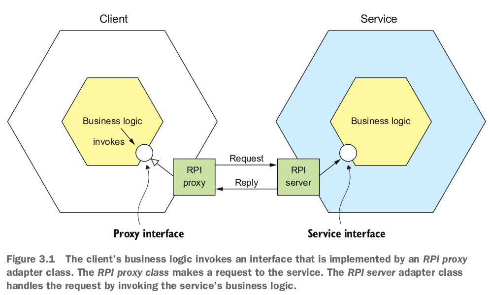

Hãy cùng nhau xem xét REST trước.

### 3.2.1 Using REST

Ngày nay, publish triển API theo phong cách RESTful (https://en.wikipedia.org/wiki/Representational_state_transfer) là một xu hướng phổ biến. REST là một cơ chế IPC (gần như luôn luôn) sử dụng HTTP. Roy Fielding, người sáng tạo ra REST, định nghĩa REST như sau:

> REST provides a set of architectural constraints that, when applied as a whole, emphasizes scalability of component interactions, generality of interfaces, independent deployment of components, and intermediary components to reduce interaction latency, enforce security, and encapsulate legacy systems.

> REST cung cấp một tập hợp các ràng buộc kiến trúc, khi được áp dụng như một toàn bộ, nhấn mạnh tính mở rộng của tương tác giữa các thành phần, tính chung của các giao diện, việc triển khai độc lập của các thành phần, và các thành phần trung gian để giảm thiểu độ trễ tương tác, áp dụng bảo mật, và đóng gói hệ thống kế thừa.

Một khái niệm quan trọng trong REST là resource , thường đại diện cho một business object duy nhất, như một Consumer hoặc Product, hoặc một tập hợp các business object. REST sử dụng các động từ HTTP để thao tác với resource, được tham chiếu bằng một URL. Ví dụ, một request GET trả về biểu diễn của một resource, thường dưới dạng một tài liệu XML hoặc đối tượng JSON, mặc dù các định dạng khác như nhị phân cũng có thể được sử dụng. Một request POST tạo ra một resource mới, và một request PUT cập nhật một resource. Ví dụ, service Order có một endpoint `POST /orders` để tạo một Order và một endpoint `GET /orders/{orderId}` để lấy một Order.

Nhiều nhà publish triển tuyên bố rằng các API dựa trên HTTP của họ là RESTful. Nhưng như Roy Fielding mô tả trong một bài đăng trên blog, không phải tất cả chúng đều thực sự là như vậy (http://roy.gbiv.com/untangled/2008/rest-apis-must-be-hypertext-driven). Để hiểu tại sao, hãy xem xét mô hình mức độ chín mạch của REST.

#### The REST maturity model
Leonard Richardson (không có quan hệ gì với tác giả của bạn) định nghĩa một mô hình mức độ chín mạch rất hữu ích cho REST (http://martinfowler.com/articles/richardsonMaturityModel.html) gồm các cấp độ sau:
- Cấp độ 0: Các client của service ở cấp độ 0 gọi service bằng cách thực hiện các request HTTP POST đến endpoint URL duy nhất của nó. Mỗi request chỉ định hành động cần thực hiện, đối tượng mục tiêu của hành động (ví dụ, business object), và bất kỳ tham số nào.
- Cấp độ 1: service ở cấp độ 1 hỗ trợ ý tưởng về các resource. Để thực hiện một hành động trên một resource, một client thực hiện một request POST chỉ định hành động cần thực hiện và bất kỳ tham số nào.
- Cấp độ 2: service ở cấp độ 2 sử dụng các phương thức HTTP để thực hiện các hành động: GET để truy xuất, POST để tạo mới, và PUT để cập nhật. Các tham số của hành động được chỉ định trong các tham số truy vấn và thân request, nếu có. Điều này cho phép service sử dụng cơ sở hạ tầng web như bộ nhớ cache cho các request GET.
- Cấp độ 3: Thiết kế của service ở cấp độ 3 dựa trên nguyên lý HATEOAS (Hypertext As The Engine Of Application State). Ý tưởng cơ bản là biểu diễn của một resource được trả về bởi một request GET chứa các liên kết để thực hiện các hành động trên resource đó. Ví dụ, một client có thể hủy Order bằng một liên kết trong biểu diễn được trả về bởi request GET đã truy xuất Order đó. Các lợi ích của HATEOAS bao gồm không còn cần phải cứng rắn các URL vào mã client (www.infoq.com/news/2009/04/hateoas-restful-api-advantages).

Tôi khuyến khích bạn xem xét các API REST tại tổ chức của bạn để xem chúng tương ứng với cấp độ nào.

#### Specifying REST APIs

Như đã đề cập trước đó trong phần 3.1, bạn phải định nghĩa API của mình bằng một ngôn ngữ định nghĩa giao diện (IDL). Khác với các giao thức giao tiếp cũ như CORBA và SOAP, REST ban đầu không có IDL. May mắn thay, cộng đồng publish triển đã khám phá lại giá trị của một IDL cho các API RESTful. IDL REST phổ biến nhất là Open API Specification (www.openapis.org), publish triển từ dự án mã nguồn mở Swagger. Dự án Swagger là một bộ công cụ cho việc publish triển và tài liệu hóa các API REST. Nó bao gồm các công cụ tạo ra các đoạn mã client và các cấu trúc máy chủ từ một định nghĩa giao diện.


#### The challenge of fetching multiple resources in a single request
Các nguồn resource REST thường được tập trung vào các business object, chẳng hạn như Consumer và Order. Do đó, một vấn đề phổ biến khi thiết kế một REST API là làm thế nào để cho phép máy client lấy nhiều đối tượng liên quan trong một request duy nhất. Ví dụ, hãy tưởng tượng rằng một máy client REST muốn lấy một Order và Consumer của Order đó. Một API REST thuần túy sẽ request máy client thực hiện ít nhất hai request, một request cho Order và một request khác cho Consumer của nó. Một kịch bản phức tạp hơn sẽ request nhiều hơn nữa lượt truy cập và gặp phải độ trễ quá mức.

Một giải pháp cho vấn đề này là cho phép API cho phép máy client lấy các resource liên quan khi nó nhận một resource. Ví dụ, một máy client có thể lấy một Order và Consumer của nó bằng cách sử dụng `GET /orders/order-id-1345?expand=consumer`. Tham số truy vấn xác định các resource liên quan cần được trả về cùng với Order. Phương pháp này hoạt động tốt trong nhiều kịch bản nhưng thường không đủ cho các kịch bản phức tạp hơn. Nó cũng có thể tốn thời gian để triển khai. Điều này đã dẫn đến sự phổ biến ngày càng tăng của các công nghệ API thay thế như GraphQL (http://graphql.org) và Netflix Falcor (http://netflix.github.io/falcor/), được thiết kế để hỗ trợ việc lấy dữ liệu hiệu quả. 

#### The challenge of mapping operations to HTTP verbs
Một vấn đề thiết kế API REST phổ biến khác là làm thế nào để ánh xạ các hoạt động bạn muốn thực hiện trên một đối tượng business thành một động từ HTTP. Một REST API nên sử dụng PUT cho các cập nhật, nhưng có thể có nhiều cách để cập nhật một Order, bao gồm hủy nó, sửa đổi Order và cũng có thể không idempotent, điều này là một request để sử dụng PUT. Một giải pháp là xác định một resource phụ cho việc cập nhật một khía cạnh cụ thể của một resource. Ví dụ, service Order có một đường dẫn `POST /orders/{orderId}/cancel` để hủy Order và một đường dẫn `POST /orders/{orderId}/revise` để chỉnh sửa Order. Một giải pháp khác là xác định một động từ dưới dạng một tham số truy vấn URL. Thật không may, cả hai giải pháp đều không phải là hoàn toàn RESTful.

Vấn đề này với việc ánh xạ các hoạt động sang các động từ HTTP đã dẫn đến sự phổ biến ngày càng tăng của các phương pháp thay thế cho REST, như gPRC, sẽ được thảo luận ngay sau ở mục 3.2.2. Nhưng trước hết hãy xem xét những ưu điểm và nhược điểm của REST.

#### Benefits and drawbacks of REST
Có nhiều lợi ích khi sử dụng REST:
- Nó đơn giản và quen thuộc.
- Bạn có thể kiểm tra một API HTTP từ trong trình duyệt bằng cách sử dụng, ví dụ, plugin Postman, hoặc từ dòng lệnh bằng cách sử dụng curl (giả sử JSON hoặc một định dạng văn bản khác được sử dụng).
- Nó trực tiếp hỗ trợ giao tiếp theo kiểu request/response.
- HTTP, tất nhiên, thân thiện với tường lửa.
- Nó không request một trung gian môi giới, điều này làm đơn giản hóa kiến trúc của hệ thống.

Tuy nhiên, cũng có một số nhược điểm khi sử dụng REST:
- Nó chỉ hỗ trợ kiểu giao tiếp theo request/response.
- Giảm khả dụng. Vì Client và service giao tiếp trực tiếp mà không có một trung gian để đệm message, họ phải cùng chạy trong suốt thời gian trao đổi.
- Client phải biết vị trí (URL) của các phiên bản service. Như đã mô tả trong mục 3.2.4, đây là một vấn đề phức tạp trong một ứng dụng hiện đại. Client phải sử dụng cái được gọi là cơ chế publish hiện service để xác định vị trí của các phiên bản service.
- Lấy nhiều resource trong một request đơn có thách thức.
- Đôi khi khó khăn khi ánh xạ nhiều hoạt động cập nhật sang các động từ HTTP.


Mặc dù có nhược điểm này, REST dường như là tiêu chuẩn không chính thức cho các API, mặc dù có một vài lựa chọn thú vị khác. Ví dụ, GraphQL thực hiện việc lấy dữ liệu một cách linh hoạt và hiệu quả. Chương 8 bàn về GraphQL và đề cập đến pattern gateway API.

gRPC là một lựa chọn khác cho REST. Hãy cùng nhau tìm hiểu về cách hoạt động của nó.

### 3.2.2 Using gRPC

Như đã đề cập trong phần trước đó, một thách thức khi sử dụng REST là vì HTTP chỉ cung cấp một số ít động từ, nên không phải lúc nào cũng dễ dàng để thiết kế một REST API hỗ trợ nhiều hoạt động cập nhật. Một công nghệ IPC giải quyết vấn đề này là gRPC (www.grpc.io), một framework cho việc viết các client và server chéo ngôn ngữ (xem https://en.wikipedia.org/wiki/Remote_procedure_call để biết thêm thông tin). gRPC là một giao thức dựa trên message nhị phân, và điều này có nghĩa—như đã đề cập trước đó trong phần thảo luận về các định dạng message nhị phân—bạn buộc phải tiếp cận thiết kế service theo cách API trước.

Bạn định nghĩa các API gRPC của mình bằng cách sử dụng một IDL dựa trên Protocol Buffers, đó là cơ chế của Google không phụ thuộc vào ngôn ngữ để serialize dữ liệu cấu trúc. Bạn sử dụng trình biên dịch Protocol Buffer để tạo ra các stub phía client và các skeleton phía server. Trình biên dịch có thể tạo mã cho nhiều ngôn ngữ khác nhau, bao gồm Java, C#, NodeJS, và GoLang. Các client và server trao đổi các message nhị phân trong định dạng Protocol Buffers sử dụng HTTP/2.

Một API gRPC bao gồm một hoặc nhiều service và định nghĩa message request/response. Một định nghĩa service tương tự như một giao diện Java và là một bộ sưu tập các phương thức kiểu cố định. Ngoài việc hỗ trợ RPC request/response đơn giản, gRPC còn hỗ trợ RPC dòng. Một server có thể phản hồi với một luồng message cho client. Hoặc ngược lại, một client có thể gửi một luồng message cho server.

gRPC sử dụng Protocol Buffers làm định dạng message. Protocol Buffers là, như đã đề cập trước đó, một định dạng nhị phân hiệu quả, gọn nhẹ. Đó là một định dạng được gắn thẻ. Mỗi trường của một message Protocol Buffers được đánh số và có một mã loại. Người nhận message có thể trích xuất các trường mà nó cần và bỏ qua các trường mà nó không nhận dạng. Kết quả là, gRPC cho phép các API publish triển mà vẫn duy trì tính tương thích ngược với các phiên bản cũ.

Listing 3.1 shows an excerpt of the gRPC API for the Order Service. It defines several methods, including `createOrder()`. This method takes a `CreateOrderRequest` as a parameter and returns a `CreateOrderReply`.

```proto
service OrderService {
    rpc createOrder(CreateOrderRequest) returns (CreateOrderReply) {}
    rpc cancelOrder(CancelOrderRequest) returns (CancelOrderReply) {}
    rpc reviseOrder(ReviseOrderRequest) returns (ReviseOrderReply) {}
    ...
}
message CreateOrderRequest {
    int64 restaurantId = 1;
    int64 consumerId = 2;
    repeated LineItem lineItems = 3;
    ...
}
message LineItem {
    string menuItemId = 1;
    int32 quantity = 2;
}
message CreateOrderReply {
    int64 orderId = 1;
}
...
```

`CreateOrderRequest` và `CreateOrderReply` là các message có kiểu. Ví dụ, message `CreateOrderRequest` có một trường `restaurantId` kiểu int64. Giá trị thẻ của trường là 1. gRPC có một số lợi ích:

- Nó rất dễ thiết kế một API có một bộ các hoạt động cập nhật phong phú.
- Nó có một cơ chế IPC hiệu quả, gọn nhẹ, đặc biệt là khi trao đổi các message lớn.
- Luồng kép cho phép cả hai phong cách gọi hàm từ xa (RPI) và giao tiếp theo kiểu Message.
- Nó cho phép tương thích giữa các client và service được viết bằng nhiều ngôn ngữ khác nhau.

gRPC cũng có một số nhược điểm:

- Việc JavaScript clients tiêu thụ API dựa trên gRPC mất nhiều công sức hơn so với API dựa trên REST/JSON.
- Một số tường lửa cũ có thể không hỗ trợ HTTP/2.

gRPC là một lựa chọn hấp dẫn so với REST, nhưng giống như REST, nó là một cơ chế giao tiếp đồng bộ, nên nó cũng gặp vấn đề về sự cố một phần. Hãy xem xét vấn đề đó là gì và cách xử lý nó.

### 3.2.3 Handling partial faiure using the Circurit breaker patter

Trong một hệ thống phân tán, mỗi khi một service thực hiện một request đồng bộ đến một service khác, luôn tồn tại nguy cơ mất mát một phần. Bởi vì client và service là các quy trình riêng biệt, một service có thể không thể phản hồi kịp thời cho request của client. service có thể bị tắt do một sự cố hoặc để bảo trì. Hoặc service có thể bị quá tải và phản hồi rất chậm chạp đối với các request. Bởi vì client đang chặn chờ một phản hồi, nguy cơ là sự cố có thể lan ra các client của client và vấn đề có thể gây ra sự cố.    

Hãy xem xét, ví dụ, tình huống được hiển thị trong hình 3.2, trong đó Order Service không phản hồi. Một client di động thực hiện một request REST đến một cổng API, mà, như đã thảo luận trong chương 8, là điểm vào ứng dụng cho client API. Cổng API chuyển tiếp request đến Order Service không phản hồi.

> **Pattern: Circurit breaker**\
An RPI proxy that immediately rejects invocations for a timeout period after the number of consecutive failures exceeds a specified threshold. See http://microservices.io/patterns/reliability/circuit-breaker.html.


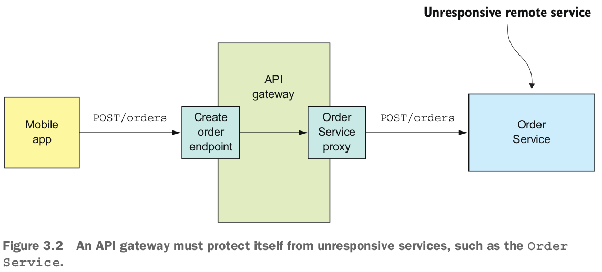

Một cách triển khai ngây thơ của `OrderServiceProxy` sẽ chặn vô thời hạn, chờ đợi một phản hồi. Không chỉ dẫn đến một trải nghiệm người dùng kém, nhưng trong nhiều ứng dụng, nó sẽ tiêu thụ một nguồn tài nguyên quý báu, như một luồng. Cuối cùng, cổng API sẽ cạn kiệt tài nguyên và trở nên không thể xử lý các request. Toàn bộ API sẽ không khả dụng.

Quan trọng là bạn phải thiết kế các service của mình để ngăn chặn sự cố một phần lan rộng trong toàn bộ ứng dụng. Có hai phần trong giải pháp:
- Bạn phải thiết kế các RPI proxies, như `OrderServiceProxy`, để xử lý các service từ xa không phản hồi.
- Bạn cần quyết định cách khôi phục từ một service từ xa bị lỗi.

#### Developing robust RPI experts

Khi một service đồng bộ gọi một service khác, nó nên tự bảo vệ bằng cách sử dụng phương pháp mô tả bởi Netflix. Phương pháp này bao gồm sự kết hợp của các cơ chế sau:
- **Timeout mạng:** Không bao giờ chặn vô thời hạn và luôn sử dụng timeout khi đợi phản hồi. Sử dụng timeout đảm bảo rằng các tài nguyên không bao giờ bị ràng buộc vô thời hạn.
- **Limiting the number of outstanding requests from a client to a service:** Đặt một ngưỡng trên số lượng request đang chờ xử lý mà một máy client có thể gửi đến một service cụ thể. Nếu đã đạt đến giới hạn, có lẽ là không có ý nghĩa để gửi thêm request, và những cố gắng đó nên thất bại ngay lập tức.
- **Circuit breaker pattern:** Theo dõi số lượng request thành công và thất bại, và nếu tỷ lệ lỗi vượt quá một ngưỡng nào đó, thì đóng mạch phá vỡ để những cố gắng tiếp theo thất bại ngay lập tức. Một số lượng lớn request thất bại gợi ý rằng service không khả dụng và gửi thêm request không có ý nghĩa. Sau một khoảng thời gian timeout, máy client nên thử lại, và nếu thành công, đóng mạch phá vỡ.

Netflix Hystrix là một thư viện mã nguồn mở thực hiện những mẫu này và các mẫu khác. Nếu bạn đang sử dụng JVM, bạn nên xem xét sử dụng Hystrix khi triển khai các proxy RPI. Và nếu bạn chạy trong một môi trường không phải JVM, bạn nên sử dụng một thư viện tương đương. Ví dụ, thư viện Polly phổ biến trong cộng đồng .NET.

#### Recovering from an unvailable service

Sử dụng một thư viện như Hystrix chỉ là một phần của giải pháp. Bạn cũng phải quyết định từng trường hợp cụ thể làm sao service của bạn nên phục hồi từ một service từ xa không phản hồi. Một lựa chọn là để service trả về một lỗi đến máy client của nó. Ví dụ, phương pháp này hợp lý cho tình huống được hiển thị trong hình 3.2, nơi request tạo một Order thất bại. Tùy chọn duy nhất là cho API gateway trả về một lỗi cho mobile app.

Trong các tình huống khác, việc trả về một giá trị thay thế, chẳng hạn như giá trị mặc định hoặc một phản hồi lưu trữ, có thể hợp lý. Ví dụ, chương 7 mô tả cách API gateway có thể triển khai thao tác truy vấn `findOrder()` bằng cách sử dụng mẫu tổ hợp API. Như hình 3.3 cho thấy, triển khai của nó cho điểm cuối `GET /orders/{orderId}` gọi nhiều service, bao gồm Order Service, Kitchen Serivce, và Delivery Service, và kết hợp các kết quả.


Có khả năng rằng dữ liệu từng service không quan trọng như nhau đối với máy client. Dữ liệu từ Order Service là quan trọng. Nếu service này không khả dụng, API gateway nên trả về một phiên bản lưu trữ của dữ liệu của nó hoặc một lỗi. Dữ liệu từ các service khác ít quan trọng hơn. Một máy client có thể, ví dụ, hiển thị thông tin hữu ích cho người dùng ngay cả khi trạng thái Delivery không khả dụng. Nếu Delivery Service không khả dụng, API gateway nên trả về một phiên bản lưu trữ của dữ liệu của nó hoặc loại bỏ nó khỏi phản hồi.


Quan trọng là bạn phải thiết kế các service của mình để xử lý sự cố phần, nhưng đó không phải là vấn đề duy nhất bạn cần giải quyết khi sử dụng RPI. Một vấn đề khác là để một service gọi một service khác bằng cách sử dụng RPI, nó cần biết vị trí mạng của một phiên bản service. Trên bề mặt điều này nghe có vẻ đơn giản, nhưng trong thực tế đó là một vấn đề thách thức. Bạn phải sử dụng một cơ chế publish hiện service. Hãy xem cách hoạt động của nó.


### 3.2.4 Using service dicovery
Nói bạn đang viết một số mã để gọi một service có REST API. Để thực hiện request, mã của bạn cần biết vị trí mạng (địa chỉ IP và cổng) của một phiên bản service. Trong một ứng dụng truyền thống chạy trên phần cứng vật lý, các vị trí mạng của các phiên bản service thường là tĩnh. Ví dụ, mã của bạn có thể đọc các vị trí mạng từ một tệp cấu hình được cập nhật định kỳ. Nhưng trong một ứng dụng microservices hiện đại dựa trên đám mây, điều này thường không đơn giản như vậy. Như được hiển thị trong hình 3.4, một ứng dụng hiện đại động hơn nhiều.

Các phiên bản service có các vị trí mạng được chỉ định động. Hơn nữa, tập hợp các phiên bản service thay đổi động do tự động mở rộng, lỗi và nâng cấp. Do đó, mã client của bạn phải sử dụng một cơ chế publish hiện service.

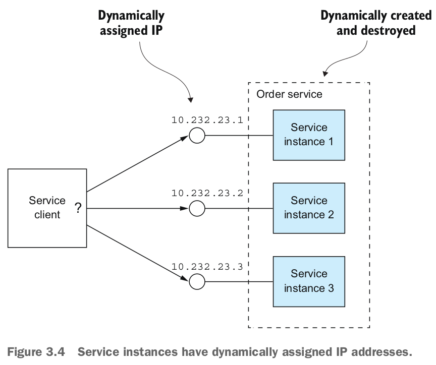

#### Overview of service discovery

Như bạn vừa thấy, bạn không thể cấu hình tĩnh một client với các địa chỉ IP của các service. Thay vào đó, một ứng dụng phải sử dụng một cơ chế publish hiện service động. publish hiện service trong tư duy khá đơn giản: thành phần chính của nó là một bảng đăng ký service, là một cơ sở dữ liệu các vị trí mạng của các phiên bản service của một ứng dụng.

Cơ chế publish hiện service cập nhật bảng đăng ký service khi các phiên bản service bắt đầu và kết thúc. Khi một client gọi một service, cơ chế publish hiện service truy vấn bảng đăng ký service để lấy danh sách các phiên bản service có sẵn và định tuyến request tới một trong số chúng.

Có hai cách chính để triển khai publish hiện service:
- Các service và các client của chúng tương tác trực tiếp với bảng đăng ký service.
- Hạ tầng triển khai xử lý publish hiện service. (Tôi sẽ nói thêm về điều đó trong chương 12.)

Hãy xem xét mỗi lựa chọn.

#### Applying the application-level service discovery patterns

Một cách triển khai publish hiện service là để các service của ứng dụng và client của chúng tương tác với bảng đăng ký service. Hình 3.5 cho thấy cách hoạt động này. Một phiên bản service đăng ký vị trí mạng của mình với bảng đăng ký service. Một client của service gọi một service bằng cách trước tiên truy vấn bảng đăng ký service để lấy danh sách các phiên bản service. Sau đó, nó gửi một request tới một trong số những phiên bản đó.

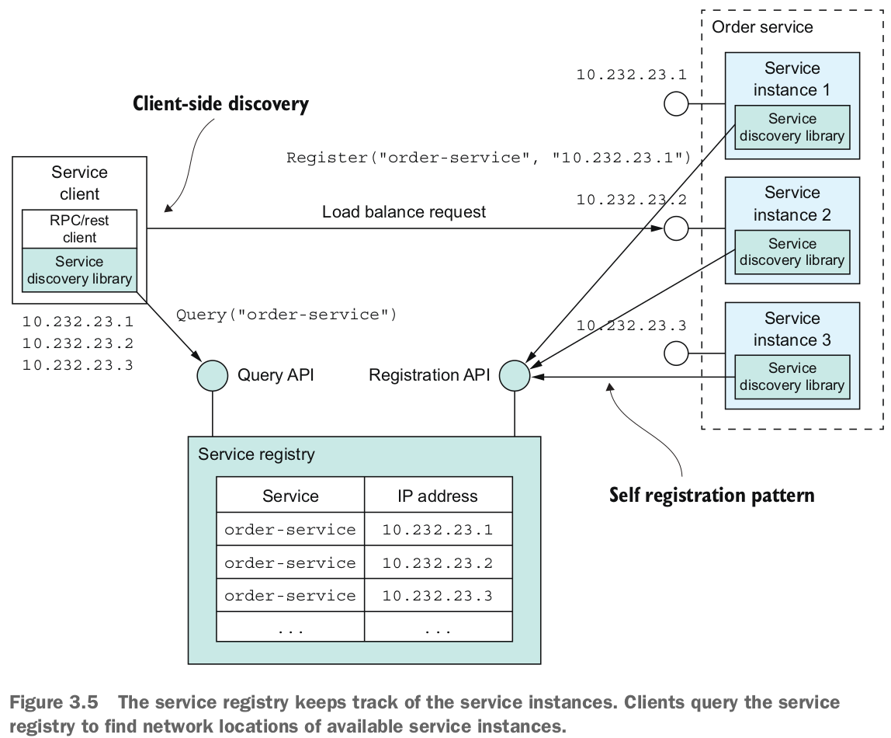

Cách tiếp cận này đối với publish hiện service là sự kết hợp của hai mẫu thiết kế. Mẫu đầu tiên là mẫu tự đăng ký. Một phiên bản service gọi API đăng ký của bảng đăng ký service để đăng ký vị trí mạng của nó. Nó cũng có thể cung cấp một URL kiểm tra sức khỏe, được mô tả chi tiết hơn trong chương 11. URL kiểm tra sức khỏe là một điểm cuối API mà bảng đăng ký service gọi định kỳ để xác minh rằng phiên bản service lành mạnh và có sẵn để xử lý request. Một bảng đăng ký service có thể request một phiên bản service gọi định kỳ API "nhịp tim" để ngăn việc đăng ký của nó hết hạn.

> **Pattern: Self registration**\
A service instance registers itself with the service registry. See http://microservices.io/patterns/self-registration.html.

Mẫu thiết kế thứ hai là mẫu publish hiện phía client. Khi một client của service muốn gọi một service, nó truy vấn bảng đăng ký service để lấy danh sách các phiên bản của service. Để cải thiện hiệu suất, một client có thể lưu vào bộ nhớ cache các phiên bản của service. Client của service sau đó sử dụng một thuật toán cân bằng tải, chẳng hạn như round-robin hoặc random, để chọn một phiên bản của service. Sau đó, nó gửi một request tới một phiên bản service được chọn.

> **Pattern: Client-side discovery**\
A service client retrieves the list of available service instances from the service registry and load balances across them. See http://microservices.io/patterns/client-side-discovery.html.

Việc khám phá service ở mức ứng dụng đã trở nên phổ biến nhờ Netflix và Pivotal. Netflix đã publish triển và công khai mã nguồn một số thành phần: Eureka, một bảng đăng ký service có khả năng sẵn có cao, Eureka Java client, và Ribbon, một HTTP client tinh vi hỗ trợ Eureka client. Pivotal đã publish triển Spring Cloud, một framework dựa trên Spring giúp việc sử dụng các thành phần của Netflix trở nên đáng kinh ngạc dễ dàng. Các service dựa trên Spring Cloud tự động đăng ký với Eureka, và các client dựa trên Spring Cloud tự động sử dụng Eureka để khám phá service.

Một lợi ích của việc khám phá service ở mức ứng dụng là nó xử lý trường hợp khi các service được triển khai trên nhiều nền tảng triển khai khác nhau. Hãy tưởng tượng, ví dụ, bạn chỉ triển khai một số service trên Kubernetes, được thảo luận trong chương 12, và phần còn lại đang chạy trong một môi trường kế thừa. Việc khám phá service ở mức ứng dụng bằng cách sử dụng Eureka, ví dụ, hoạt động trên cả hai môi trường này, trong khi việc khám phá service dựa trên Kubernetes chỉ hoạt động trong Kubernetes.

Một điểm nhược điểm của việc khám phá service ở mức ứng dụng là bạn cần một thư viện khám phá service cho mỗi ngôn ngữ - và có thể là framework - mà bạn sử dụng. Spring Cloud chỉ hỗ trợ các nhà publish triển Spring. Nếu bạn đang sử dụng một framework Java khác hoặc một ngôn ngữ không phải JVM như NodeJS hoặc GoLang, bạn phải tìm một framework khám phá service khác. Một điểm nhược điểm khác của việc khám phá service ở mức ứng dụng là bạn phải tự thiết lập và quản lý bảng đăng ký service, điều này làm xao lạc. Do đó, thường thì tốt hơn là sử dụng một cơ chế khám phá service được cung cấp bởi cơ sở hạ tầng triển khai.

#### Applying the platform-provided service discovery patterns
Trong chương 12, sau này bạn sẽ học được rằng nhiều nền tảng triển khai hiện đại như Docker và Kubernetes có một bảng đăng ký service và cơ chế khám phá service tích hợp sẵn. Nền tảng triển khai cung cấp cho mỗi service một tên DNS, một địa chỉ IP ảo (VIP), và một tên DNS mà giải quyết thành địa chỉ VIP. Một client service thực hiện một request đến tên DNS / VIP, và nền tảng triển khai tự động định tuyến request đến một trong các phiên bản service có sẵn. Kết quả là, việc đăng ký service, khám phá service, và định tuyến request được xử lý hoàn toàn bởi nền tảng triển khai. Hình 3.6 cho thấy cách hoạt động này.

Nền tảng triển khai bao gồm một bảng đăng ký service để theo dõi các địa chỉ IP của các service đã triển khai. Trong ví dụ này, một client truy cập service Order bằng cách sử dụng tên DNS order-service, giải quyết thành địa chỉ IP ảo 10.1.3.4. Nền tảng triển khai tự động cân bằng tải request qua ba phiên bản của service Order.

Cách tiếp cận này là sự kết hợp của hai mẫu:
- 3rd party registration - Thay vì một service đăng ký với bản đăng ký service, một bên thứ ba gọi là bộ đăng ký, thường là một phần của nền tảng triển khai, xử lý việc đăng ký.
-  Server-side discovery - Thay vì một client truy vấn bảng đăng ký service, nó thực hiện một request đến một tên DNS, mà giải quyết thành một bộ định tuyến request truy vấn bảng đăng ký service và cân bằng tải request.


> **Pattern: 3rd party registration**\
Service instances are automatically registered with the service registry by a third party.
See http://microservices.io/patterns/3rd-party-registration.html.

> **Pattern: Server-side discovery**\
A client makes a request to a router, which is responsible for service discovery. See
http://microservices.io/patterns/server-side-discovery.html.

Lợi ích chính của việc triển khai service do nền tảng cung cấp là tất cả các khía cạnh của khám phá service đều được xử lý hoàn toàn bởi nền tảng triển khai. Cả service lẫn các client không chứa bất kỳ mã khám phá service nào. Do đó, cơ chế khám phá service sẵn có ngay cho tất cả các service và client mà không phụ thuộc vào ngôn ngữ hoặc framework nào chúng được viết bằng.

Một nhược điểm của việc triển khai service do nền tảng cung cấp là nó chỉ hỗ trợ việc khám phá các service đã được triển khai bằng cách sử dụng nền tảng. Ví dụ, như đã đề cập trước đó khi miêu tả về khám phá cấp ứng dụng, khám phá dựa trên Kubernetes chỉ hoạt động cho các service đang chạy trên Kubernetes. Mặc dù có hạn chế này, tôi khuyên bạn nên sử dụng khám phá service do nền tảng cung cấp mỗi khi có thể.

Bây giờ khi đã tìm hiểu về IPC đồng bộ bằng REST hoặc gRPC, hãy xem xét phương pháp thay thế: giao tiếp bất đồng bộ, dựa trên message.

## 3.3 Communicating using the Asychronous messaging pattern
Khi sử dụng message, các service giao tiếp bằng cách trao đổi message không đồng bộ. Một ứng dụng dựa trên message thường sử dụng một message broker, làm trung gian giữa các service, mặc dù một lựa chọn khác là sử dụng một kiến trúc không có message broker, trong đó các service giao tiếp trực tiếp với nhau. Một client của service tạo một request đến một service bằng cách gửi một message. Nếu một thể hiện của service được mong đợi sẽ trả lời, nó sẽ làm như vậy bằng cách gửi một message riêng biệt trở lại cho client. Bởi vì giao tiếp là không đồng bộ, client không chặn lại đợi phản hồi. Thay vào đó, client được viết với giả định rằng phản hồi sẽ không được nhận ngay lập tức.

> **Pattern: Messaging**\
A client invokes a service using asynchronous messaging. See http://microservices
.io/patterns/communication-style/messaging.html.

Tôi bắt đầu phần này với một tổng quan về message. Tôi mô tả cách mô tả một kiến trúc message độc lập với công nghệ message. Tiếp theo, tôi so sánh và đối chiếu giữa các kiến trúc không có broker và dựa trên broker và mô tả các tiêu chí để lựa chọn một message broker. Sau đó, tôi thảo luận về một số chủ đề quan trọng, bao gồm mở rộng consumer trong khi bảo tồn thứ tự message, publish hiện và loại bỏ message trùng lặp, và gửi và nhận message như một phần của một transaction cơ sở dữ liệu. Hãy bắt đầu bằng cách xem xét cách hoạt động của message. 

### 3.3.1 Overview of Messaging
Một mô hình hữu ích về message được định nghĩa trong cuốn sách Enterprise Integration Patterns (Addison-Wesley Professional, 2003) của Gregor Hohpe và Bobby Woolf. Theo mô hình này, các message được trao đổi qua các message channel. Một người gửi (một ứng dụng hoặc service) ghi một message vào một kênh, và một người nhận (một ứng dụng hoặc service) đọc các message từ một kênh. Hãy xem xét về message và sau đó xem xét về các kênh.

#### About message
Một message bao gồm một Header và một phần thân message (www.enterpriseintegrationpatterns.com/Message.html). Header là một bộ sưu tập các cặp name-value,  siêu dữ liệu mô tả dữ liệu được gửi. Ngoài các cặp name-value được cung cấp bởi người gửi message, Header message chứa các cặp name-value như một id message duy nhất được tạo ra bởi người gửi hoặc cơ sở hạ tầng message, và một địa chỉ trả về tùy chọn, chỉ định message channel mà một câu trả lời nên được ghi vào. Phần thân message là dữ liệu đang được gửi, ở dạng văn bản hoặc nhị phân.

Có một số loại message khác nhau:

- Document: Một message chung chỉ chứa dữ liệu. Người nhận quyết định cách diễn giải nó. Câu trả lời cho một lệnh là một ví dụ về message Document.
- Command: Một message tương đương với một request RPC. Nó chỉ định thao tác cần gọi và các tham số của nó.
- Event: Một message chỉ ra rằng điều gì đó đáng chú ý đã xảy ra trong người gửi. Một Event thường là một Event domain, đại diện cho một thay đổi trạng thái của một đối tượng domain như một Đơn Order, hoặc một Client.

Phương pháp kiến trúc service nhỏ mà cuốn sách này mô tả sử dụng Command và Event rộng rãi. Bây giờ, chúng ta hãy xem xét về các kênh, cơ chế mà các service giao tiếp.
#### About message channels

Như hình 3.7 hiển thị, các message được trao đổi qua các kênh (www.enterpriseintegrationpatterns.com/MessageChannel.html). Bunsiness logic trong người gửi kích hoạt một giao diện Sending port, mà đóng gói cơ chế giao tiếp cơ bản. Sending port được thực hiện bởi một lớp adapter message sender, gửi một message cho một người nhận thông qua một message channel. Một message channel là một trừu tượng hóa của cơ sở hạ tầng message. Một lớp adapter message handler trong người nhận được gọi để xử lý message. Nó gọi một giao diện receiving port được được thực hiện bởi Bunsiness logic của Consumer. Bất kỳ số lượng người gửi nào cũng có thể gửi message đến một kênh. Tương tự, bất kỳ số lượng người nhận nào cũng có thể nhận message từ một kênh.


Có hai loại kênh: kênh point-to-point (www.enterpriseintegrationpatterns.com/PointToPointChannel.html) và kênh publish-subcribe (www.enterpriseintegrationpatterns.com/PublishSubscribeChannel.html):
- Một kênh point-to-point chuyển một message đến chính xác một trong số các consumer đang đọc từ kênh. service sử dụng các kênh point-to-point cho các kiểu tương tác một-một được mô tả trước đó. Ví dụ, một message lệnh thường được gửi qua một kênh point-to-point.
- Một kênh publish-subcribe chuyển mỗi message đến tất cả các consumer đính kèm. service sử dụng các kênh publish-subcribe cho các kiểu tương tác một-nhiều được mô tả trước đó. Ví dụ, một message event thường được gửi qua một kênh publish-subcribe.

### 3.3.2 Implementing the interaction styles using messaging
Một trong những tính năng quý giá của hệ thống message là nó linh hoạt đến mức đủ để hỗ trợ tất cả các kiểu tương tác mô tả trong phần 3.1.1. Một số kiểu tương tác được triển khai trực tiếp thông qua hệ thống message. Những kiểu tương tác khác phải được triển khai trên nền tảng của hệ thống message.

Hãy xem cách triển khai mỗi kiểu tương tác, bắt đầu với request/response và request/response không đồng bộ.

#### Implementing request/response and asynchronous request/response

Khi một Client và service tương tác sử dụng request/response hoặc request/response không đồng bộ, Client gửi một request và service gửi lại một phản hồi. Sự khác biệt giữa hai kiểu tương tác này là với request/response, Client mong đợi service phản hồi ngay lập tức, trong khi với request/response không đồng bộ thì không có kỳ vọng đó. Hệ thống message là không đồng bộ theo bản chất, nên chỉ cung cấp request/response không đồng bộ. Tuy nhiên, Client có thể chặn cho đến khi nhận được phản hồi.

Client và service triển khai kiểu tương tác request/response không đồng bộ bằng cách trao đổi một cặp message. Như hình 3.8 thể hiện, Client gửi một message lệnh, chỉ định thao tác cần thực hiện và các tham số, đến một kênh message dành riêng của service. service xử lý request và gửi một message phản hồi, chứa kết quả, đến một kênh message dành riêng của Client.

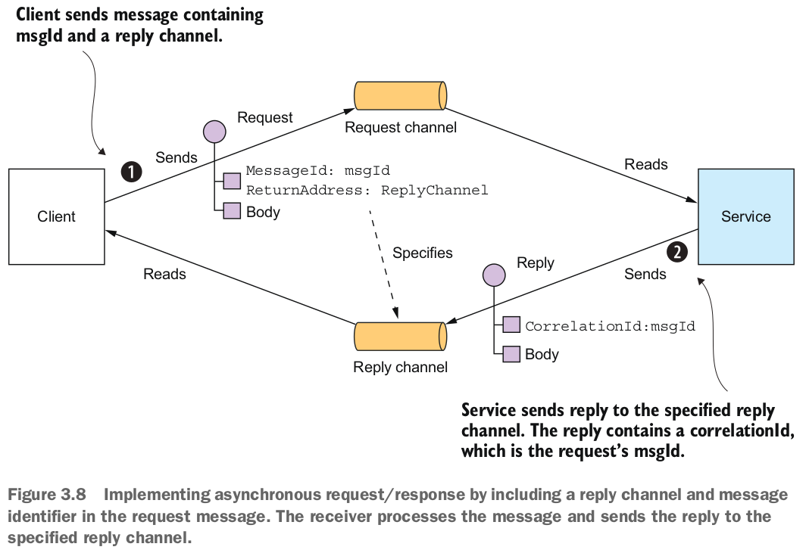

Client phải thông báo cho service nơi gửi một message phản hồi và phải khớp các message phản hồi với các request. May mắn thay, giải quyết hai vấn đề này không quá khó khăn. Client gửi một message lệnh có header reply channel. service viết message phản hồi, chứa một correlation id có cùng giá trị với message identifier, đến reply channel. Client sử dụng correlation id để khớp message phản hồi với request.

Bởi vì Client và service tương tác bằng cách sử dụng hệ thống message, nên tương tác là không đồng bộ theo bản chất. Lý thuyết, một Client message có thể chặn cho đến khi nhận được một phản hồi, nhưng trong thực tế Client sẽ xử lý các phản hồi không đồng bộ. Hơn nữa, các phản hồi thường được xử lý bởi bất kỳ một trong các phiên bản của Client.

#### Implementing one-way notifications
Việc triển khai thông báo một chiều là đơn giản bằng cách sử dụng hệ thống message không đồng bộ. Client gửi một message, thường là một message lệnh, đến một kênh point-to-point thuộc sở hữu của service. service đăng ký theo dõi kênh và xử lý message. Nó không gửi lại một phản hồi.

#### Implementing publish/subcribe
Message hỗ trợ tính năng publish/subcribe của phong cách tương tác publish/subcribe. Một Client publish một message đến một kênh publish/subcribe được đăng ký bởi nhiều consumer. Như đã mô tả trong các chương 4 và 5, các service sử dụng publish/subcribe để publish các event domain, đại diện cho các thay đổi đối với các đối tượng domain. service publish các event domain sở hữu một kênh publish/subcribe, tên của nó được dẫn xuất từ lớp domain. Ví dụ, service Order publish các event Order đến một kênh Order, và service Delivery publish các event Delivery đến một kênh Delivery. Một service quan tâm đến các event của một đối tượng domain cụ thể chỉ cần đăng ký theo dõi kênh tương ứng.

#### Implementing publish/async response
Phong cách tương tác publish/tiêu thụ và phản hồi bất đồng bộ là một phong cách tương tác ở mức độ cao hơn được thực hiện bằng cách kết hợp các yếu tố của publish/tiêu thụ và request/response . Một client hàng publish một message chỉ định một header kênh phản hồi đến một kênh publish/tiêu thụ. Một consumer viết một message phản hồi chứa một correlation id đến kênh phản hồi. client hàng thu thập các phản hồi bằng cách sử dụng correlation id để kết hợp các message phản hồi với request.
Mỗi service trong ứng dụng của bạn có một API bất đồng bộ sẽ sử dụng một hoặc nhiều kỹ thuật triển khai này. Một service có một API bất đồng bộ để gọi các hoạt động sẽ có một kênh message cho các request. Tương tự, một service publish các event sẽ publish chúng đến một kênh message event.

Như đã mô tả trong phần 3.1.2, việc viết một đặc tả API cho một service là rất quan trọng. Hãy xem cách thực hiện điều đó cho một API bất đồng bộ.


### 3.3.3 Creating an API specification for a messaging-based service API
Đặc tả cho API bất đồng bộ của một service, như hình 3.9 thể hiện, phải chỉ định tên của các kênh message, các loại message được trao đổi qua mỗi kênh, và các định dạng của chúng. Bạn cũng cần mô tả định dạng của các message bằng một tiêu chuẩn như JSON, XML, hoặc Protobuf. Tuy nhiên, khác với REST và Open API, không có một tiêu chuẩn được chấp nhận rộng rãi để tài liệu hóa các kênh và các loại message. Thay vào đó, bạn cần viết một tài liệu không chính thức.

API bất đồng bộ của một service bao gồm các hoạt động, được gọi bởi các client hàng, và các event, được publish bởi các service. Chúng được tài liệu hóa theo các cách khác nhau. Hãy cùng xem xét mỗi cách, bắt đầu với các hoạt động.

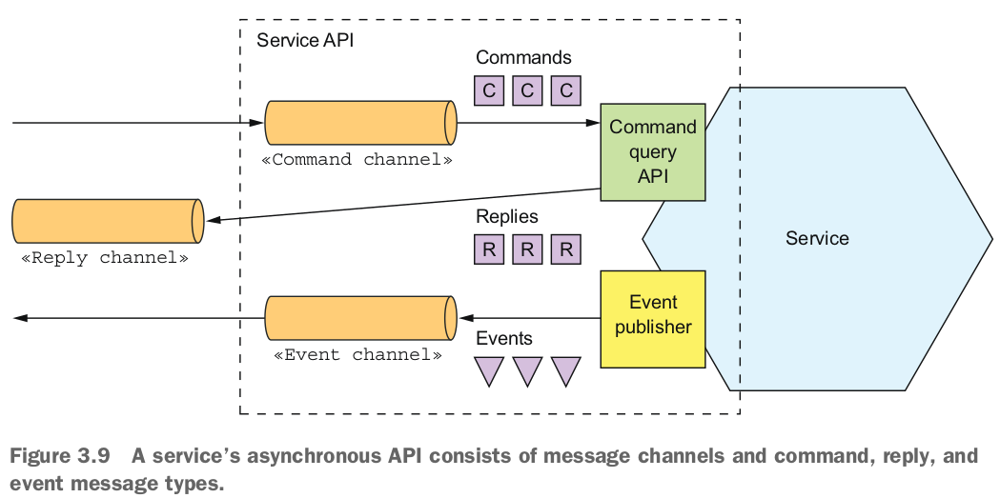


#### Documenting Asynchronous operations

Các hoạt động của một service có thể được gọi bằng một trong hai kiểu tương tác khác nhau:
- API theo kiểu Request/async response: Bao gồm kênh message lệnh của service, các loại và định dạng của các loại message lệnh mà service chấp nhận, và các loại và định dạng của các message phản hồi được gửi bởi service.
- API theo kiểu thông báo một chiều: Bao gồm kênh message lệnh của service và các loại và định dạng của các loại message lệnh mà service chấp nhận.

Một service có thể sử dụng cùng một kênh request cho cả hai kiểu tương tác bất đồng bộ và thông báo một chiều.

#### Documenting published event
Một service cũng có thể publish các event bằng cách sử dụng kiểu tương tác publish/subscribe. Đặc tả của loại API này bao gồm kênh event và các loại và định dạng của các message event được service publish lên kênh đó.

Mô hình message và kênh là một trừu tượng tuyệt vời và là một cách tốt để thiết kế API bất đồng bộ của một service. Nhưng để triển khai một service, bạn cần chọn một công nghệ message và xác định cách triển khai thiết kế của bạn bằng cách sử dụng các khả năng của công nghệ đó. Hãy cùng xem xét những gì liên quan đến việc này.

### 3.3.4 Using Messaging broker
Một ứng dụng dựa trên message thường sử dụng một message broker, một service cơ sở hạ tầng thông qua đó service giao tiếp. Nhưng một kiến trúc dựa trên broker không phải là duy nhất. Bạn cũng có thể sử dụng một kiến trúc dựa trên không có broker, trong đó các service giao tiếp trực tiếp với nhau. Hai phương pháp này, được minh họa trong hình 3.10, có các ưu và nhược điểm khác nhau, nhưng thường thì một kiến trúc dựa trên broker là một phương pháp tốt hơn.

Cuốn sách này tập trung vào kiến trúc dựa trên broker, nhưng việc nhanh chóng xem xét kiến trúc không có broker cũng đáng giá, bởi vì có thể có các tình huống mà bạn thấy nó hữu ích.

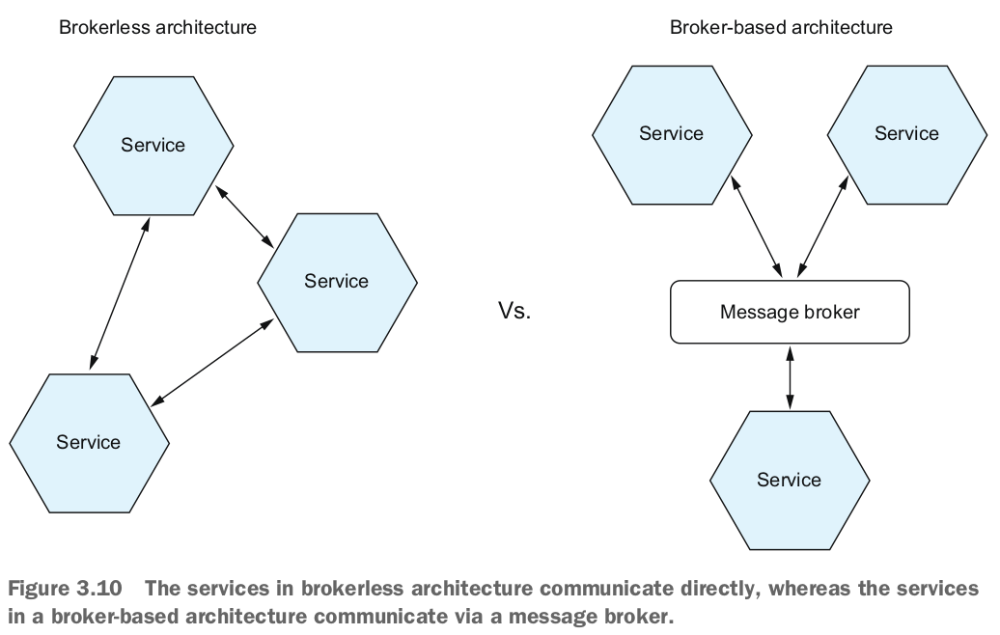

#### Brokerless messaging
Trong kiến trúc không có broker, các service có thể trao đổi message trực tiếp. ZeroMQ (http://zeromq.org) là một công nghệ truyền tin không có broker phổ biến. Nó là cả một đặc tả và một bộ thư viện cho các ngôn ngữ khác nhau. Nó hỗ trợ nhiều phương tiện truyền dẫn, bao gồm TCP, các ổ đĩa Unix-style domain, và multicast.

Kiến trúc không có broker có một số lợi ích:
- Cho phép lưu lượng mạng nhẹ hơn và độ trễ tốt hơn, vì các message đi trực tiếp từ người gửi đến người nhận, thay vì phải đi từ người gửi đến message broker và từ đó đến người nhận.
- Loại bỏ khả năng message broker là một chướng ngại vật hiệu suất hoặc một điểm hỏng hóc duy nhất.
- Giảm thiểu độ phức tạp vận hành, vì không có message broker cần thiết lập và duy trì.

Mặc dù những lợi ích này có vẻ hấp dẫn, nhưng kiến trúc truyền tin không có broker cũng có nhược điểm đáng kể:
- Các service cần phải biết về vị trí của nhau và do đó phải sử dụng một trong các cơ chế phát hiện mô tả trước đó trong phần 3.2.4.
- Nó cung cấp sẵn có giảm đi, vì cả người gửi và người nhận của một message phải có sẵn trong khi message đang được trao đổi.
- Triển khai các cơ chế, chẳng hạn như đảm bảo giao hàng, khó khăn hơn.

Trong thực tế, một số nhược điểm này, chẳng hạn như sẵn có giảm đi và nhu cầu phát hiện service, giống như khi sử dụng đồng bộ, response/response.

Do những hạn chế này, hầu hết các ứng dụng doanh nghiệp sử dụng một kiến trúc dựa trên message broker. Hãy xem cách mà nó hoạt động.

#### Overview of broker-based messaging
Một message broker là một trung gian thông qua đó tất cả các message đều chảy qua. Người gửi viết message vào message broker và message broker giao nó cho người nhận. Một lợi ích quan trọng của việc sử dụng message broker là người gửi không cần phải biết vị trí mạng của consumer. Một lợi ích khác là message broker lưu tạm message cho đến khi consumer có thể xử lý chúng.

Có nhiều message broker để lựa chọn. Các ví dụ về các message broker mã nguồn mở phổ biến bao gồm các service sau:
- ActiveMQ (http://activemq.apache.org)
- RabbitMQ (https://www.rabbitmq.com)
- Apache Kafka (http://kafka.apache.org)

Cũng có các service truyền tin dựa trên đám mây, như AWS Kinesis (https://aws.amazon.com/kinesis/) và AWS SQS (https://aws.amazon.com/sqs/).

Khi chọn một message broker, bạn có nhiều yếu tố để cân nhắc, bao gồm:
- Supported programming language : Bạn nên chọn một message broker hỗ trợ nhiều ngôn ngữ lập trình.
- Supported messaging standards:  Message broker có hỗ trợ các tiêu chuẩn nào, như AMQP và STOMP, hoặc là độc quyền?
- Messaging ordering:  Message broker có duy trì thứ tự của các message không?
- Delivery guarantees :  Message broker đưa ra bảo đảm giao hàng như thế nào?
- Persistence : Các message có được lưu trữ vào đĩa và có thể tồn tại qua các lần sập của broker không?
- Durability : Nếu một consumer kết nối lại với message broker, liệu nó có nhận được các message đã được gửi trong khi nó bị ngắt kết nối không?
- Scability:  Message broker có khả năng mở rộng như thế nào?
- Latency:  Độ trễ từ đầu đến cuối là bao nhiêu?
- Competing consumers : Message broker có hỗ trợ các consumer cạnh tranh không?

Mỗi message broker đều có những lựa chọn khác nhau. Ví dụ, một message broker có độ trễ rất thấp có thể không duy trì thứ tự, không đưa ra bất kỳ bảo đảm nào để giao hàng, và chỉ lưu trữ message trong bộ nhớ. Một message broker đảm bảo giao hàng và lưu trữ message một cách đáng tin cậy trên đĩa có thể có độ trễ cao hơn. Loại message broker nào phù hợp nhất phụ thuộc vào request của ứng dụng của bạn. Có thể rằng các phần khác nhau của ứng dụng của bạn sẽ có các request về truyền tin khác nhau.

Tuy nhiên, có thể rằng việc duy trì thứ tự truyền tin và khả năng mở rộng là cần thiết. Bây giờ hãy xem cách triển khai các kênh message bằng cách sử dụng một message broker.

#### Implementing message channels using a messagr broker
Mỗi message broker thực hiện khái niệm kênh message theo một cách khác nhau. Như bảng 3.2 cho thấy, các message broker JMS như ActiveMQ có hàng đợi và topic. Các message broker dựa trên AMQP như RabbitMQ có exchange và hàng đợi. Apache Kafka có topic, AWS Kinesis có luồng, và AWS SQS có hàng đợi. Hơn nữa, một số message broker cung cấp truyền tin linh hoạt hơn so với sự trừu tượng về message và kênh được mô tả trong chương này.

Hầu hết các message broker mô tả ở đây đều hỗ trợ cả các kênh point-to-point và publish-subscribe. Một ngoại lệ duy nhất là AWS SQS, chỉ hỗ trợ các kênh point-to-point.

Bây giờ hãy xem xét các lợi ích và nhược điểm của truyền tin dựa trên message broker.


#### Benefits and drawbacks of broked-based messaging
Có nhiều lợi ích khi sử dụng truyền tin dựa trên message broker:

- Loose coupling : Một client thực hiện một request bằng cách đơn giản gửi một message đến kênh phù hợp. Client hoàn toàn không biết về các thể hiện service. Nó không cần sử dụng cơ chế phát hiện để xác định vị trí của một thể hiện service.
- Message buffering : Message broker lưu đệm message cho đến khi chúng có thể được xử lý. Với giao thức đồng bộ request/response như HTTP, cả client và service phải sẵn có trong suốt quá trình trao đổi. Tuy nhiên, với messaging, các message sẽ được xếp hàng cho đến khi chúng có thể được xử lý bởi consumer. Điều này có nghĩa, ví dụ, một cửa hàng trực tuyến có thể chấp nhận các Order từ client hàng ngay cả khi hệ thống xử lý Order chậm hoặc không khả dụng. Các message sẽ đơn giản là xếp hàng cho đến khi chúng có thể được xử lý.
- Flexible communication: Truyền tin hỗ trợ tất cả các kiểu tương tác được mô tả trước đó.
- Explicit interprocess communication : Cơ chế dựa trên RPC cố gắng làm cho việc gọi một service từ xa trông giống như việc gọi một service cục bộ. Nhưng do luật vật lý và khả năng của việc một phần thất bại, chúng thực sự khác nhau. Messaging làm cho những khác biệt này rất rõ ràng, vì vậy các nhà phát triển không bị mê hoặc bởi một cảm giác an toàn giả mạo.

Tuy nhiên, cũng có một số nhược điểm khi sử dụng messaging:

- Potential performance bottleneck : Có nguy cơ rằng message broker có thể làm chậm hiệu suất. May mắn thay, nhiều message broker hiện đại đã được thiết kế để có khả năng mở rộng cao.
- Potential single point of failure: Quan trọng là message broker phải có sẵn và có thể sử dụng - nếu không, độ tin cậy hệ thống sẽ bị ảnh hưởng. May mắn thay, hầu hết các broker hiện đại đã được thiết kế để có sẵn.
- Addtional operational complexity : Hệ thống truyền message là một thành phần hệ thống khác phải được cài đặt, cấu hình và vận hành.

Hãy xem xét một số vấn đề thiết kế bạn có thể phải đối mặt.


### 3.3.5 Competing receivers and message ordering

Một thách thức là làm thế nào để mở rộng các consumer message trong khi vẫn giữ nguyên thứ tự của các message. Điều này là request phổ biến để có nhiều thể hiện của một service để xử lý các message đồng thời. Hơn nữa, ngay cả một thể hiện service duy nhất cũng sẽ có khả năng sử dụng các luồng để xử lý đồng thời nhiều message. Sử dụng nhiều luồng và thể hiện service để xử lý đồng thời các message tăng hiệu suất của ứng dụng. Nhưng thách thức khi xử lý các message đồng thời là đảm bảo rằng mỗi message được xử lý một lần và theo đúng thứ tự.

Ví dụ, hãy tưởng tượng rằng có ba thể hiện của một service đọc từ cùng một kênh point-to-point và một bên gửi publish các message event Order Created, Order Updated và Order Cancelled theo thứ tự. Một cách triển khai truyền tin đơn giản có thể giao gửi mỗi message đến một consumer khác nhau đồng thời. Do các trễ do vấn đề mạng hoặc việc thu gom rác, các message có thể được xử lý không theo đúng thứ tự, điều này sẽ dẫn đến hành vi kỳ lạ. Lý thuyết, một thể hiện của service có thể xử lý message Order Cancelled trước khi một service khác xử lý message Order Created!

Một giải pháp phổ biến, được sử dụng bởi các message broker hiện đại như Apache Kafka và AWS Kinesis, là sử dụng các shared channel (partitioned) (có thể hiểu là các phần của một kênh được chia nhỏ). Hình 3.11 cho thấy cách thức hoạt động của điều này. Có ba phần trong giải pháp:
1. Một shared channel bao gồm hai hoặc nhiều shard, mỗi shard hoạt động như một kênh.
2. Bên gửi chỉ định một shard key trong message's header, thông thường là một chuỗi ngẫu nhiên hoặc chuỗi byte. Message broker sử dụng shard key để gán message vào một shard cụ thể. Nó có thể, ví dụ, chọn shard bằng cách tính băm của shard key theo số lượng các shard.
3. Message broker nhóm các consumer message thành nhiều consumer và xem chúng như cùng một consumer logic. Apache Kafka, ví dụ, sử dụng thuật ngữ nhóm consumer (consumer group). Message broker gán mỗi shard cho một consumer duy nhất. Nó sẽ gán lại các shard khi consumer bắt đầu và kết thúc.


Trong ví dụ này, mỗi message event Order có orderId làm shar key của nó. Mỗi event cho một Order cụ thể được publish vào cùng một shard, được đọc bởi một thể hiện consumer duy nhất. Do đó, các message này được đảm bảo sẽ được xử lý theo đúng thứ tự.

### 3.3.6 Handling duplicate messages
Một thách thức khác mà bạn phải giải quyết khi sử dụng hệ thống truyền tin là xử lý các message trùng lặp. Một message broker lý tưởng nên giao mỗi message chỉ một lần, nhưng việc đảm bảo truyền tin chỉ một lần chính xác thường quá tốn kém. Thay vào đó, hầu hết các message broker hứa sẽ giao một message ít nhất một lần.

Khi hệ thống hoạt động bình thường, một message broker đảm bảo giao tin ít nhất một lần sẽ chỉ giao mỗi message một lần duy nhất. Nhưng một sự cố của một client, mạng, hoặc message broker có thể dẫn đến việc giao một message nhiều lần. Giả sử một client sập sau khi xử lý một message và cập nhật cơ sở dữ liệu của nó—nhưng trước khi xác nhận message. Message broker sẽ giao lại message chưa được xác nhận đó, hoặc cho client đó khi nó khởi động lại hoặc cho một bản sao khác của client.

Lý tưởng, bạn nên sử dụng một message broker giữ nguyên thứ tự khi giao lại các message. Hãy tưởng tượng rằng client xử lý một event Order Created được theo sau bởi event Order Cancelled cho cùng một Order, và somehow event Order Created không được xác nhận. Message broker nên giao lại cả event Order Created và Order Cancelled. Nếu chỉ giao lại event Order Created, client có thể hủy bỏ việc hủy bỏ Order.

Có một số cách khác nhau để xử lý các message trùng lặp:
- Viết các bộ xử lý message idempotent.
- Theo dõi message và loại bỏ các bản sao.

Hãy xem mỗi lựa chọn.

#### Writing idempotent message handlers
Nếu logic ứng dụng xử lý message là idempotent, thì các message trùng lặp là không gây hại. Logic ứng dụng là idempotent nếu việc gọi nó nhiều lần với các giá trị đầu vào giống nhau không có tác động bổ sung. Ví dụ, hủy bỏ một Order đã bị hủy là một thao tác idempotent. Tương tự, tạo một Order với một ID do người dùng cung cấp cũng là idempotent.

Một bộ xử lý message idempotent có thể được thực thi an toàn nhiều lần, miễn là message broker giữ nguyên thứ tự khi giao lại các message.

Thật không may, logic ứng dụng thường không phải là idempotent. Hoặc bạn có thể đang sử dụng một message broker không giữ nguyên thứ tự khi giao lại các message. Các message trùng lặp hoặc không theo thứ tự có thể gây ra lỗi. Trong tình huống này, bạn phải viết các bộ xử lý message để theo dõi message và loại bỏ các message trùng lặp.

#### Tracking messages and discarding duplicates
Hãy xem xét ví dụ về một bộ xử lý message kiểm tra xác thực thẻ tín dụng của một Consumer. Nó phải xác thực thẻ đúng một lần cho mỗi Order. Ví dụ về logic ứng dụng này có một hiệu ứng khác nhau mỗi khi nó được gọi. Nếu các message trùng lặp làm cho bộ xử lý message thực hiện logic này nhiều lần, ứng dụng sẽ hoạt động không chính xác.

Bộ xử lý message thực thi logic ứng dụng này phải trở thành idempotent bằng cách phát hiện và loại bỏ các message trùng lặp.

Một giải pháp đơn giản là để một Consumer message theo dõi các message mà nó đã xử lý bằng cách sử dụng id của message và loại bỏ bất kỳ message nào trùng lặp. Ví dụ, nó có thể lưu trữ id của mỗi message mà nó tiêu thụ vào một bảng cơ sở dữ liệu. Hình 3.12 mô tả cách thực hiện điều này bằng cách sử dụng một bảng riêng biệt.


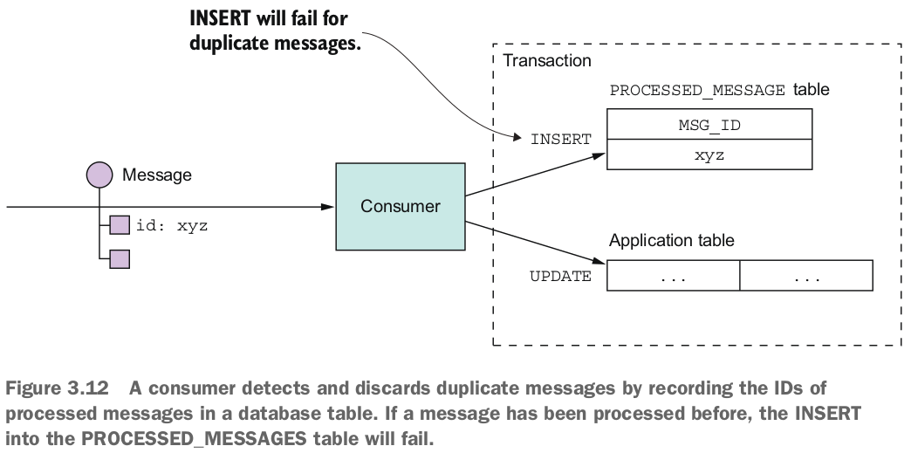

Khi một Consumer xử lý một message, nó ghi nhận id của message trong bảng cơ sở dữ liệu như là một phần của transaction tạo và cập nhật thực thể business. Trong ví dụ này, Consumer chèn một hàng chứa id của message vào bảng PROCESSED_MESSAGES. Nếu một message là một bản sao, INSERT sẽ thất bại và Consumer có thể loại bỏ message.

Một lựa chọn khác là để một bộ xử lý message ghi lại id của message trong một bảng ứng dụng thay vì một bảng dành riêng. Phương pháp này đặc biệt hữu ích khi sử dụng một cơ sở dữ liệu NoSQL có một mô hình transaction hạn chế, do đó nó không hỗ trợ việc cập nhật hai bảng như là một phần của transaction cơ sở dữ liệu. Chương 7 trình bày một ví dụ về phương pháp này.

### 3.3.7 Transactional Messaging

Một service thường cần phải publish message như là một phần của transaction cập nhật cơ sở dữ liệu. Ví dụ, trong suốt cuốn sách này, bạn thấy các ví dụ về các service publish các event domain khi chúng tạo hoặc cập nhật entities business. Cả việc cập nhật cơ sở dữ liệu và việc gửi message phải xảy ra trong một transaction. Nếu không, một service có thể cập nhật cơ sở dữ liệu và sau đó gặp sự cố, ví dụ, trước khi gửi message. Nếu service không thực hiện hai hoạt động này một cách nguyên tử, một sự cố có thể để lại hệ thống ở trạng thái không nhất quán.

Giải pháp truyền thống là sử dụng một transaction phân tán mà bao gồm cả cơ sở dữ liệu và message broker. Nhưng như bạn sẽ học được trong chương 4, các transaction phân tán không phải là lựa chọn tốt cho các ứng dụng hiện đại. Hơn nữa, nhiều broker hiện đại như Apache Kafka không hỗ trợ transaction phân tán.

Kết quả là, một ứng dụng phải sử dụng một cơ chế khác để publish message một cách đáng tin cậy. Hãy xem cách hoạt động của nó.


#### Using a database table as a message queue
Hãy tưởng tượng rằng ứng dụng của bạn đang sử dụng một cơ sở dữ liệu quan hệ. Một cách trực tiếp để publish message một cách đáng tin cậy là áp dụng mẫu Transactional outbox. Mẫu này sử dụng một bảng cơ sở dữ liệu như là một hàng đợi message tạm thời. Như hình 3.13 hiển thị, một service gửi message có một bảng cơ sở dữ liệu OUTBOX. Như một phần của transaction cơ sở dữ liệu mà tạo ra, cập nhật và xóa các đối tượng business, service gửi message bằng cách chèn chúng vào bảng OUTBOX. Tính nguyên tử được đảm bảo vì đây là một transaction ACID cục bộ.
Bảng OUTBOX hoạt động như là một hàng đợi message tạm thời. MessageRelay là một thành phần đọc bảng OUTBOX và publish các message đến một message broker.


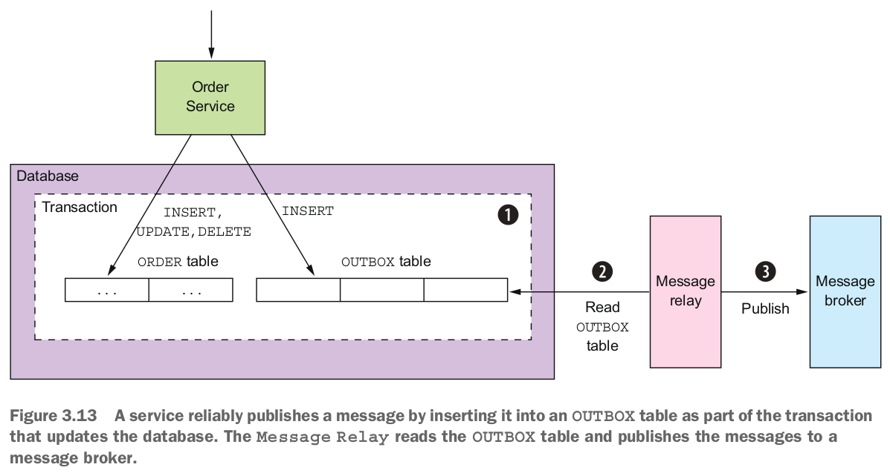


> **Pattern: Transactional outbox**\
Publish an event or message as part of a database transaction by saving it in an OUT-
BOX in the database. See http://microservices.io/patterns/data/transactional-outbox.html.

Bạn có thể sử dụng một phương pháp tương tự với một số cơ sở dữ liệu NoSQL. Mỗi business entities được lưu trữ như một bản ghi trong cơ sở dữ liệu có một thuộc tính là một danh sách các message cần được publish. Khi một service cập nhật một thực thể trong cơ sở dữ liệu, nó thêm một message vào danh sách đó. Điều này là nguyên tử vì nó được thực hiện với một hoạt động cơ sở dữ liệu duy nhất. Thách thức ở đây là tìm cách tìm kiếm hiệu quả các business entities đó có event và publish chúng.

Có một vài cách khác nhau để chuyển các message từ cơ sở dữ liệu đến message broker. Chúng ta sẽ xem xét mỗi cách.
#### Publishing events by using the polling publisher pattern
Nếu ứng dụng sử dụng một cơ sở dữ liệu quan hệ, một cách đơn giản để publish các message được chèn vào bảng OUTBOX là cho MessageRelay truy vấn bảng để lấy các message chưa được publish. Nó định kỳ truy vấn bảng như sau:
```sql
SELECT * FROM OUTBOX ORDERED BY ... ASC
```


Tiếp theo, MessageRelay publish các message đó đến message broker, gửi một message đến kênh message đích của nó. Cuối cùng, nó xóa các message đó khỏi bảng OUTBOX:

```sql
BEGIN
DELETE FROM OUTBOX WHERE ID in (....)
COMMIT
```
Truy vấn cơ sở dữ liệu là một phương pháp đơn giản hoạt động khá tốt ở quy mô thấp. Hạn chế là việc thường xuyên truy vấn cơ sở dữ liệu có thể tốn kém. Hơn nữa, việc sử dụng phương pháp này với một cơ sở dữ liệu NoSQL phụ thuộc vào khả năng truy vấn của nó. Điều này là vì thay vì truy vấn một bảng OUTBOX, ứng dụng phải truy vấn các business entities, và điều đó có thể hoặc không thể thực hiện một cách hiệu quả. Vì những hạn chế và giới hạn này, thường tốt hơn - và trong một số trường hợp, cần thiết - là sử dụng phương pháp phức tạp và hiệu suất hơn của theo dõi nhật ký transaction cơ sở dữ liệu.

> **Pattern: Polling publisher**\
Publish messages by polling the outbox in the database. See http://microservices.io/patterns/data/polling-publisher.html.

#### Publishing events by applying the transaction log tailing pattern

Một giải pháp phức tạp là cho MessageRelay theo dõi nhật ký transaction của cơ sở dữ liệu (cũng được gọi là nhật ký commit). Mỗi cập nhật được thực hiện bởi ứng dụng và được xác nhận sẽ được biểu diễn dưới dạng một mục trong nhật ký transaction của cơ sở dữ liệu. Một transaction log miner có thể đọc nhật ký transaction và publish mỗi thay đổi dưới dạng một message đến message broker. Hình 3.14 thể hiện cách tiếp cận này hoạt động.

Transaction log miner đọc các mục nhật ký transaction. Nó chuyển đổi mỗi mục nhật ký liên quan tới một message được chèn thành một message và publish message đó đến message broker. Phương pháp này có thể được sử dụng để publish các message được viết vào một bảng OUTBOX trong một hệ quản trị cơ sở dữ liệu quan hệ hoặc các message được thêm vào bản ghi trong một cơ sở dữ liệu NoSQL.

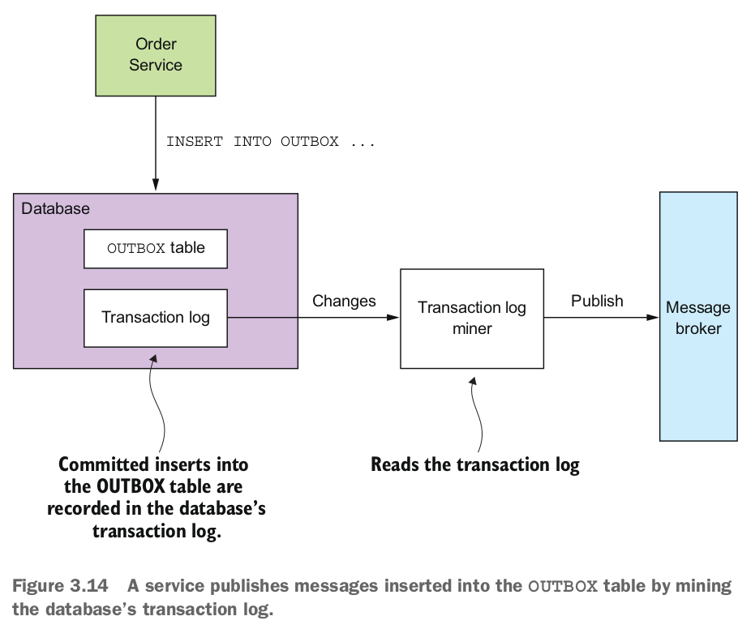

> **Pattern: Transaction log tailing**\
Publish changes made to the database by tailing the transaction log. See http://microservices.io/patterns/data/transaction-log-tailing.html.


Dưới đây là một số ví dụ về cách tiếp cận này được sử dụng:

- Debezium (http://debezium.io) - Một dự án mã nguồn mở publish các thay đổi cơ sở dữ liệu đến message broker Apache Kafka.
- LinkedIn Databus (https://github.com/linkedin/databus) - Một dự án mã nguồn mở khai thác nhật ký transaction Oracle và publish các thay đổi dưới dạng event. LinkedIn sử dụng Databus để đồng bộ các kho dữ liệu tạo ra từ hệ thống gốc.
- DynamoDB streams (http://docs.aws.amazon.com/amazondynamodb/latest/developerguide/Streams.html) - DynamoDB streams chứa chuỗi thay đổi theo thứ tự thời gian (tạo, cập nhật và xóa) được thực hiện cho các mục trong một bảng DynamoDB trong 24 giờ qua. Một ứng dụng có thể đọc các thay đổi đó từ luồng và, ví dụ, publish chúng dưới dạng event.
- Eventuate Tram (https://github.com/eventuate-tram/eventuate-tram-core) - Một thư viện mã nguồn mở về transaction message mà tác giả của bạn tự xây dựng, sử dụng giao thức nhật ký MySQL, Postgres WAL hoặc polling để đọc các thay đổi được thực hiện đối với một bảng OUTBOX và publish chúng đến Apache Kafka.

Mặc dù cách tiếp cận này có vẻ khá bất hợp lý, nhưng nó hoạt động khá tốt. Thách thức là triển khai nó request một số công sức phát triển. Bạn có thể, ví dụ, viết mã cấp thấp gọi các API cụ thể cho cơ sở dữ liệu. Hoặc bạn có thể sử dụng một framework mã nguồn mở như Debezium để publish các thay đổi được thực hiện bởi ứng dụng đến MySQL, Postgres hoặc MongoDB tới Apache Kafka. Nhược điểm của việc sử dụng Debezium là nó tập trung vào việc chụp các thay đổi ở cấp độ cơ sở dữ liệu và các API cho việc gửi và nhận message không nằm trong phạm vi của nó. Đó là lý do tại sao tác giả đã tạo ra framework Eventuate Tram, cung cấp các API message cũng như việc theo dõi transaction và polling.

### 3.3.8 Libraries and frameworks for messaging
Một service cần sử dụng một thư viện để gửi và nhận các message. Một cách tiếp cận là sử dụng thư viện client của message broker, mặc dù có một số vấn đề với việc sử dụng trực tiếp một thư viện như vậy:

- Thư viện client kết nối logic business gửi message tới API của message broker.
- Thư viện client của message broker thường là cấp thấp và request nhiều dòng mã để gửi hoặc nhận một message. Như một nhà phát triển, bạn không muốn lặp đi lặp lại việc viết mã boilerplate. Ngoài ra, như tác giả của cuốn sách này, tôi không muốn các mã ví dụ bị rối bời bởi mã boilerplate cấp thấp.
- Thư viện client thường chỉ cung cấp cơ chế cơ bản để gửi và nhận message và không hỗ trợ các kiểu tương tác cấp cao hơn.

Một cách tiếp cận tốt hơn là sử dụng một thư viện hoặc framework cấp cao hơn ẩn đi các chi tiết cấp thấp và hỗ trợ trực tiếp các kiểu tương tác cấp cao hơn. Đối với sự đơn giản, các ví dụ trong cuốn sách này sử dụng framework Eventuate Tram của tôi. Nó có một API đơn giản, dễ hiểu ẩn đi sự phức tạp của việc sử dụng message broker. Ngoài API để gửi và nhận message, Eventuate Tram cũng hỗ trợ các kiểu tương tác cấp cao hơn như request/response bất đồng bộ và publish event domain.


> **What!? Why the Eventuate frameworks?** \
The code samples in this book use the open source Eventuate frameworks I’ve developed for transactional messaging, event sourcing, and sagas. I chose to use my frameworks because, unlike with, say, dependency injection and the Spring framework, there are no widely adopted frameworks for many of the features the microservice architecture requires. Without the Eventuate Tram framework, many examples would have to use the low-level messaging APIs directly, making them much more complicated and obscuring important concepts. Or they would use a framework that isn’t widely adopted, which would also provoke criticism.\
Instead, the examples use the Eventuate Tram frameworks, which have a simple, easy-to-understand API that hides the implementation details. You can use these frameworks in your applications. Alternatively, you can study the Eventuate Tram frameworks and reimplement the concepts yourself.

Eventuate Tram cũng thực hiện hai cơ chế quan trọng:

- Transactional messaging - Nó publish các message như một phần của transaction cơ sở dữ liệu.
- Duplicate messages detection - consumer message của Eventuate Tram phát hiện và loại bỏ các message trùng lặp, điều này rất quan trọng để đảm bảo rằng một consumer xử lý message một cách chính xác một lần, như đã thảo luận trong phần 3.3.6.

Hãy xem xét các API của Eventuate Tram.

#### Basic messaging
Các API cơ bản cho messaging bao gồm hai giao diện Java: MessageProducer và MessageConsumer. Một service sản xuất sử dụng giao diện MessageProducer để publish các message tới các kênh message. Dưới đây là một ví dụ về việc sử dụng giao diện này:

```java
MessageProducer messageProducer = ...;
String channel = ...;
String payload = ...;
messageProducer.send(destination, MessageBuilder.withPayload(payload).build())
```

Một service tiêu thụ sử dụng giao diện MessageConsumer để đăng ký nhận các message:

```java
MessageConsumer messageConsumer;
messageConsumer.subscribe(subscriberId, Collections.singleton(destination),
message -> { ... })
```

MessageProducer và MessageConsumer là nền tảng của các API cấp cao hơn cho request/response bất đồng bộ và publish event domain.

Hãy nói về cách publish và đăng ký nhận event.


#### Domain event publishing

Eventuate Tram cung cấp các API cho việc publish và tiêu thụ các domain event. Chương 5 giải thích rằng các domain event là các event được phát ra bởi một aggregate (business object) khi nó được tạo, cập nhật hoặc xóa. Một service publish một domain event bằng cách sử dụng giao diện DomainEventPublisher. Dưới đây là một ví dụ:

```java
DomainEventPublisher domainEventPublisher;
String accountId = ...;
DomainEvent domainEvent = new AccountDebited(...);
domainEventPublisher.publish("Account", accountId, Collections.singletonList(
domainEvent));
```

Một service tiêu thụ các domain event bằng cách sử dụng DomainEventDispatcher. Dưới đây là một ví dụ:

```java
DomainEventHandlers domainEventHandlers = DomainEventHandlersBuilder
.forAggregateType("Order")
.onEvent(AccountDebited.class, domainEvent -> { ... })
.build();
new DomainEventDispatcher("eventDispatcherId",
domainEventHandlers,
messageConsumer);
```

Các event không phải là mẫu giao tiếp cấp cao duy nhất được hỗ trợ bởi Eventuate Tram. Nó cũng hỗ trợ giao tiếp dựa trên command/reply.


#### Command/Reply-based messaging
Một client có thể gửi một message lệnh đến một service bằng cách sử dụng giao diện CommandProducer. Ví dụ:

```java
CommandProducer commandProducer = ...;
Map<String, String> extraMessageHeaders = Collections.emptyMap();
String commandId = commandProducer.send("CustomerCommandChannel",
new DoSomethingCommand(),
"ReplyToChannel",
extraMessageHeaders);
```

Một service tiêu thụ các message lệnh bằng cách sử dụng lớp CommandDispatcher. CommandDispatcher sử dụng giao diện MessageConsumer để đăng ký các event được chỉ định. Nó gửi mỗi message lệnh đến phương thức xử lý tương ứng. Dưới đây là một ví dụ:

```java
CommandHandlers commandHandlers = CommandHandlersBuilder
.fromChannel(commandChannel)
.onMessage(DoSomethingCommand.class, (command) -
> { ... ; return withSuccess(); })
.build();
CommandDispatcher dispatcher = new CommandDispatcher("subscribeId",
commandHandlers, messageConsumer, messageProducer);
```

Trong suốt cuốn sách này, bạn sẽ thấy các ví dụ mã sử dụng các API này để gửi và nhận message.

Như bạn đã thấy, framework Eventuate Tram thực hiện giao tiếp có giao dịch cho các ứng dụng Java. Nó cung cấp một API cấp thấp để gửi và nhận message theo cách có giao dịch. Nó cũng cung cấp các API cấp cao hơn cho việc publish và tiêu thụ các event miền và cho việc gửi và xử lý các lệnh.

Bây giờ hãy xem một phương pháp thiết kế service sử dụng giao tiếp không đồng bộ để cải thiện tính sẵn có.

## 3.4  Using asynchronous messaging to improve avaibility

Như bạn đã thấy, các cơ chế IPC khác nhau có các ưu và nhược điểm khác nhau. Một ưu và nhược điểm cụ thể là cách lựa chọn cơ chế IPC của bạn ảnh hưởng đến tính sẵn có. Trong phần này, bạn sẽ tìm hiểu rằng giao tiếp đồng bộ với các Service khác như một phần của xử lý request giảm tính sẵn có của ứng dụng. Do đó, bạn nên thiết kế các Service của mình để sử dụng giao tiếp không đồng bộ mỗi khi có thể.

Hãy trước hết xem xét vấn đề với giao tiếp đồng bộ và cách nó ảnh hưởng đến tính sẵn có.


### 3.4.1 Synchronous communication reduces avaibility
REST là một cơ chế IPC vô cùng phổ biến. Bạn có thể cảm thấy cám dỗ sử dụng nó cho giao tiếp giữa các Service. Tuy nhiên, vấn đề của REST là nó là một giao thức đồng bộ: một HTTP client phải đợi cho đến khi Service gửi phản hồi. Mỗi khi các Service giao tiếp bằng một giao thức đồng bộ, tính sẵn sàng của ứng dụng sẽ giảm đi.

Để hiểu vì sao, hãy xem xét kịch bản được hiển thị trong hình 3.15. Service Order có một REST API để tạo một Order. Nó gọi Service Consumer và Service Restaurant để xác thực Order. Cả hai Service đó cũng có REST API.


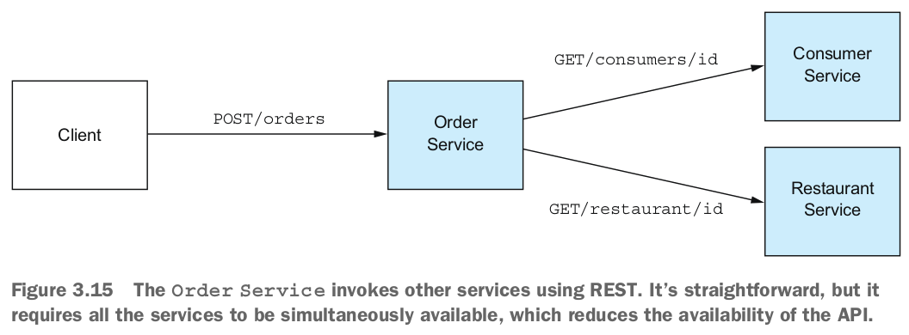

Các bước để tạo một Order như sau:
1. Client gửi một request HTTP `POST /orders` đến Order Service.
2. Order Service lấy thông tin Client bằng cách gửi một request `HTTP GET /consumers/id` đến Consumer Service.
3. Order Service lấy thông tin nhà hàng bằng cách gửi một request `HTTP GET /restaurant/id` đến Restaurant Service.
4. Order Service xác thực request bằng cách sử dụng thông tin về Client và nhà hàng.
5. Order Service tạo một Order.
6. Order Service gửi một phản hồi HTTP cho Client.

Bởi vì các service này sử dụng HTTP, chúng phải đồng thời có sẵn để ứng dụng FTGO có thể xử lý request Tạo Order. Ứng dụng FTGO không thể tạo Order nếu bất kỳ một trong ba service này bị tắt. Toán học cho thấy sự sẵn có của một hoạt động hệ thống là tích của sự sẵn có của các service được gọi bởi hoạt động đó. Nếu Order Service và hai service mà nó gọi có sẵn 99.5%, tổng sẵn có là 99.5%^3 = 98.5%, mức độ này thấp hơn đáng kể. Mỗi service bổ sung tham gia vào việc xử lý một request sẽ làm giảm sự sẵn có.

Vấn đề này không chỉ đặc thù cho giao tiếp dựa trên REST. Sự sẵn có sẽ giảm đi mỗi khi một service chỉ có thể phản hồi cho Client của mình sau khi nhận được phản hồi từ một service khác. Vấn đề này tồn tại ngay cả khi các service giao tiếp bằng cách sử dụng giao tiếp theo phong cách request/response qua giao tiếp bất đồng bộ. Ví dụ, sự sẵn có của Order Service sẽ bị giảm nếu nó gửi một message đến Consumer Service thông qua một trung gian message và sau đó đợi phản hồi.

Nếu bạn muốn tối đa hóa sự sẵn có, bạn phải giảm thiểu lượng giao tiếp đồng bộ. Hãy xem cách làm điều đó.

### 3.4.2 Eliminating synchronous interaction
Có một vài cách khác nhau để giảm lượng giao tiếp đồng bộ với các service khác trong quá trình xử lý các request đồng bộ. Một giải pháp là tránh vấn đề hoàn toàn bằng cách định nghĩa các service chỉ có các API bất đồng bộ. Tuy nhiên, điều này không phải lúc nào cũng có thể thực hiện được. Ví dụ, các API công cộng thường sử dụng giao thức RESTful. Do đó, các service đôi khi được request có các API đồng bộ.

May mắn thay, có cách để xử lý các request đồng bộ mà không cần tạo ra các request đồng bộ. Hãy nói về các lựa chọn.

#### Use asynchronous interaction styles
Lý tưởng nhất, tất cả các tương tác nên được thực hiện bằng các kiểu tương tác bất đồng bộ đã được mô tả trước đó trong chương này. Ví dụ, giả sử một Client của ứng dụng FTGO sử dụng một kiểu tương tác bất đồng bộ để tạo order. Một Client tạo order bằng cách gửi một message request đến service order. service này sau đó trao đổi message bất đồng bộ với các service khác và cuối cùng gửi một message trả lời cho Client. Hình 3.16 mô tả kiến trúc.

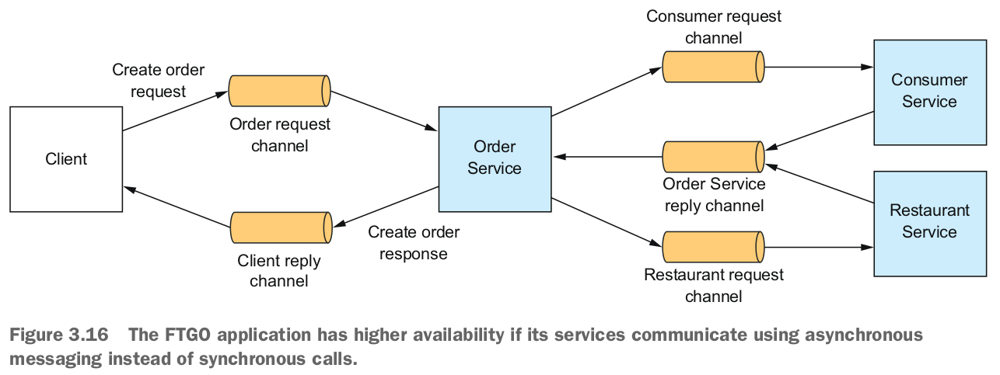


Client và các service giao tiếp bất đồng bộ bằng cách gửi message qua các kênh giao tiếp message. Không có bất kỳ bên tham gia nào trong tương tác này bị chặn đợi một phản hồi.

Một kiến trúc như vậy sẽ rất mạnh mẽ, vì bộ nhớ đệm message của trình điều phối message giữ message cho đến khi chúng có thể được tiêu thụ. Tuy nhiên, vấn đề là các service thường có một API bên ngoài sử dụng giao thức đồng bộ như REST, do đó phải trả lời request ngay lập tức.

Nếu một service có một API đồng bộ, một cách để cải thiện tính sẵn có là sao chép dữ liệu. Hãy xem cách làm đó hoạt động.


#### Replicate data
Một cách để giảm thiểu các request đồng bộ trong quá trình xử lý request là sao chép dữ liệu. Một service duy trì một bản sao của dữ liệu mà nó cần khi xử lý request. Nó duy trì bản sao cập nhật bằng cách đăng ký theo dõi các sự kiện được publish bởi các service sở hữu dữ liệu. Ví dụ, Order Service có thể duy trì một bản sao của dữ liệu thuộc sở hữu của Consumer Service và Restaurant Service. Điều này sẽ cho phép Order Service xử lý request để tạo order mà không cần tương tác với những service đó. Hình 3.17 mô tả thiết kế.

Consumer Service và Restaurant Service publish các sự kiện mỗi khi dữ liệu của họ thay đổi. Order Service đăng ký theo dõi các sự kiện đó và cập nhật bản sao của mình.

Trong một số tình huống, sao chép dữ liệu là một cách tiếp cận hữu ích. Ví dụ, chương 5 mô tả cách Order Service sao chép dữ liệu từ Restaurant Service để có thể xác nhận và định giá các món trong menu. Một nhược điểm của sao chép là đôi khi nó có thể request sao chép một lượng lớn dữ liệu, điều này không hiệu quả. Ví dụ, có thể không thực tế cho Order Service duy trì một bản sao của dữ liệu thuộc sở hữu của Consumer Service, do số lượng người tiêu dùng lớn. Một nhược điểm khác của sao chép là nó không giải quyết được vấn đề làm thế nào một service cập nhật dữ liệu thuộc sở hữu của các service khác.

Một cách để giải quyết vấn đề đó là cho một service trì hoãn tương tác với các service khác cho đến sau khi nó phản hồi cho client của mình. Chúng ta sẽ tiếp tục xem cách làm đó hoạt động.

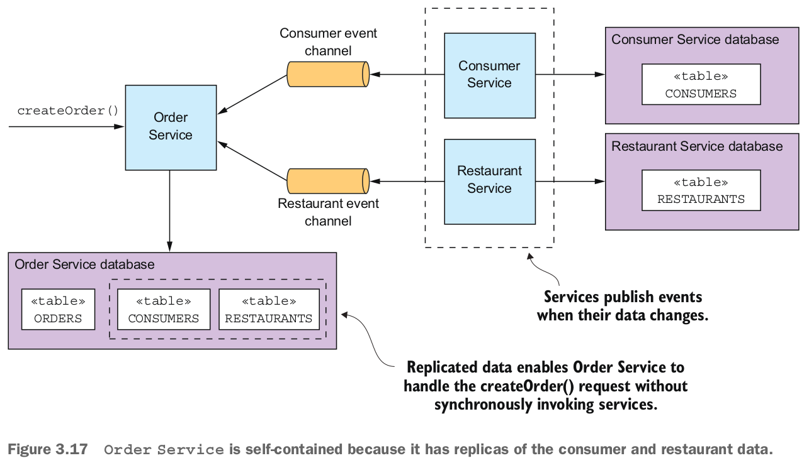

#### Finish processing after returning a response
Một cách khác để loại bỏ giao tiếp đồng bộ trong quá trình xử lý request là để một service xử lý request như sau:
1. Xác thực request chỉ sử dụng dữ liệu có sẵn cục bộ.
2. Cập nhật cơ sở dữ liệu của nó, bao gồm việc chèn các message vào bảng OUTBOX.
3. Trả lại phản hồi cho client của nó.

Trong quá trình xử lý request, service không tương tác đồng bộ với bất kỳ service nào khác. Thay vào đó, nó gửi các message một cách không đồng bộ đến các service khác. Phương pháp này đảm bảo rằng các service được kết nối lỏng lẻo. Như bạn sẽ tìm hiểu trong chương tiếp theo, điều này thường được thực hiện bằng cách sử dụng một cuộc phiêu lưu.

Ví dụ, nếu Order Service sử dụng phương pháp này, nó tạo một order ở trạng thái PENDING và sau đó xác thực order bất đồng bộ bằng cách trao đổi message với các service khác. Hình 3.18 mô tả điều gì xảy ra khi hoạt động `createOrder()` được gọi. Các sự kiện diễn ra như sau:
1. Order Service tạo một order ở trạng thái PENDING.
2. Order Service trả lại một phản hồi cho client của nó chứa ID của order.
3. Order Service gửi một message ValidateConsumerInfo đến Consumer Service.

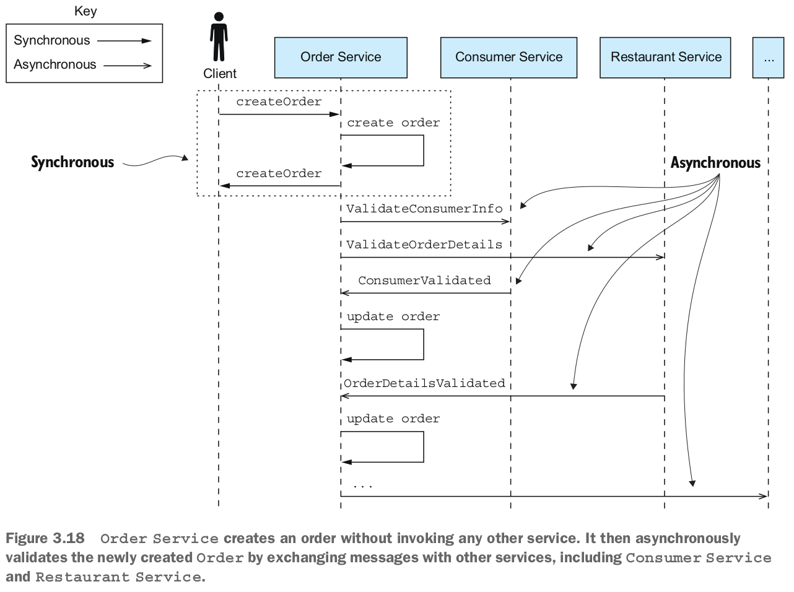

4. Order Service gửi một message ValidateOrderDetails đến Restaurant Service.
5. Consumer Service nhận một message ValidateConsumerInfo, xác nhận người tiêu dùng có thể đặt order và gửi một message ConsumerValidated cho Order Service.
6. Restaurant Service nhận một message ValidateOrderDetails, xác nhận các mặt hàng trong menu là hợp lệ và nhà hàng có thể giao hàng đến địa chỉ giao hàng của order, và gửi một message OrderDetailsValidated cho Order Service.
7. Order Service nhận ConsumerValidated và OrderDetailsValidated và thay đổi trạng thái của order thành VALIDATED.
...


Order Service có thể nhận các message ConsumerValidated và OrderDetailsValidated ở bất kỳ thứ tự nào. Nó theo dõi xem message nào nhận trước bằng cách thay đổi trạng thái của order. Nếu nó nhận được ConsumerValidated trước, nó sẽ thay đổi trạng thái của order thành CONSUMER_VALIDATED, trong khi nếu nó nhận được message OrderDetailsValidated trước, nó sẽ thay đổi trạng thái thành ORDER_DETAILS_VALIDATED. Order Service thay đổi trạng thái của order thành VALIDATED khi nó nhận được message khác.

Sau khi order đã được xác nhận, Order Service hoàn thành phần còn lại của quá trình tạo order, được thảo luận trong chương tiếp theo. Điều tốt đẹp của phương pháp này là ngay cả khi Consumer Service không hoạt động, ví dụ, Order Service vẫn tạo order và phản hồi cho client của nó. Cuối cùng, Consumer Service sẽ trở lại và xử lý các message trong hàng đợi, và các order sẽ được xác nhận.

Một nhược điểm của việc một service phản hồi trước khi hoàn thành việc xử lý một request là làm cho client phức tạp hơn. Ví dụ, Order Service đưa ra các cam kết tối thiểu về trạng thái của một order mới được tạo khi nó trả về một phản hồi. Nó tạo order và trả lại ngay lập tức trước khi xác nhận order và ủy quyền cho thẻ tín dụng của người tiêu dùng. Do đó, để biết liệu order đã được tạo thành công, hoặc là client phải thực hiện việc kiểm tra định kỳ hoặc Order Service phải gửi cho nó một message thông báo. Dù có vẻ phức tạp, trong nhiều tình huống, đây là cách tiếp cận được ưa thích—đặc biệt là vì nó cũng giải quyết các vấn đề quản lý giao dịch phân tán mà tôi sẽ thảo luận trong chương tiếp theo. Trong các chương 4 và 5, ví dụ, tôi mô tả cách Order Service sử dụng phương pháp này.