# Chapter 4 : Managing transactions with sagas
---------------

Khi Mary bắt đầu nghiên cứu về kiến trúc microservice, một trong những lo ngại lớn nhất của cô là làm thế nào để triển khai các transaction bao gồm nhiều service. transaction là một thành phần quan trọng của mọi ứng dụng doanh nghiệp. Nếu thiếu transaction, việc duy trì tính nhất quán dữ liệu sẽ không thể thực hiện được.

Các transaction ACID (Atomicity, Consistency, Isolation, Durability) giúp đơn giản hóa công việc của các nhà phát triển bằng cách cung cấp ấn tượng rằng mỗi transaction có quyền truy cập độc quyền vào dữ liệu. Trong một kiến trúc microservice, các transaction trong cùng một service vẫn có thể sử dụng các transaction ACID. Tuy nhiên, thách thức nằm ở việc triển khai transaction cho các hoạt động cập nhật dữ liệu thuộc sở hữu của nhiều service.

Ví dụ, như đã mô tả trong chương 2, hoạt động ``createOrder()`` bao gồm nhiều service, bao gồm Order Service, Kitchen Service và Accounting Service. Các hoạt động như thế này cần một cơ chế quản lý transaction hoạt động trên các service.

Mary phát hiện rằng, như đã đề cập trong chương 2, cách tiếp cận truyền thống trong việc quản lý transaction phân tán không phải là một lựa chọn tốt cho các ứng dụng hiện đại. Thay vì sử dụng các transaction ACID, một hoạt động bao gồm nhiều service phải sử dụng những gì được gọi là một saga, một chuỗi transaction cục bộ được kích hoạt bằng message, để duy trì tính nhất quán dữ liệu. Một thách thức với các saga là chúng chỉ đảm bảo tính ACD (Atomicity, Consistency, Durability). Chúng thiếu tính cô lập của transaction ACID truyền thống. Do đó, một ứng dụng phải sử dụng những gì được biết đến là biện pháp phòng ngừa, các kỹ thuật thiết kế ngăn chặn hoặc giảm thiểu tác động của các biến thể đồng thời gây ra bởi thiếu tính cô lập.

Theo nhiều cách, trở ngại lớn nhất mà Mary và các nhà phát triển FTGO sẽ phải đối mặt khi áp dụng các service microservice là chuyển từ một cơ sở dữ liệu đơn lẻ với các transaction ACID sang một kiến trúc đa cơ sở dữ liệu với các saga ACD. Họ đã quen với tính đơn giản của mô hình transaction ACID. Nhưng trong thực tế, ngay cả các ứng dụng monolithic như ứng dụng FTGO cũng thường không sử dụng các transaction ACID theo sách giáo trình. Ví dụ, nhiều ứng dụng sử dụng một mức độ cô lập transaction thấp hơn để cải thiện hiệu suất. Ngoài ra, nhiều business process quan trọng, như chuyển tiền giữa các tài khoản tại các ngân hàng khác nhau, thường là nhất quán cuối cùng. Ngay cả Starbucks cũng không sử dụng hai pha cam kết (www.enterpriseintegrationpatterns.com/ramblings/18_starbucks.html).

Tôi bắt đầu chương này bằng cách xem xét các thách thức của quản lý transaction trong kiến trúc microservice và giải thích tại sao cách tiếp cận truyền thống trong việc quản lý transaction phân tán không phải là một lựa chọn. Tiếp theo, tôi giải thích cách duy trì tính nhất quán dữ liệu bằng cách sử dụng saga. Sau đó, tôi xem xét hai cách khác nhau để phối hợp saga: nhảy múa, nơi các bên participant trao đổi event mà không có một điểm kiểm soát tập trung, và dàn dẫn, nơi một bộ điều khiển tập trung chỉ đạo các bên participant saga thực hiện hoạt động gì. Tôi thảo luận về cách sử dụng các biện pháp phòng ngừa để ngăn chặn hoặc giảm thiểu tác động của các biến thể đồng thời gây ra bởi sự thiếu cô lập giữa các saga. Cuối cùng, tôi mô tả việc triển khai một saga ví dụ. Bắt đầu bằng cách xem xét thách thức của việc quản lý transaction trong một kiến trúc microservice.
## 4.1 Transaction management in a microservice architecture

Gần như mọi yêu cầu được xử lý bởi một ứng dụng doanh nghiệp đều được thực thi trong một transaction cơ sở dữ liệu. Các nhà phát triển ứng dụng doanh nghiệp sử dụng các framework và thư viện giúp đơn giản hóa quản lý transaction. Một số framework và thư viện cung cấp một API lập trình để bắt đầu, hoàn thành và quay lại các transaction một cách rõ ràng. Các framework khác, như framework Spring, cung cấp một cơ chế khai báo. Spring cung cấp một chú thích `@Transactional` sắp xếp các lời gọi phương thức để tự động thực thi trong một transaction. Kết quả là, việc viết logic business có transaction là một việc đơn giản.

Tuy nhiên, để chính xác hơn, quản lý transaction là một công việc đơn giản trong một ứng dụng monolithic truy cập vào một cơ sở dữ liệu duy nhất. Quản lý transaction trở nên khó khăn hơn trong một ứng dụng monolithic phức tạp sử dụng nhiều cơ sở dữ liệu và message broker. Và trong một kiến trúc microservice, các transaction bao gồm nhiều service, mỗi service có cơ sở dữ liệu riêng. Trong tình huống này, ứng dụng phải sử dụng một cơ chế phức tạp hơn để quản lý transaction. Như bạn sẽ tìm hiểu, cách tiếp cận truyền thống sử dụng các transaction phân tán không phải là một lựa chọn khả thi cho các ứng dụng hiện đại. Thay vào đó, một ứng dụng dựa trên kiến trúc microservices phải sử dụng sagas.

Trước khi tôi giải thích về sagas, hãy xem xét tại sao quản lý transaction là một thách thức trong kiến trúc microservices.

### 4.1.1 The need for distributed transactions in a microservice architecture

Hãy tưởng tượng bạn là nhà phát triển FTGO chịu trách nhiệm triển khai hoạt động hệ thống `createOrder()`. Như đã mô tả trong chương 2, hoạt động này phải xác minh rằng người tiêu dùng có thể đặt hàng, xác minh chi tiết Order, ủy quyền thẻ tín dụng của người tiêu dùng, và tạo một Order trong cơ sở dữ liệu. Việc triển khai hoạt động này trong ứng dụng FTGO monolithic là tương đối đơn giản. Tất cả dữ liệu cần thiết để xác minh Order đều có sẵn. Hơn nữa, bạn có thể sử dụng một transaction ACID để đảm bảo tính nhất quán của dữ liệu. Bạn có thể sử dụng chú thích `@Transactional` của Spring trên phương thức service `createOrder()`.

Ngược lại, việc triển khai cùng hoạt động trong một kiến trúc microservices phức tạp hơn nhiều. Như hình ảnh 4.1 cho thấy, dữ liệu cần thiết được phân tán trong nhiều service. Hoạt động `createOrder()` truy cập dữ liệu trong nhiều service. Nó đọc dữ liệu từ Consumer Service và cập nhật dữ liệu trong Order Serivce, Kitchen Service, và Accounting Service.

Do mỗi service có cơ sở dữ liệu riêng của mình, bạn cần sử dụng một cơ chế để duy trì tính nhất quán dữ liệu trên các cơ sở dữ liệu đó.

### 4.1.2  The trouble with distributed transactions 

Phương pháp truyền thống để duy trì tính nhất quán dữ liệu trên nhiều service, cơ sở dữ liệu hoặc các môi trường truyền tin là sử dụng transaction phân tán. Tiêu chuẩn de facto cho việc quản lý transaction phân tán là Mô hình X/Open Distributed Transaction Processing (DTP) (X/Open XA — xem https://en.wikipedia.org/wiki/X/Open_XA). XA sử dụng hai pha commit (2PC) để đảm bảo rằng tất cả các bên participant vào một transaction sẽ hoàn thành hoặc hồi phục. Một bộ công nghệ tuân thủ XA bao gồm cơ sở dữ liệu và các môi trường truyền tin tuân thủ XA, các trình điều khiển cơ sở dữ liệu và API truyền tin, và một cơ chế giao tiếp giữa các tiến trình mà truyền đi ID transaction global XA. Hầu hết các cơ sở dữ liệu SQL tuân thủ XA, cũng như một số môi trường truyền tin. Ứng dụng Java EE, ví dụ, có thể sử dụng JTA để thực hiện các transaction phân tán.

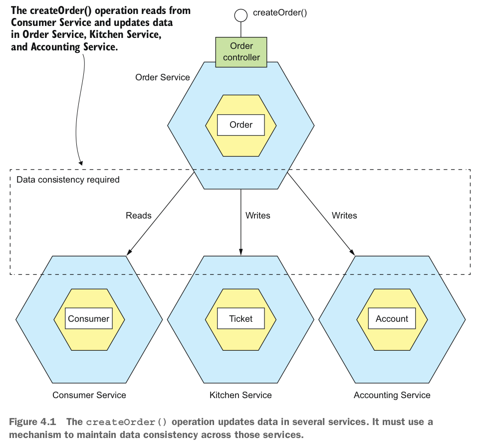

Dù có vẻ đơn giản nhưng transaction phân tán có nhiều vấn đề phức tạp. Một vấn đề là nhiều công nghệ hiện đại, bao gồm cơ sở dữ liệu NoSQL như MongoDB và Cassandra, không hỗ trợ chúng. Ngoài ra, transaction phân tán không được hỗ trợ bởi các môi trường truyền tin hiện đại như RabbitMQ và Apache Kafka. Do đó, nếu bạn kiên quyết sử dụng transaction phân tán, bạn không thể sử dụng nhiều công nghệ hiện đại.

Một vấn đề khác với transaction phân tán là chúng là một dạng của IPC đồng bộ, làm giảm tính sẵn có. Để một transaction phân tán hoàn thành, tất cả các service participant phải sẵn có. Như đã mô tả trong chương 3, tính sẵn có là tích của sự sẵn có của tất cả các bên participant trong transaction. Nếu một transaction phân tán liên quan đến hai service có sẵn ở mức 99,5%, thì tổng sẵn có sẽ là 99%, mức độ này là ít hơn đáng kể. Mỗi service bổ sung participant vào một transaction phân tán sẽ làm giảm sẵn có thêm nữa. Thậm chí còn có định lý CAP của Eric Brewer, khẳng định rằng một hệ thống chỉ có thể có hai trong ba thuộc tính sau: tính nhất quán, tính sẵn có và khả năng chịu phân mảnh (https://en.wikipedia.org/wiki/CAP_theorem). Ngày nay, các kiến trúc sư thích có một hệ thống sẵn có hơn là một hệ thống nhất quán.

Ở mặt bề ngoài, transaction phân tán rất hấp dẫn. Từ góc độ của một nhà phát triển, chúng có cùng một mô hình lập trình như các transaction cục bộ. Nhưng vì các vấn đề đã đề cập cho đến nay, transaction phân tán không phải là một công nghệ thích hợp cho các ứng dụng hiện đại. Chương 3 đã mô tả cách gửi message như một phần của transaction cơ sở dữ liệu mà không sử dụng transaction phân tán. Để giải quyết vấn đề phức tạp hơn của việc duy trì tính nhất quán dữ liệu trong một kiến trúc microservices, một ứng dụng phải sử dụng một cơ chế khác dựa trên khái niệm của service lỏng lẻo, bất đồng bộ. Đó là nơi mà saga xuất hiện.


### 4.1.3 Using the Saga pattern to maintain data consistency

Sagas là cơ chế để duy trì tính nhất quán dữ liệu trong một kiến trúc microservice mà không cần sử dụng transaction phân tán. Bạn định nghĩa một saga cho mỗi lệnh hệ thống cần cập nhật dữ liệu trong nhiều service. Một saga là một chuỗi các transaction cục bộ. Mỗi transaction cục bộ cập nhật dữ liệu trong một service duy nhất bằng cách sử dụng các framework và thư viện transaction ACID quen thuộc đã được đề cập trước đó.

> **Pattern: Saga** \
Maintain data consistency across services using a sequence of local transactions that are coordinated using asynchronous messaging. See http://microservices.io/patterns/data/saga.html.


Hoạt động hệ thống khởi tạo bước đầu tiên của saga. Việc hoàn thành một transaction cục bộ kích hoạt việc thực thi của transaction cục bộ tiếp theo. Sau này, trong phần 4.2, bạn sẽ thấy cách phối hợp các bước được thực hiện bằng cách sử dụng truyền tin bất đồng bộ. Một lợi ích quan trọng của truyền tin bất đồng bộ là nó đảm bảo rằng tất cả các bước của một saga đều được thực thi, ngay cả khi một hoặc nhiều bên participant của saga tạm thời không có sẵn.

Sagas khác biệt so với các transaction ACID ở một số cách quan trọng. Như tôi mô tả chi tiết trong phần 4.3, chúng thiếu tính chất cô lập của các transaction ACID. Ngoài ra, do mỗi transaction cục bộ xác nhận các thay đổi của nó, một saga phải được quay trở lại bằng các compensating transaction. Tôi sẽ nói thêm về các compensating transaction sau trong phần này. Hãy xem một ví dụ về saga.


#### An example saga: The create order saga
Ví dụ về saga được sử dụng trong toàn bộ chương này là Saga Create Order, được hiển thị trong hình 4.2. Order Service  thực hiện hoạt động `creatOrder()` bằng cách sử dụng saga này. Transaction cục bộ đầu tiên của saga được khởi tạo bởi yêu cầu ngoại vi để tạo một Order. Các Transaction cục bộ khác năm đều được kích hoạt bởi việc hoàn thành của Transaction trước đó.

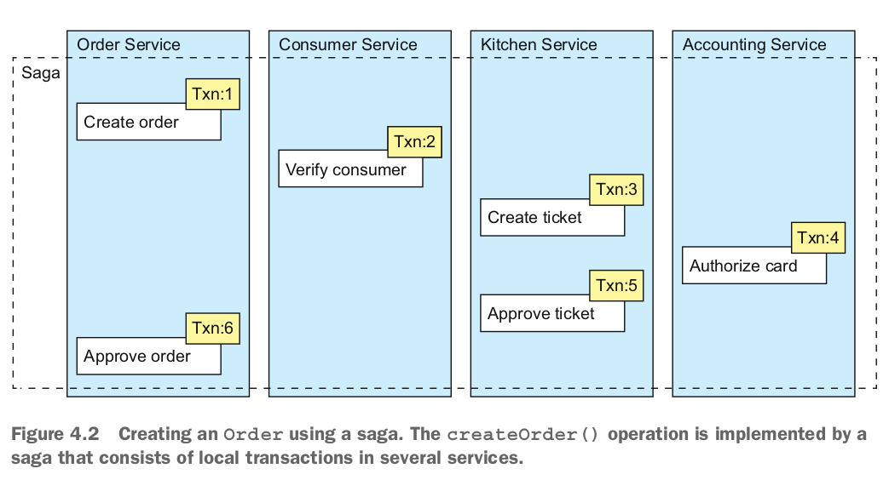


Saga này bao gồm các Transaction cục bộ sau:
1. Order Service:  Tạo một Order trong trạng thái APPROVAL_PENDING.
2. Consumer Service : Xác minh rằng người tiêu dùng có thể đặt Order.
3. Kitchen Service : Xác minh chi tiết Order và tạo một Ticket trong trạng thái CREATE_PENDING.
4. Accounting Service : Xác minh thẻ tín dụng của người tiêu dùng.
5. Kitchen Service : Thay đổi trạng thái của Ticket thành AWAITING_ACCEPTANCE.
6. Order Service: Thay đổi trạng thái của Order thành APPROVED.

Sau này, ở phần 4.2, tôi mô tả cách các service participant vào một saga giao tiếp bằng cách sử dụng truyền tin bất đồng bộ. Một service publish một message khi một Transaction cục bộ hoàn tất. message này sau đó kích hoạt bước tiếp theo trong saga. Không chỉ việc sử dụng message đảm bảo rằng các bên participant vào saga được lỏng lẻo kết nối, nó cũng đảm bảo rằng một saga hoàn thành. Điều này là vì nếu người nhận của một message tạm thời không có sẵn, trung gian message sẽ lưu trữ message cho đến khi nó có thể được gửi đi.

Trên bề mặt, saga có vẻ đơn giản, nhưng có một số thách thức khi sử dụng chúng. Một thách thức là sự thiếu cô lập giữa các saga. Phần 4.3 mô tả cách xử lý vấn đề này. Một thách thức khác là quay lại các thay đổi khi xảy ra lỗi. Hãy xem cách làm điều đó.


#### Sagas use compensating transactions to roll backs change

Một tính năng tuyệt vời của các transaction ACID truyền thống là logic business có thể dễ dàng quay lại một transaction nếu phát hiện vi phạm một quy tắc business. Nó thực thi một câu lệnh ROLLBACK, và cơ sở dữ liệu hủy bỏ tất cả các thay đổi đã thực hiện cho đến nay. Thật không may, saga không thể tự động quay lại, vì mỗi bước cam kết các thay đổi của mình vào cơ sở dữ liệu cục bộ. Điều này có nghĩa, ví dụ, rằng nếu việc ủy quyền thẻ tín dụng thất bại trong bước thứ tư của Saga Create Order, ứng dụng FTGO phải rõ ràng hoàn tác các thay đổi đã được thực hiện trong ba bước đầu tiên. Bạn phải viết những gì được biết là các compensating transaction.

Giả sử rằng transaction $(n + 1)^{th}$ của một saga thất bại. Các tác động của các transaction trước đó n phải được hoàn tác. Theo quan điểm lý thuyết, mỗi bước đó, $T_i$, có một compensating transaction tương ứng, $C_i$, thực hiện việc hoàn tác các hiệu ứng của $T_i$. Để hoàn tác các hiệu ứng của những bước đầu tiên đó, saga phải thực hiện mỗi $C_i$ theo thứ tự ngược lại. Trình tự các bước là $T_1 \ldots T_n$, $C_n \ldots C_1$, như được hiển thị trong hình 4.3. Trong ví dụ này, $T_{n+1}$ thất bại, điều này đòi hỏi các bước $T_1 \ldots T_n$ phải được hoàn tác.

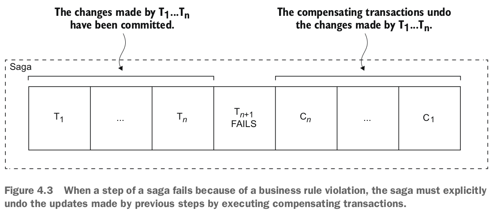

Các compensating transaction của saga được thực hiện theo thứ tự ngược lại của các transaction chạy xuôi: $C_n \ldots C_1$. Cơ chế xếp hàng của các $C_i$ không khác gì việc xếp hàng của các $T_i$. Việc hoàn thành của $C_i$ phải kích hoạt việc thực thi của $C_{i-1}$.

Hãy xem xét, ví dụ, Saga Create Order. Saga này có thể thất bại vì nhiều lý do khác nhau:
- Thông tin của người tiêu dùng không hợp lệ hoặc người tiêu dùng không được phép Create Order.
- Thông tin của nhà hàng không hợp lệ hoặc nhà hàng không thể chấp nhận Order.
- Việc ủy quyền thẻ tín dụng của người tiêu dùng thất bại.

Nếu một transaction cục bộ thất bại, cơ chế điều phối của saga phải thực hiện các compensating transaction từ chối Order và có thể cả Ticket. Bảng 4.1 hiển thị các compensating transaction cho mỗi bước của Saga Create Order. Điều quan trọng cần lưu ý là không phải tất cả các bước cần các compensating transaction. Các bước chỉ đọc, chẳng hạn như **verifyConsumerDetails()**, không cần các compensating transaction. Cũng không cần các bước như `authorizeCreditCard()` mà sau đó là các bước luôn thành công.

Phần 4.3 thảo luận về cách ba bước đầu tiên của Saga Create Order được gọi là các transaction có thể bù trừ vì chúng được theo sau bởi các bước có thể thất bại, cách bước thứ tư được gọi là pivot transaction của saga vì nó được theo sau bởi các bước không bao giờ thất bại, và cách hai bước cuối được gọi là các transaction có thể thử lại vì chúng luôn thành công.

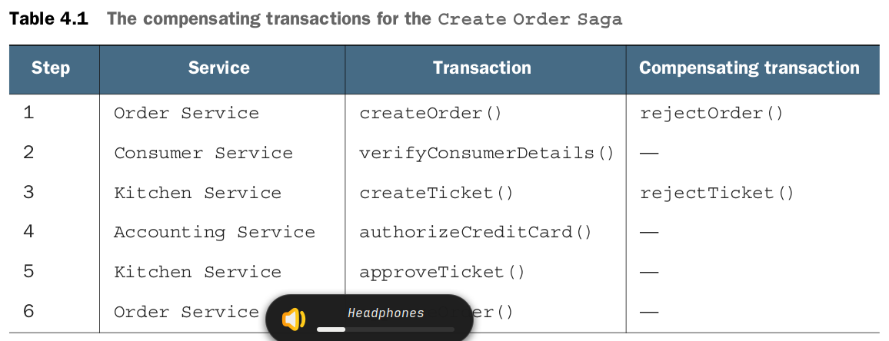

Để hiểu cách sử dụng các compensating transaction, hãy tưởng tượng một tình huống nơi việc ủy quyền thẻ tín dụng của người tiêu dùng thất bại. Trong tình huống này, saga thực thi các transaction cục bộ sau:
1. Order Service : Tạo một Order ở trạng thái APPROVAL_PENDING.
2. Consumer Service : Xác minh rằng người tiêu dùng có thể đặt Order.
3. Kitchen Service : Xác nhận thông tin Order và tạo một Ticket ở trạng thái CREATE_PENDING.
4. Accounting Service : Ủy quyền thẻ tín dụng của người tiêu dùng, thất bại.
5. Kitchen Service : Thay đổi trạng thái của Ticket thành CREATE_REJECTED.
6. Order Service : Thay đổi trạng thái của Order thành REJECTED.

Hai bước thứ năm và thứ sáu là các compensating transaction để hoàn tác các cập nhật của Kitchen Service và Order Service, tương ứng. Logic điều phối của saga chịu trách nhiệm xếp hàng thực thi của các transaction chạy xuôi và các compensating transaction. Hãy xem cách hoạt động của nó.

## 4.2 Coordinating sagas
Hiện thực của một saga bao gồm logic điều phối các bước của saga. Khi một saga được khởi tạo bởi lệnh hệ thống, logic điều phối phải chọn và thông báo cho bên participant saga đầu tiên thực thi một transaction cục bộ. Khi transaction đó hoàn tất, logic điều phối của saga chọn và kích hoạt bên participant saga kế tiếp. Quá trình này tiếp tục cho đến khi saga đã thực thi tất cả các bước. Nếu bất kỳ transaction cục bộ nào thất bại, saga phải thực thi các transaction bù trừ theo thứ tự ngược lại. Có một số cách khác nhau để cấu trúc logic điều phối của saga:

- Coreography: Phân phối quyết định và sắp xếp giữa các bên participant saga. Chúng chủ yếu giao tiếp bằng cách trao đổi các event.

- Orchestration: Tập trung logic điều phối của một saga trong một lớp điều phối saga. Một điều phối saga gửi các message lệnh đến các bên participant saga, yêu cầu chúng thực hiện các hoạt động nào.

Hãy xem xét từng tùy chọn, bắt đầu với coreography.

### 4.2.1 Choreography-based sagas
Hình 4.4 cho thấy thiết kế của phiên bản dựa trên coreography của Create Order Saga. Các bên participant giao tiếp bằng cách trao đổi các event. Mỗi bên participant, bắt đầu với Order Service, cập nhật cơ sở dữ liệu của mình và publish một event kích hoạt bên participant tiếp theo.

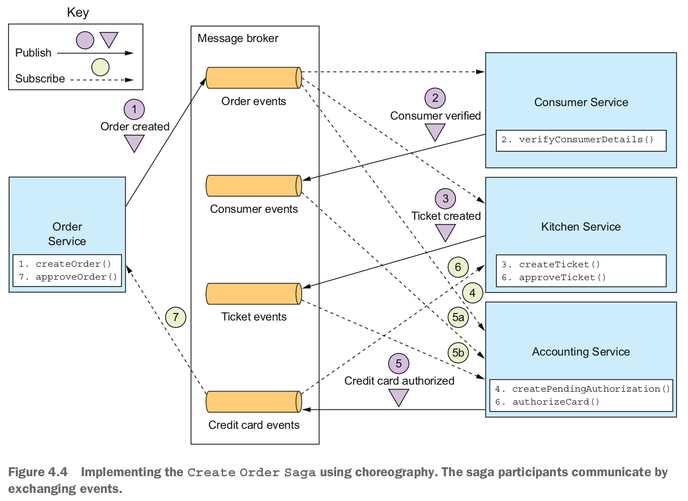

Các bước thông qua saga này theo kịch bản hoạt động bình thường là như sau:
1. Order Service tạo một Order ở trạng thái APPROVAL_PENDING và publish một event OrderCreated.
2. Service Consumer consumes event OrderCreated, xác minh rằng người tiêu dùng có thể đặt Order và publish một event ConsumerVerified.
3. Service Kitchen consumes event OrderCreated, xác minh Order, tạo một Ticket ở trạng thái CREATE_PENDING và publish một event TicketCreated.
4. Service Accounting consumes event OrderCreated và tạo một CreditCardAuthorization ở trạng thái PENDING.
5. Service Accounting consumes event TicketCreated và ConsumerVerified, thu tiền từ thẻ tín dụng của người tiêu dùng và publish một event CreditCardAuthorized.
6. Service Kitchen consumes event CreditCardAuthorized và thay đổi trạng thái của Ticket thành AWAITING_ACCEPTANCE.
7. Order Service nhận event CreditCardAuthorized, thay đổi trạng thái của Order thành APPROVED và publish một event OrderApproved.

#### Implementing the Create Order saga using choreography

The Create Order Saga cũng phải xử lý trường hợp mà một phần tử của saga từ chối Order và publish một loại event thất bại nào đó. Ví dụ, việc xác minh thẻ tín dụng của người tiêu dùng có thể thất bại. Saga phải thực hiện các transaction bù đắp để hoàn tác những gì đã được thực hiện. Hình ảnh 4.5 hiển thị dòng event khi AccountingService không thể xác minh thẻ tín dụng của người tiêu dùng.

Dãy event diễn ra như sau:
1. Service Order tạo một Order ở trạng thái APPROVAL_PENDING và publish một event OrderCreated.
2. Service Consumer consumes event OrderCreated, xác minh rằng người tiêu dùng có thể đặt Order và publish một event ConsumerVerified.
3. Service Kitchen consumes event OrderCreated, xác minh Order, tạo một Ticket ở trạng thái CREATE_PENDING và publish một event TicketCreated.
4. Service Accounting consumes event OrderCreated và tạo một Credit-CardAuthorization ở trạng thái PENDING.
5. Service Accounting consumes event TicketCreated và ConsumerVerified, thu tiền từ thẻ tín dụng của người tiêu dùng và publish một event Credit Card Authorization Failed.
6. Service Kitchen consumes event Credit Card Authorization Failed và thay đổi trạng thái của Ticket thành REJECTED.
7. Service Order consumes event Credit Card Authorization Failed và thay đổi trạng thái của Order thành REJECTED.

Như bạn có thể thấy, các phần tử của các saga dựa trên choreography tương tác bằng cách publish/đăng ký. Hãy xem xét một số vấn đề bạn cần xem xét khi triển khai giao tiếp dựa trên publish/đăng ký cho các saga của mình.


#### Reliable event-based communcation

Có một vài vấn đề liên quan đến giao tiếp giữa các service mà bạn cần phải xem xét khi triển khai các saga dựa trên choreography. Vấn đề đầu tiên là đảm bảo rằng một phần tử của saga cập nhật cơ sở dữ liệu của mình và publish một event như một phần của transaction cơ sở dữ liệu. Mỗi bước của một saga dựa trên choreography cập nhật cơ sở dữ liệu và publish một event. Ví dụ, trong Saga Create Order, service Kitchen nhận một event Consumer Verified, tạo một Ticket và publish một event Ticket Created. Quan trọng là việc cập nhật cơ sở dữ liệu và việc publish event xảy ra một cách nguyên tử. Do đó, để giao tiếp một cách đáng tin cậy, các phần tử của saga phải sử dụng giao tiếp có transaction, được mô tả trong chương 3.

Vấn đề thứ hai bạn cần xem xét là đảm bảo rằng một phần tử của saga phải có khả năng ánh xạ mỗi event mà nó nhận được với dữ liệu của mình. Ví dụ, khi service Order nhận được một event Credit Card Authorized, nó phải có khả năng tìm kiếm Order tương ứng. Giải pháp là để một phần tử của saga publish các event chứa một correlation ID, đó là dữ liệu cho phép các phần tử khác thực hiện ánh xạ.

Ví dụ, các phần tử của Saga Tạo Order có thể sử dụng orderId như một correlation ID được chuyển từ một phần tử sang phần tử tiếp theo. service Accounting publish một event Credit Card Authorized chứa orderId từ event Ticket Created. Khi service Order nhận được một event Credit Card Authorized, nó sử dụng orderId để lấy Order tương ứng. Tương tự, service Kitchen sử dụng orderId từ event đó để lấy Ticket tương ứng.
#### Benefits and drawbacks of choreography-based sagas

Các saga dựa trên choreography có một số lợi ích:
- Simplicity: Các service publish event khi chúng tạo, cập nhật hoặc xóa các đối tượng business.
- Loose coupling: Các phần tử đăng ký theo dõi event và không có kiến thức trực tiếp về nhau.

Và có một số điểm hạn chế:
- More difficult to understand: Khác với orchestration, không có một nơi duy nhất trong mã nguồn xác định saga. Thay vào đó, choreography phân phối triển khai của saga giữa các service. Do đó, đôi khi khó cho một nhà phát triển hiểu cách một saga cụ thể hoạt động.
- Cycle dependencies between services: Các phần tử của saga đăng ký theo dõi event của nhau, điều này thường tạo ra sự phụ thuộc lặp lại. Ví dụ, nếu bạn xem xét cẩn thận hình 4.4, bạn sẽ thấy rằng có sự phụ thuộc lặp lại, như Order Service -> Accounting Service -> Order Service. Mặc dù điều này không nhất thiết là một vấn đề, nhưng sự phụ thuộc lặp lại được coi là một dấu hiệu thiết kế không tốt.
- Risk of tight coupling: Mỗi phần tử của saga cần đăng ký theo dõi tất cả các event ảnh hưởng đến chúng. Ví dụ, service Accounting phải đăng ký theo dõi tất cả các event gây ra việc thẻ tín dụng của người tiêu dùng bị tính phí hoặc hoàn tiền. Kết quả là, có nguy cơ rằng nó sẽ cần được cập nhật đồng bộ với vòng đời Order được triển khai bởi service Order.

Choreography có thể hoạt động tốt cho các saga đơn giản, nhưng do những điểm hạn chế này, thường tốt hơn là sử dụng orchestration cho các saga phức tạp hơn. Hãy xem cách orchestration hoạt động.

### 4.2.2 Orchestration-based sagas
Orchestration là một cách khác để triển khai saga. Khi sử dụng orchestration, bạn định nghĩa một lớp orchestrator có trách nhiệm duy nhất là thông báo cho các phần tử của saga biết phải làm gì. Orchestrator của saga giao tiếp với các phần tử bằng cách sử dụng tương tác kiểu command/reply bất đồng bộ. Để thực hiện một bước của saga, nó gửi một message lệnh đến một phần tử và cho biết phải thực hiện hoạt động gì. Sau khi phần tử của saga đã thực hiện hoạt động, nó gửi một message phản hồi đến orchestrator. Sau đó, orchestrator xử lý message và xác định bước tiếp theo của saga.

Để mô tả cách hoạt động của saga dựa trên orchestration, tôi sẽ trước tiên mô tả một ví dụ. Sau đó, tôi sẽ mô tả cách mô hình hóa các saga dựa trên orchestration dưới dạng state machine. Tôi sẽ thảo luận về cách sử dụng messaging có transaction để đảm bảo giao tiếp đáng tin cậy giữa orchestrator của saga và các phần tử của saga. Sau đó, tôi sẽ mô tả các lợi ích và hạn chế của việc sử dụng saga dựa trên orchestration.
#### Implemeting the Create Order saga using Orchestration

Hình 4.6 cho thấy thiết kế của phiên bản dựa trên orchestration của Create Order Saga. Saga được điều phối bởi lớp CreateOrderSaga, lớp này gọi các phần tử của saga bằng cách sử dụng request/response bất đồng bộ. Lớp này theo dõi quá trình và gửi các message lệnh đến các phần tử của saga, chẳng hạn như Kitchen Service và Consumer Service. Lớp CreateOrderSaga đọc các message phản hồi từ channel phản hồi của nó và sau đó xác định bước tiếp theo, nếu có, trong saga.

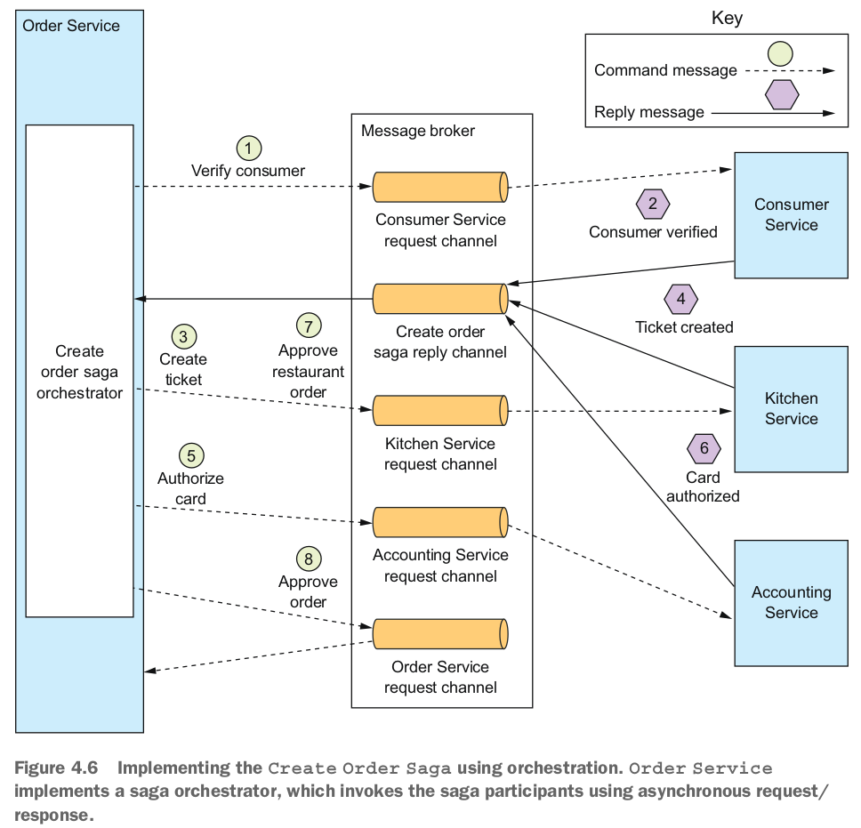


Order Service đầu tiên tạo một Order và một Orchestrator của Create Order Saga. Sau đó, quy trình cho lối đi hạnh phúc là như sau:
1. Orchestrator của saga gửi một lệnh Verify Consumer đến Consumer Service.
2. Consumer Service trả lời bằng một message Consumer Verified.
3. Orchestrator của saga gửi một lệnh Create Ticket đến Kitchen Service.
4. Kitchen Service trả lời bằng một message Ticket Created.
5. Orchestrator của saga gửi một message Authorize Card đến Accounting Service.
6. Accounting Service trả lời bằng một message Card Authorized.
7. Orchestrator của saga gửi một lệnh Approve Ticket đến Kitchen Service.
8. Orchestrator của saga gửi một lệnh Approve Order đến Order Service.

Lưu ý rằng trong bước cuối cùng, Orchestrator của saga gửi một message lệnh đến Order Service, ngay cả khi nó là một thành phần của Order Service. Về nguyên tắc, Create Order Saga có thể phê duyệt Order bằng cách cập nhật trực tiếp. Nhưng để đồng nhất, saga xử lý Order Service như một phần tử khác.

Các biểu đồ như hình 4.6 mô tả một kịch bản cho một saga, nhưng một saga có thể có nhiều kịch bản. Ví dụ, Create Order Saga có bốn kịch bản. Ngoài lối đi hạnh phúc, saga có thể thất bại do một lỗi ở Consumer Service, Kitchen Service hoặc Accounting Service. Do đó, việc mô hình một saga như một state machine là hữu ích, vì nó mô tả tất cả các kịch bản có thể có.

#### Modeling saga orchestration as state machines
Một cách tốt để mô hình một orchestrator của saga là dưới dạng một state machine. Một state machine bao gồm một tập hợp các trạng thái và một tập hợp các chuyển tiếp giữa các trạng thái được kích hoạt bởi các sự kiện. Mỗi chuyển tiếp có thể có một hành động, trong trường hợp của một saga là việc triệu gọi một participant của saga. Các chuyển tiếp giữa các trạng thái được kích hoạt bởi việc hoàn thành một transaction cục bộ được thực hiện bởi một participant của saga. Trạng thái hiện tại và kết quả cụ thể của transaction cục bộ xác định chuyển tiếp trạng thái và hành động, nếu có. Cũng có các chiến lược kiểm thử hiệu quả cho state machine. Do đó, việc sử dụng một mô hình state machine làm cho việc thiết kế, triển khai và kiểm thử các saga dễ dàng hơn.

Hình 4.7 mô tả mô hình state machine cho Create Order Saga. State machine này bao gồm nhiều trạng thái, bao gồm các trạng thái sau:
- Verifying Consumer: Trạng thái ban đầu. Khi ở trong trạng thái này, saga đang chờ Consumer Service xác minh rằng người tiêu dùng có thể đặt Order.
- Creating Ticket: Saga đang chờ một phản hồi cho lệnh Tạo Ticket.
- Authorizing Card: Đang chờ Accounting Service phê duyệt thẻ tín dụng của người tiêu dùng.
- Order Approved: Một trạng thái cuối cùng chỉ ra rằng saga đã hoàn thành thành công.
- Order Rejected: Một trạng thái cuối cùng chỉ ra rằng Đơn đặt hàng đã bị từ chối bởi một trong số các participant.

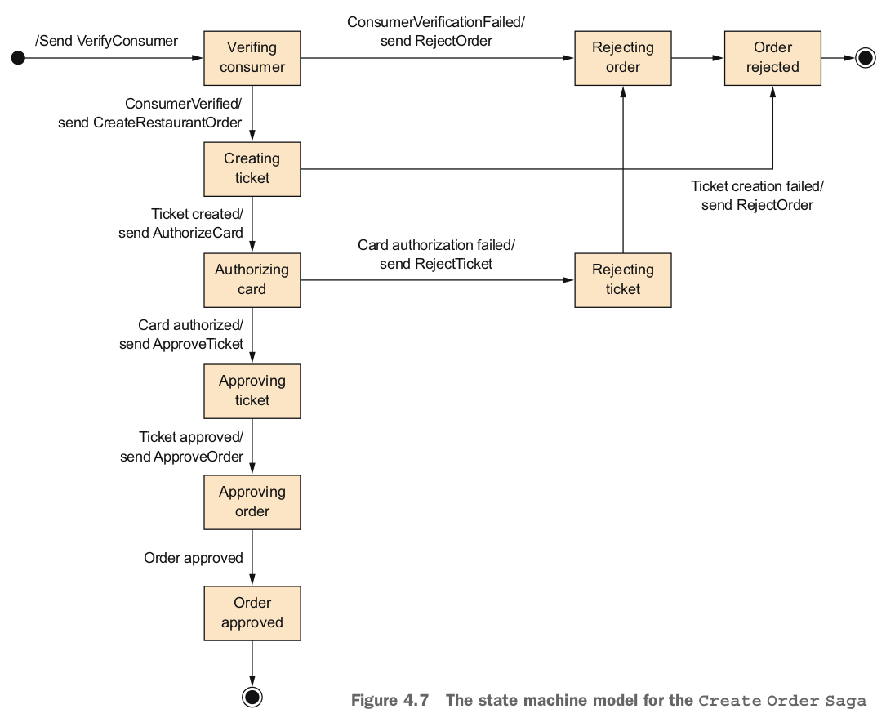

State machine cũng xác định nhiều chuyển tiếp trạng thái. Ví dụ, State machine chuyển từ trạng thái Creating Ticket sang trạng thái Authorizing Card hoặc trạng thái Rejected Order. Nó chuyển sang trạng thái Authorizing Card khi nhận được một phản hồi thành công cho lệnh Create Ticket. Nếu Kitchen Service không thể tạo Ticket, State machine chuyển sang trạng thái Rejected Order.

Hành động ban đầu của State machine là gửi lệnh VerifyConsumer đến Consumer Service. Phản hồi từ Consumer Service kích hoạt chuyển tiếp trạng thái tiếp theo. Nếu người tiêu dùng được xác minh thành công, saga tạo Ticket và chuyển sang trạng thái Creating Ticket. Nhưng nếu việc xác minh người tiêu dùng thất bại, saga từ chối Order và chuyển sang trạng thái Rejecting Order. State machine trải qua nhiều chuyển tiếp trạng thái khác nhau, được thúc đẩy bởi các phản hồi từ các participant của saga, cho đến khi nó đạt được một trạng thái cuối cùng là Order Approved hoặc Order Rejected.

#### Saga orchestration and transactional messaging

Mỗi bước của một saga dựa trên orchestration bao gồm một service cập nhật cơ sở dữ liệu và publish một message. Ví dụ, Order Service lưu trữ một Order và một orchestrator Create Order Saga và gửi một message đến participant saga đầu tiên. Một participant của saga, như Kitchen Service, xử lý một message lệnh bằng cách cập nhật cơ sở dữ liệu của nó và gửi một message phản hồi. Order Service xử lý message phản hồi của participant bằng cách cập nhật trạng thái của orchestrator saga và gửi một message lệnh đến participant saga tiếp theo. Như đã mô tả trong chương 3, một service phải sử dụng giao tiếp có transaction để cập nhật cơ sở dữ liệu và publish các message một cách nguyên tử. Sau này ở phần 4.4, tôi sẽ mô tả cách triển khai của orchestrator Create Order Saga một cách chi tiết hơn, bao gồm cách nó sử dụng giao tiếp có transaction.

Hãy xem xét các lợi ích và nhược điểm của việc sử dụng orchestration saga.

#### Benefits anf drawbacks of orchestration-based sagas

Sagas dựa trên orchestration có một số lợi ích:

- Simpler dependencies: Một lợi ích của orchestration là nó không giới thiệu phụ thuộc vòng. orchestrator saga gọi các participant saga, nhưng các participant không gọi lại orchestrator. Do đó, orchestrator phụ thuộc vào các participant nhưng không phải ngược lại, vì vậy không có phụ thuộc vòng.
  
- Less coupling: Mỗi service thực hiện một API được gọi bởi orchestrator, vì vậy nó không cần biết về các sự kiện được xuất bản bởi các participant saga.
  
- Improves separation of concerns and simplifies the business logic : Logic điều phối saga được tập trung trong orchestrator saga. Các đối tượng domain làm cho việc quản lý đơn giản hơn và không có kiến thức về các saga mà chúng thanm gia. Ví dụ, khi sử dụng orchestration, lớp Order không biết về bất kỳ saga nào, vì vậy nó có một mô hình state machine đơn giản hơn. Trong quá trình thực thi của Create Order Saga, nó chuyển trực tiếp từ trạng thái APPROVAL_PENDING sang trạng thái APPROVED. Lớp Order không có bất kỳ trạng thái trung gian nào tương ứng với các bước của saga. Kết quả là, việc business trở nên đơn giản hơn.

Tuy nhiên, orchestration cũng có một điểm nhược: rủi ro tập trung quá nhiều business logic trong orchestrator. Điều này dẫn đến một thiết kế trong đó orchestrator thông minh chỉ đạo các service ngu ngốc thực hiện các hoạt động nào. May mắn thay, bạn có thể tránh vấn đề này bằng cách thiết kế orchestrator chỉ chịu trách nhiệm về trình tự và không chứa bất kỳ business logic nào khác.

Tôi khuyến nghị sử dụng orchestration cho tất cả các saga trừ những saga đơn giản nhất. Việc triển khai logic điều phối cho các saga của bạn chỉ là một trong những vấn đề thiết kế mà bạn cần phải giải quyết. Vấn đề khác, có thể là thách thức lớn nhất bạn sẽ phải đối mặt khi sử dụng saga, là xử lý vấn đề thiếu cô lập. Hãy cùng xem xét vấn đề đó và cách giải quyết nó.

## 4.3 Handling the lack of isolation 
Hành động "I" trong ACID đại diện cho tính cô lập. Tính chất cô lập của các transaction ACID đảm bảo rằng kết quả của việc thực thi nhiều transaction cùng lúc sẽ giống như chúng được thực thi theo một thứ tự tuần tự nào đó. Cơ sở dữ liệu cung cấp ấn tượng rằng mỗi transaction ACID có quyền truy cập độc quyền vào dữ liệu. Tính cô lập giúp việc viết logic business thực thi đồng thời trở nên dễ dàng hơn nhiều.

Thách thức khi sử dụng saga là chúng thiếu tính chất cô lập của các transaction ACID. Điều này bởi vì các cập nhật được thực hiện bởi mỗi transaction cục bộ của một saga ngay lập tức trở nên hiển nhiên cho các saga khác khi transaction đó hoàn tất. Hành vi này có thể gây ra hai vấn đề. Đầu tiên, các saga khác có thể thay đổi dữ liệu được truy cập bởi saga trong khi nó đang thực thi. Và các saga khác có thể đọc dữ liệu của nó trước khi saga hoàn thành các cập nhật của mình, và do đó có thể bị phơi ra dữ liệu không nhất quán. Thực tế, bạn có thể xem xét một saga như là ACD:

- Atomicity: Hệ thống saga đảm bảo rằng tất cả các transaction được thực thi hoặc tất cả các thay đổi đều được hủy.
- Consistency: Sự nguyên vẹn tham chiếu trong một service được xử lý bởi các cơ sở dữ liệu cục bộ. Sự nguyên vẹn tham chiếu qua các service được xử lý bởi các service.
- Durability: Được xử lý bởi các cơ sở dữ liệu cục bộ.

Sự thiếu cô lập này tiềm ẩn nguy cơ gây ra những gì mà tài liệu cơ sở dữ liệu gọi là các anomalies. Một anomalies là khi một transaction đọc hoặc ghi dữ liệu một cách mà nó sẽ không nếu các transaction được thực thi một cách tuần tự. Khi một anomalies xảy ra, kết quả của việc thực thi các saga đồng thời sẽ khác so với nếu chúng được thực thi một cách tuần tự.

Dù ngay từ bề ngoài, sự thiếu cô lập nghe có vẻ không thể làm việc. Nhưng trong thực tế, thường xuyên là các nhà phát triển chấp nhận sự giảm cô lập để đổi lại là hiệu suất cao hơn. Một hệ quả cơ bản dữ liệu quan hệ cho phép bạn chỉ định mức độ cô lập cho mỗi transaction. Mức độ cô lập mặc định thường là một mức độ cô lập yếu hơn so với cô lập đầy đủ, còn được biết đến với tên transaction tuân theo. transaction cơ sở dữ liệu thực tế thường khác so với định nghĩa sách giáo trình của các transaction ACID.

Phần tiếp theo sẽ thảo luận về một tập hợp các chiến lược thiết kế saga xử lý sự thiếu cô lập. Các chiến lược này được gọi là countermeasures. Một số countermeasures thực hiện cô lập ở mức ứng dụng. Các countermeasures khác giảm thiểu rủi ro business của sự thiếu cô lập. Bằng cách sử dụng các countermeasures, bạn có thể viết logic business dựa trên saga mà hoạt động đúng cách. Tôi sẽ bắt đầu phần này bằng cách mô tả các anomalies gây ra bởi sự thiếu cô lập.

Sau đó, tôi sẽ nói về các countermeasures mà hoặc loại bỏ những anomalies đó hoặc giảm thiểu rủi ro business của chúng.

### 4.3.1 Overview of anomalies
Sự thiếu cách ly có thể gây ra ba loại hiện tượng không bình thường sau đây:
- Lost updates: Một saga ghi đè lên những thay đổi mà không đọc được của một saga khác.
- Dirty reads: Một transaction hoặc một saga đọc các cập nhật được thực hiện bởi một saga mà chưa hoàn thành các cập nhật đó.
- Fuzzy/nonrepeatable reads: Hai bước khác nhau của một saga đọc cùng một dữ liệu và có kết quả khác nhau vì một saga khác đã thực hiện các cập nhật.

Tất cả ba hiện tượng không bình thường có thể xảy ra, nhưng hai hiện tượng đầu tiên là phổ biến và thách thức nhất. Hãy xem xét hai loại hiện tượng này, bắt đầu với mất cập nhật.


#### Lost Updates
Một hiện tượng mất cập nhật xảy ra khi một saga ghi đè lên một cập nhật được thực hiện bởi một saga khác. Hãy xem xét ví dụ sau:
- Bước đầu tiên của Create Order Saga tạo một Order.
- Trong khi saga đó đang thực thi, Cancel Order Saga hủy Order đó.
- Bước cuối cùng của Create Order Saga phê duyệt Order đó.

Trong kịch bản này, Create Order Saga bỏ qua cập nhật được thực hiện bởi Cancel Order Saga và ghi đè lên nó. Kết quả là, ứng dụng FTGO sẽ giao một Order mà khách hàng đã hủy. Sau này trong phần này, tôi sẽ chỉ ra cách ngăn chặn mất cập nhật.

#### Dirty Reads

Một dirty reads xảy ra khi một saga đọc dữ liệu đang được cập nhật bởi một saga khác. Hãy xem xét, ví dụ, một phiên bản của ứng dụng cửa hàng FTGO nơi người tiêu dùng có một hạn mức tín dụng. Trong ứng dụng này, một saga Cancel Order bao gồm các transaction sau:
- Consumer Service — Tăng số dư tín dụng có sẵn.
- Order Service — Thay đổi trạng thái của Order thành đã hủy.
- Delivery Service — Hủy giao hàng.

Hãy tưởng tượng một kịch bản nơi thực thi xen kẽ của các Saga Cancel Order và Create Order, và Saga Cancel Order bị lùi lại vì quá muộn để hủy giao hàng. Có thể rằng chuỗi transaction gọi Consumer Service như sau:
1. Saga Cancel Order — Tăng số dư tín dụng có sẵn.
2. Saga Create Order — Giảm số dư tín dụng có sẵn.
3. Saga Cancel Order — Một transaction bù đắp giảm số dư tín dụng có sẵn.

Trong kịch bản này, Saga Create Order thực hiện một dirty reads của số dư tín dụng có sẵn, cho phép người tiêu dùng đặt một Order vượt quá hạn mức tín dụng của họ. Có thể rằng đây là một rủi ro không chấp nhận được đối với doanh nghiệp.

Hãy xem cách ngăn chặn điều này và các loại hiện tượng khác từ ảnh hưởng đến một ứng dụng.

### 4.3.2 Countermeasures for handling the lack of isolation

Mô hình transaction của saga là ACD, và sự thiếu hụt cách ly có thể dẫn đến các hiện tượng gây ra ứng xử không đúng của ứng dụng. Trách nhiệm của nhà phát triển là viết các saga một cách sao cho ngăn chặn các hiện tượng này hoặc giảm thiểu tác động của chúng đối với doanh nghiệp. Điều này có thể nghe có vẻ là một nhiệm vụ đáng sợ, nhưng bạn đã thấy một ví dụ về một chiến lược ngăn chặn các hiện tượng. Việc sử dụng các trạng thái *_PENDING của Order, như APPROVAL_PENDING, là một ví dụ về một chiến lược như vậy. Các saga cập nhật Order, như Saga Create Order, bắt đầu bằng cách đặt trạng thái của một Order thành *_PENDING. Trạng thái *_PENDING thông báo cho các transaction khác rằng Order đang được cập nhật bởi một saga và hành động tương ứng.

Việc sử dụng các trạng thái *_PENDING của Order là một ví dụ về những gì bài báo năm 1998 "Các thuộc tính ACID ngữ nghĩa trong các cơ sở dữ liệu đa cơ sở sử dụng các cuộc gọi thủ tục từ xa và lan truyền cập nhật" của Lars Frank và Torben U. Zahle gọi là semantic lock countermeasure (https://dl.acm.org/citation.cfm?id=284472.284478). Bài báo mô tả cách xử lý sự thiếu hụt cách ly trong các kiến trúc cơ sở dữ liệu đa cơ sở không sử dụng transaction phân tán. Nhiều ý tưởng trong bài báo này hữu ích khi thiết kế các saga. Nó mô tả một tập hợp các countermeasure để xử lý các hiện tượng gây ra bởi sự thiếu hụt cách ly mà ngăn chặn một hoặc nhiều hiện tượng hoặc giảm thiểu tác động của chúng đối với doanh nghiệp. Các countermeasure mô tả bởi bài báo này bao gồm:

- Semantic lock - Một loại khóa ở mức ứng dụng.
- Commutative updates - Thiết kế các thao tác cập nhật có thể thực thi được theo bất kỳ thứ tự nào.
- Pessimistic view - Sắp xếp lại các bước của một saga để giảm thiểu rủi ro business.
- Reread value - Ngăn chặn ghi dirty read bằng cách đọc lại dữ liệu để xác minh rằng nó không thay đổi trước khi ghi đè lên nó.
- Version file - Ghi lại các cập nhật cho một bản ghi để chúng có thể được sắp xếp lại.
- By value - Sử dụng rủi ro business của mỗi yêu cầu để chọn cơ chế concurrency.

Sau đây, trong phần này, tôi sẽ mô tả từng countermeasure này, nhưng trước tiên, tôi muốn giới thiệu một số thuật ngữ để mô tả cấu trúc của một saga mà hữu ích khi thảo luận về các countermeasure.

#### The structure of a saga
Bài báo về các countermeasure được đề cập trong phần trước định nghĩa một mô hình hữu ích cho cấu trúc của một saga. Trong mô hình này, được hiển thị trong hình 4.8, một saga bao gồm ba loại transaction:

- Compensatable transactions - Các transaction có thể được quay trở lại bằng cách sử dụng một Compensating transaction.
- Pivot transaction - Điểm go/no-go trong một saga. Nếu Pivot transaction được thực hiện, saga sẽ chạy đến khi hoàn tất. Một Pivot transaction có thể là một transaction không thể đền bù hoặc có thể là transaction cuối cùng có thể được đền bù hoặc transaction đầu tiên có thể được lặp lại.
- Retriable transaction - Các transaction theo sau Pivot transaction và được đảm bảo thành công.


Trong Saga Create Order, các bước `createOrder()`, `verifyConsumerDetails()`, và `createTicket()` là các transaction có thể được đền bù. Các transaction `createOrder()` và `createTicket()` có các Compensating transaction để hoàn tác các cập nhật của chúng. transaction `verifyConsumerDetails()` chỉ là transaction chỉ đọc, nên không cần một Compensating transaction. transaction `authorizeCreditCard()` là Pivot transaction của saga này. Nếu thẻ tín dụng của khách hàng có thể được xác thực, saga này được đảm bảo sẽ hoàn tất. Các bước `approveTicket()` và `approveOrder()` là các Retriable transaction theo sau Pivot transaction.

Sự phân biệt giữa các transaction có thể được đền bù và các transaction có thể được lặp lại là đặc biệt quan trọng. Như bạn sẽ thấy, mỗi loại transaction đóng một vai trò khác nhau trong các countermeasure. Chương 13 nêu rõ rằng khi di chuyển sang kiến trúc microservices, monolith đôi khi phải tham gia vào các saga và điều này đơn giản hơn đáng kể nếu monolith chỉ cần thực hiện các transaction có thể được lặp lại.

Bây giờ hãy xem từng countermeasure, bắt đầu với biện pháp semantic lock.


#### Countermeasure: Sematic lock

Khi sử dụng countermeasure semantic lock, transaction có thể được đền bù của một saga đặt một Flag trong bất kỳ bản ghi nào mà nó tạo ra hoặc cập nhật. Flag chỉ ra rằng bản ghi đó chưa được cam kết và có thể thay đổi. Flag có thể là một khóa ngăn cản các transaction khác truy cập vào bản ghi hoặc một cảnh báo cho biết các transaction khác nên xem xét bản ghi đó một cách đáng nghi. Nó được xóa bởi một trong hai transaction có thể lặp lại - saga hoàn tất thành công hoặc bởi một transaction đền bù - saga bị quay lại.

Trường Order.state là một ví dụ tuyệt vời về một semantic lock. Các trạng thái *_PENDING, như APPROVAL_PENDING và REVISION_PENDING, triển khai một semantic lock. Chúng cho biết cho các saga khác truy cập vào một Order rằng một saga đang trong quá trình cập nhật Order đó. Ví dụ, bước đầu tiên của Saga Create Order, là một transaction có thể đền bù, tạo một Order trong trạng thái APPROVAL_PENDING. Bước cuối cùng của Saga Create Order, là một transaction có thể lặp lại, thay đổi trường thành APPROVED. Một transaction đền bù thay đổi trường thành REJECTED.

Quản lý khóa chỉ là một nửa của vấn đề. Bạn cũng cần quyết định trường hợp cụ thể làm thế nào một saga nên xử lý một bản ghi đã bị khóa. Xem xét, ví dụ, lệnh hệ thống `cancelOrder()`. Một khách hàng có thể kích hoạt thao tác này để hủy một Order đang ở trạng thái APPROVAL_PENDING.

Có một vài cách khác nhau để xử lý tình huống này. Một lựa chọn là cho lệnh hệ thống `cancelOrder()` thất bại và thông báo cho khách hàng thử lại sau. Lợi ích chính của cách tiếp cận này là nó đơn giản để triển khai. Tuy nhiên, điều nhược điểm là nó làm cho khách hàng phức tạp hơn vì nó phải triển khai logic thử lại.

Một lựa chọn khác là cho `cancelOrder()` chờ đợi cho đến khi khóa được giải phóng. Một lợi ích của việc sử dụng các semantic lock là chúng về cơ bản tái tạo lại sự cô lập do transaction ACID cung cấp. Các saga cập nhật cùng một bản ghi được tuần tự hóa, điều này giảm đáng kể nỗ lực lập trình. Một lợi ích khác là chúng loại bỏ gánh nặng của việc thử lại khỏi khách hàng. Nhược điểm là ứng dụng phải quản lý khóa. Nó cũng phải triển khai một thuật toán phát hiện chết khóa thực hiện một cuộc lùi lại của một saga để phá vỡ một sự chết khóa và thực hiện lại nó.

#### Countermeasure: Commutative updates

Một countermeasure trực tiếp là thiết kế các hoạt động cập nhật để là commutative. Các hoạt động là commutative nếu chúng có thể được thực thi trong bất kỳ thứ tự nào. Các hoạt động `debit()` và `credit()` của một Tài khoản là commutative (nếu bạn bỏ qua kiểm tra trượt tài khoản). countermeasure này hữu ích vì nó loại bỏ sự mất cập nhật.

Xem xét, ví dụ, một tình huống nơi một saga cần phải bị lùi lại sau khi một transaction có thể đền bù đã debited (hoặc credited) một tài khoản. Compensating transaction có thể đơn giản là credit (hoặc debit) tài khoản để hoàn tác cập nhật. Không có khả năng ghi đè các cập nhật được thực hiện bởi các saga khác.

#### Countermeasure: Pessimistic view

Một cách khác để giải quyết sự thiếu isolation là countermeasure Pessimistic view. Nó sắp xếp lại các bước của một saga để giảm thiểu rủi ro business do một dirty read. Xem xét, ví dụ, kịch bản trước đó đã được sử dụng để mô tả bất thường dirty read. Trong kịch bản đó, Create Order Saga đã thực hiện một dirty read của tín dụng có sẵn và tạo một đơn đặt hàng vượt quá giới hạn tín dụng của người tiêu dùng. Để giảm thiểu nguy cơ xảy ra, countermeasure này sẽ sắp xếp lại Cancel Order Saga:

1. Order Service - Thay đổi trạng thái của Order thành đã hủy.
2. Delivery Service - Hủy giao hàng.
3. Customer Service - Tăng số dư tín dụng có sẵn.

Trong phiên bản của saga được sắp xếp lại này, số dư tín dụng có sẵn được tăng trong một transaction có thể lặp lại, loại bỏ khả năng dirty read.

#### Countermeasure: Reread value
Countermeasure việc reread value ngăn chặn việc mất cập nhật. Một saga sử dụng biện pháp này sẽ đọc lại một bản ghi trước khi cập nhật nó, xác minh rằng nó không thay đổi, và sau đó cập nhật bản ghi. Nếu bản ghi đã thay đổi, saga sẽ hủy bỏ và có thể khởi động lại. Biện pháp này là một dạng của mẫu Optimistic Offline Lock pattern.

Create Order Saga có thể sử dụng biện pháp này để xử lý kịch bản khi Order bị hủy trong khi đang được phê duyệt. transaction phê duyệt Order xác minh rằng Order không thay đổi kể từ khi nó được tạo ra trong saga. Nếu nó không thay đổi, transaction sẽ phê duyệt Order. Nhưng nếu Order đã bị hủy, transaction sẽ hủy bỏ saga, làm cho các compensating transaction của nó được thực thi.

#### Countermeasure: Version file

Countermeasure verison file được đặt tên như vậy vì nó ghi lại các thao tác được thực hiện trên một bản ghi để có thể sắp xếp lại chúng. Đây là cách để biến các thao tác không có tính giao hoán thành các thao tác có tính giao hoán. Để hiểu cách biện pháp này hoạt động, hãy xem xét một kịch bản khi Create Order Saga thực hiện song song với một Cancel Order Saga. Trừ khi các saga sử dụng Countermeasure khóa ngữ nghĩa, có thể xảy ra trường hợp Cancel Order Saga hủy bỏ Authorize Card tín dụng của người tiêu dùng trước khi Create Order Saga authorize card.

Một cách mà Accouting Service có thể xử lý các yêu cầu được sắp xếp không đúng thứ tự này là ghi lại các thao tác khi chúng đến và sau đó thực hiện chúng theo thứ tự đúng. Trong kịch bản này, nó sẽ đầu tiên ghi lại yêu cầu Cancel Authorization. Sau đó, khi Accouting Service nhận được yêu cầu Authorize Card tiếp theo, nó sẽ nhận ra rằng đã nhận được yêu cầu Cancel Authorization và bỏ qua việc Authorize Card tín dụng.

#### Countermeasure: By value


Biện pháp cuối cùng là biện pháp By value. Đó là một chiến lược để chọn cơ chế song song dựa trên rủi ro business. Một ứng dụng sử dụng biện pháp này sử dụng các thuộc tính của mỗi yêu cầu để quyết định giữa việc sử dụng sagas và transaction phân tán. Nó thực thi các yêu cầu có rủi ro thấp bằng cách sử dụng sagas, có thể áp dụng các Countermeasure được mô tả trong phần trước. Nhưng nó thực hiện các yêu cầu có rủi ro cao liên quan đến, ví dụ, số tiền lớn, bằng cách sử dụng transaction phân tán.

Chiến lược này cho phép ứng dụng động viên thực hiện các sự đánh đổi về rủi ro business, tính sẵn có và khả năng mở rộng.

Rất có thể bạn sẽ cần sử dụng một hoặc nhiều trong số các biện pháp này khi triển khai các saga trong ứng dụng của bạn. Hãy xem xét thiết kế và triển khai chi tiết của Create Order Saga, sử dụng Countermeasure semantic lock.

## 4.4 The deisgn of the Order Service and the Create Order Saga

Bây giờ khi chúng ta đã xem xét được các vấn đề thiết kế và triển khai saga khác nhau, hãy xem một ví dụ. Hình 4.9 cho thấy thiết kế của Order Service. Logic business của service bao gồm các lớp logic business truyền thống, như Order Service và đối tượng Order. Cũng có các lớp orchestrator saga, bao gồm lớp CreateOrderSaga, điều phối Create Order Saga. Ngoài ra, vì Order Service tham gia vào các saga của riêng mình, nó có một lớp adapter OrderCommandHandlers xử lý các message lệnh bằng cách gọi OrderService.

Một số phần của Order Service có vẻ quen thuộc. Giống như trong một ứng dụng truyền thống, lõi của logic business được triển khai bởi các lớp OrderService, Order và OrderRepository. Trong chương này, tôi sẽ mô tả tóm tắt các lớp này. Tôi sẽ mô tả chúng chi tiết hơn trong chương 5.

Những điều ít quen thuộc hơn về Order Service là các lớp liên quan đến saga. service này đồng thời là một orchestrator saga và một người tham gia saga. Order Service có một số orchestrator saga, chẳng hạn như CreateOrderSaga. Các orchestrator saga gửi các message lệnh đến một người tham gia saga bằng cách sử dụng một lớp proxy orchestrator saga, như KitchenServiceProxy và OrderServiceProxy. Một proxy người tham gia saga xác định API truyền tin của một người tham gia saga. Order Service cũng có một lớp OrderCommandHandlers, xử lý các message lệnh được gửi bởi các saga đến Order Service.


Hãy xem xét chi tiết hơn về thiết kế, bắt đầu với lớp OrderService.

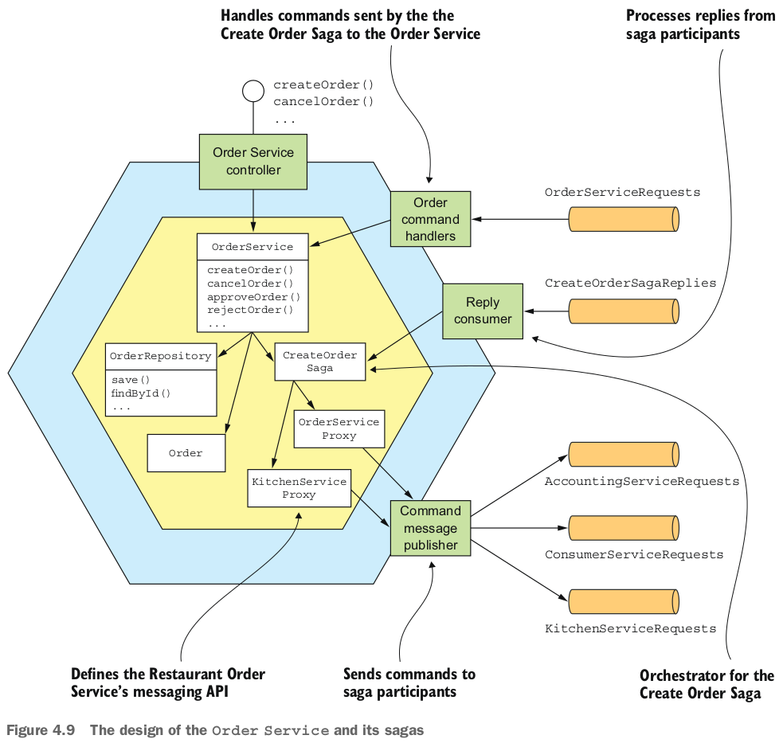


### 4.4.1 The OrderService class
Lớp OrderService là một domain service được gọi bởi tầng API của service. Nó chịu trách nhiệm cho việc tạo và quản lý các Order. Hình 4.10 cho thấy OrderService và một số đối tác của nó. OrderService tạo và cập nhật các Order, gọi OrderRepository để lưu trữ các Order, và tạo các saga, chẳng hạn như CreateOrderSaga, bằng cách sử dụng SagaManager. Lớp SagaManager là một trong những lớp được cung cấp bởi khung sự kiện Tram Saga của Eventuate, đây là một khung sự kiện dùng để viết các trình điều phối và người tham gia saga, và sẽ được thảo luận kĩ hơn trong phần này sau đây.

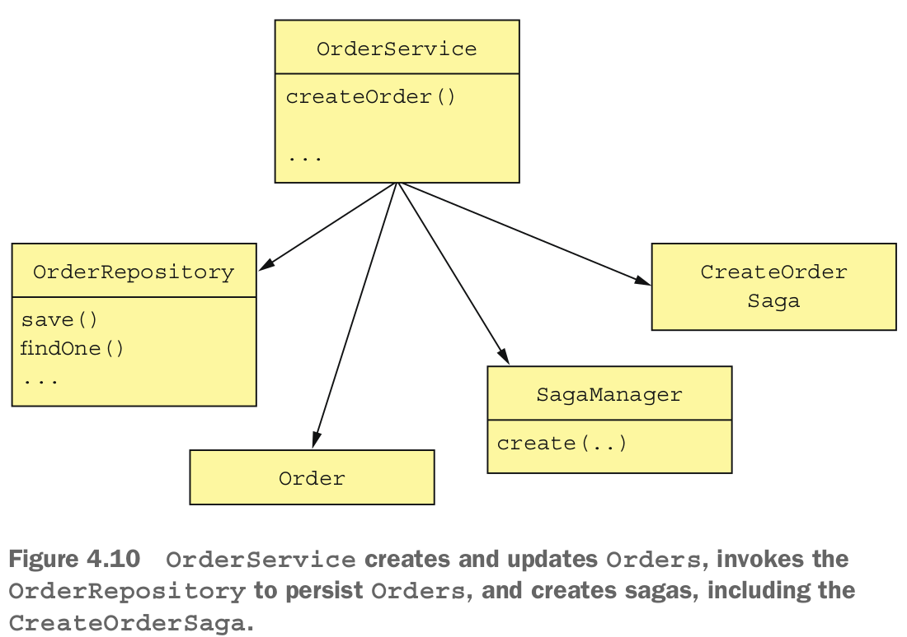

Tôi sẽ thảo luận chi tiết hơn về lớp này trong chương 5. Hiện tại, hãy tập trung vào phương thức `createOrder()`. Đoạn mã sau đây hiển thị phương thức `createOrder()` của OrderService. Phương thức này đầu tiên tạo một Order và sau đó tạo một CreateOrderSaga để xác thực Order.

```java
@Transactional
public class OrderService {

    @Autowired
    private SagaManager<CreateOrderSagaState> createOrderSagaManager;
    @Autowired
    private OrderRepository orderRepository;
    @Autowired
    private DomainEventPublisher eventPublisher;

    public Order createOrder(OrderDetails orderDetails) {
    ...
    ResultWithEvents<Order> orderAndEvents = Order.createOrder(...);
    Order order = orderAndEvents.result;
    orderRepository.save(order);
    eventPublisher.publish(Order.class, Long.toString(order.getId()), orderAndEvents.events);

    CreateOrderSagaState data = new CreateOrderSagaState(order.getId(), orderDetails);
    createOrderSagaManager.create(data, Order.class, order.getId());
    return order;
    }
    ...
}
```

Phương thức `createOrder()` tạo một Order bằng cách gọi phương thức factory `Order.createOrder()`. Sau đó, nó lưu trữ Order bằng cách sử dụng OrderRepository, một repository dựa trên JPA. Nó tạo CreateOrderSaga bằng cách gọi `SagaManager.create()`, truyền một CreateOrderSagaState chứa ID của Order vừa được lưu và OrderDetails. SagaManager khởi tạo người điều hành saga, làm cho nó gửi một message lệnh đến người tham gia saga đầu tiên, và lưu trữ người điều hành saga vào cơ sở dữ liệu.

Hãy cùng xem xét lớp CreateOrderSaga và các lớp liên quan của nó.

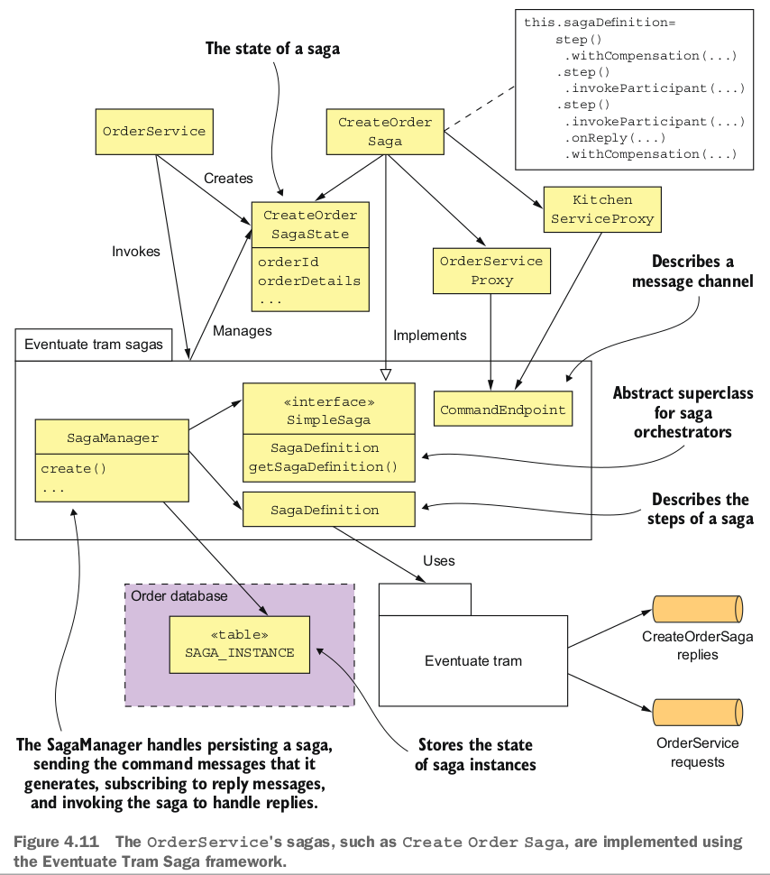

### 4.4.2 The implementation of Create Order Saga
Hình 4.11 cho thấy các lớp thực hiện Saga Create Order. Các trách nhiệm của mỗi lớp như sau:
- CreateOrderSaga: Một lớp singleton xác định state machine của saga. Nó gọi CreateOrderSagaState để tạo các message lệnh và gửi chúng đến các bên tham gia bằng cách sử dụng các channel message, được chỉ định bởi các lớp proxy bên tham gia saga, như KitchenServiceProxy.
- CreateOrderSagaState: Trạng thái cố định của một saga, tạo các message lệnh.
- Các lớp proxy của bên tham gia saga, như KitchenServiceProxy: Mỗi lớp proxy định nghĩa (API) của bên tham gia saga, bao gồm channel lệnh, các loại message lệnh và các loại phản hồi.

Các lớp này được viết bằng Eventuate Tram Saga framework.

Eventuate Tram Saga framework cung cấp một ngôn ngữ cụ thể cho miền (DSL) để xác định state machine của saga. Nó thực thi state machine của saga và trao đổi message với các bên tham gia saga bằng cách sử dụng Eventuate Tram framework. Framework cũng lưu trữ trạng thái của saga trong cơ sở dữ liệu.

Hãy xem xét cách triển khai chi tiết của Saga Create Order, bắt đầu với lớp CreateOrderSaga.

#### The CreatOrderSaga orchestrator
Lớp CreateOrderSaga triển khai state machine được hiển thị trước đó trong hình 4.7. Lớp này triển khai SimpleSaga, một giao diện cơ bản cho các saga. Trái tim của lớp CreateOrderSaga là định nghĩa saga được hiển thị trong đoạn mã sau đây. Nó sử dụng DSL được cung cấp bởi Eventuate Tram Saga framework để xác định các bước của Saga Create Order.


```java
public class CreateOrderSaga implements SimpleSaga<CreateOrderSagaState> {
    private SagaDefinition<CreateOrderSagaState> sagaDefinition;
    public CreateOrderSaga(OrderServiceProxy orderService,
        ConsumerServiceProxy consumerService,
        KitchenServiceProxy kitchenService,
        AccountingServiceProxy accountingService) {
    this.sagaDefinition =
            step()
                .withCompensation(orderService.reject, CreateOrderSagaState::makeRejectOrderCommand)
            .step()
                .invokeParticipant(consumerService.validateOrder, CreateOrderSagaState::makeValidateOrderByConsumerCommand)
            .step()
                .invokeParticipant(kitchenService.create, CreateOrderSagaState::makeCreateTicketCommand)
                .onReply(CreateTicketReply.class, CreateOrderSagaState::handleCreateTicketReply)
                .withCompensation(kitchenService.cancel, CreateOrderSagaState::makeCancelCreateTicketCommand)
            .step()
                .invokeParticipant(accountingService.authorize, CreateOrderSagaState::makeAuthorizeCommand)
            .step()
                .invokeParticipant(kitchenService.confirmCreate, CreateOrderSagaState::makeConfirmCreateTicketCommand)

            .step()
                .invokeParticipant(orderService.approve, CreateOrderSagaState::makeApproveOrderCommand)
            .build();
}   
@Override
public SagaDefinition<CreateOrderSagaState> getSagaDefinition() {
    return sagaDefinition;
}
```
Constructor của CreateOrderSaga tạo định nghĩa saga và lưu trữ nó trong trường sagaDefinition. Phương thức `getSagaDefinition()` trả về định nghĩa saga. Để hiểu cách CreateOrderSaga hoạt động, hãy xem định nghĩa của bước thứ ba của saga, được hiển thị trong đoạn mã sau đây. Bước này của saga gọi Kitchen Service để tạo một Ticket. Compensating transaction của nó hủy bỏ Ticket đó. Các phương thức `step()`, `invokeParticipant()`, `onReply()`, và `withCompensation()` là một phần của DSL được cung cấp bởi Eventuate Tram Saga.

```java
public class CreateOrderSaga ...
public CreateOrderSaga(..., KitchenServiceProxy kitchenService,
...) {
    ...
    .step()
       .invokeParticipant(kitchenService.create,
            CreateOrderSagaState::makeCreateTicketCommand)
       .onReply(CreateTicketReply.class,
            CreateOrderSagaState::handleCreateTicketReply)
       .withCompensation(kitchenService.cancel,
            CreateOrderSagaState::makeCancelCreateTicketCommand)
    ...
    ;
```

Cuộc gọi đến `invokeParticipant()` xác định transaction tiến. Nó tạo ra message lệnh CreateTicket bằng cách gọi `CreateOrderSagaState.makeCreateTicketCommand()` và gửi nó đến kênh được chỉ định bởi `kitchenService.create`. Cuộc gọi đến `onReply()` chỉ định rằng `CreateOrderSagaState.handleCreateTicketReply()` sẽ được gọi khi một phản hồi thành công được nhận từ Kitchen Service. Phương thức này lưu trữ ticketId được trả về trong `CreateOrderSagaState`. Cuộc gọi đến `withCompensation()` xác định transaction đền bù. Nó tạo ra một message lệnh `RejectTicketCommand` bằng cách gọi `CreateOrderSagaState.makeCancelCreateTicket()` và gửi nó đến kênh được chỉ định bởi `kitchenService.create`.
Các bước khác của saga được định nghĩa theo cách tương tự. `CreateOrderSagaState` tạo mỗi message, được gửi bởi saga đến điểm cuối giao tiếp thông báo được xác định bởi một `KitchenServiceProxy`. Hãy xem xét từng lớp trong số đó, bắt đầu với `CreateOrderSagaState`.

#### The CreateOrderSagaState class

Lớp `CreateOrderSagaState`, được hiển thị trong đoạn mã dưới đây, đại diện cho trạng thái của một phiên bản saga. Một phiên bản của lớp này được tạo ra bởi OrderService và được lưu trữ trong cơ sở dữ liệu bởi Eventuate Tram Saga framework. Trách nhiệm chính của nó là tạo ra các message được gửi đến các thành phần saga.

```java
public class CreateOrderSagaState {
    private Long orderId;
    private OrderDetails orderDetails;
    private long ticketId;
    public Long getOrderId() {
        return orderId;
    }
    private CreateOrderSagaState() {
    }
    public CreateOrderSagaState(Long orderId, OrderDetails orderDetails) {
        this.orderId = orderId;
        this.orderDetails = orderDetails;
    }
    CreateTicket makeCreateTicketCommand() {
        return new CreateTicket(getOrderDetails().getRestaurantId(), getOrderId(), makeTicketDetails(getOrderDetails()));
    }
    void handleCreateTicketReply(CreateTicketReply reply) {
        logger.debug("getTicketId {}", reply.getTicketId());
        setTicketId(reply.getTicketId());
    }
    CancelCreateTicket makeCancelCreateTicketCommand() {
        return new CancelCreateTicket(getOrderId());
    }
    ...
```

`CreateOrderSaga` gọi `CreateOrderSagaState` để tạo các message lệnh. Nó gửi các message lệnh này đến các điểm cuối được xác định bởi các lớp `SagaParticipantProxy`. Hãy xem một trong những lớp đó: `KitchenServiceProxy`.

#### The KitchenServiceProxy class

Lớp `KitchenServiceProxy`, được hiển thị trong danh sách 4.5, xác định các điểm cuối message lệnh cho service Bếp. Có ba điểm cuối:
- `create`: Tạo một Ticket
- `confirmCreate`: Xác nhận việc tạo
- `cancel`: Hủy một Ticket

Mỗi `CommandEndpoint` chỉ định loại lệnh, kênh đích của message lệnh và các loại trả lời mong đợi.

```java
public class KitchenServiceProxy {
    public final CommandEndpoint<CreateTicket> create = CommandEndpointBuilder
                                            .forCommand(CreateTicket.class)
                                            .withChannel(KitchenServiceChannels.kitchenServiceChannel)
                                            .withReply(CreateTicketReply.class)
                                            .build();
    public final CommandEndpoint<ConfirmCreateTicket> confirmCreate = CommandEndpointBuilder
                                            .forCommand(ConfirmCreateTicket.class)
                                            .withChannel(KitchenServiceChannels.kitchenServiceChannel)
                                            .withReply(Success.class)
                                            .build();
    public final CommandEndpoint<CancelCreateTicket> cancel = CommandEndpointBuilder
                                            .forCommand(CancelCreateTicket.class)
                                            .withChannel(KitchenServiceChannels.kitchenServiceChannel)
                                            .withReply(Success.class)
                                            .build();
}
```
Các lớp proxy, như `KitchenServiceProxy`, không hoàn toàn cần thiết. Một saga có thể đơn giản gửi các message lệnh trực tiếp đến các bên tham gia. Nhưng lớp proxy có hai lợi ích quan trọng. Đầu tiên, một lớp proxy xác định các điểm cuối được kiểu tĩnh, giúp giảm nguy cơ của một saga gửi message sai đến một service. Thứ hai, một lớp proxy là một API được xác định rõ ràng để gọi một service, giúp mã code dễ hiểu và dễ kiểm thử hơn. Ví dụ, chương 10 mô tả cách viết các bài kiểm thử cho `KitchenServiceProxy` để xác minh rằng Order Service gọi Kitchen Service đúng cách. Nếu không có `KitchenServiceProxy`, sẽ không thể viết một bài kiểm thử có phạm vi hẹp như vậy.

#### The Eventuate Tram Saga framework
Eventuate Tram Saga, như được thể hiện trong hình 4.12, là một framework để viết cả các trình điều phối saga và các bên tham gia saga. Nó sử dụng khả năng gửi message có transaction của Eventuate Tram, đã được thảo luận trong chương 3.

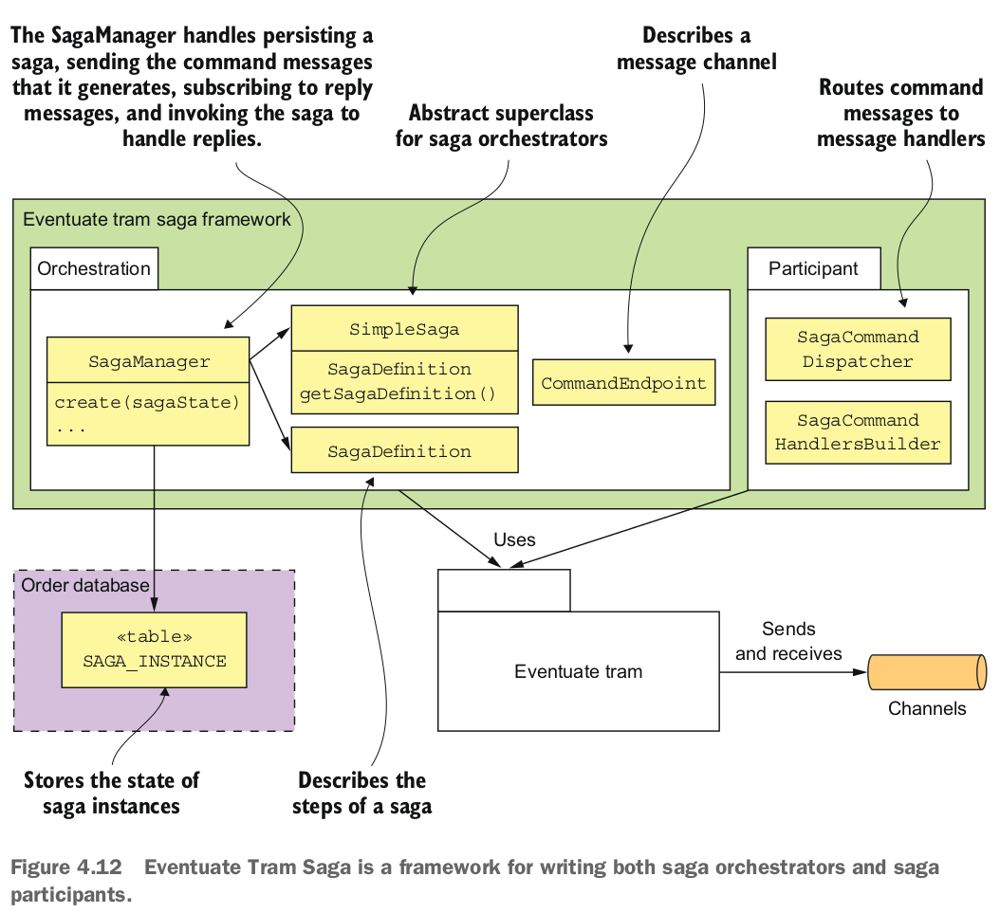

Gói orchestration của saga là phần phức tạp nhất của framework. Nó cung cấp SimpleSaga, một giao diện cơ bản cho các saga, và một lớp SagaManager, quản lý việc tạo và quản lý các phiên bản saga. SagaManager xử lý việc lưu trữ saga, gửi các message lệnh mà nó tạo ra, đăng ký nhận các message phản hồi và gọi saga để xử lý các phản hồi. Hình 4.13 cho thấy chuỗi sự kiện khi OrderService tạo một saga. Chuỗi sự kiện diễn ra như sau:
1. OrderService tạo CreateOrderSagaState.
2. Nó tạo một phiên bản của saga bằng cách gọi SagaManager.
3. SagaManager thực thi bước đầu tiên của định nghĩa saga.
4. CreateOrderSagaState được gọi để tạo một message lệnh.
5. SagaManager gửi message lệnh đến bên tham gia saga (service Consumer).
6. SagaManager lưu trữ phiên bản saga trong cơ sở dữ liệu.

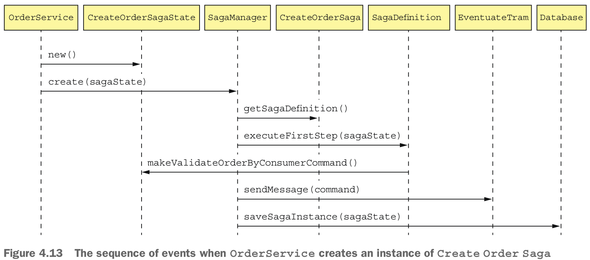


Hình 4.14 cho thấy chuỗi sự kiện khi SagaManager nhận được một phản hồi từ service Consumer.

Chuỗi sự kiện diễn ra như sau:
1. Eventuate Tram gọi SagaManager với phản hồi từ service Consumer.
2. SagaManager truy xuất phiên bản saga từ cơ sở dữ liệu.
3. SagaManager thực thi bước tiếp theo của định nghĩa saga.
4. CreateOrderSagaState được gọi để tạo một message lệnh.
5. SagaManager gửi message lệnh đến bên tham gia saga được chỉ định (service Kitchen).
6. SagaManager lưu trữ phiên bản saga cập nhật trong cơ sở dữ liệu.

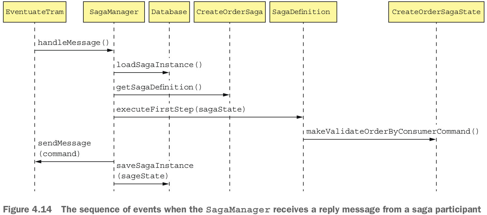


Nếu một bên tham gia saga thất bại, SagaManager sẽ thực thi các transaction bù đắp theo thứ tự ngược lại.

Phần còn lại của framework Eventuate Tram Saga là gói bên tham gia saga. Nó cung cấp các lớp SagaCommandHandlersBuilder và SagaCommandDispatcher để viết các bên tham gia saga. Các lớp này định tuyến các message lệnh đến các phương thức xử lý, các phương thức này gọi logic business của các bên tham gia saga và tạo ra các message phản hồi. Hãy xem cách các lớp này được sử dụng bởi Order Service.

### 4.4.3 The OrderCommandHandlers class

Order Service tham gia vào các saga của riêng mình. Ví dụ, CreateOrderSaga gọi Order Service để phê duyệt hoặc từ chối một Order. Lớp OrderCommandHandlers, được hiển thị trong hình 4.15, xác định các phương thức xử lý cho các message lệnh được gửi bởi các saga này.

Mỗi phương thức xử lý gọi OrderService để cập nhật một Order và tạo ra một message phản hồi. Lớp SagaCommandDispatcher định tuyến các message lệnh đến phương thức xử lý phù hợp và gửi phản hồi.

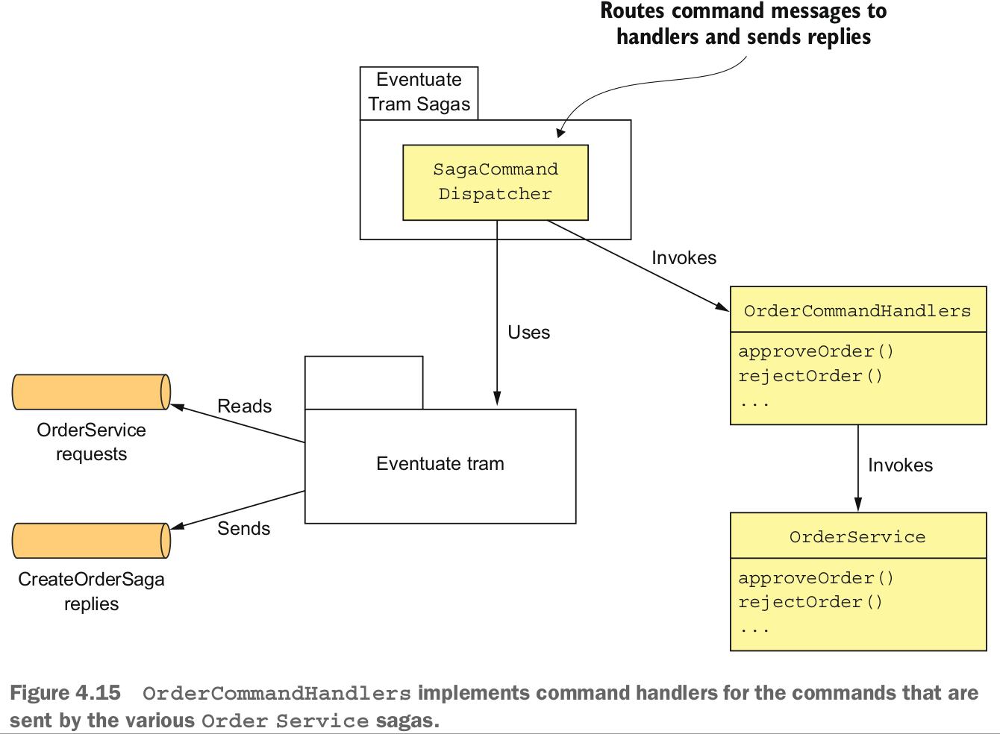

Đoạn code dưới đây hiển thị lớp OrderCommandHandlers. Phương thức commandHandlers() ánh xạ các loại message lệnh tới các phương thức xử lý. Mỗi phương thức xử lý nhận một message lệnh làm tham số, gọi OrderService và trả về một message phản hồi.

```java
public class OrderCommandHandlers {
    @Autowired
    private OrderService orderService;
    public CommandHandlers commandHandlers() {
        return SagaCommandHandlersBuilder
            .fromChannel("orderService")
            .onMessage(ApproveOrderCommand.class, this::approveOrder)
            .onMessage(RejectOrderCommand.class, this::rejectOrder)
            ...
            .build();
    }
    public Message approveOrder(CommandMessage<ApproveOrderCommand> cm) {
        long orderId = cm.getCommand().getOrderId();
        orderService.approveOrder(orderId);
        return withSuccess();
    }
    public Message rejectOrder(CommandMessage<RejectOrderCommand> cm) {
        long orderId = cm.getCommand().getOrderId();
        orderService.rejectOrder(orderId);
        return withSuccess();
    }
```

### 4.4.4 The OrderServiceConfiguration class

The Order Service uses the Spring framework. The following listing is an excerpt of the OrderServiceConfiguration class, which is an @Configuration class that instantiates and wires together the Spring @Beans

```java
@Configuration
public class OrderServiceConfiguration {

    @Bean
    public OrderService orderService(RestaurantRepository restaurantRepository,
                                     SagaManager<CreateOrderSagaState> createOrderSagaManager,
                                     ...) {
        return new OrderService(restaurantRepository,
                                ...
                                createOrderSagaManager
                                ...);
    }

    @Bean
    public SagaManager<CreateOrderSagaState> createOrderSagaManager(CreateOrderSaga saga) {
        return new SagaManagerImpl<>(saga);
    }

    @Bean
    public CreateOrderSaga createOrderSaga(OrderServiceProxy orderService,
                                           ConsumerServiceProxy consumerService,
                                           ...) {
        return new CreateOrderSaga(orderService, consumerService, ...);
    }

    @Bean
    public OrderCommandHandlers orderCommandHandlers() {
        return new OrderCommandHandlers();
    }

    @Bean
    public SagaCommandDispatcher orderCommandHandlersDispatcher(OrderCommandHandlers orderCommandHandlers) {
        return new SagaCommandDispatcher("orderService", orderCommandHandlers.commandHandlers());
    }

    @Bean
    public KitchenServiceProxy kitchenServiceProxy() {
        return new KitchenServiceProxy();
    }

    @Bean
    public OrderServiceProxy orderServiceProxy() {
        return new OrderServiceProxy();
    }
    ...
}
```
Lớp này định nghĩa một số Spring `@Beans` bao gồm `orderService`, `createOrderSagaManager`, `createOrderSaga`, `orderCommandHandlers`, và `orderCommandHandlersDispatcher`. Nó cũng định nghĩa các Spring `@Beans` cho các lớp proxy khác nhau, bao gồm `kitchenServiceProxy` và `orderServiceProxy`.

`CreateOrderSaga` chỉ là một trong số nhiều saga của Order Service. Nhiều hoạt động hệ thống khác của nó cũng sử dụng các saga. Ví dụ, hoạt động `cancelOrder()` sử dụng một Cancel Order Saga, và hoạt động `reviseOrder()` sử dụng một Revise Order Saga. Do đó, mặc dù nhiều service có một API bên ngoài sử dụng giao thức đồng bộ như REST hoặc gRPC, một lượng lớn giao tiếp giữa các service sẽ sử dụng message bất đồng bộ.

Như bạn có thể thấy, quản lý transaction và một số khía cạnh của thiết kế logic business khá khác biệt trong một kiến trúc microservice. May mắn thay, các trình điều phối saga thường là các state machine khá đơn giản, và bạn có thể sử dụng một framework saga để đơn giản hóa mã của mình. Tuy nhiên, quản lý transaction chắc chắn phức tạp hơn so với trong một kiến trúc monolithic. Nhưng điều đó thường là một khoản phí nhỏ để trả cho những lợi ích to lớn của microservices.